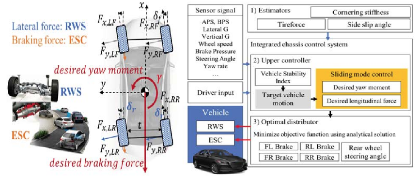
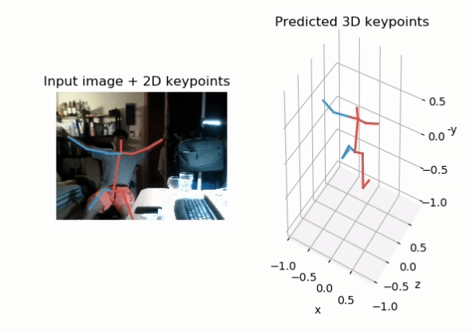
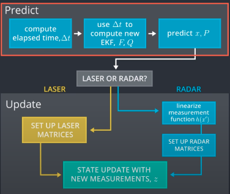

# Sungwook LEE
> 010.9853.3641  
> joker1251@naver.com  
> github.com/sungwookLE  

---------

## 1. EDUCATION

- 한양대학교 자동차전자제어공학과 석사 
- 국민대학교 기계시스템공학과 학사

## 2. RESEARCH INTEREST

- Autonomous Driving SW
    - Vehicle Control
    - State Estimation & Prediction
    - Localization

- Deep Learning with Vision
    - Deep Learning & Dynamic Model Fusion Algorithm

## 3. CAREER

- Researcher(17.1~19.1): Intelligent Machine Lab, @Hanyang University
    - Integrated Chassis Control
        - 차량 동역학 모델 기반 최적 ESC + RWS 제어 로직
        - 모델 상태변수 추정(슬립각, 타이어포스) 로직
        - Actuator Failure 따른 고장허용제어
        - Lidar + Radar Sensor Fusion SW 알고리즘 개발

- Researcher(19.1~): Safety Control, @Hyundai Motor Company
    - 차량 상태 추정 SW 개발: 전복 감지(`c, c++`)
        - 차량 롤각 추정 SW 로직 개발 및 양산
        - 주행 중 롤각 추정 성능 개선
    - 승객 영상 인식 자세 추정 SW 개발(`python`)
        - Deep-learning 기반 승객 keypoints 추정 및 3D 좌표 추정
        - Occlusion 강건화 알고리즘 개발
        - 실내 승객 클래스 판단 알고리즘 개발
    - 충돌시험 빅데이터 분석 툴 개발
        - Django, 기계학습을 이용한 웹기반 분석 툴 개발
    - 에어백 SW 검증
        - 요구사항 기반 테스트 케이스 자동화 생성 코드 개발
        - 정적/동적 SW 검증, SILS/HILS 기능 검증

## 4. SKILLS

- Model Based Development: Control & Estimation
    - Advanced Control, Optimal Estimation(Kalman)
- Programming Languages: C++, C, Python
- Frameworks: Tensorflow, Keras, Django
- Tools: Git, MySQL, docker

## 5. PAPERS & PATENTS(*1st author)

- PAPERS
    - "Control Allocation of Rear Wheel Steering and Electronic Stability Control with Actuator Failure", *IEEE International Conference on Vehicular Electronics and Safety*
    - "Integrated Chassis Control of Suspension and Steering Systems for LKAS", *International Conference on Control, Automation and Systems*

- PATENTS
    - RWS, ESC Actuator 고장허용제어 기술 특허 출원
    - 6DOF IMU 센서 오프셋 가속 제거 기술 특허 출원
    - 기계학습 기반 충돌 승객 상해 예측 안전 제어 기술 특허 출원
    - Kinetics 모델 기반 실내 승객 거동 추정 기술 특허 출원
    - 실내 영상 기반 승객 거동 추정 및 안전 제어 기술 특허 출원

## 6. PROJECT EXPERIENCE
### 1. Integrated Chassis Control (17.6~18.6)
- Vehicle Dynamics Model Based, Optimal Control and Estimation SW algorithm(`Matlab/Simulink`)
    - Rear Wheel Steering and Electronic Stability Contorl
    - Controller: Nonlinear Sliding Mode Control
    - Estimator: Tire Force and Side Slip Angle with Dual Extended Kalman Filter (모델 파라미터 및 상태변수 동시 추정)
    - Optimizer: KKT(Karush-Kuhn-Tucker) method for considering Contraints

        ||
        |-|-|
        ||

### 2. 차량 상태 추정 SW 개발: 롤각 추정 (20.4~20.10)
- Dynamics Model Based, Roll Angle Estimation SW algorithm( c,c++ )
- 3차원 거동 상황에서의 강건한 롤각 추정 로직 개발
- 차량 신호 분석 기반 Gain Scheduling Domain Design
- Gain-Scheduled Roll Angle Estimator 개발
- 롤각 추정 Fault-Tolerant 로직 개발

### 3. 승객 영상 인식 SW 개발 (21.4~21.11)
- Deep Learning algorithm(`python, pytorch, opencv`)
    - Deep-learning 기반 승객 2D keypoints 추정 및 3D 자세 추정

        |||
        |-|-|-|
        |||

    - Occlusion 강건화 알고리즘 개발
    - 승객 클래스 판단 알고리즘 개발(`keras, tensorflow`)
    - autoencoder 활용한 semi-supervised learning

### 4. [Self-Driving Car](https://graduation.udacity.com/confirm/WHYAFRLW) Nanodegree, Udacity (20.10~21.2)
- Computer Vision
- Sensor Fusion
    - Pedestrian {위치 , 속도} 예측 Lidar+Radar Sensor Fusion
    - Kalman Filter, Extended Kalman Filter
    - [Lidar+Radar Sensor Fusion with Extended Kalman Filter](https://github.com/SungwookLE/udacity_extended_kf)

        ||
        |-|-|
        ||

- Localization
    - Particle Filter
- Planning, Control
- System Integration: `ROS`

### 5. [C++ Intermediate](https://graduation.udacity.com/confirm/UZ3U3CZE) Nanodegree, Udacity (20.6~20.9)
- Object-Oriented Programming
    - A-Star Search Algorithm
- Memory Management
- Concurrency Programming

## End