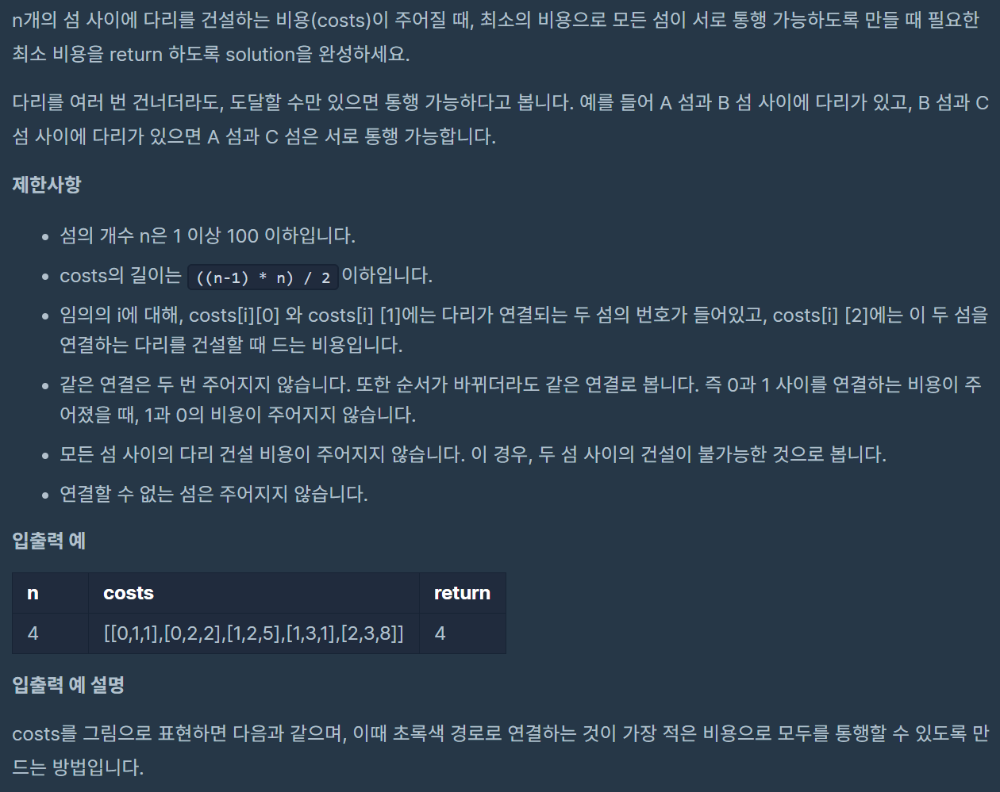
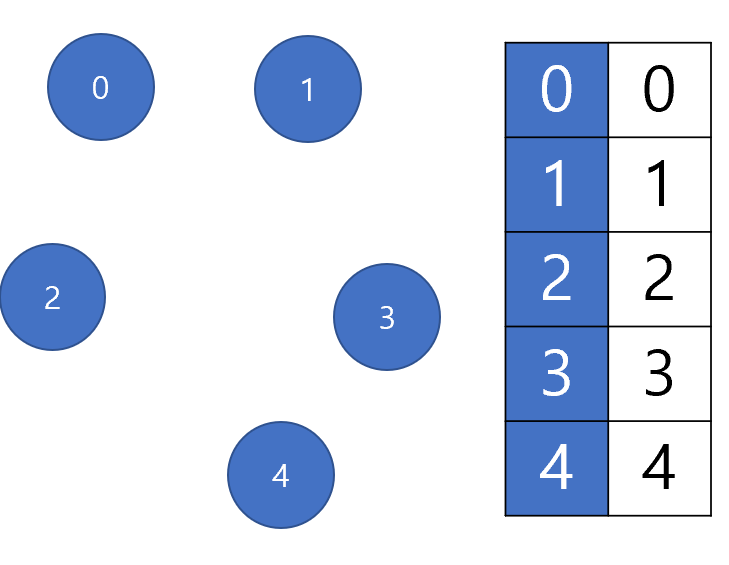
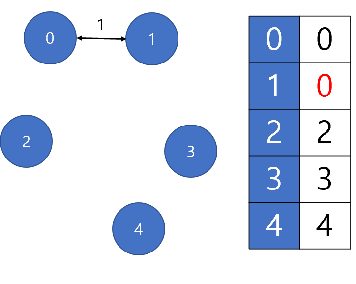
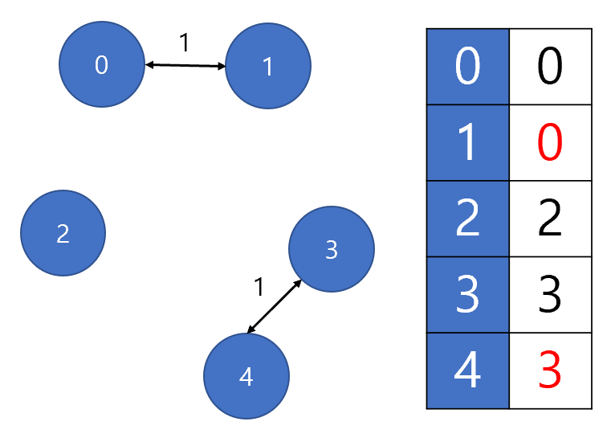
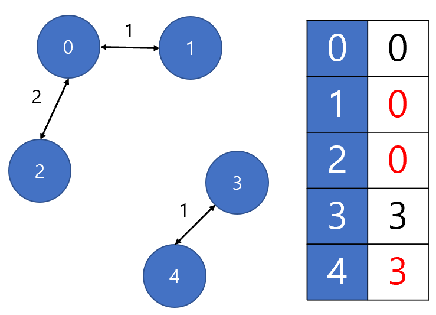
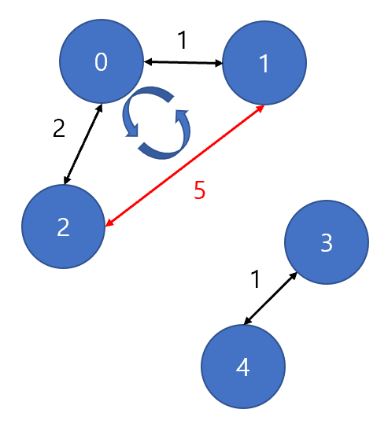
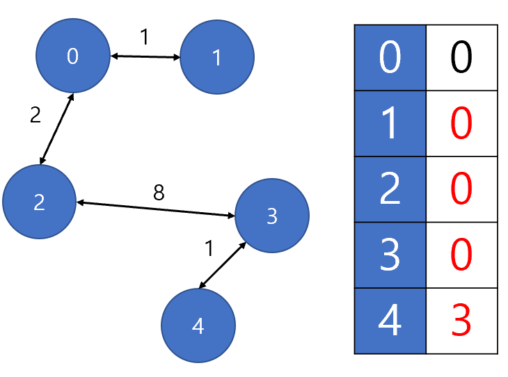

# 프로그래머스 > 그리디 > 섬 연결하기
> AUTHOR: SungwookLE    
> DATE: '21.12/01  
>> PROBLEM: [문제링크](https://programmers.co.kr/learn/courses/30/lessons/42861)  
>> REFERENCE: [참고](https://lipcoder.tistory.com/entry/%EC%84%AC-%EC%97%B0%EA%B2%B0%ED%95%98%EA%B8%B0-%ED%94%84%EB%A1%9C%EA%B7%B8%EB%9E%98%EB%A8%B8%EC%8A%A4)  
>> LEVEL: Lv3    

## 1. 혼자 풀기 실패
- **노드를 잇는 최소 비용을 구하는 문제**
-   
- 그래프를 활용하여 풀어야겠다는 생각이 들기도 하였으나, 아직 까지는 노드(그래프) 순회 방식으로 구조화하고 푸는 것에 대해 익숙치가 않아 트라이를 못해보았다.
- 그나마, 시도해본 것은 `unordered_map`을 활용하여 방문한 섬을 체크하여, 체크된 섬은 중복 방문되지 않게 하려고 하였는데, 오답
- 최적화된 방법으로 다리를 건설해야 하므로 틀리는 것이었다...

## 2. Kruskal 알고리즘 (노드 순회)
- 크러스컬 알고리즘은 그리디 알고리즘을 이용하여 가중치가 존재하는 그래프를 최소의 비용으로 연결하는 최적의 해답을 구하는 알고리즘이다.
- MST(최소 비용 신장 트리)가 최소 비용의 간선으로 구성되어 있고, 사이클을 포함하지 않은 조건에서 각 단계에서 사이클을 이루지 않는 최소 비용 간선을 선택한다.

**크러스컬 알고리즘의 동작**
1. 그래프의 간선들을 가중치의 오름차순으로 정렬한다.
2. 정렬된 간선 리스트에서 순서대로 사이클을 형성하지 않는 간선을 선택한다.
    - 가장 낮은 가중치를 먼저 선택한다.
    - 사이클을 형성하는 간선을 제외한다.
3. 해당 간선을 현재의 MST의 집합에 추가한다.

- 사이클을 포함하지 않는 조건이어야지만, 불필요한 다리 건설을 최소화 할 수 있다.
- 따라서, 본 문제에서는 사이클을 형성하지 않는 다리만 찾아서 건설하는 방식으로 최소 건설 비용을 `그리디`방식으로 찾아냈다.

## 3. Pseudo Code Diagram
1. 다리가 사이클 형성을 하게되면 낭비되는 다리를 설치하게 되는 경우이므로 최소 비용으로 모든 섬을 다리로 잇기 위해서는 사이클을 제거해야 한다. 이 제거 작업을 위해 벡터 컨테이너 하나를 만들고 다음과 같이 초기화한다. 각 인덱스는 섬에 대한 정보를 뜻한다. 이 컨테이너에는 다리를 설치할 때마다 각 섬의 최상위 부모 섬을 담게 된다.   
-   

2. 이제 비용 순서대로 다리를 설치해 보도록 하자. 먼저 [0,1,1]을 설치한다. 섬 0과 1을 잇는 다리를 설치하게 되므로, v[0]과 v[1]을 찾는다. 그리고 그 값들 중 더 큰 값에 현재 작은 값의 섬 0을 기록한다. 이는 곧 1번째 섬의 부모 섬이 0이 된다는 뜻이다. 
- 

3. 이제 [3,4,1]을 설치한다. 위와 동일한 작업을 하며 그림과 같이 된다.
- 

4. 다음으로 [0,2,2]를 설치한다. 섬 2와 0이 이어지므로 다음과 같이 된다.
- 

5. 이제 [1,2,5]를 설치한다. 여기서 문제가 생긴다. 이 다리를 설치하면 다음처럼 사이클이 생기게 된다. 
이를 판별하는 방법은 다음과 같다. v로 부터 섬 2의 최상위 부모 섬을 찾는다. 최상위 부모 섬은 0이다. 섬 1의 최상위 부모 섬 역시 0이다. 이 둘은 모두 최상위 부모 섬으로 0을 가지므로 다리를 잇는다면 사이클이 생기게 된다. 이러한 이유로 컨테이너 v가 필요하다.
- 

6. 이제 마지막 [2,3,8]을 설치한다. 섬 3은 섬 2와 이어진다. 섬 2의 최상위 부모 섬은 0이므로 섬 3의 최상위 부모 섬은 0이 된다. 그리고 자동적으로 섬 4의 최상위 부모 섬도 0이 된다.
- 


## 4. 풀이(c++)
- REFERENCE 코드를 참고하여 작성하였다.
- 노드를 잇는 최소 비용 문제를 풀때 활용하면 좋은 알고리즘이다.

```c++
class kruskal_greedy{
    public:
    kruskal_greedy(vector<int> _parents): parents(_parents) {}
    int getParents(int x){
        // 자기 자신의 최상위의 부모
        if (parents[x] == x) return x;
        // 자기 자신의 최상위의 부모가 아니면 부모가 나올 때 까지 올라가라
        else return  getParents(parents[x]);
    }

    void mergeParent(int a, int b){
        a = getParents(a);
        b = getParents(b);

        //  부모끼리 비교하였을 때, 값이 작은 노드를 부모 값으로 덮어 씌운다.
        if ( a > b)
            parents[a] = b;
        else
            parents[b] = a;
        return;
    }

    bool find(int a , int b){
        a = getParents(a);
        b = getParents(b);
        // 부모끼리의 값이 같은지 비교하자.
        // 부모끼리의 값이 같다는 것은 사이클을 형성하게 된다는 의미이다.
        return a==b;
    }

    private:
    vector<int> parents;

};


int solution(int n, vector<vector<int>> costs) {
    int answer = 0, max =0;
    
    sort(costs.begin(), costs.end(), [](auto a , auto b){
        if ( a[2] < b[2])
            return true;
        else
            return false;
    });

    //부모노드용 리스트 생성 및 초기화
    vector<int> parents;
    for(int i =0 ; i < n ; ++i) parents.push_back(i);
    kruskal_greedy solver(parents);

    //costs를 처음부터 순회
    for(auto a : costs){
        //두개의 부모노드가 같지않다면 -> 사이클이 생성 안된다면
        if (!solver.find(a[0], a[1])){
            //결과에 가중치 추가
            answer += a[2];
            //부모노드 병합하기
            solver.mergeParent(a[0], a[1]);
        }
    }
    
    return answer;
}
```


## 끝