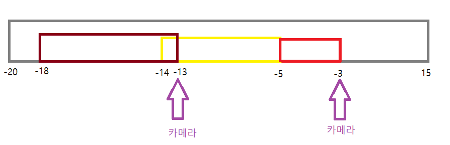

# 프로그래머스 > 그리디 > 단속카메라
> AUTHOR: SungwookLE    
> DATE: '21.12/01  
>> PROBLEM: [문제링크](https://programmers.co.kr/learn/courses/30/lessons/42884)  
>> REFERENCE: [참고](https://mungto.tistory.com/49)  
>> LEVEL: Lv3    

## 1. 혼자 풀기 실패
- 느낌대로 풀려니까, `sort` 한 다음에 연속되어 붙어 있는 `stream` 을 덩어리 지어서 각 덩어리 마다 1대 씩 카메라 배치하려고 하였는데, 잘 안되었다
- 쉬운 문제에 속하는 것인데, 바로 느낌대로 코드를 쓰려고만 하니까, 시간 소모만 되고 못 푼 것 같다... ㅠㅠ
- 

## 2. 코드
- 코드를 읽어보자.

```c++
#include <string>
#include <vector>
#include <algorithm>

using namespace std;

int solution(vector<vector<int>> routes) {
    // 먼저 카메라 1개는 최소조건으로 있어야 하니 배치해두고
    int answer = 1;
    sort(routes.begin(), routes.end());

    int prev_end = routes[0][1];
    for(int i =0 ; i < routes.size() ; ++i){
      
        // stream이 이어있지 않으면 카메라 1대를 더 추가하고,
        if (prev_end < routes[i][0]){
            answer+=1;
            prev_end = routes[i][1];
        }

        // stream이 안에 이어져 있으니까, stream의 뒷 부분을 새로운 stream의 끝으로 설정해 둔다.
        // 이 때, 카메라 추가는 필요 없음
        if (prev_end >= routes[i][1])
            prev_end = routes[i][1];
    }
    
    return answer;
}
```
- 종이에 쓰고 푸는 것을 습관화해야하는데, 바로 느낌받는대로 끄적여보고 안되면 멘붕 자꾸 이런 패턴이 된다.. 적어보고 시작하자. 그림을 그려보고 코딩 시작ㅜㅜ

## 끝