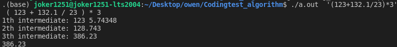

# 문자열 계산기
> AUTHOR: SungwookLE    
> DATE: '21.12/04  
>> REFERENCE: [참고](https://penglog.tistory.com/99)  

## 1. 문자열 계산기
- 4칙 연산에 `+,-,*,/,(,)` 에는 우선순위가 존재한다.
- 우리는 중위계산법에 입각해서, 식 중간의 연산자 우선순위에 따라 계산을 해나가는데, 컴퓨터로 연산을 하게 하려면 다른 계산법을 가져오는 것이 좋다.
- 우선순위에 따라 `numbers`, `operations` 벡터에 숫자와 연산자를 차곡차곡 저장했다가 입력된 연산자에 따라 계산을 하면서 컨테이너에서 하나씩 숫자를 꺼내서 연산을 해나가면 된다. (후위계산법이라고 부른다.)

- Reference를 참고하여 코드 작성하였다.
- 

## 2. 코드

```c++
#include <iostream>
#include <vector>
#include <string>
#include <sstream>

using namespace std;

/**
 * @brief String Calculator only works in integer expression
 * ref: https://penglog.tistory.com/99
 */
class string_calculator{
    public:
        double string_calc(string inputs){
            string process_input = tokenizer(inputs);
            stringstream ss(process_input);
            string token;

            while(ss >> token){
                if (token == "(")
                    operations.push_back({0, "("});
                else if (token == ")"){
                    while (operations.back().oper != "("){
                        calc();
                    }
                    operations.pop_back();
                }
                else if(token == "*" || token == "/" || token == "+" || token == "-"){
                    int prior;
                    if (token == "*")
                        prior = 2;
                    else if (token == "/")
                        prior = 2;
                    else if (token == "+")
                        prior = 1;
                    else if (token == "-")
                        prior = 1;
                    
                    while (!operations.empty() && prior <= operations.back().prior)
                        calc();
                    operations.push_back({prior, token});
                }
                else
                    numbers.push_back(stod(token));
            }
            while(!operations.empty())
                calc();
            return numbers.back();
        }

    private:
        void calc(){
            double a, b, result;
            b = numbers.back();
            numbers.pop_back();
            a = numbers.back();
            numbers.pop_back();
            string o;
            o = operations.back().oper;
            operations.pop_back();

            if (o == "*")
                result = (double)a*b;
            else if ( o =="/")
                result = (double)a/b;
            else if ( o =="+")
                result = (double)a+b;
            else if ( o == "-")
                result = (double)a-b;
            
            iter+=1;

            numbers.push_back(result);
            cout << iter << "th intermediate: ";
            for (auto a : numbers)
                cout << a << " ";
            cout << endl;
        }
        struct op{
            int prior;
            string oper;
        };
        vector<double> numbers;
        vector<op> operations;

    /**
    * @brief 아래코드는 string handle을 위해 필요한 함수
    */
    int iter = 0;
    string tokenizer(string _input){
        string process_string;
        bool flag = false;
        for(int i= 0; i < _input.length() ; ++i){
            if (_input[i] >= '0' && _input[i] <= '9' || _input[i] == '.'){
                if (flag == false){
                    process_string += ' ';
                    process_string += _input[i];
                    flag = true;
                }
                else{
                    process_string += _input[i];
                }
            }
            else{
                flag = false;
                process_string+=' ';
                process_string+= _input[i];
            }
        }
        cout << process_string << endl;
        return process_string;
    }
};

int main(int argc, char* argv[]){
    string_calculator calc;
    cout << calc.string_calc(argv[1]) <<endl;
}
```

## 끝