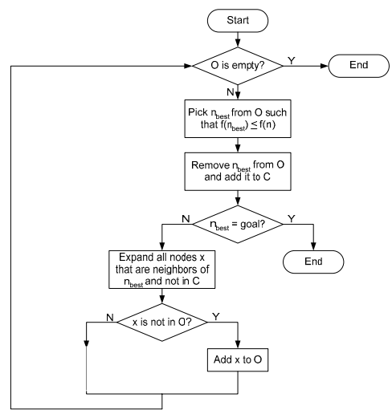
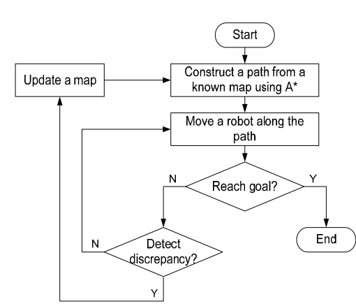
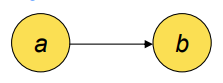
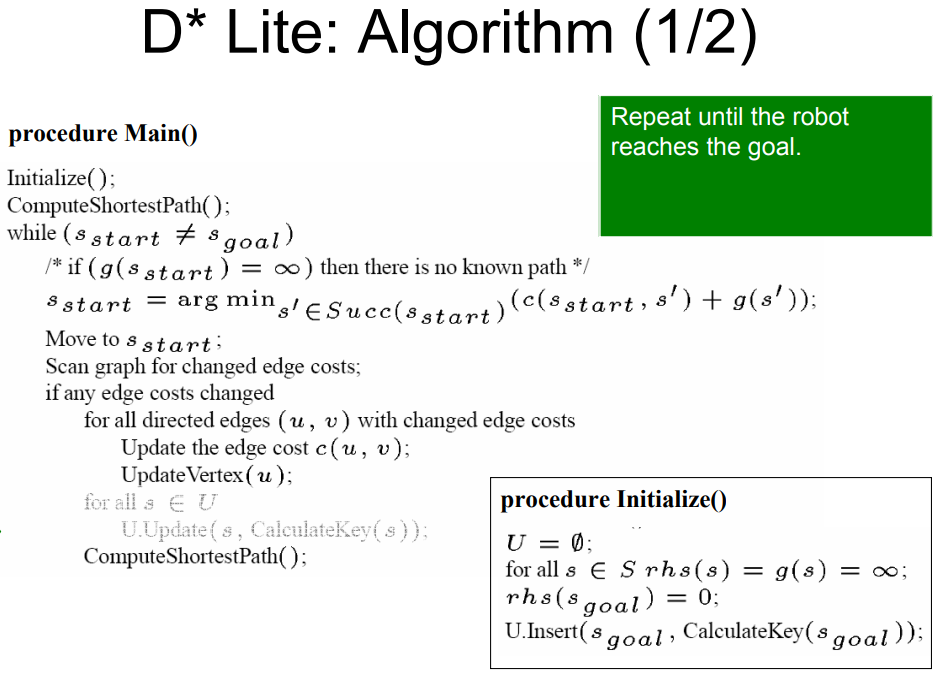
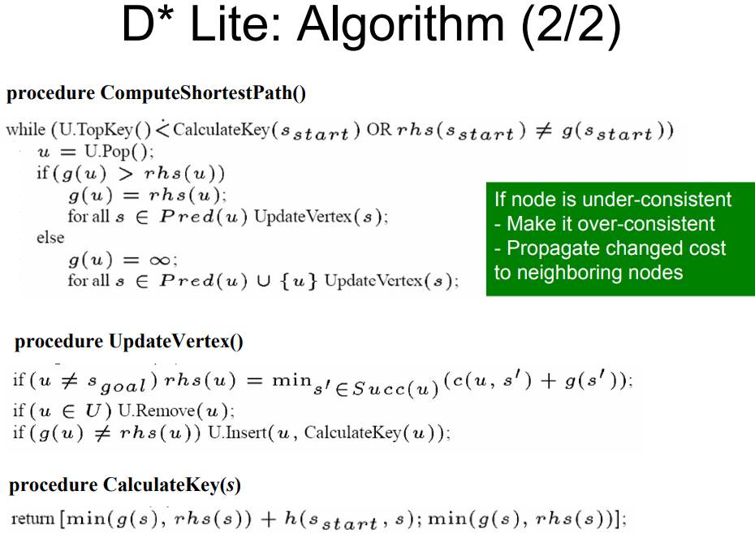
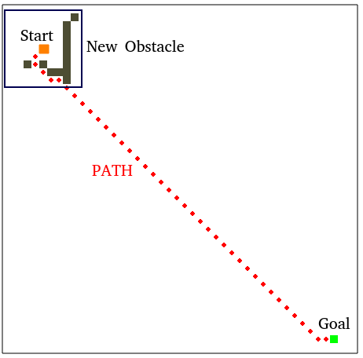

# Search algorithm: A star & D star
> AUTHOR: Sungwook LE  
> DATE: '22.2/01    
> Code: [My Code A*](https://github.com/SungwookLE/ReND_Cpp_Astar/tree/Review)  
> Reference:
  - [My Implementation A*](https://github.com/SungwookLE/ReND_Cpp_Astar/blob/master/readme.md)
  - [CMU AStar & DStar Matrial](/img/AppH-astar-dstar_howie.pdf)  
  - [D* Code](https://github.com/SungwookLE/Dstar-lite-pathplanner)  

## 1. A* Introduction
- A star algorithm은 효율적인 최단거리 길찾기 알고리즘으로, autonomous parking system에서 쓰인다.


- 위의 구조에서 `CellSort(), ExpandNeighbors(), CheckValidCell(), Heuristic(), AddToOpen()` method가 **A Star** 알고리즘의 전부이다.

- `CellSort()` 이름을 통해 전체 알고리즘의 대략적으로 설명해보자. `Cell`은 현재 지도의 좌표(2차원 격자)를 의미한다. `Cell`을 `Sort`한다는 의미는 `Cell`이 가지고 있는 어떤 **Cost Value**를 **정렬**한다는 의미이다. 

- `A*` 알고리즘의 **Cost Function**은  $f = g + h$ 이다. g는 출발지 부터 해당 cell까지의 경로 거리를 의미하고, h는 목적지로부터 해당 cell까지의 경로 거리를 의미한다. heuristic value인 `h`는 다양한 방식으로 변형이 가능하다.

**<center>$A^*$ 알고리즘은 갈 수 있는 경로의 Cell의 Cost Value를 계산하고 작은 Cell을 선택하면서 최단거리 경로를 탐색한다</center>**

- 앞에서 기술한 바와 같이, `A star`는 Cost Value와 Cost Value에 따른 Sort를 통한 선택이 가장 핵심이 되는 부분이다.
  - $Cost \space value, \space f = g + h$
  - $g$는 출발점으로 부터 현재 cell까지의 발생한 이동 경로 거리를 의미한다.
  - 이번 구현에서는 heuristic value $h$를 `Manhatan distance`로 목적지로부터 타겟 `cell` 의 거리로 하였다.  
  ```c++
    int manhatan_dist(std::vector<int> target, std::vector<int> goal){
      int res;
      res = std::abs(goal[0]-target[0]) + std::abs(goal[1]-target[1]);
      return res;
  }
  ```
  - 구해진 $cost \space value$를 기준으로 Cell을 Sorting하고 선택(`pop_back`)한다.

## 2. A* 구현

- 이번 구현에서는 `maze.txt`를 입력받아 지도로 사용하므로 전체 코드에는 `ReadBoardFile()`이 존재하고, 찾은 경로를 출력해주는 `PrintSolution()`가 있으나, `Search()`알고리즘에 포커싱하여 살펴보자
- 핵심이 되는 `Search` 알고리즘은 다음과 같다.

### 2-1. A* 코드(`C++`)
```c++
void A_star::initialize(){
        closed[start[0]][start[1]] = 1; // closed
        heauristic_calculate();
        
        x = start[0];
        y = start[1];

        g = 0;
        h = heuristic[x][y];
        f = g+h;
        opens.push_back({f,h,x,y});

        found = false;
        resign = false;
        count = 0;
}

std::vector<std::vector<std::string>> A_star::Search(){

    A_star::initialize();
    while (found != true && resign != true)
    {
        if (opens.size() == 0)
        {
            resign = true;
            navigation[start[0]][start[1]] = "S";
            navigation[goal[0]][goal[1]] = "G";
            std::cout << "Fail to find the exit!" << std::endl;
            break;
        }
        else
        {
            // CellSort()
            std::sort(opens.begin(), opens.end(), [](auto a, auto b)
                      {
                        if (a[0] > b[0]) 
                            return true;
                        else
                            return false; });

            next = opens.back();
            opens.pop_back();

            f = next[0];
            g = next[1];
            x = next[2], y = next[3];

            count_traced[x][y] = count;
            count += 1;

            if ((x == goal[0]) && (y == goal[1]))
            {
                found = true;
                // SAVE NAVIGATION
                navigation[x][y] = "*G";
                while ((x != start[0]) || (y != start[1]))
                {
                    int x_ex = x - delta[delta_traced[x][y]][0];
                    int y_ex = y - delta[delta_traced[x][y]][1];
                    navigation[x_ex][y_ex] = delta_emoji[delta_traced[x][y]];
                    x = x_ex;
                    y = y_ex;
                }
                navigation[x][y] = "*S";
            }
            else
            {
                // ExpandNeighbors()
                for (int i = 0; i < delta.size(); ++i)
                {
                    int x2 = x + delta[i][0];
                    int y2 = y + delta[i][1];
                    // CheckValidCell()
                    if ((x2 >= 0) && (x2 < map.size()) && (y2 >= 0) && (y2 < map[0].size()))
                    {
                        if ((closed[x2][y2] == 0) && (map[x2][y2] == 0))
                        {
                            int g2 = g + cost;
                            int h2 = heuristic_map[x2][y2];
                            int f2 = g2 + h2;
                            // AddToOpen()
                            opens.push_back({f2, g2, x2, y2});
                            closed[x2][y2] = 1;
                            delta_traced[x2][y2] = i;
                        }
                    }
                }
            }
        }
    }
 
    return navigation;
}
```

### 2-2. A* Results

  ```
  MAP is: 
    *    1    0    0    0    0    0    0
    0    1    0    1    1    1    1    0
    0    1    0    0    0    0    1    0
    0    1    1    0    1    0    1    0
    0    1    0    0    1    1    1    0
    0    0    0    1    1    0    0    *
  ** 1 is grid / 0 is aisle

  NAVIGATOR is: 
    S*   #    >    >    >    >    >    v
    v    #    ^    #    #    #    #    v
    v    #    ^    <              #    v
    v    #    #    ^    #         #    v
    v    #    >    ^    #    #    #    v
    >    >    ^    #    #              G*
  
  COST is: 
    S   -1   17   18   19   20   21   22
    1   -1   16   -1   -1   -1   -1   23
    2   -1   15   11   12   13   -1   24
    3   -1   -1   10   -1   14   -1   25
    4   -1    8    9   -1   -1   -1   26
    5    6    7   -1   -1   -1   -1   G
  ** Number is cost value(how many step: 27)
  ```

### 2-3. 구현 결과
- A star 알고리즘은 아래 Flow를 기억하자
  - 시작지점과 끝지점 그리고 MAP을 받아 초기화한다.
  - Cell 마다 Heuristic Value를 계산해 둔다.
  - 시작지점부터 주변의 Cell을 Neighbor(`상,하,좌,우`)로 추가하고 Neighbor의 Cost Value(`f=g+h`)를 계산한다.
  - Cost Value가 계산된 Cell은 `visited` 표시를 하여 중복 계산이 안되게끔 한다.
  - 제일 작은 Cost Value를 갖는 Cell을 다음 이동 지점으로 고르고 주변 Cell을 탐색한다.
  - 더 이상 새로운 cell을 추가할 수 없을 땐, 길을 못 찾는단 의미이고 목적지에 도달하면 경로를 출력한다.
- Heuristic Value를 잘 선택하면 탐색 횟수를 줄일 수도 있을 것이고, 최악의 경우엔 모든 cell을 탐색해서라도 경로를 찾아내는 **A star** algorithm에 대해 리뷰하였다.


## 3. 학술적 정리: Search in Path Planning 
- Find a path between two locations in an unknown, partially known, or know environment
- Uninformed Search
  - Use no information obtained fron the environment
  - Blind Search: BFS, DFS, Dijkstra
- Informed Search
  - Use evaluation function, More efficient
  - Heuristic Search: AStar, DStar, etc..

### 3-1. A* algorithm Flow Chart
- 
 - Open list(O) stores nodes for expansions
  - 방문하지 않은 노드에 대해서 현재 위치의 이웃 노드를 Open list에 추가
- Closed list(C) stores nodes which we have explored
  - 방문한 노드는 Closed/Visited 체크
- A*는 Optimal path planning이 가능함
- 참고: Dijkstra's Search는 f(n) = g(n) 인 케이스, Total Cost $f$를 이동경로에 대한 비용 $g$만 따져서 경로 Search, heuristic 값을 사용치 않음

### 3-2. A* Star Replanner
- **A Star Replanner**: 새로운 맵(장애물) 정보가 들어오면, 그 지점을 시작점으로 하여 A* 알고리즘 재수행
- 
- Optimal but, Inefficient and impractical..!
- DStar(Dynamic AStar) 등장 이유, 동적인(partially known, unknown map) 환경에서 효율적인 길찾기 알고리즘(재수행)

## 4. D* Lite Introduction
- Based on A*, there are various version of DStar(Dstar, Focused DStar, DStar Lite...)
- Incrementally repair solution paths when changes occur -> **Fast replanngin**
- DStar(Dynamic AStar) 등장 이유, 동적인(partially known, unknown map) 환경에서 효율적인 길찾기 알고리즘(재수행)
  - 왜 효율적이냐, InConsistent한 Node만을 Openlist에 추가하고, 탐색함으로써 새로운 장애물/맵정보가 들어왔을때 영향을 받는 Node만을 대상으로 길찾기 알고리즘 재수행이 가능

### 4-1. terminology
- $g$: the objective function value
- $rhs$: the objective function value of one-step lookahead
- "Consistency"
  - Consistent => $g=rhs$
  - Inconsistent => $g!=rhs$
- **Inconsistent nodes go on the *open list***
- "b" is a successor of "a" and "a" is a predecessor of "b"
  - 
- $rhs$ value of a node is computed based on the $g$ values of its sucessors in the graph and the transition costs of the edges to those successors.
  - $rhs(u) = min_{s'~in~successor(u)}{(c(u,s')+g(s'))}$
- The key(priority) of a node on the open list is the minimum of its $g$ and $rhs$ values plus a focusing heuristic, $h$.
  - $[min(g(s), rhs(s))+h(s_{start},s);~min(g(s), rhs(s))]$

### 4-2. D* Lite Algorithm
- 
- 
- [CMU AStar & DStar Matrial](./img/AppH-astar-dstar_howie.pdf) 자료의 p75~p131 의 예제 문제를 따라가며 살펴보자!!


### 4-3. D* Demo
- [D* Code](https://github.com/SungwookLE/Dstar-lite-pathplanner)
- 


## 끝