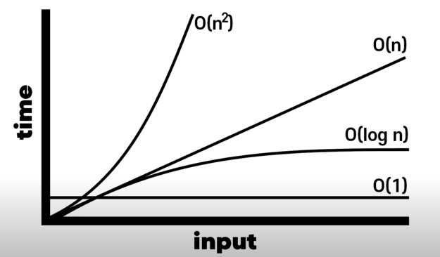
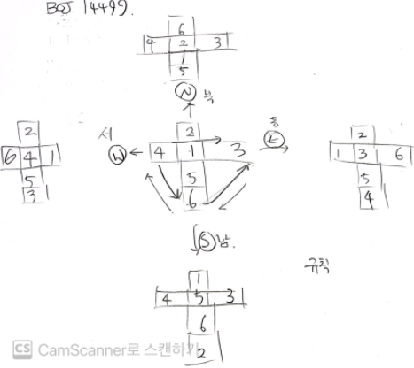

# Algorithm: Program Solving(c++)

> 작성자: SungwookLE  
> 작성일: '22.3/14   

## 1. 본 페이지에서는 무엇을 배우나요?

### 1-1. 문제해결, Program Solving(`PS`)을 위한 알고리즘 설계 문제를 배웁니다.

- 다른 말로, 코딩테스트 문제라고 불러요 😢
    
    [알고리즘 공부, 어떻게 해야하나요?](https://baactree.tistory.com/52)
    
- 본 페이지는 아래 강의를 따라가며 작성하였어요.
    
    [IT 기업 취업을 위한: 코딩 테스트 혼자서 정복하기](https://www.inflearn.com/course/%EC%BD%94%EB%94%A9%ED%85%8C%EC%8A%A4%ED%8A%B8-%ED%98%BC%EC%9E%90-%EC%A0%95%EB%B3%B5/dashboard)
    

### 1-2. 데이터베이스나 복잡한 구조에서 효율적인 알고리즘(`Big O`) 설계를 위한 방법을 배웁니다.

- 시각복잡도`Big O` 에 대해 알아봐요 👊
    
    [개발자라면 이제는 알아야하는 Big O 설명해드림. 10분컷.](https://www.youtube.com/watch?v=BEVnxbxBqi8)


### 1-3. 효율적인 알고리즘 만큼 중요한 것은 `Clean Code` 작성이라는 사실! 

- Variable, Function, Class 의 이름만 잘 지어도 Clean Code가 될 수 있어요. 💯

    [깨끗한 코드를 위한 5가지 팁](https://www.youtube.com/watch?v=Jz8Sx1XYb04)
    

## 2. 시간복잡도(`BigO`) 먼저 짚고 시작해요

- 알고리즘의 효율성의 가장 기본적인 비교 메트릭은 `BigO` 방법이예요.

<details><summary>
`BigO`는 인풋 사이즈(`N`)에 대한 함수의 실행횟수를 말합니다. </summary>



</details>

- 다음의 대표적인 방식에 대한 `BigO`를 계산해보면,
    1. 인풋 배열(사이즈N)에서 하나의 값을 바로 출력: `O(1)`
    2. 인풋 배열(사이즈N)을 1중 for문으로 조회: `O(N)`
    3. 인풋 배열(사이즈N)을 2중 for문(nested loop)으로 조회: `O(N^2)`
    4. 인풋 배열(사이즈N)을 n중 for문(nested loop)으로 조회: `O(N^n)`
    5. 인풋 배열(사이즈N)을 Binary Search 알고리즘으로 특정 값을 출력: `O(logN)`
        - Binary Search 알고리즘은 인풋 배열을 매 스텝마다 반으로 잘라 왼쪽과 오른쪽으로 쪼개나가며 특정 값을 찾아나가는 특징이 있는 알고리즘이예요.

            ```
            void binary_search(input_array){
            	if (특정값 찾기 성공)
            		return answer;
              else{
            	  left_side = input_array[0:mid]
            		right_side = input_array[mid:-1]
            	  binary_sarch()
            	}
            }
            ```

            - Binary Search 알고리즘의 `BigO` 실행횟수(step)는 `logN` 이 됩니다.
            - `BigO` 표기법에서는 `log`의 `밑 2`를 표기하지 않고 생략하니 참고하세요.
            - Binary Search 알고리즘을 사용하여, 32개의 인풋사이즈를 갖는 배열의 특정 값을 찾는 경우를 생각해봅시다.
                
                ```
                32개의 인풋 배열이 입력되면,
                
                32 / 2 = 16 <- 1 step
                16 / 2 = 8  <- 2 step
                8  / 2 = 4  <- 3 step
                4  / 2 = 2  <- 4 step
                2  / 2 = 1  <- 5 step
                
                특정값을 찾는 worst case를 가정하고 살펴보아도
                최대 실행횟수는 logN = 5 가 되네요.
                ```
- 공간복잡도에 대해서도 알아두면 좋아요. (메모리 관점)
    - `BigO` 표현법 기준으로 배열의 최대 사이즈가 공간복잡도입니다.
    - 프로그램의 소요시간 뿐만 아니라, 사용되는 메모리도 중요합니다. 여러분들의 컴퓨터의 메모리는 한정되어 있기 때문에, 똑같은 프로그램이면 차지하는 메모리가 적은게 더 좋겠죠? 그렇기 때문에 시간복잡도 뿐만 아니라 공간복잡도도 중요합니다.
    - 보통 메모리를 계산하는 경우에는 C++을 기준으로 생각합니다. C++ 에서는 int가 4 byte, char이 1 byte, double이 8 byte, short가 2 byte 이렇게 정해져 있습니다.
    - int로 2천만이 대략 80 MB라는 것을 이용하여 다음과 같이 쉽게 계산이 가능합니다.
        
        ```jsx
        int a[2천만] : 80MB
        int a[2백만] : 80 / 10 = 8MB
        char a[2천만] : 80 / 4 = 20MB
        double a[2천만] : 80 * 2 = 160MB
        ```
        
    - `int` 1개(`4byte`) x 2천만 = 80,000,000 = 80*10^6 = 80 MB
    - 예제를 살펴봅시다.
        
        ```jsx
        function solution(n)
        	set list = [n][n][n]
        	for i= 0 ... i < n
        		set tmp = [n]
        		for j = 0 ... j < n
        			tmp[j] = list[0][i][j]
        ```
        
        - 정답: 공간복잡도는 배열 최대 크기인 O(N^3) 이고, 참고로 시간복잡도는 O(N^2)               

## 3. `PS` Dynamic Programming 동적 프로그래밍

- Dynamic Programming = 분할정복 프로그래밍 = 점화식 배열
- 분할정복 풀이: Bottom-up 방식으로 점화식(recurrence relation)을 유도하여 풀자
    - 문제를 직접 풀려고 `if`문을 생각하게 되면, 여러 예외조건에 막혀 문제를 풀 수 없게된다는 것을 명심
    - 분할정복 문제는 배열을 이용해서 풀게되는데, 이 때!, `0` 번째 케이스에 대한 값을 {공집합, 0}과 같은 default 값을 넣어줌으로써 `trivial case` 에 대한 값을 명시적으로 배열을 채워서 풀자.
    - Top-down 방식으로 풀어야하는 문제도 있으나, 대부분 Bottom-up 방식이 풀기 쉽다.

### 3.1. 컨셉

1. 수열의 n번째 값 a_n을 구하기 위해 따라야 하는 규칙
2. a_n을 구하기 위해서는, a_1부터 순서대로 계산해야 함
- Bottom-up 방식으로 동적 프로그래밍을 위한 점화식 배열 문제 풀기
    - 배열을 이용한 점화식 풀이 방법
        
        
        
        
    - 실제 코딩테스트 문제는 `점화식`을 주지 않으니, 직접 유도해야 한다.
        
    ```cpp
    int main(){
    	int n ; 
    	cin >> n;
        
    	vector<int> arr = {3};
    	//bottom-up 방식
    	for(int i = 1  ; i <= n ; ++i)
    		arr.push_back(arr[i-1]*2 -4);
        
    	cout << arr[n] << endl;
    	return 0;
    }
    ```
        

### 3-2. 개념문제(1차원)

큰 문제를 작은 문제부터 해결하여 계산하기: 1차원 배열

- 특정 금액을 만들 수 있는 동전의 최소 개수를 찾아라
    
    
    
    1.  풀이: 20원으로 조합되기 위한 조합의 수는 15원의 조합+1 또는 17원의 조합+1 의 조합의 수를 갖는다.
        
        
        
    2. 점화식(recurrent function):
        
        
        
    3. DP 배열 설계:
        
        
        
    4. 코드:
        
        ```cpp
        int main(){
        
            int N;
            cin >> N;
        
            vector<int> DP(N+1, 0);
        
            //bottom - up
            // 1) 초항
            DP[0] = 0;
            DP[1] = X;
            DP[2] = X;
            DP[3] = 1;
            DP[4] = X;
            DP[5] = 1;
        
            // 2) 점화식
            // DP[6] = min(DP[6-3]+1 , DP[6-5]+1);
            //        = min(DP[3]+1, DP[1]+1);
            //        = min(DP[3]+1)
        
            for(int i = 6 ; i <= N ; ++i){
        
                if (DP[i-3] == X){
                    if (DP[i-5] == X)
                        DP[i] = X;
                    else if (DP[i-5] != X)
                        DP[i] = DP[i-5]+1;
                }
                else if (DP[i-3] != X){
                    if (DP[i-5] == X)
                        DP[i] = DP[i-3]+1;
                    else if (DP[i-5] != X)
                        DP[i] = min(DP[i-3]+1, DP[i-5]+1);
                }
            }
            cout << DP[N] << endl;
        
            return 0;
        }
        ```
        

### 3-3. 연습문제(2차원)

큰 문제를 작은 문제부터 해결하여 계산하기: 2차원 배열

- 가방에 담을 수 있는 보석의 최대 값어치를 담아서 훔쳐라
    
    
    
    1. 풀이: 작은 문제들을 풀어나가는 과정을 통해 N=4, K=14라고 하였을 때의 최대 값어치를 찾아보는 것을 생각해보자.
        
        
        
        
    2. 점화식:
        
        ```cpp
        if (j >= W)
            DP[i][j] = max(DP[i-1][j], DP[i-1][j-W]+current_price)
         // 배낭의 무게 허용량(j)이 보석의 무게(W)보다 크다면, 새로운 보석을 넣었을 때와 넣지 않았을 때의 max값이 가방에 들어갈 수 있는 보석의 최대값어치이다. 
        else if (j < W)
            DP[i][j] = DP[i-1][j]
        // 보석의 무게(W)가 배낭 허용량(j)보다 무거운 케이스
        ```
        
    3. 코드
        
        ```cpp
        int main(){
        
            int N, K;
            cin >> N >> K;
        
            vector<vector<int>>DP(N+1, vector<int>(K+1,0));
        
            for(int i = 1 ; i <= N ; ++i){
        
                int W, P;
                cin >> W >> P;
        
                for(int j = 1; j <= K; ++j){
                    if ( j >= W )
                        DP[i][j] = max(DP[i-1][j] , DP[i-1][j-W] + P);
                    else if ( j < W)
                        DP[i][j] = DP[i-1][j];
                }
            }
        
            cout << DP[N][K] << endl;
            return 0;
        }
        ```

- 주어진 두개의 문자열의 `LCS`(Longest Common Sequence)를 찾아라

    

    1. 풀이: 작은 문제들을 풀어나가는 과정을 통해 `LCS`를 찾아내자.
    2. 문제의 조건에서 `LCS`는 연속적일 문자열일 필요는 없었다.
    3. 점화식:

        

        ```cpp
        vector<vector<int>> DP(A.length()+1, vector<int>(B.length()+1,0));
            string A_token_last;
            for(int i = 1 ; i <= A.length(); ++i){
                A_token_last = A[i-1];
                string B_token_last;
                for(int j = 1 ; j <= B.length(); ++j){
                    B_token_last = B[j-1];
                    if (A_token_last == B_token_last)
                        DP[i][j] = DP[i-1][j-1]+1; 
            //두 문자열의 마지막 문자가 같다면, LCS("A문자열에서 마지막 문자 제거", "B문자열에서 마지막 문자 제거") + 1 의 값의 DP[i][j]의 LCS 최대값
                    else
                        DP[i][j] = max(DP[i-1][j], DP[i][j-1]);
            //두 문자열의 마지막 문자가 다르다면, max(LCS("A문자열", "B문자열에서 마지막 문자 제거"), LCS("A문자열에서 마지막 문자 제거", "B문자열"))
                }
            }
        ```

    4. 코드 

        ```cpp
        int main(){
            string A, B;
            cin >> A >> B;
        
            vector<vector<int>> DP(A.length()+1, vector<int>(B.length()+1,0));
            string A_token_last;
            for(int i = 1 ; i <= A.length(); ++i){
                A_token_last = A[i-1];
                string B_token_last;
                for(int j = 1 ; j <= B.length(); ++j){
                    B_token_last = B[j-1];
        
                    if (A_token_last == B_token_last)
                        DP[i][j] = DP[i-1][j-1]+1;
                    else
                        DP[i][j] = max(DP[i-1][j], DP[i][j-1]);
                }
            }
        
            for(auto elements : DP){
                for(auto element : elements)
                    cout << element << " ";
                cout << endl;
            }
        
            cout << "ANSWER: " << DP[A.length()][B.length()] << endl;
        
            return 0;
        }
        ```
        
- 프로그래머스 문제: 최소 N을 사용하여 주어진 number를 만드는 개수를 찾아라
    - 문제: [N으로표현](https://programmers.co.kr/learn/courses/30/lessons/42895)
    - 문제 설명:
        
        ```html
        아래와 같이 5와 사칙연산만으로 12를 표현할 수 있습니다.
        12 = 5 + 5 + (5 / 5) + (5 / 5)
        12 = 55 / 5 + 5 / 5
        12 = (55 + 5) / 5
        
        5를 사용한 횟수는 각각 6,5,4 입니다. 그리고 이중 가장 작은 경우는 4입니다.
        이처럼 숫자 N과 number가 주어질 때, N과 사칙연산만 사용해서 표현 할 수 있는 방법 중 N 사용횟수의 최솟값을 return 하도록 solution 함수를 작성하세요.
        
        * 제한사항
        N은 1 이상 9 이하입니다.
        number는 1 이상 32,000 이하입니다.
        수식에는 괄호와 사칙연산만 가능하며 나누기 연산에서 나머지는 무시합니다.
        최솟값이 8보다 크면 -1을 return 합니다.
        ```
        
    1. 문제 풀이: bottom-up으로 풀 수 있는 배열을 설계하여 풀자(`점화식`)
        
        
        
    2. 코드:
        
        ```cpp
        #define max_K 8
        using namespace std;
        
        int get_Ns(int N, int idx){
            int Ns=N;
            for(int i = 1 ; i < idx ; ++i){
                Ns = Ns*10 + Ns;
            }
            return Ns;
        }
        
        int main(){
            int N, number;
            cin >> N >> number;
            vector<unordered_set<int>> DP(max_K+1);
            DP[0].insert(0); //trivial case
            for(int k = 1; k <= max_K; ++k){
                DP[k].insert(get_Ns(N, k));
            
                for(int i = 1 ; i <= k; ++i){
                    for(int j = 1;  j<= k ; ++j){
                        if ((i+j) != k)
                            continue;
        
                        for(int p : DP[i]){
                            for(int q: DP[j]){
                                DP[k].insert(p+q);
                                DP[k].insert(p*q);
        
                                if ( p - q > 0)
                                    DP[k].insert(p-q);
                                if ( p / q > 0 )
                                    DP[k].insert(p/q);
                            }
                        }
                    }
                }
        
                if( DP[k].find(number) != DP[k].end()){
                    cout << "Find: " << *(DP[k].find(number)) << endl; // 
                    cout << "ANSWER: " << k << endl;
                    return k;
                }
            }
            cout << "ANSWER: " << -1 << endl;
            return -1;
        }
        ```
        
- 프로그래머스 문제: 삼각형의 최대 합을 찾아라
    - 문제: [정수삼각형](https://programmers.co.kr/learn/courses/30/lessons/43105)
    - 문제 설명:
        
        
        
        - 위와 같은 삼각형의 꼭대기에서 바닥까지 이어지는 경로 중, 거쳐간 숫자의 합이 가장 큰 경우를 찾아보려고 합니다. 아래 칸으로 이동할 때는 대각선 방향으로 한 칸 오른쪽 또는 왼쪽으로만 이동 가능합니다. 예를 들어 3에서는 그 아래칸의 8 또는 1로만 이동이 가능합니다.삼각형의 정보가 담긴 배열 triangle이 매개변수로 주어질 때, 거쳐간 숫자의 최댓값을 return 하도록 solution 함수를 완성하세요.
        - 제한사항삼각형의 높이는 1 이상 500 이하입니다.삼각형을 이루고 있는 숫자는 0 이상 9,999 이하의 정수입니다
    1. 문제 풀이: bottom-up으로 풀 수 있는 배열을 설계하여 풀자(`점화식` )
        - 처음 생각한 방식은 삼각형의 위에서 부터 모든 경로에 대한 경우의 수를 따지는 것은 동적프로그래밍이라기 보다는 브루트포스 방식(모든 경우를 naive하게 전부 계산)가 된다.
        - 삼각형의 밑변에서 부터 시작하여 최대 합이 나오는 것을 선택해주면 모든 경우의 수를 따지지 않고서 삼각형 경로의 최대합을 구할 수 있다.
            
            ```cpp
            DP[i][j] = max( DP[i-1][j] + triangle[height-i][j-1],DP[i-1][j+1] + triangle[height-i][j-1]);
            ```
            
            
            
    2. 코드:
        
        ```cpp
        int main(){
        
            // triangle 값 입력받기
            int height;
            cin >> height;
            vector<vector<int>> triangle(height);
            int element;
            for(int i = 1 ; i <= height ; ++i){
                for (int j = 1 ; j <= i ; ++j){
                    cin >> element;
                    triangle[i-1].push_back(element);
                }
            }
        
            //solution
            cout << endl;
            cout << "DP array below: "<< endl;
            vector<vector<int>> DP(height+1, vector<int>(height+2,0));
            for(int i = 1; i <= height; ++i){
                for(int j = 1; j <= height - (i-1); ++j){
        
                    DP[i][j] = max( DP[i-1][j] + triangle[height-i][j-1],
                                    DP[i-1][j+1] + triangle[height-i][j-1]);
        
                    cout << DP[i][j] << " ";
                }
                cout << endl;
            }
        
            cout << endl << "ANSWER: " << DP[height][1] << endl;
            return 0;    
        }
        ```
        

## 4. `PS` 그래프 탐색 `BFS`, `DFS`

- 그래프(Graph)는 노드(상태)와 엣지로 이루어져 있음
- 그래프 탐색 알고리즘은 `BFS`(너비우선탐색)와 `DFS`(깊이우선탐색) 알고리즘으로 나뉜다.
    1. `BFS`(Breadth First Search, 너비우선탐색)
        - 탐색 후, 노드 방문
        - 큐(`queue`)를 사용하여 문제 해결
        - 큐(`queue`)는  Last In Last Out의 데이터 배열 자료구조를 말해요
        - 큐(`queue`)의 역할은 탐색한 노드(방문 예정 노드)를 저장하는 역할을 합니다.
    2. `DFS`(Depth First Search, 깊이우선탐색)
        - 즉시 노드를 방문 (탐색 X)
        - 스택(`stack`)을 사용하여 문제 해결
        - 스택(`stack`)은 Last In First Out의 데이터 배열 자료구조를 말해요
        - 스택(`stack`)의 역할은 지금까지 방문한 노드를 모두 저장하는 역할을 합니다. (Trace)

### 4-1. `BFS, DFS` 컨셉 및 개념문제

1. 다리로 이어져 있는 군도에서 목표 섬에 가는 경로를 찾아라
    - 문제 설명
        - 지웅이는 A 위치에서 목적지인 F까지 이동하고 싶다. (시작점 A, 목적지 F)
        
        
        
        - `BFS`를 이용한 풀이: 가까이 있는 섬부터 탐색하기 (너비우선탐색)
            - 큐(`queue`)를 사용하여 `BFS`문제를 풀어요.
            - 큐에 있는 노드는 탐색하여 갈 수 있는 노드이지만, 방문은 하지 않은 노드예요. 즉, 갈 수 있는 노드 후보지(`candidates`)를 큐에 담아두었어요. 큐에서 꺼낼 때(`pop`) 해당 노드를 방문할거예요.
            1. default 상태 (어느 섬에도 있지 않음)
                
                
                
            2. A섬에서 방문하고 탐색을 시작(큐에서 첫번째인 A를 꺼냄)
                
                
                
                - B와 C노드가 탐색되어 큐에 넣어줌(갈 수 있는 후보지)
            3. B섬에 방문하고 탐색을 시작(큐에서 첫번째인 B를 꺼냄)
                
                
                
                - D노드가 탐색되어 큐에 넣어줌(갈 수 있는 후보지)
            4. C섬에 방문하고 탐색을 시작(큐에서 첫번째인 C를 꺼냄)
                
                
                
            5. D섬에 방문하고 탐색을 시작(큐에서 첫번째인 D를 꺼냄)
                
                
                
                - D섬에서는 갈 수 있는 섬이 없으니 추가할 후보지 노드는 없네요.
            6. F섬에 방문하고 탐색을 시작(큐에서 첫번째인 F를 꺼냄)
                
                
                
                - F섬은 목적지였으니, 탐색을 종료한다. 경로의 길이는 2이다.
                
                
                
                - 최종 경로는 A - C - F 의 순서로 2번만에 목적지 섬으로 이동 가능하다. (최단 경로)
            
        - `DFS`를 이용한 풀이: 최대한 깊숙한 곳까지 탐색하기 (깊이우선탐색)
            - 스택을 이용하여 문제를 풀어요
            - 스택에 담겨져 있다는 것은 해당 섬을 방문했다는 의미예요
            1. A섬에서 시작 (A섬에 방문한 상태)
                - 스택에 담는다.
                
                
                
            2. B섬에 방문
                
                
                
            3. D섬에 방문
                
                
                
                - 더 이상 나아갈 곳이 없다. (깊이의 끝에 도달)
                - D섬을 스택에서 지우고(`pop`) 이 전 지점인 B로 돌아가자
            4. B섬에 돌아와서 C섬에 방문
                
                
                
                - 이 부분에서 `DFS`와 `BFS`의 차이점이 보이는데, C섬으로 오는 경로에 있어서 `DFS`는 A-B-C 의 경로로 이동하였지만, `BFS`의 경우에는 A-C의 경로로 올 수 있었다.
            5. F섬에 방문
                
                
                
                - 목적지인 F섬에 도달하였으니 `DFS` 탐색을 멈춘다.
                - 지웅이의 이동 경로는 스택의 순서대로, A-B-C-F가 된다.
                    
                    
                    
                - `DFS` 알고리즘을 통해 경로를 찾는 경우, 최단 경우를 알려주는 것은 아닐 수도 있다.
                - 그러나, 경우에 따라서 `DFS` 로만 풀어야지 풀 수 있는 문제가 있다.
                
2. 2차원 격자 속 미로 탈출
    - 문제 설명
        - 민영이는 S(1,1)에서 E(4,3)로 가고 싶다.
        
        
        
        - `BFS`를 이용한 미로찾기 경로탐색 (너비우선탐색)
            - 큐에서 원소 제거(`pop`): 좌표 방문
            - 큐에서 원소 삽입(`push`): 탐색한 좌표를 방문 후보지에 추가
            1. 시작지점(1,1)에서 시작
                
                
                
            2. (1,2) 방문
                - 추가할 수 있는 탐색한 방문 후보지가 없음 (큐에 추가 X)
            3. (2,1) 방문
                - 탐색: (3,1) 추가 가능
                
                
                
            4. (3,1) 방문
                - 탐색: (3,2) 추가 가능
                
                
                
            5. (3,2) 방문
                - 탐색: (3,3), (4,4), (2,2) 추가 가능
                
                
                
            6. (3,3) 방문
                
                
                
                - 후보지를 탐색하니 목표로 하는 도착지점 (4,3)이 탐색됨
                
                
                
            7. 큐에 있는 나머지 노드를 방문하고 탐색 수행하고 (4,2), (2,2) ...
            8. (4,3) 방문
                - 도착지점에 도달하였으니, `BFS` 탐색 종료
                - (1,1)부터 (4,3)까지 5번의 이동으로 최단 경로를 찾아냄
                    
                    
                    
            
        - `DFS`를 이용한 미로찾기 경로탐색 (깊이우선탐색)
            - 스택 원소 삽입(`push`): 새로운 좌표 방문
            - 스택 원소 제거(`pop`): 이전 위치로 복귀
            1. 시작지점(1,1)에서 시작
                
                
                
            2. (1,2)에 방문
                
                
                
                - 더 이상 갈 곳이 없으니까, 이전 위치로 `pop` (깊이의 끝)
            3. (2,1)에 방문
                
                
                
            4. (3,1)에 방문
                
                
                
            5. (3,2)에 방문
                
                
                
                - (3,2)에서 3방향으로 이동 가능하나, 위부터 방문한다고 치면 (3,3)부터 방문
                - 어느 방향부터 방문할지는 임의대로 규칙을 정해 따르면 됨
            6. (3,3)에 방문
                
                
                
            7. (4,3)에 방문
                
                
                
                - 목적지인 (4,3)에 도착하여 `DFS` 탐색 종료
                - 이동한 경로는 스택에 담겨져 있는 순서로 5번의 이동 경로 발생
                    - (`BFS`와 동일한 최단 거리를 찾아냄)

### 4-2. `BFS` 연습문제

- `BFS`(Breadth First Search, 너비우선탐색)
    - 탐색 후, 노드 방문
    - 큐(`queue`)를 사용하여 문제 해결
    - 큐(`queue`)는  Last In Last Out의 데이터 배열 자료구조를 말해요
    - 큐(`queue`)의 역할은 탐색한 노드(방문 예정 노드)를 저장하는 역할을 합니다.
- 큐(방문 가능한 노드 리스트)에 추가가 되지 않는 조건
    1. 그래프나 그리드를 벗어나는 탐색 공간
        - `if ((next.x >= 시작 && next.y >= 시작) && (next.x <= 끝 && next.y <= 끝)`
    2. 방문한 곳은 또 방문하지 않는다. 비효율 경로를 발생시키기 때문
        - `if (grid[next.x][next.y] == 방문 안한 곳)`
- 장기판에서 말을 원하는 곳으로 옮기는 데 필요한 최소 회수를 구해라
    - 문제 설명:
        
        
        
    - 문제 풀이:
        1. 초기값: 큐에 이동 가능한 좌표(시작 좌표)를 넣는다.
            
            
            
        2. 시작좌표에 방문하고, 이동 가능한 탐색한 공간을 큐에 넣는다.
            - 시작좌표 노드를 `pop`하여 꺼냄
                
                
                
            - 방문 가능한 탐색한 공간을 큐에 넣는다.
                
                
                
            - 총 8개의 공간이 이동 가능한 좌표로 큐에 추가된다.
                
                
                
        3. 큐의 첫번째인 (6,5)부터 방문하여 탐색한다.
            - (6,5)를 `pop` 하여 꺼내기
            - 탐색 공간을 찾고 큐에 넣어주기
                
                
                
            - 이 때 큐에 목표지점인 (4,6)이 들어와 있음을 볼 수 있다.
        4. 큐의 첫번째인 (6,3) 부터 방문하여 탐색과정을 반복하여 진행
        5. (어느 순간) 큐의 첫번째인 목표지점(4,6)에 방문
            - 목표지점(4,6)에 도착하여 `BFS`탐색 종료

        - 코드 구현
            
            ```cpp
            #include <iostream>
            #include <queue>
            #include <vector>
            using namespace std;
            
            //1. 문제의 조건을 입력받는 변수나 배열은 글로벌 변수로 선언해주는 것이 편리하다.
            //2. 배열같은 경우, 딱 맞게 사이즈를 선언하는 것 보다는 문제 조건에서 최대 조건을 따져서 크게 잡아주는 것이,
            //   유리한데, 문제를 푸는 데 있어서 불필요하게 발생할 수 있는 메모리 에러를 피할 수 있다.
            
            int N, M;
            int sx, sy, fx, fy;
            vector<vector<int>> grid(110, vector<int>(110,0));
            queue<pair<int, int>> q;
            vector<pair<int, int>> delta = { {2,1}, {2, -1}, {-2,1}, {-2, -1},
                                             {1,2}, {1, -2}, {-1,2}, {-1, -2} };
            
            int main(){
            
                cin >> N >> M;
                cin >> sx >> sy;
                cin >> fx >> fy;
                q.push({sx, sy});
            
                //---------------- |solution| ----------------
                while(q.size() > 0){
            
                    pair<int, int> now = q.front(); // peek
                    q.pop();
            
                    cout << "NOW:{" << now.first << "," << now.second 
                    << "}, COUNT:" << grid[now.first][now.second] << endl;
                    
                    if (now.first == fx && now.second == fy){
                        cout << "FIND(BFS): " << grid[fx][fy] << endl;
                        return 0;
                    }
            
                    for (auto d_move : delta){
                        pair<int, int> next = {now.first+d_move.first , now.second+d_move.second}; 
                        
                        if ((next.first >= 1 && next.second >=1) && (next.first <= N && next.second <= M) && // 장기판 안에서만 움직여야 하고
                            (grid[next.first][next.second] == 0) ){  // 방문하지 않은 곳만 추가한다.
                                q.push(next);
                                grid[next.first][next.second] = grid[now.first][now.second]+1;
                            }
                    }
                }    
            
                cout << "NO PATH" << endl;
                return 0;
            }
            ```
            
- 박스 안에 귤이 모두 상하는 데 걸리는 최소 날짜는 얼마일까
    - 문제 설명:
        
        
        
    - 문제 풀이:
        1. 시작 값(상한 귤의 좌표)를 큐에 넣어 준다.
            
            
            
            - 상한 귤은 1, 상하지 않은 귤은 0, 비어 있는 공간은 X(-1)로 표시하였다.
        2. 큐 제일 앞에 있는 (1,2)를 꺼내 방문하고, 이 지점을 기준으로 주변의 상하게 될 귤을 큐에 추가한다.
            
            
            
            - 상하게 될 귤의 그리드 값은 +1을 해주어 표시한다. (모든 귤이 상하는 데 걸리는 날짜 표시)
        3. 큐 제일 앞에 있는 (3,1)을 꺼내고, 주변의 상하게 될 귤을 큐에 추가한다.
            
            
            
        4. 큐 제일 앞에 있는 (4,3)을 꺼내고, 주변의 상하게 될 귤을 큐에 추가한다.
            
            
            
        5. 큐 제일 앞에 있는 (1,3)을 꺼내고, 주변의 상하게 될 귤을 큐에 추가한다.
        6. 큐가 모두 비워질 때 까지 반복한다. (도달할 수 있는 경로 X)
        7. 큐가 모두 비워져 있다면, 큐를 순회하며 최대값을 리턴한다.
            - 리턴되는 값의 -1을 한 것이 귤이 전부 상하게 될 때까지 걸리는 날짜이다.
            - 순회 중에 `0`의 값이 발견된다면, 모든 귤이 상하지 않았단 의미이므로 문제의 조건대로 `-1`을 리턴해요.

        - 코드 구현:
            
            ```cpp
            #include <iostream>
            #include <vector>
            #include <queue>
            using namespace std;
            
            int N, M;
            vector<vector<int>> grid_orange_box(1010, vector<int>(1010,0));
            vector<pair<int, int>> delta = { {-1,0},{1,0},{0,-1},{0,1} };
            queue<pair<int, int>> queue_weird_oranges;
            
            int main(){
            
                cin >> N >> M;
                for(int i = 1 ; i <= N ; ++i){
                    for(int j = 1 ; j <= M ; ++j){
                        cin >> grid_orange_box[i][j];
            
                        if (grid_orange_box[i][j] == 1)
                            queue_weird_oranges.push({i,j});
                    }
                }
                
                // ------ |solution| ------ 
                while(!queue_weird_oranges.empty()){
                    pair<int, int> now = queue_weird_oranges.front();
                    queue_weird_oranges.pop();
            
                    cout << "NOW:{" << now.first << "," << now.second 
                    << "}, COUNT:" << grid_orange_box[now.first][now.second] << endl;
            
                    for(auto d : delta){
                        pair<int, int> next = {now.first + d.first , now.second + d.second};
                        if (next.first >= 1 && next.second >= 1 && next.first <= N && next.second <= M){
                            
                            if (grid_orange_box[next.first][next.second] == -1)
                                continue;
            
                            if (grid_orange_box[next.first][next.second] == 0){
                                queue_weird_oranges.push(next);
                                grid_orange_box[next.first][next.second] = grid_orange_box[now.first][now.second]+1;
                            }
                        }
                    }
                }
            
                int days = -1;
                for (int i = 1; i <= N ; ++i){
                    for(int j = 1 ; j <= M ; ++j){
                        if (grid_orange_box[i][j] == 0){
                            cout << "No answer: -1" << endl;
                            return 0;
                        }
                        if (grid_orange_box[i][j] > days){
                            days = grid_orange_box[i][j];
                        }
                    }
                }
            
                cout << "Answer: " << (days-1) << endl;
                return 0;
            }
            ```
            

### 4-3. `DFS` 연습문제

- `DFS`(Depth First Search, 깊이우선탐색)
    - 즉시 노드를 방문 (탐색 X)
    - 스택(`stack`)을 사용하여 문제 해결
    - 스택(`stack`)은 Last In First Out의 데이터 배열 자료구조를 말해요
    - 스택(`stack`)의 역할은 지금까지 방문한 노드를 모두 저장하는 역할을 합니다. (Trace)
    - `DFS`는 스택 자료구조를 이용해서 문제를 풀게 됩니다.
    사용할 함수 스택(`call stack`)에 대해 알아보아요.

    - 일반적인 함수 호출
            
    ```cpp
            int main(){
                printf("-143의 절대값은: ?%d\n", abs(-143));
            }
    ```
            
    - 호출순서: `main` → `printf` → `abs`
    - 종료순서: `abs` → `printf` → `main`

    
                
    - 재귀함수(`recurrent`) 호출

    ```cpp
            inf f(int n){
                if (n==1) return 1;
                return f(n-1)*n;
            }
            int main(){
                int res = f(4);
                printf("Factorial(4): %d\n", res);
            }
    ```
            
    - 호출순서: `f(4)` → `f(3)` → `f(2)` → `f(1)`
    - 종료순서: `f(1)` → `f(2)` → `f(3)` → `f(4)`
                
    - 
                
- 아파트 단지를 식별하라 ( `DFS` 문제)
    - 문제 설명:
        
        
        
    - 문제 풀이: 아래와 같이 배열을 식별할 수 있으면, 인접한 모든 아파트를 단지로 식별할 수 있다.
        
        
        
        - STEP에 따른 좌표 탐색 호출 순서
        - 현재 방문 좌표를 (⭐)로 표시
            1. 시작점(1,1)  

                (1,1) 좌표에서 DFS 함수 호출
                
                
            2. (-1,0) 이동하여 (0,1) 방문

                더 이상 갈 수 있는 곳이 없음
                
                
                
            3. (1,1)로 돌아옴
                
                
                
            4. (0,1)이동하여 (1,2) 방문
                
                그 다음 이동할 수 있는 공간 존재
                
                
            5. (1,0)이동하여 (2,2) 방문

                그 다음 이동할 수 있는 공간 존재
                
                
                
            6. (0,1)이동하여 (2,3) 방문

                그 다음 이동할 수 있는 공간 존재
                
                
                
            7. 계속해서 이동할 수 있는 공간으로 이동 ...

                더 이상 이동할 수 있는 공간 없음
                
                
            8. 이전 지점을 돌아감 (호출 스택에서 제거됨)
            9. (2,2) 지점에서 갈 수 있는 지점 발견하여 이동 (3,2)
                
                
                
            10. 더 이상 갈 수 있는 공간 없으므로 이전 지점으로 돌아감 (호출 스택에서 제거됨)
            11. (1,1) 지점에서 갈 수 있는 지점 발견하여 이동 (1,0)

                더 이상 갈 수 있는 곳 없음
                
                
                
            12. 더 이상 갈 수 있는 공간 없으므로 이전 지점으로 돌아감 (호출 스택에서 제거됨)
            13. 스택에서 모든 것이 제거됨
            14. 깊이 노드의 끝까지 탐색 완료
            
        - DFS 함수의 프로토타입 형태:
            
            
            
            - 다음 지점의 좌표가 범위를 벗어나거나, 이미 방문한 곳이거나, 유효하지 않은 조건이라면 DFS 재귀함수 호출 없이 종료되고, 그렇지 않은 경우 MAP[x][y]를 특정값으로 식별

    - 문제 구현:
        
        ```cpp
        #include <iostream>
        #include <vector>
        #include <algorithm>
        
        using namespace std;
        int N;
        void DFS(int x,int y);
        vector<vector<int>> grid(30, vector<int>(30,0));
        int cnt = 1; // 단지마다 번호를 세기 위함
        
        vector<int> ap(900,0); // 단지마다 몇개 아파트가 속해 있는지 개수를 세기 위함
        vector<pair<int,int>> delta = { {1,0}, {-1,0}, {0,1}, {0,-1} };
        
        int main(){
            // ------|check the result| ------
            cin >> N;
            for(int i =0 ; i < N ; ++i){
                string row ;
                cin >> row;
                for(int j =0 ; j < row.length() ; ++j){
                    grid[i][j] = row[j]-'0';
                }
            }
            // ------|solution|------ 
            for(int i = 0 ; i < N ; ++i){
                for(int j = 0 ; j < N ; ++j){
                    if (grid[i][j] == 1){
                        // cnt가 2부터 시작하는 이유: grid에 '1'이라는 정보가 이미 '아파트가 있음'을 알려주는 정보로 사용되고 있기 때문
                        cnt += 1;
                        // ------|dfs calling|------
                        DFS(i,j); 
                    }
                }
            }
            // ------|check the result|------
            cout << endl << "APART Complex:" << cnt-1 << endl;
            for(int i = 0 ; i < N ; ++i){
                for(int j =0 ; j < N ; ++j){
                    cout << grid[i][j];
                }
                cout << endl;
            }
            // ------|답 출력을 위한 구문|------
            sort(ap.begin()+2, ap.begin()+cnt+1); // 오름차순 정렬
            cout << cnt-1 << " ";
            for(int i =2 ; i <= cnt ; ++i){
                cout << ap[i] << " ";
            }
            return 0;
        }
        
        void DFS(int x,int y){
            grid[x][y] = cnt;
            ap[cnt] +=1;
            for(auto d : delta){
                int nx = x + d.first;
                int ny = y + d.second;
                if (!(nx >= 0 && nx < N && ny>=0 && ny <N))
                    continue;
                if (!(grid[nx][ny]==1))
                    continue;
                DFS(nx, ny);
            }
            return;
        }
        ```
        
- 욕심쟁이 딸기쟁이 조이 (`DFS+DP` 결합문제)

    - 문제 설명:
        
        ```
        Q) 조이는 nxn의 크기의 딸기밭을 방문했다. 조이는 딸기밭의 딸기를 수확할 수 있는데,
        어떤 지역에 있는 딸기를 모두 수확하면 상,하,좌,우 중 한 곳으로 이동을 하고, 그곳에서 딸기를 수확한다.
        
        그런데, 이 조이는 욕심이 많아서 딸기를 수확하고 자리를 옮기면, 새로 도착한 지역에 전 지역보다 딸기가 많아야 한다.
        조이는 어떤 지점에서 수확을 시작하여야 최대한 많은 칸을 방문하여 수확할 수 있는지 고민에 빠져 있다.
        조이를 도와주는 프로그램을 작성하여라
        
        첫 줄에 딸기밭의 크기 n (1<=n<=500)이 주어지고, 둘째 줄부터 n+1번째 줄까지는 딸기밭의 정보가 주어진다.
        딸기밭의 정보는 공백으로 구분되며, 각 지역의 딸기의 양의 정수로 주어진다.
        (단, 딸기의 양은 1,000,000보다 작거나 같은 자연수이다.)
        
        위와 같은 입력이 주어질 때, 조이가 최대로 이동할 수 있는 횟수를 출력한다.
        ```
        
        
        
    
    - 문제 풀이:
        - `DFS` 를 써서 문제를 풀 수 있다. 유효한 경로가 가장 긴 녀석의 개수가 본 문제의 답이 된다.
        - 그러나, `DFS`만으로만 문제를 풀면 모든 지점에 대하여 `DFS`알고리즘이 작동하여 함수의 실행 횟수 (호출 스택)이 많이 늘어나, 비효율적인 코드가 된다.
        - 비효율을 방지하기 위한 `DP` 프로그래밍 기법을 활용하여 전체 코드의 실행시간을 줄이자.

            - `DP` 프로그래밍은 점화식을 이용하여 푸는 문제로,
            이전 스텝의 출력값을 배열에 저장하고, 현재 스텝의 출력값은 이전 출력값과 관계식(점화식)을 이용하여 현재 스텝의 출력값을 구함으로써, 반복 계산을 줄일 수 있다.

            - 이런 특징을 메모이제이션(`memoization`)이라 한다.

        1. `DFS`함수 사용
            - 모든 지점에 `DFS` 함수를 호출하고 (아파트 문제와 동일)
            - 확산 조건(유효조건): 현재 위치의 딸기 개수 < 다음 위치의 딸기 개수

        2. `DP` 를 이용하여 연산 횟수 줄이기
            - Top-down 접근: 동적 프로그래밍 적용
            - 메모이제이션(memoization)
            
            
            
        3. `DFS`와 `DP` 결합하여 문제 풀이
            
            
            
    - 문제 구현:
        
        ```cpp
        #include <iostream>
        #include <vector>
        #include <algorithm>
        // DFS로 각 노드들의 최대 깊이를 구한다.
        // DFS가 반복된 계산을 하는 비효율을 줄이기 위해 Dynamic Programming을 설계해준다. (Memoization)
        
        using namespace std;
        int n;
        vector<vector<int>> strawbery(510, vector<int>(510,0));
        vector<vector<int>> DP(510, vector<int>(510,0));
        
        vector<pair<int, int>> delta = { {-1,0},{1,0},{0,-1},{0,1} };
        int DFS(int x, int y);
        
        int main(){
            cin >> n;
            for(int i = 0 ; i < n ; ++i){
                for(int j =0 ; j < n ; ++j){
                    cin >> strawbery[i][j];
                }
            }
        
            // --------------- |DFS calling| ----------------------
            for(int i=0 ; i<n ; ++i){
                for(int j=0 ; j<n ; ++j){
                    //memoization 계속해서 불필요한 DFS 함수 호출이 되지 않게끔
                    if (DP[i][j] == 0)
                        DP[i][j] = DFS(i,j);
                }
            }
        
            int answer = -1;
            cout << endl <<"DP 배열:\n";
            for(int i = 0 ; i < n ; ++i){
                for(int j =0 ; j < n ; ++j){
                    cout << DP[i][j] << " ";
                    if (answer < DP[i][j])
                        answer = DP[i][j];
                }
                cout << endl;
            }
        
            cout << endl << "ANSWER: " << answer << endl;
            return 0;
        }
        
        int DFS(int x, int y){
            //memoization 계속해서 불필요한 DFS 함수 호출이 되지 않게끔
            if (DP[x][y] != 0)
                return DP[x][y];
            
            for(auto d : delta){
                int nx = x + d.first;
                int ny = y + d.second;
        
                if (!(nx>=0 && nx < n && ny>=0 && ny < n))
                    continue;
                
                if (strawbery[x][y] < strawbery[nx][ny])
                    DP[x][y] = max(DP[x][y], DFS(nx,ny)+1);
            }
            return DP[x][y];
        }
        ```
        

## 5. 레퍼런스

1. 위키독스(프로그래밍 온라인 교재)
    
    [점프 투 파이썬](https://wikidocs.net/)
    
2. 프로그래머스(알고리즘 문제)
    
    [코딩테스트 연습](https://programmers.co.kr/learn/challenges)

## 6. 연습문제

### 6-1. BOJ 14499(구현)
[14499번: 주사위 굴리기](https://www.acmicpc.net/problem/14499)

- 3차원을 머리속에서 굴리려니까 쉽지 않다.
    - 주사위가 회전하면서 바뀌는 동서남북 이동할 때의 주사위 순번을 덱에 담아서 어떻게 저쩌게 해보려고 햇는데, 틀렸고..., 생각을 해보니, 규칙이 틀린듯 싶다.
    - 그래프 자료구조를 써서 인접리스트를 만들어야하는건가.. 하고 있었는데, 그것까지는 아닌듯하다.
- 주사위 회전에 따른 면 배치 규칙을 손으로 그려보고 나서야 규칙을 찾고 풀 수 있었다.
    - 
- 제출 코드(`c++`)
    ```cpp
        #include <iostream>
        
        using namespace std;
        
        int N, M;
        int x, y;
        int K;
        
        int map[21][21];
        int order[1001];
        
        int dice[7] = {0, 1, 2, 3, 4, 5, 6};
        int value[7] = {0, 0, 0, 0, 0, 0, 0};
        
        int main()
        {
        
            cin >> N >> M >> x >> y >> K;
            for (int i = 0; i < N; ++i)
                for (int j = 0; j < M; ++j)
                    cin >> map[i][j];
            for (int i = 0; i < K; ++i)
                cin >> order[i];
        
            pair<int, int> cur = {x, y};
        
            for (int i = 0; i < K; ++i)
            {
                bool in_map = false;
                switch (order[i])
                {
                case (1):
                    if (cur.second + 1 < M)
                    {
                        in_map = true;
                        cur.second += 1;
                        int temp = dice[6];
                        dice[6] = dice[4];
                        dice[4] = dice[1];
                        dice[1] = dice[3];
                        dice[3] = temp;
                    }
                    break;
                case (2):
                    if (cur.second - 1 >= 0)
                    {
                        in_map = true;
                        cur.second -= 1;
                        int temp = dice[6];
                        dice[6] = dice[3];
                        dice[3] = dice[1];
                        dice[1] = dice[4];
                        dice[4] = temp;
                    }
                    break;
        
                case (3):
                    if (cur.first - 1 >= 0)
                    {
                        in_map = true;
                        cur.first -= 1;
                        int temp = dice[6];
                        dice[6] = dice[5];
                        dice[5] = dice[1];
                        dice[1] = dice[2];
                        dice[2] = temp;
                    }
                    break;
        
                case (4):
                    if (cur.first + 1 < N)
                    {
                        in_map = true;
                        cur.first += 1;
                        int temp = dice[2];
                        dice[2] = dice[1];
                        dice[1] = dice[5];
                        dice[5] = dice[6];
                        dice[6] = temp;
                    }
                    break;
                }
        
                if (in_map)
                {
                    if (map[cur.first][cur.second] == 0)
                    {
                        map[cur.first][cur.second] = value[dice[1]];
                    }
                    else
                    {
                        value[dice[1]] = map[cur.first][cur.second];
                        map[cur.first][cur.second] = 0;
                    }
                    cout << value[dice[6]] << endl;
                }
            }
        
            return 0;
        }
    ```

### 6-2. BOJ 11053: `LIS` (DP)
[11053번: 가장 긴 증가하는 부분 수열](https://www.acmicpc.net/problem/11053)
    
- `dyanamic programming` 문제가 항상 어렵다.. **대표문제격인** `LIS` 문제를 풀어보자.
- `LIS`는 주어진 배열중에 숫자가 증가하는 규칙으로 숫자를 뽑았을 때 가질 수 있는 최장길이를 말한다.
    - 예: {1,7,2,4,9} 일 때, 최장길이는 4가 된다. (배열: {1,2,4,9})
- 풀이방법
    1. DP배열 정의: DP[i] : i번째 수를 끝 수로 하는 최장길이의 개수
    2. 점화식:`if (arr[k] < arr[i]) DP[i] = max(DP[k] + 1, DP[i])`
    3. 초기값: `DP[0~n] = 1` 최악의 경우에는 자기 자신이 최장길이의 개수가 된다.
- 코드
    ```cpp
        #include <iostream>
        #include <vector>
        
        using namespace std;
        
        int main(){
            int N = 5;
            vector<int> A = {1,7,2,4,9};
        
            
            vector<int> DP(N,1);
            for(int i = 0 ; i < A.size(); ++i){
                for(int k = 0 ; k < i; ++k){
                    if (A[i] > A[k]) DP[i] = max(DP[k]+1, DP[i]);
                }
            }
        
            cout << DP[N-1] << endl;
        }
    ```
        
### 6-3. 프로그래머스 도둑질 Lv4(DP)
[코딩테스트 연습 - 도둑질](https://programmers.co.kr/learn/courses/30/lessons/42897)
    
- (220422 첫시도) 실패
    - DP 배열을 하나 잡고서 풀려고 시도했다.(`LIS` 풀이방식과 유사하게 접근) 주어진 테스트케이스는 맞추었으나, 채점 결과 점수가 대부분 틀리게 나왔고, 생각을 해보니 첫번째 집을 털 경우에 끝집을 털면 안되는데, 아래 코드는 그런 부분에 대해서 처리가 안되어 있다.
        
    ```cpp
        int N = money.size();
            
            for(int i = 0 ; i < N ; ++i){
                DP[i] = money[i];
                
                for(int k =0 ; k<i ; ++k){
                    if (abs(i-k) > 1 ){ //이웃의 집은 털지 못하게
                        DP[i] = max(DP[i], DP[k]+money[i]);
                    }
                }
            }
    ```
        
- 풀이방법(`DP배열을 2개 잡아서 풀어야한다`)
    - 고민을 꽤 오래 해보았는데, 답이 떠오르지가 않아.. 다른 사람 풀이를 참고해보니, 배열을 **한개가 아닌, 두개를 잡고** 동적프로그래밍을 풀었더라.
        1. 첫번째 집을 털 경우에 대한 배열: `DP1`
            - 첫번째 집을 털 경우엔 자동으로 끝에 집을 털 수 없다.
        2. 첫번째 집을 털지 못한 경우에 대한 배열: `DP2`
            - 첫번째 집을 털지 않았으니, 끝에 집을 털 수 있다.
    - DP 배열 정의
        1. DP1[n] = 첫번째 집을 털었고, n번째 집까지 왔을 때, 털 수 있는 돈의 최대값
        2. DP2[n] = 첫번째 집은 털지 않았고, n번째 집까지 왔을 때, 털 수 있는 돈의 최대값
    - DP 초기값 정의
        1. DP1[0] = money[0] , 첫번째 집을 털었다. DP1[1] = money[0], 두번째 집은 털지 못한다.
        2. DP2[0] = 0, 첫번째 집을 털지 않았고, DP2[1] = money[1], 두 번째 집은 털었다.
    - 점화식
        - `if (i != N-1) DP1[i] = max(DP1[i-2] + money[i] , DP1[i-1]);
            DP2[i] = max(DP2[i-2]+money[i], DP2[i-1]);`
        - 최종적으로 답을 구할땐, DP1과 DP2 두 개에 담긴 값중 최대값을 리턴한다.
            - `return max(DP2[N-1], DP1[N-2]);`
- 제출코드(`c++`)

    ```cpp
        #include <string>
        #include <vector>
        #include <iostream>
        
        using namespace std;
        
        int solution(vector<int> money) {
            int answer = 0;
            
            int N = money.size();
            vector<int> DP1(N,money[0]); //첫번째 집 털었을 때,
            vector<int> DP2(N,money[1]); //첫번째 집 못 털었을 때,
            DP2[0] = 0;
        
            for(int i = 2 ; i < N ; ++i){
                if (i != N-1) DP1[i] = max(DP1[i-2] + money[i] , DP1[i-1]);
                DP2[i] = max(DP2[i-2]+money[i], DP2[i-1]);
            }
        
            return max(DP2[N-1], DP1[N-2]); //DP1과 DP2에 담긴 값중 최대값을 리턴
        }
    ```

### 6-4. BOJ 23291(구현)
[23291번: 어항 정리](https://www.acmicpc.net/problem/23291)

- 구현 문제 (아래 포스팅에 잘 정리해놓은 듯 하다.)
    - [[BOJ] 백준 23291 어항 정리 포스팅](https://zoosso.tistory.com/1069)
    - 구현문제는 class를 만들어 푸는 것이 좋다.
    - 어항쌓는 규칙 찾는 것에서 고민하다가 직접 구현 않고, 포스팅 참고함

    ```cpp
        class solver;
        int main(){       
        	   solver solve_this();
               while (1)
               {
                      solve_this.addFish();           // 1. 물고기 추가
        
                      solve_this.roll();              // 2. 어항 쌓기
                      solve_this.controlFish();       // 3. 물고기 수 조절
                      solve_this.sortFish();          // 4. 물고기 정렬
        
                      solve_this.fold();              // 5. 어항 접기
                      solve_this.controlFish();       // 6. 물고기 수 조절
                      solve_this.sortFish();          // 7. 물고기 정렬
        
                      ans++;                          // 8. 정리 횟수
                      if (solve_this.getDiff() <= K) break;
               }
               printf("%d\n", ans);
    ```
        

## 끝