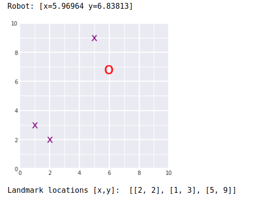
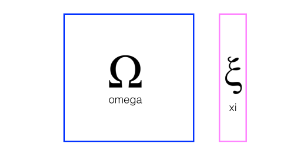
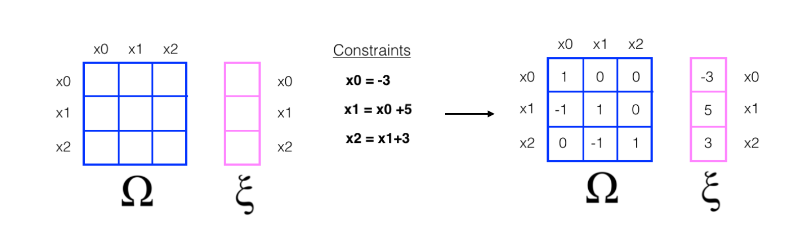
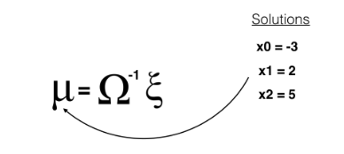
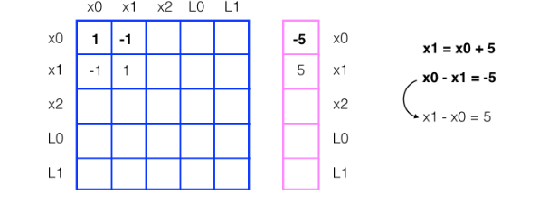
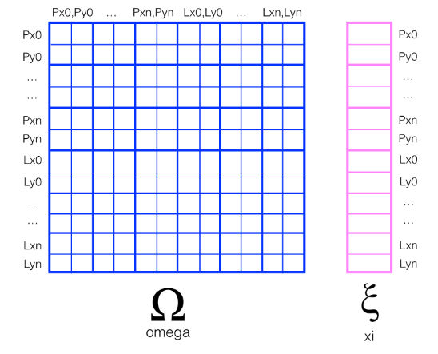

# Localization: Particle Filter 
> AUTHOR: Sungwook LE    
> DATE: '21.10/7  

## 1. Introduction

- 파티클 필터를 이용하여 localization을 문제를 풀 수 있다.
- localization 문제에서 `Kalman Filter`는 효율적이나, `uni-modal`의 **belif**를 가지고 있다는 것이 큰 단점이 된다.
- `Particle Filter`는 particle의 개수에 따라 효율이 결정되지만, `multi-modal`을 풀 수 있다는 장점이 있다.
- `multi-modal`을 풀 수 있다는 것은 *highly non-linear* (예를 들면, irregular 공간 점프) 등의 상황에서도 localization을 풀 수 있는 장점이 있다.

## 2. Particle Filter Basic
- 구현은 쉬운 편인데, 파티클 여러개를 MAP위에 생성하고, `LandMark`와 `measurement`의 *Gausian Matching* 확률 정보를 Weight로 하여 값을 기준으로 `Resampling`하는 과정을 통해 매칭 확률이 높은 Particle이 생존하게 되는 방식이다.

- 리샘플링은 `weight`가 클수록 더 높은 확률롤 뽑히게끔 만들어주면 됨: `resampling wheel`이라는 것을 이용할 수도 있다
    - wheel의 둘레를 $\beta = random * Weight_{max}$ 로 선언하고 $index_{init} = random$으로 하여, 
    ```python
    for i in range(Particle 개수:)
        while (beta < Weight[index]):
                beta -= Weight[index]
                index=(index+1)%N
        Pick.append(Particle[index])
    ```
    하는 형태이다.

- 파티클 필터는 particle들을 랜덤하게 여러군데 뿌린다음에 각각의 방향으로 move(`predict`)하고, `observation`과 `landmark`의 matching 정보를 확률로 계산하고 이 것을 weight의 가중치로 하여 resample 하는 과정으로 `bayesian filter`의 realization의 한 형태이다.
     1. `Measurement Update Step`: 

     - $P(X\|Z) \propto P(Z\|X)P(X)$

       - P(Z\|X): Important Weight로 파티클의 `observation`과 `landmark` 사이의 매칭 확률이다. 

       - P(X): Particle로서 각각의 모든 파티클에 대해 Important Weight를 곱하고 큰 값을 기준으로 Resampling 하고 있으니 보정이 되고 있는 것이다.

       - P(X|Z): Posterior
     2. `Motion Predict Step`:

     - $P(X') = \Sigma P(X'\|X)P(X)$

       - P(X): Particle 

       - P(X'\|X)는 각각의 입자에 대한 이동 모델이고

       - 이것을 다 나타낸 것이 새로운 Particle 인 것이다.

     3. 정리하면, Particle Filter도 Bayisan Filter의 표현형 중 하나인 것이다. 

     3. Original Bayisan Form   


## 3. Implementation of Particle Filter

- 아래의 초록색 박스가 파티클 필터의 `process`

- pseudo code로는 아래와 같다.

  1. 샘플을 initialize 한다.
  3. 샘플들을 주어진 input에 따라 움직이게 한다.
  4. 샘플들의 `observation`정보와 `landmark`까지의 거리 matching 확률을 계산한다.
  7. ~weight 값을 기준으로 resampling 한다.

- 실제로 파티클 필터를 구현하려고 하면, 센서 데이터를 파티클 필터 기준으로 `TRANSFORM`해야할 것이고, 그 다음 여러 개의 센서를 쓴다면 `ASSOCIATE`해주고 `LANDMARK`와 결합를 지어주어야 할 것이다. 그 다음에서야 matching 확률을 계산해줄 수 있다.


- 2D 공간에서 파티클 필터를 이용한 localization 함수 구성 flow는 해당 강의를 참고하자: [링크](https://classroom.udacity.com/nanodegrees/nd013/parts/b9040951-b43f-4dd3-8b16-76e7b52f4d9d/modules/85ece059-1351-4599-bb2c-0095d6534c8c/lessons/e3981fd5-8266-43be-a497-a862af9187d4/concepts/8c4483e7-ab82-49e3-b640-593f7d5e8cd4)


## 4. SLAM
- [Graph SLAM 과제 링크](https://learn.udacity.com/nanodegrees/nd891/parts/cd0359/lessons/75cc1d1d-2d09-4def-97fc-5dd4787c5bca/concepts/3f151bf4-5fea-485b-82ce-adb0fc325023)

- SLAM 결과값: 로봇(빨간 O), 랜드마크(보라색 X)
  - 
- [Graph SLAM (Omega and Xi)](https://jay.tech.blog/2017/03/18/graph-slam/)
  - SLAM문제를 해결하는 방법중 가장 기본적인 접근방법은 least square method를 이용하는 것이다. 이 방법은 linear algebra측면에서 매우 중요한 방법으로 연립 방정식의 해를 통해 로봇의 이동시 위치 좌표와 landmarks의 위치좌표를 이동거리라는 측정정보와 landmarks와 로봇간의 거리정보를 동시에 이용하여 산술적으로 풀어내는 방식이다. 모든 정보를 축적하고 이 데이터를 통해 robot 위치좌표와 environment map을 한꺼번에 구하는 방법을 full  SLAM이라고 하며, 이동하면서 얻은 정보는 지속적으로 정보로서 추가되면서 연립방정식을 풀어내는 방법을 online SLAM이라고 한다. 그러므로, 후자는 고정된 state dimension내에서 해를 구하는 것이 아니라 dynamic하게 state dimension이 변하지만, 새로운 measurement information을 기존 information을 이용하여 새운 방정식에 쉽게 추가하여 새로운 연립 방정식을 세운다. 구해진 로봇의 위치좌표는 localization을 의미하고, landmarks의 위치좌표는 mapping을 의미한다.

  - To implement Graph SLAM, a matrix and a vector (omega and xi, respectively) are introduced. The matrix is square and labelled with all the robot poses (xi) and all the landmarks (Li). Every time you make an observation, for example, as you move between two poses by some distance dx and can relate those two positions, you can represent this as a numerical relationship in these matrices.
  - 
  - Next, let's look at a simple example that relates 3 poses to one another.
    - When you start out in the world most of these values are zeros or contain only values from the initial robot position
    - In this example, you have been given constraints, which relate these poses to one another
    - Constraints translate into matrix values
    - 
  - Solving for x
    - To "solve" for all these x values, we can use linear algebra; all the values of x are in the vector mu which can be calculated as a product of the inverse of omega times xi.
    - 
  - $u=\Omega^{-1}\zeta$
    - u: 좌표값
    - Omega: Constraint Matrix
    - zeta: Constraint Value
    - 
    - 

- Graph SLAM code
  ```c++
  ## TODO: Complete the code to implement SLAM

  ## slam takes in 6 arguments and returns mu, 
  ## mu is the entire path traversed by a robot (all x,y poses) *and* all landmarks locations

  def slam(data, N, num_landmarks, world_size, motion_noise, measurement_noise):
    
    ## TODO: Use your initilization to create constraint matrices, omega and xi
    omega, xi = initialize_constraints(N-1, num_landmarks, world_size)
    
    ## TODO: Iterate through each time step in the data
    ## get all the motion and measurement data as you iterate
    
    '''
    measurement = data[i][0]
    motion = data[i][1]
    '''
    
    for idx, measurements_and_motion in enumerate(data):
        P_idx_prev = 2*(idx)
        P_idx_after = 2*(idx+1)
        # print(P_idx_prev, P_idx_after)
        
        measurements = measurements_and_motion[0]
        motion = measurements_and_motion[1]
        
        dx = motion[0]
        dy = motion[1]
        
        ## TODO: update the constraint matrix/vector to account for all *measurements*
        ## this should be a series of additions that take into account the measurement noise
        start_landmark = 2 + (N-1) * 2
        for landmark_id, Lx, Ly in measurements:
            L_idx = start_landmark + 2 * landmark_id
            omega[P_idx_prev][P_idx_prev] += 1/measurement_noise
            omega[P_idx_prev][L_idx] -= 1/measurement_noise 
            omega[L_idx][P_idx_prev] -= 1/measurement_noise
            omega[L_idx][L_idx] += 1/measurement_noise
            xi[P_idx_prev][0] -= Lx/measurement_noise
            xi[L_idx][0] += Lx/measurement_noise
            
            
            omega[P_idx_prev+1][P_idx_prev+1] += 1/measurement_noise
            omega[P_idx_prev+1][L_idx+1] -= 1/measurement_noise 
            omega[L_idx+1][P_idx_prev+1] -= 1/measurement_noise
            omega[L_idx+1][L_idx+1] += 1/measurement_noise
            xi[P_idx_prev+1][0] -= Ly/measurement_noise
            xi[L_idx+1][0] += Ly/measurement_noise
            
        ## TODO: update the constraint matrix/vector to account for all *motion* and motion noise
        omega[P_idx_prev][P_idx_prev]    += 1/motion_noise
        omega[P_idx_prev][P_idx_after]  -= 1/motion_noise
        omega[P_idx_after][P_idx_prev]  -= 1/motion_noise
        omega[P_idx_after][P_idx_after]+= 1/motion_noise
        xi[P_idx_prev][0] -= dx/motion_noise
        xi[P_idx_after][0] += dx/motion_noise
        
        omega[P_idx_prev+1][P_idx_prev+1]    += 1/motion_noise
        omega[P_idx_prev+1][P_idx_after+1]  -= 1/motion_noise
        omega[P_idx_after+1][P_idx_prev+1]  -= 1/motion_noise
        omega[P_idx_after+1][P_idx_after+1]+= 1/motion_noise
        xi[P_idx_prev+1][0] -= dy/motion_noise
        xi[P_idx_after+1][0] += dy/motion_noise
        
    
    
    # check the omega as sns
    # print(omega.shape, np.linalg.det(omega))
    # plt.rcParams["figure.figsize"] = (20,14)
    # sns.heatmap(DataFrame(omega), cmap='Blues', annot=True, linewidths=.5)
    # return
    
    
    ## TODO: After iterating through all the data
    ## Compute the best estimate of poses and landmark positions
    ## using the formula, omega_inverse * Xi
    omega = np.matrix(omega)
    xi = np.array(xi)
    mu = np.linalg.inv(omega)*xi
    
    return mu
  ```

- [SLAM and Mapping Paper](https://classroom.udacity.com/nanodegrees/nd013/parts/b9040951-b43f-4dd3-8b16-76e7b52f4d9d/modules/85ece059-1351-4599-bb2c-0095d6534c8c/lessons/e3981fd5-8266-43be-a497-a862af9187d4/concepts/f32443f3-0a61-41a6-987d-0481427ec29f)

## 끝