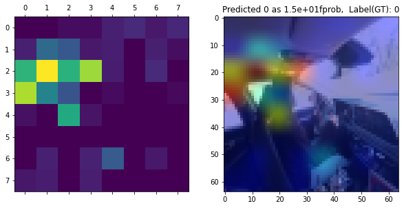
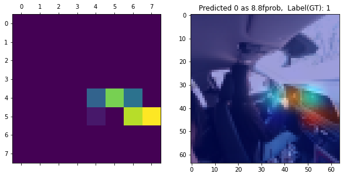

# Camera based Passenger Class Classifier
> Author: SungwookLE  
> Date  : '21.11/04    
> github repository is [here](https://github.com/SungwookLE/Safety_Class)  
> Semi-supervised Learning using AutoEncoder      
> For less memory usage, each classifier share one ConvNet branch  

### Project File Tree
```bash
Project/
│   README.md
│   run_realtime.py: function that run inferencing as realtime using final model(EncoderConvNet MutltOut with XAI analysis simultaneously)
│
│   1_SimpleConv_SingleOut_belt_trainer.ipynb: Belt Classifier Train&Analysis Pipeline using own SimpleConvNet
│   1_SimpleConv_SingleOut_weak_trainer.ipynb: Weak Classifier Train&Analysis Pipeline using own SimpleConvNet
│   1_SimpleConv_SingleOut_oop_trainer.ipynb: oop Classifier Train&Analysis Pipeline using own SimpleConvNet
│   1_SimpleConv_SingleOut_mask_trainer.ipynb: mask Classifier Train&Analysis Pipeline using own SimpleConvNet
│   1_SimpleConv_LoadModel_tester.ipynb: This is for load and test(analysis) the trained SimpleConv SingleOut model
│   2_Baseline_autoencoder_trainer.ipynb: Autoencoder(encoder+decoder) trainer for SSL
│   3_EncoderConv_MultiOut_oop_weak_mask.ipynb: oop&weak&mask multi output Classifier Train&Analysis Pipeline using EncoderConvNet
│   3_EncoderConv_LoadModel_testet.ipynb: This is for load and test(analysis) the trained EncoderConv MultiOut model
│   ...
│
└─── load/
│   └   load_data.py: This is for load data set from Data/ folder
│
└─── model/
│   │   model_cnn.py: This is SimpleConvNet model
│   │   model_autoencoder.py: This is autoencoder model and EncoderConvNet model
│   └   model_transfer.py: Empty
│
└─── utils/
│   │   xai_viz.py: This is for xAI analysis
│   │   extract_testset.py: This is work for divide the test data set from source data set
│   │   process.py: This is processing librarys.   
│   │   pseudo_oop_labeler.py: This is work for set labeling by manual in opendataset
│   └ samples_png/
│       │   xai_belt_sample.png
│       │   ...
│
└─── viz/
│   │   config.py: This is parse argument function
│   │   vis_support.py: This is realtime demo function
│   └ samples_fig/
│       │   realtime_demo_juwon.gif
│       │   ...
│
└─── ckpt/ (not commited): [x] Not used, [Δ] Patially Used, [O] Used in final result
    │   [O] model_belt_cnn: SimpleConv SingleOut trained model (Belt class): used in final result demo
    │   [x] model_weak_cnn: SimpleConv SingleOut trained model (Weak class)   
    │   [x] model_oop_cnn: SimpleConv SingleOuttrained model (OOP class)
    │   [x] model_mask_cnn: SimpleConv SingleOut trained model (Mask class) 
    │   [Δ] model_autoencoder: Autoencoder trained model (non-supervised): result was divided into two parts: encoder and decoder. encoder was used as final result demo
    │   [X] model_autoencoder_fine: Autoencoder trained model (non-supervised)   
    │   [Δ] model_encoder_oop: Using fixed Encoder, oop classifier trained model    
    │   [Δ] model_encoder_weak: Using fixed Encoder, weak classifier trained model  
    │   [Δ] model_encoder_mask: Using fixed Encoder, mask classifier trained model  
    └   [O] model_encoder_multihead: Assembling three trained encoder models, the final trained model: This is the final trained model

Data/ (not commited)   
│   open_dataset/: Those are from the distracted dataset(`DMD dataset`)
│   safety_class_dataset/: Collecting by myself
└   safety_class_testset/: Extracted from safety_class_datasets using random collection method
```    
- safety datasets were collected by myself. and those are for private research. also, trained models are for privated research. If you want to explore those, contact to this [email](joker125@naver.com).
- open dataset is [DMD](https://dmd.vicomtech.org/).

## 1. Introduction
- `safety_class_dataset`은 realsense 카메라를 이용하여 `dn8, rg3` 차량에서 `Body Camera`각도로 장착하여 직접 수집하였다.  
  
- Actors in images are Yukhyun(man), Minseok(man), Sungwook(man), Juwon(woman), Sujin(woman), Jieun(Woman).
- Classifiers have **4(four)** main tasks. `BELT/OOP/WEAK/MASK`
    1. 벨트 착용 여부: Belt(`b0`) / Unbelt(`b1`)
    2. 착좌 특이조건(OOP): Far(`c5`) / Close(`c6`) / Behind(`c7`) / Phone(`c1`) / Normal(`c0`)
    3. 취약승객: Man(`s0`) / Woman(`s1`)
    4. 마스크 착용 여부: Mask(`m0`) / Nomask(`m1`)

- 프로젝트의 목적
    1. 4개의 main tasks 분류 성능이 우수한 모델을 개발하는 것이 본 프로젝트의 주된 목적이다.
        - Target Performance: `AUC&Accuracy` > **0.93**  
        - AUC는 True positive , False positive 커브 영역의 넓이로써, THD에 따른 모델의 종합적인 Accuracy를 표현해주는 [지표](https://bioinformaticsandme.tistory.com/328)이다.
    2. 부족한 취득 데이터 볼륨을 극복하여, 모델 성능을 확보
        - Semi-Supervised Learning (w/ Large Open dataset) 적용함
        - opendataset은 이미지는 많으나, 이미지의 라벨링이 본 프로젝트의 class와 다르므로, 직접 지도학습에 사용하는 것에 한계가 있음
        - 그러나, opendataset에는 실내 승객 이미지가 가지고 있는 일반적인 정보가 있기 때문에, 비지도학습 방법인 autoencoder를 활용하여 학습하고 encoder 부분만 분리하여 사용함으로써, 이미지의 `hidden feature`를 추출하고자 하였음
    3. 모델이 현재 이미지에서 reasonable한 판단을 내리고 있는 것인지 해석할 수 interpretable한 툴 개발
        - xAI(Explainable AI) 분석 방법 적용함

- 최종적으로 구현한 Classifier 모델 Realtime 데모  
[](./img/samples_gif/realtime_demo_minseok.mp4)  
- 실행 명령어: `python run_realtime.py --model_multi 'model_encoder_multihead' --model_belt 'model_belt_cnn' --video 0`
- 최종적으로 학습 완료된 모델
    1. EncoderConv_MultiOut_oop_weak_mask: `./ckpt/model_encoder_multihead`
    2. SimpleConv_SingleOut_belt: `./ckpt/model_belt_cnn`

## 2. Ad Function (xAI, real-time Demo, processing, ...)
- 4개의 TASK를 판단하는 모델은 아래와 같은 구조로 구성되었다.  
   
- Encoder는 AutoEncoder에서 Encoder 파트만 분리하여 가져온 것으로, 실내 승객 이미지가 가지고 있는 general한 정보를 추출하는 역할을 한다.  
      
- 자기 자신의 이미지가 입력되어 출력으로 자신의 이미지를 사용하기 때문에 오토인코더는 라벨링이 필요없는 비지도 학습이다. 그렇다 보니 Symetric한 구조의 가운데의 feature는 hidden feature라 부르며, 이미지에서 제일 핵심이 되는 압축 정보를 가지고 있다.
- safety testset은 직접 취득한 dataset pool에서 랜덤하게 균등 추출한 것으로 [extract_testset.py](./utils/extract_testset.py) 코드 이용하여 추출함

### 2-1. xAI(explainable AI) 시각화 분석
- [xai_viz.py](./utils/xai_viz.py)  
    - 역할: Conv Layer의 Node들의 출력값을 Heatmap으로 표현하고, Input Image에 Overay 시킴으로써, 모델이 어떤 픽셀에 집중하고 있는지 시각적으로 설명  
    - 아래의 분류 모델에 xAI 분석을 통해 주어진 input 이미지의 어떠한 Feature에 주목하여 판단하고 있는지 분석 수행

### 2-2. real-time Demo
- 실시간 데모를 위해 코드를 작성하였다. [run_realtime.py](./run_realtime.py)
- 역할: 이미지 폴더 또는 비디오 웹캠 아이디를 넘겨주면, 실시간 작동하여 visualize 해준다.
1. 사용법1: 폴더 안의 이미지들을 비디오처럼 사용
```bash
 python run_realtime.py --model_multi 'model_encoder_multihead' --model_belt 'model_belt_cnn' --images ../Data/safety_class_dataset/*_nomask_juwon1/Color/*.jpg
```
2. 사용법2: 카메라를 실시간으로 이용
```bash
 python run_realtime.py --model_multi 'model_encoder_multihead' --model_belt 'model_belt_cnn' --video 0
```
### 2-3. preprocessing
- [process.py](./utils/process.py)
    - 이미지 reshape, 이미지 augment, 이미지 normalize, tsne 분석, 이미지 플롯팅, 데이터 shuffler, 라벨 딕션너리, predict score 함수, prediction 값 matching 플롯팅 함수
    - 학습 데이터의 augmentation을 수행하고 (전체 set의 15% 가량) 합쳐주어, generalization performance를 향상시킴
        - 랜덤 회전, 랜덤 쉬프트, 랜덤 줌
    ```
    img=random_rotation(X[data_aug_idx], rg=80, row_axis=0, col_axis=1, channel_axis=2)
    img=random_shift(X[data_aug_idx], wrg=0.1, hrg=0.1, row_axis=0, col_axis=1, channel_axis=2)
    img=random_zoom(X[data_aug_idx], zoom_range=[0.6,0.9], row_axis=0, col_axis=1, channel_axis=2)
    ```

### 2-4. Miscellaneous techniques
- gradient descenter: adam as learning rate 0.01 ~ 0.001
- call backs: learning rate 조정, early stopping, model checkpoint 등을 사용하였음
- batch size의 경우 gpu 로드 고려하여 16~32로 두고 수행

```python
adam = Adam(learning_rate=0.001)
rl_callback = ReduceLROnPlateau(monitor='val_acc', factor=0.1, patience=7, min_delta=0.001)
es_callback = EarlyStopping(monitor='val_acc', min_delta=0.0001, patience=9)
filepath = os.path.join(os.getcwd(), "ckpt/", "Encoder_OOP-{epoch:01d}-{val_acc:.2f}.h5")
checkpoint = ModelCheckpoint(filepath=filepath, monitor='val_acc', verbose=1, save_best_only=True, mode='max')

fin.compile(optimizer = adam,
            loss='categorical_crossentropy',
            metrics=['acc', tf.keras.metrics.AUC(thresholds=[0.5,0.7,0.9,0.95])],
            )

history = fin.fit(x=X_train_oop, y=y_train_oop,
                 epochs=25, batch_size=32, shuffle=True,
                 validation_data=(X_val_oop, y_val_oop),
                 callbacks=[rl_callback, es_callback, checkpoint])
```

## 3. Classifiers
- Belt Classifier는 지도학습을 이용하여 학습하였고, OOP/Weak/Mask Classifier는 Semi-supervised Learning을 이용하여 학습하였음
- Semi-supervised Learning은 AutoEncoder를 이용하여 완성하였음

### 3-1. Belt Classifier
- 벨트 착용 여부: Belt(`b0`) / Unbelt(`b1`)
- Input image size: 128x128x3
- Model: 3 stack ConvNet + 1 FullyConnected + 1 Output Layer


- 학습 결과 아래와 같이 Belt/Unbelt를 구분
    
- 코드는 [1_SimpleConv_SingleOut_belt_trainer](./1_SimpleConv_SingleOut_belt_trainer.ipynb)을 참고
- `Weak`, `OOP`, `Mask` Task와 달리 `Belt` 모델은 input 이미지의 사이즈를 `128x128`로 하였다. 
- 벨트는 승객의 의상과 비슷한 색깔일 때도, 옷에 가려 잘 보이지 않는 경우가 많아, input 이미지를 `64x64`로 할 경우 학습이 잘 되지 않았다.

- **결과 설명**
    1. Testset을 Dataset에서 추출해서 Fix 구성하고, 나머지 Dataset에서 Train, Validation Split 하여 학습, 튜닝 진행
    2. 추출된 Trainset과 Testset의 라벨 distribution  
      
    3. 직접 취득한 데이터셋에 벨트 착용 유무의 Class가 비슷하지 않아서, Opendataset에서 벨트 착용한 사진을 섞어서 전체 학습 데이터를 구성
    
    4. 최종적으로 `Train/Val/Test` 데이터 구성은 아래와 같다.
    ```bash
    Train: (6577, 128, 128, 3)
    Val: (1645, 128, 128, 3)
    Test: (387, 128, 128, 3)
    ```
    5. 구성한 CNN 모델은 아래와 같다.  [model_cnn.py](./model/model_cnn.py)  
    - 모델을 compile할 때 실수가 있었는데,
    `model.compile(loss='categorical_crossentropy', optimizer = adam, metrics=['acc',tf.keras.metrics.TruePositives(),tf.keras.metrics.TrueNegatives(), tf.keras.metrics.AUC(thresholds=[0.5,0.7,0.9,0.95])])` 에서 처음에 categorical_crossentropy가 아니고 binary_crossentrpy를 사용하여 학습이 제대로 되지 않았다.
    - model.compile단계에서 `loss` 함수는 아래와 같이 사용하면 된다. 
    - binary corssentropy : output node 1일 때 쓰는 것이고, categorical corssentropy는 output node가 2개 이상이면서 라벨링의 차원이 outputnode와 같을 때, , sparse crossentropy는 output node가 2개 이상이지만, 라벨링의 차원이 1일때 사용하면 된다.
    
    6. 학습 결과 (Total Epochs=10)은 아래와 같다.
    ```bash
    Epoch 8/10
    6577/6577 [==============================] - 150s 23ms/sample - loss: 0.0215 - acc: 0.9932 - true_positives: 6532.0000 - true_negatives: 6532.0000 - auc: 0.9962 - val_loss: 0.0672 - val_acc: 0.9720 - val_true_positives: 1599.0000 - val_true_negatives: 1599.0000 - val_auc: 0.9834
    ```
    - **Validation acc: 97.2%** , **Validation auc: 98.34%**  

      
      

    7. **Test Set의 Accuracy 100%**

    8. xAI로 살펴본 기계 학습 모델이 주목하고 있는 Feature 분석
        - 벨트 판단 `(머리 뒤쪽의 공간에 집중하고 있다)`    
          
        - 언벨트 판단 `(특이점을 잡지 못해, 집중하고 있는 픽셀이 분산되었다.)`  
          
        -  B-pillar 부의 벨트가 인출되는 지점의 픽셀에 집중해서, 해당 부분을 보고 벨트 착용 유무를 학습한 것으로 판단됨  

### 3-2. AutoEncoder 학습
- autoencoder는 인풋이 이미지이고 아웃풋이 자기 자신의 이미지로 **비지도학습**이 가능함
- 따라서, AutoEncoder의 학습은 30000장 규모의 opendataset을 활용하여 학습 진행

- 설계한 autoencoder의 구조는 아래와 같다. [model_autoencoder.py](./model/mode_autoencoder.py)의 `model_autoencoder` 참고
```
Layer (type)                 Output Shape              Param #   
=================================================================
input_1 (InputLayer)         [(None, 64, 64, 3)]       0         
_________________________________________________________________
enc_1st_conv (Conv2D)        (None, 64, 64, 64)        4864      
_________________________________________________________________
enc_1st_relu (ReLU)          (None, 64, 64, 64)        0         
_________________________________________________________________
enc_1st_maxpool (MaxPooling2 (None, 32, 32, 64)        0         
_________________________________________________________________
enc_2nd_conv (Conv2D)        (None, 32, 32, 128)       204928    
_________________________________________________________________
enc_2nd_relu (ReLU)          (None, 32, 32, 128)       0         
_________________________________________________________________
enc_2nd_maxpool (MaxPooling2 (None, 16, 16, 128)       0         
_________________________________________________________________
enc_3rd_conv (Conv2D)        (None, 16, 16, 256)       819456    
_________________________________________________________________
enc_3rd_relu (ReLU)          (None, 16, 16, 256)       0         
_________________________________________________________________
enc_3rd_maxpool (MaxPooling2 (None, 8, 8, 256)         0         
_________________________________________________________________
dec_3rd_conv (Conv2DTranspos (None, 16, 16, 256)       1638656   
_________________________________________________________________
dec_2nd_conv (Conv2DTranspos (None, 32, 32, 128)       819328    
_________________________________________________________________
dec_1st_conv (Conv2DTranspos (None, 64, 64, 64)        204864    
_________________________________________________________________
dec_out (Conv2D)             (None, 64, 64, 3)         4803      
=================================================================
```
- 학습한 autoencoder의 인풋과 아웃풋의 reconstruction loss는 0.0016 수준으로 낮은 값으로 학습을 마무리 하였다.
- 첫번째 row는 입력 이미지이고, 두번째 row는 autoencoder를 통해 출력된 이미지이다.
- 실내 승객의 주요 정보가 잘 reconstruction 되었음을 확인할 수 있다.


### 3-3. Encoder를 이용한 Multi Output 모델 구조

- 라벨이 없는 대규모의 실내 승객 opendataset을 활용하여 `autoencoder`를 학습하였고, 여기서 `encoder`부분만을 가져왔다. (`SSL`방법론)
- `SSL`방법론인 위와 같은 방법으로 모델을 학습할 경우, 얻을 수 있는 장점은 다음과 같다.
    1. 취득한 라벨링 데이터는 개수가 적고 표본의 분포가 좋지 않기 때문에, 취득한 데이터로만 모델을 학습할 경우, 데이터에 모델이 오버피팅되어, 실제 적용시 정확도가 크게 떨어질 수 있는 단점이 있다.
    2. 이를 극복하기 위해선, 데이터의 품질(분포 등)을 높히는 것이 중요한데, 현실적인 한계가 존재한다.
    3. 따라서, 실내 승객이미지라는 라벨링이 없는 오픈데이터를 활용하여, 실내 승객 이미지의 일반적인 특징을 추출할 수 있는 hidden feature 추출기를 학습하게 하고, 이를 feature 추출기로 사용하는 방법이 있다. 본 프로젝트의 경우 `encoder`가 그것이다.
    4. `encoder` 뒷 부분에 Fully Connected Layer와 Output Layer를 붙여서, 내가 가지고 있는 라벨링 되어 있는 취득데이터로 학습을 (미세 정밀 학습)마무리 지음으로써, 전체 모델의 general 성능을 끌어올릴 수 있는 장점을 취할 수 있다.
- 학습 Pipeline은 [2_Baseline_autoencoder_trainer.ipynb](./2_Baseline_autoencoder_trainer.ipynb) 참고
- 모델 코드는 [model_autoencoder.py](./model/model_autoencoder.py)의 `model_classifier_with_encoder, multihead_classifier_with_encoder` 참고 
- 가져온 `encoder`를 본 프로젝트의 task인 `oop, weak, mask`와 결합하여 구성하여 전체 모델 구조를 설계하였다.
- 이렇게 모델을 구성하면, `encoder`부를 각 task의 공통된 `conv`, feature 추출기를 갖게되어 메모리 측면에서 효율적이다.


- Encoder가 앞에 위치함으로써, 이미지의 공통된 feature를 추출하게 되고, 추출된 feature를 가지고 각 task(`oop, weak, mask`)가 승객의 `class`를 판단하는 구조이다.

- 학습 Pipeline은 [3_EncoderConv_MultiOut_oop_weak_mask.ipynb](./3_EncoderConv_MultiOut_oop_weak_mask.ipynb) 참고

### 3-3. OOP Classifier with Encoder
- 착좌 특이 조건(OOP)의 클래스 정의는 다음과 같이 하였다.
    - Far(`c5`) / Close(`c6`) / Behind(`c7`) / Phone(`c1`) / Center, Normal(`c0`)

- 착좌 특이 조건의 경우, 본 프로젝트의 목적에 맞는 데이터셋 sample 개수가 적어 추가적인 데이터 수집 및 라벨링을 붙이는 작업이 필요하였다.
- 이를 위해 [pseudo_oop_labeler.py](./img/pseudo_oop_labeler.py)를 작성하였고, 해당 코드를 실행하면 이미지를 현재 학습이 된 모델로 추론할 결과를 보여주고, 유저(사람)가 해당 라벨이 맞는지 여부를 피드백 입력을 넣어 이미지 데이터의 라벨을 반자동으로 붙일 수 있게 도와주는 툴이다.

- `oop` classifier만의 모델 branch 구조는 아래와 같다.


- **결과 설명**
    1. Pipeline 코드는 [passenger_classifier_oop](./passenger_classifier_oop.ipynb)를 참고 
    2. OOP 조건에 대한 데이터 구성
    ```bash
    Train (2480, 64, 64, 3)
    Val (621, 64, 64, 3)
    Test (340, 64, 64, 3)
    ```
    

    3. 학습 결과 **validation accuracy: 93.72%, validation auc: 96.38%**
    ```bash
    Epoch 00024: val_acc improved from 0.93720 to 0.94042, saving model to /home/joker1251/Desktop/owen/DataAnalysis_Science/DS_Master_21/Project/ckpt/Encoder_OOP-24-0.94.h5
    Epoch 25/25
    78/78 [==============================] - 38s 494ms/step - loss: 0.2065 - acc: 0.9141 - auc: 0.9482 - val_loss: 0.1893 - val_acc: 0.9372 - val_auc: 0.9638
    ```
    
    
    

    4. **Test accuracy: 98.235%**

    5. xAI로 분석해본 결과, 모두 몸 동작을 캐치하고 있는 것으로는 보인다. 
        - SafeDriving:   
          
        - Too Close:  
          
        - Too Far:  
          
        - Phone:  
          
        - Look Behind:  
          

### 3-4. Weak Classifier with Encoder
- 취약승객의 데이터로 남자/여자 데이터만을 활용할 수 있는 상황이어서, 노약자와 영유아에 대한 데이터 없이 학습을 진행하였다.
- 학습 Pipeline은 [3_EncoderConv_MultiOut_oop_weak_mask.ipynb](./3_EncoderConv_MultiOut_oop_weak_mask.ipynb)를 참고
- Weak classifier의 모델 branch만을 표현하면 아래 그림과 같다.


- 직접 취득한 데이터를 기준으로 Train/Validation, Test 구성하여 학습 진행

```bash
Train: (5728, 64, 64, 3)
Val: (1432, 64, 64, 3)
Test: (524, 64, 64, 3)
```

- 학습 결과:
    1. **Validation Accuracy: 99.37%, Validation AUC: 99.61%, Test Accuracy: 100%**
    ```bash
    Epoch 00006: val_acc improved from 0.99651 to 0.99791, saving model to /home/joker1251/Desktop/owen/DataAnalysis_Science/DS_Master_21/Project/ckpt/Encoder_Weak-6-1.00.h5
    Epoch 7/7
    179/179 [==============================] - 96s 534ms/step - loss: 0.0098 - acc: 0.9974 - auc_2: 0.9983 - val_loss: 0.0164 - val_acc: 0.9937 - val_auc_2: 0.9961
    ```
      
      
    2. predict 결과 샘플
    
    3. xAI로 살펴본 결과 (모든 이미지에 대해서 사람이 보기에 명확한것은 아니었다)  
        - 남자판단: `얼굴을 잡는 듯 하다.`   
          
        - 여자 판단   
           

### 3-5. Mask Classifier with Encoder
- 승객의 마스크 여부도 판단해보면 좋을 것 같아 구성한 서비스 Task이다.
- 학습 Pipeline은 [3_EncoderConv_MultiOut_oop_weak_mask](./3_EncoderConv_MultiOut_oop_weak_mask.ipynb) 참고
- 직접 취득한 데이터를 기준으로 Train/Validation, Test 구성하여 학습 진행


```bash
Train: (5728, 64, 64, 3)
Val: (1432, 64, 64, 3)
Test: (524, 64, 64, 3)
```
- `mask` classifier의 모델 구조는 아래오 같다.


- 학습 결과:
    1. **Validation accuracy: 94.2%, Validation auc: 96.49%, Test accuracy: 97.33%**
    ```bash
    Epoch 00004: val_acc improved from 0.93296 to 0.93715, saving model to /home/joker1251/Desktop/owen/DataAnalysis_Science/DS_Master_21/Project/ckpt/Encoder_Mask-4-0.94.h5
    Epoch 5/5
    179/179 [==============================] - 68s 382ms/step - loss: 0.2174 - acc: 0.8883 - auc_4: 0.9269 - val_loss: 0.1355 - val_acc: 0.9420 - val_auc_4: 0.9649
    ```
      
      

    

    2. xAI로 살펴본 결과
    - 마스크 착용  
    
    - 마스크 미착용  
    

## 4. Results Summary
- 최종적인 모델의 구성은 아래와 같다.  
   
- `autoencoder`을 활용하여 가지고 있는 데이터에 외에도 라벨링이 없는 데이터를 활용한 `SSL`을 수행하였다.
- `encoder`를 task마다 공유시키게 하여, 메모리 리소스를 효율적으로 사용하였다.
- Test set의 예측 결과는 아래와 같이, 좋은 성능을 보여주었다.
```bash
OOP Classifier: Test Predict is 98.23529411764706%
Weak Classifier: Test Predict is 100.0%
Mask Classifier: Test Predict is 97.33%
Belt Classifier: Test Predict is 100.0%
```

- real_time_demo results:
    1. [realtime_demo_minseok.mp4](./img/samples_gif/realtime_demo_minseok.mp4)  
    
    2. [realtime_demo_jieun.mp4](./img/samples_gif/realtime_demo_jieun.mp4)  
      

## 5. Discussion
1. 직접 취득할 수 있는 승객 영상 데이터는 배우가 한정적이고, 환경도 실제 운전자들의 주행 조건 만큼 다양하지 못하기 때문에 이미지 data의 분포는 좋지 않음
    - 이런 경우, 학습될 모델의 성능도 overfitting 되어 좋지 못함
    - 따라서, 다양한 이미지 데이터 셋을 다양한 소스(ex: 구글, 오픈데이터셋)에서 충분히 활용하는 것이 좋으나, 우리가 원하는 라벨링이 붙어있지 않는 데이터가 대다수
    - 이를 보완하기 위한 방법으로 Semi-Supervised Learning 고려해야 하며, 본 프로젝트에서는 `autoencoder`를 활용함
2. 딥러닝 로직의 판단 과정은 블랙박스이기 때문에, 이를 제어에 직접 사용하기 위해서는, 사람이 납득할 수 있는 수준의 해석 도구가 필요함
    - xAI라고 불리우는 방법을 같이 활용하여 감지 성능을 개발단계에서 지속적으로 살펴볼 필요가 있음
    - 성능 개발 단계에서, 개발 support 툴로써 같이 활용(GUI 툴)
3. 머신러닝 모델의 성능만큼이나 차량에 들어갔을 때, 리소스 측면에서 LIGHT한 모델 고려 필요
    - 당연히, 가벼울수록 전력 사용량이나 발열량 측면에서도 유리함
    - 따라서, 최대한 공유할 수 있는 부분은 공유하고, 개별적으로 분기가 필요한 부분에서만 모델 PATH를 분기시켜 설계
4. 머신러닝 추론 값을 제어 로직에 적용하기 위해선, 인터페이싱 알고리즘이 필요함
    - 추론 값은 불안정하게 흔들리므로, 이를 차량제어에 사용하기 위해선, 간단하게는 `LPF`를 붙이거나, 역학 모델과 `fusion`하는 방식을 통해 값을 보완하여 사용하여야 함

## 6. Future work

1. 본 프로젝트는 기존의 승객의 거동을 `skeleton` 모델로 regression 추정하는 것을 하는 것이 아니라, 사전 정의된 특이 거동을 `class`로 정의하고, class를 맞추는 classifier 문제로 접근해 본 것이다. class 세분화를 잘게 쪼갤 수록 regression 모델과 유사한 성능을 가질 수 있으므로, `classifier` 모델 접근법은 승객 영상 거동 추정 기술의 시작점으로 적절하다는 생각이 들었다.


    - `Regressor` 문제로 접근하여 3D keypoints를 추정하는 모델 개발(`Skeleton`)
        - 장점: 각 관절의 3D keypoints를 제공함으로써, 폭넓은 application 범용성을 갖는다.
        - 단점: 데이터를 직접 만드는 것이 까다롭고 (keypoint마다 3D 좌표 라벨을 달아주어야 함), 차량 실내 환경에 맞는 데이터셋은 없으므로 직접 만들어야 함, 모델이 무거움, 차량 제어에 직접 사용하기에는 모델의 오차가 큰 편이고, 개선에 한계가 있음
        

    - `Classifier` 문제로 접근하여 승객의 class를 판단하는 모델 개발
        - 장점: 실내 승객의 이미지 데이터셋을 오픈 데이터셋으로 구하는 것에 있어 비교적 수월한 편, 모델이 가벼운 편
        - 단점: 이미지마다 class 라벨을 달아주어야 하는데, class 라벨을 달 때에 우리가 관심으로 하는 승객의 class에 대한 정의가 정확하게 되어 있어야 함, 아무래도 regressor 정보가 아니기 때문에, 범용성엔 제한이 있는 편

2. `Regressor`모델과 `Classifier`모델 접근법의 장점을 잘 고려하여, 실내 승객 거동에 적합한 모델을 개발하는 연구가 필요하다.

3. 현재, 모델은 `Single Camera Image`를 Input으로 하여 연구를 수행하였으나, 향후에는 차량 실내의 `Multi Cameras`를 이용하여 Multi Image를 입력으로 하는 모델을 개발하여 정확도를 향상시킬 뿐 아니라, 운전자 뿐 아니라, 차량 내 모든 승객에 대한 Class 판단을 수행하는 모델을 개발하는 것을 향후 연구 방향으로 제시함

    - `Multi Camera` 이미지 모델에 대한 연구 필요
        - 미래 실내 공간은 다양한 시트 레이아웃이 존재할것으로 예상되고, 특히 자율주행 차에서는 운전자 자체가 있기 때문에, 실내 전체 공간에 대한 `SCAN`이 필요함
        - 멀티 카메라 이미지를 인풋으로 하는 머신러닝 모델 한개를 구성하고 각 그리드 영역에 사람이 있는지 여부와, 사람이 있다면 승객의 class는 어떠한지 예측하는 모델을 개발할 수 있다.
        
    
    - `Human Detector`를 사용하여 그리드 분리 없이 탑승 승객을 찾아내고, 그 승객의 착좌/거동 특이사항을 추론하는 모델도 개발할 수 있다.

## 끝

