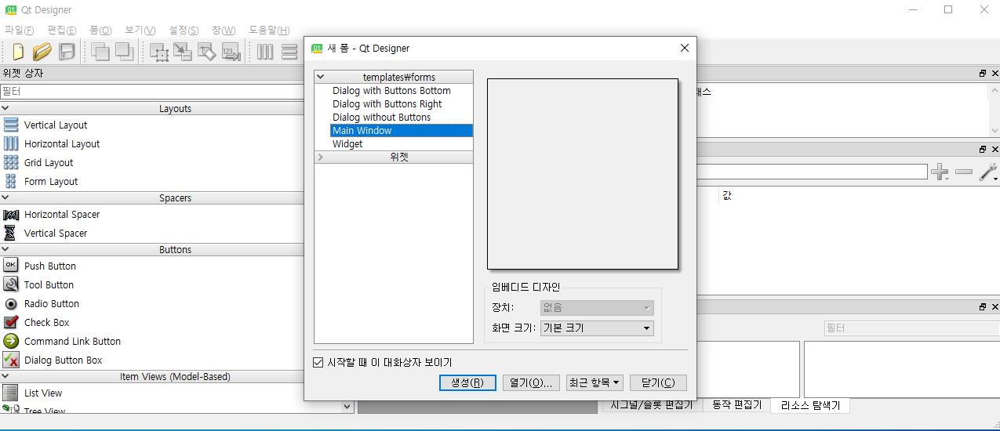
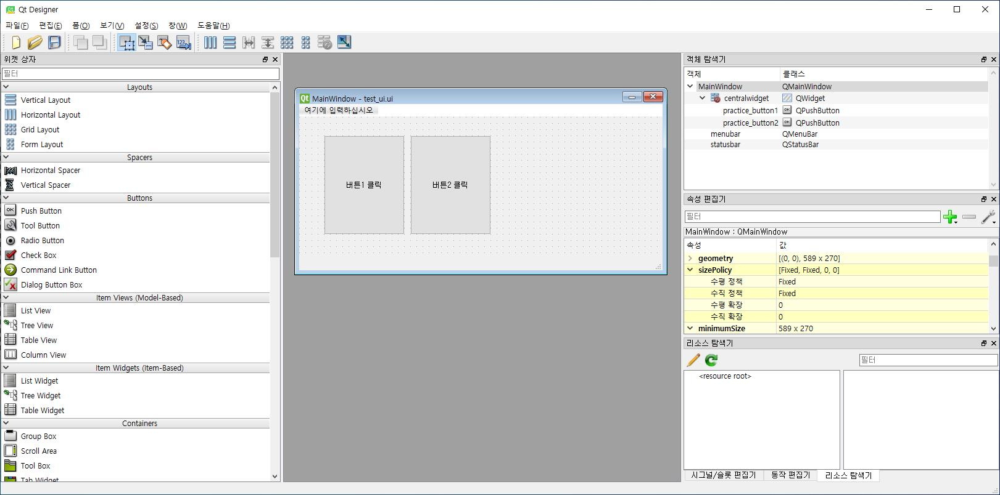
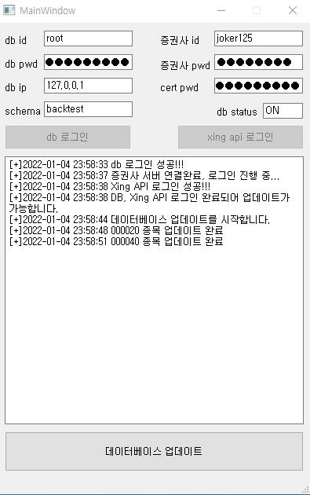

# PyQt 이용한 코스피, 코스닥 Stock DB 업데이트 GUI 프로그램
> Author: [SungwookLE](joker1251@naver.com)  
> Date  : '21.12/28
> Following Lecture: [Python을 이용한 주가 백테스팅 시스템 구축하기](https://www.inflearn.com/course/python-%EC%A3%BC%EA%B0%80-%EB%B0%B1%ED%85%8C%EC%8A%A4%ED%8C%85/dashboard)
>> 1. PyQt 사용하기(기본)
>> 2. PqQt 를 이용한 DB Update GUI 프로그램 만들기

## 1. PyQt 사용하기(기본)
1. `designer`라는 PyQt5 디자인 툴을 사용하여 기본적인 `Layout`을 설계할 수 있다.


2. 이런 식으로 `QMainWindow`를 생성하고 그 곳에다가 원하는 `Widget`들을 가져다 둔다.


3. 저장을 하면, `*.ui`라는 파일이 생성되는 데, 이를 `python`으로 변환하여 class의 구성 요소들을 얻어낸다. 물론 `designer` 툴에서 지정한 이름이 class의 attribute가 된다.

4. python 코드 변환 방법(`*.ui` --> `*.py`): `pyuic5 -x test_ui.ui -o test_ui.py`

5. 그러면, 아래와 같은 `*.py` 파일이 생성되는데, 내가 설정한 gui의 속성 정보를 담고 있다. 
6. 여기서, 눈여겨 볼 속성은 내가 가져다 둔 `버튼`인 `self.practice_button1`과 같은 변수가 되겠다.

```python
from PyQt5 import QtCore, QtGui, QtWidgets

class Ui_MainWindow(object):
    def setupUi(self, MainWindow):
        MainWindow.setObjectName("MainWindow")
        MainWindow.resize(589, 270)
        sizePolicy = QtWidgets.QSizePolicy(QtWidgets.QSizePolicy.Fixed, QtWidgets.QSizePolicy.Fixed)
        sizePolicy.setHorizontalStretch(0)
        sizePolicy.setVerticalStretch(0)
        sizePolicy.setHeightForWidth(MainWindow.sizePolicy().hasHeightForWidth())
        MainWindow.setSizePolicy(sizePolicy)
        MainWindow.setMinimumSize(QtCore.QSize(589, 270))
        MainWindow.setMaximumSize(QtCore.QSize(589, 270))
        self.centralwidget = QtWidgets.QWidget(MainWindow)
        self.centralwidget.setObjectName("centralwidget")
        self.practice_button1 = QtWidgets.QPushButton(self.centralwidget)
        self.practice_button1.setGeometry(QtCore.QRect(40, 30, 131, 161))
        self.practice_button1.setObjectName("practice_button1")
        self.practice_button2 = QtWidgets.QPushButton(self.centralwidget)
        self.practice_button2.setGeometry(QtCore.QRect(180, 30, 131, 161))
        self.practice_button2.setObjectName("practice_button2")
        MainWindow.setCentralWidget(self.centralwidget)
        self.menubar = QtWidgets.QMenuBar(MainWindow)
        self.menubar.setGeometry(QtCore.QRect(0, 0, 589, 21))
        self.menubar.setObjectName("menubar")
        MainWindow.setMenuBar(self.menubar)
        self.statusbar = QtWidgets.QStatusBar(MainWindow)
        self.statusbar.setObjectName("statusbar")
        MainWindow.setStatusBar(self.statusbar)

        self.retranslateUi(MainWindow)
        QtCore.QMetaObject.connectSlotsByName(MainWindow)

    def retranslateUi(self, MainWindow):
        _translate = QtCore.QCoreApplication.translate
        MainWindow.setWindowTitle(_translate("MainWindow", "MainWindow"))
        self.practice_button1.setText(_translate("MainWindow", "버튼1 클릭"))
        self.practice_button2.setText(_translate("MainWindow", "버튼2 클릭"))

if __name__ == "__main__":
    import sys
    app = QtWidgets.QApplication(sys.argv)
    MainWindow = QtWidgets.QMainWindow()
    ui = Ui_MainWindow()
    ui.setupUi(MainWindow)
    MainWindow.show()
    sys.exit(app.exec_())
```

7. 이제 프로그램을 작성해보자.

    - class testClass(QMainWindow, UI_MainWindow)를 보면 QMainWindow를 먼저 두어, `super().__init__()`에서 QMainWindow가 초기화되게 두었다.

    ```python
    import sys
    from PyQt5.QtCore import pyqtSlot
    from PyQt5.QtWidgets import QMainWindow, QApplication
    from test_ui import Ui_MainWindow

    class testClass(QMainWindow, Ui_MainWindow):
        def __init__(self):
            super().__init__()
            self.setupUi(self)

            self.practice_button1.clicked.connect(self.test_function1)
            self.practice_button2.clicked.connect(self.test_function2)
        
        def test_function1(self):
            print("버튼1이 클릭되었습니다.")
        
        def test_function2(self):
            print("버튼2이 클릭되었습니다.")

    app = QApplication(sys.argv)
    test_window = testClass()
    test_window.show()

    app.exec_()
    ```
    - 순서에 따라, super() 단계에서 호출되는 클래스가 다르다.
    - 직접 작성한 python class [예시](./img/basic1.py)를 살펴보자

8. 위 코드에서 중요한 것이, `self.practice_button2.clicked.connect(self.test_function2)` 인데, 내가 만든 `practice_button2`가 `.clicked.connect` 되면 `self.test_function2` 함수를 호출하게 된다.
    - 이러한 형태를 시그널발생-슬롯실행 이라고 한다.

9. 이렇게하여, 간단하게 Qt 프로그램을 생성해보았다.

## 2. PqQt 를 이용한 DB Update GUI 프로그램 만들기
- PyQt를 이용하여 DB Update GUI를 작성하였다.


- `COM`객체를 활용하여 증권사 API에 연동하고 `win32com.client.DispatchWithEvents` 를 이용하여 데이터를 받아오는 과정은 복잡하여, 외우려고 하기 보다는 플로우를 기억하자
    - `COM` 객체를 이벤트 핸들러로 호출하고, 데이터가 들어오면 `mySQL`에 `insert into` 해주었다. 
- `mySQL` DB 서버에 데이터를 올려준다. DB 구축에 시간이 오래 걸리는 만큼 증권사 API에서 제공하는 모든 정보를 DB에 업로드해주었다.
    - sh{} (date, open, high, low, close, jdiff_vol, value, jongchk, rate, pricechk, ratevalue, sign)


```python
from logging import log
import sys
from PyQt5.QtWidgets import QMainWindow, QApplication
from main_ui import Ui_MainWindow
import datetime

import os
#상위 경로 폴더를 가져오기 위해 선언
sys.path.append(os.path.dirname(os.path.abspath(os.path.dirname(__file__))))
from lecture_practice.pwd import mysql_credentials, xing_credentials
from lecture_practice.update_table import update_table

#mysql
import mysql.connector

#XingAPI
import win32com.client
import pythoncom

class mysql_status:
    def check_mysql_status():
        msg = os.popen('sc query MySQL80').read()
        for tok in msg.split(' '):
            if tok == "RUNNING":
                is_on = True
                return is_on
        else:
            is_on = False
            return is_on
   
class loginEventHandler:
    is_login= False
    is_error= False

    is_pwd_wrong = False
    is_id_wrong =False
    is_cert_pwd_wrong = False

    def OnLogin(self, code, msg):
        print(code, msg)
        loginEventHandler.is_login = True
        if code != "0000":
           loginEventHandler.is_error=True
           if code == "5101":
           #     #ID 확인
               loginEventHandler.is_id_wrong = True
           elif code == "8004":
           #      #PWD 틀림
               loginEventHandler.is_pwd_wrong = True
           elif code == "2005":
           # 공동인증서 비번 틀림
               loginEventHandler.is_cert_pwd_wrong = True
        
    def reset_flag():
        loginEventHandler.is_login= False
        loginEventHandler.is_error= False
        loginEventHandler.is_pwd_wrong = False
        loginEventHandler.is_id_wrong =False
        loginEventHandler.is_cert_pwd_wrong = False

class mainWindow(QMainWindow, Ui_MainWindow):
    def __init__(self, debug_mode=False):
        super().__init__()
        self.setupUi(self)
        self.connection = False
        self.session = False
        self.db_login_button.clicked.connect(self.db_login)
        self.xing_login_button.clicked.connect(self.api_login)
        self.db_update_button.setEnabled(False)
        self.db_update_button.clicked.connect(self.update_database)

        if (mysql_status.check_mysql_status()):
            self.db_status_text.setText('ON')
        else:
            self.db_status_text.setText('OFF')

        if debug_mode ==True:
            self.db_id_edit.setText(mysql_credentials["user"])
            self.db_pwd_edit.setText(mysql_credentials["password"])
            self.db_ip_edit.setText(mysql_credentials["host"])
            self.db_schema_edit.setText("backtest")

            self.xing_id_edit.setText(xing_credentials["ID"])
            self.xing_pwd_edit.setText(xing_credentials["password"])
            self.cert_pwd_edit.setText(xing_credentials["cert_password"])

    def db_login(self):
        user = self.db_id_edit.text()
        password = self.db_pwd_edit.text()
        host = self.db_ip_edit.text()
        database = self.db_schema_edit.text()
        try:
            self.connection = mysql.connector.connect(user=user , password=password, host=host, database=database)
        except:
            # 정말 절대로 이런식으로 예외처리하면 안좋지만 시간관계상 이렇게 진행
            self.log_text("db 로그인 실패...")
        else:
            self.log_text("db 로그인 성공!!!")
            self.db_login_button.setEnabled(False)
        
        self.check_login_status()

    def api_login(self):
        self.session = win32com.client.DispatchWithEvents("XA_Session.XASession", loginEventHandler)
        self.session.ConnectServer("hts.ebestsec.co.kr", 20001)

        xing_id = self.xing_id_edit.text()
        xing_pwd = self.xing_pwd_edit.text()
        cert_pwd = self.cert_pwd_edit.text()

        if self.session.IsConnected():
            self.log_text("증권사 서버 연결완료, 로그인 진행 중...")
            self.session.Login(xing_id, xing_pwd, cert_pwd, 0, 0)

        while loginEventHandler.is_login == False:
            pythoncom.PumpWaitingMessages()
        
        if loginEventHandler.is_error == True:
            if loginEventHandler.is_id_wrong == True:
                self.log_text("Xing API: ID 틀림...")
            elif loginEventHandler.is_pwd_wrong == True:
                self.log_text("Xing API: PWD 틀림...")
            elif loginEventHandler.is_cert_pwd_wrong == True:
                self.log_text("Xing API: 공동인증서 PWD 틀림...")

        else:
            self.log_text("Xing API 로그인 성공!!!")
            self.xing_login_button.setEnabled(False)

        self.check_login_status()
        loginEventHandler.reset_flag()

    def log_text(self, msg):
        self.textEdit.append("[+]{} {}".format(datetime.datetime.now().strftime('%Y-%m-%d %H:%M:%S'), msg))

    def check_login_status(self):
        if (self.db_login_button.isEnabled() == False and self.xing_login_button.isEnabled() == False):
            self.log_text("DB, Xing API 로그인 완료되어 업데이트가 가능합니다.")
            self.db_update_button.setEnabled(True)

    def update_database(self):
        edate = datetime.date.today() - datetime.timedelta(1)  #하루 전날까지의 데이터만 업데이트      
        cursor_a = self.connection.cursor(buffered=True)
        cursor_a.execute("select date from sh005930 order by date desc limit 1")
        database_latest_date = cursor_a.fetchone()[0]
        if edate - database_latest_date >= datetime.timedelta(1):
            self.log_text("데이터베이스 업데이트를 시작합니다.")
            cursor_a.execute("select shcode from total_company_list")
            for shcode in cursor_a:
                update_table(shcode[0], self.connection, database_latest_date.strftime('%Y%m%d'), edate.strftime('%Y%m%d'))
                self.log_text("{} 종목 업데이트 완료".format(shcode[0]))
        else:
            self.log_text("이미 데이터베이스가 최신이거나 업데이트가 불가능합니다.")

app = QApplication(sys.argv)
test_window = mainWindow(debug_mode=True)
test_window.show()

app.exec_()
```

## 끝