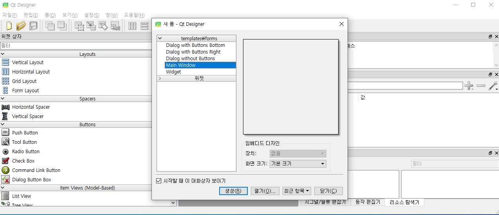
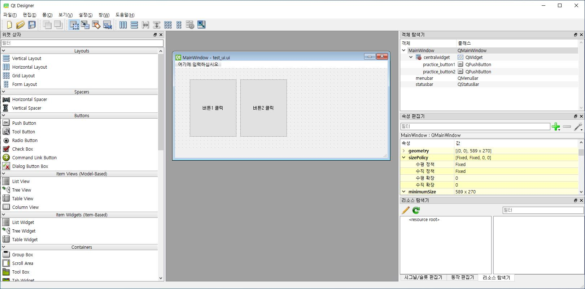

- toc
{:toc}
# PyQt 이용한 코스피, 코스닥 Stock DB 업데이트 GUI 프로그램
> Author: [SungwookLE](joker1251@naver.com)  
> Date  : '21.12/28
> Following Lecture: [Python을 이용한 주가 백테스팅 시스템 구축하기](https://www.inflearn.com/course/python-%EC%A3%BC%EA%B0%80-%EB%B0%B1%ED%85%8C%EC%8A%A4%ED%8C%85/dashboard)
>> 1. PyQt 사용하기(기본)
>> 2. PqQt 를 이용한 DB Update GUI 프로그램 만들기

## 1. PyQt 사용하기(기본)
1. `designer`라는 PyQt5 디자인 툴을 사용하여 기본적인 `Layout`을 설계할 수 있다.


2. 이런 식으로 `QMainWindow`를 생성하고 그 곳에다가 원하는 `Widget`들을 가져다 둔다.


3. 저장을 하면, `*.ui`라는 파일이 생성되는 데, 이를 `python`으로 변환하여 class의 구성 요소들을 얻어낸다. 물론 `designer` 툴에서 지정한 이름이 class의 attribute가 된다.

4. python 코드 변환 방법(`*.ui` to `*.py`): `pyuic5 -x test_ui.ui -o test_ui.py`

5. 그러면, 아래와 같은 `*.py` 파일이 생성되는데, 내가 설정한 gui의 속성 정보를 담고 있다. 
6. 여기서, 눈여겨 볼 속성은 내가 가져다 둔 `버튼`인 `self.practice_button1`과 같은 변수가 되겠다.
```python
from PyQt5 import QtCore, QtGui, QtWidgets

class Ui_MainWindow(object):
    def setupUi(self, MainWindow):
        MainWindow.setObjectName("MainWindow")
        MainWindow.resize(589, 270)
        sizePolicy = QtWidgets.QSizePolicy(QtWidgets.QSizePolicy.Fixed, QtWidgets.QSizePolicy.Fixed)
        sizePolicy.setHorizontalStretch(0)
        sizePolicy.setVerticalStretch(0)
        sizePolicy.setHeightForWidth(MainWindow.sizePolicy().hasHeightForWidth())
        MainWindow.setSizePolicy(sizePolicy)
        MainWindow.setMinimumSize(QtCore.QSize(589, 270))
        MainWindow.setMaximumSize(QtCore.QSize(589, 270))
        self.centralwidget = QtWidgets.QWidget(MainWindow)
        self.centralwidget.setObjectName("centralwidget")
        self.practice_button1 = QtWidgets.QPushButton(self.centralwidget)
        self.practice_button1.setGeometry(QtCore.QRect(40, 30, 131, 161))
        self.practice_button1.setObjectName("practice_button1")
        self.practice_button2 = QtWidgets.QPushButton(self.centralwidget)
        self.practice_button2.setGeometry(QtCore.QRect(180, 30, 131, 161))
        self.practice_button2.setObjectName("practice_button2")
        MainWindow.setCentralWidget(self.centralwidget)
        self.menubar = QtWidgets.QMenuBar(MainWindow)
        self.menubar.setGeometry(QtCore.QRect(0, 0, 589, 21))
        self.menubar.setObjectName("menubar")
        MainWindow.setMenuBar(self.menubar)
        self.statusbar = QtWidgets.QStatusBar(MainWindow)
        self.statusbar.setObjectName("statusbar")
        MainWindow.setStatusBar(self.statusbar)

        self.retranslateUi(MainWindow)
        QtCore.QMetaObject.connectSlotsByName(MainWindow)

    def retranslateUi(self, MainWindow):
        _translate = QtCore.QCoreApplication.translate
        MainWindow.setWindowTitle(_translate("MainWindow", "MainWindow"))
        self.practice_button1.setText(_translate("MainWindow", "버튼1 클릭"))
        self.practice_button2.setText(_translate("MainWindow", "버튼2 클릭"))

if __name__ == "__main__":
    import sys
    app = QtWidgets.QApplication(sys.argv)
    MainWindow = QtWidgets.QMainWindow()
    ui = Ui_MainWindow()
    ui.setupUi(MainWindow)
    MainWindow.show()
    sys.exit(app.exec_())
```

7. 이제 프로그램을 작성해보자.

```python
import sys
from PyQt5.QtCore import pyqtSlot
from PyQt5.QtWidgets import QMainWindow, QApplication
from test_ui import Ui_MainWindow

class testClass(QMainWindow, Ui_MainWindow):
    def __init__(self):
        super().__init__()
        self.setupUi(self)

        self.practice_button1.clicked.connect(self.test_function1)
        self.practice_button2.clicked.connect(self.test_function2)
    
    def test_function1(self):
        print("버튼1이 클릭되었습니다.")
    
    def test_function2(self):
        print("버튼2이 클릭되었습니다.")

app = QApplication(sys.argv)
test_window = testClass()
test_window.show()

app.exec_()
```
- class testClass(QMainWindow, UI_MainWindow)를 보면 QMainWindow를 먼저 두어, `super().__init__()`에서 QMainWindow가 초기화되게 두었다.
- 순서에 따라, super() 단계에서 호출되는 클래스가 다르다.
- 직접 작성한 python class [예시](./img/basic1.py)를 살펴보자

8. 위 코드에서 중요한 것이, `self.practice_button2.clicked.connect(self.test_function2)` 인데, 내가 만든 `practice_button2`가 `.clicked.connect` 되면 `self.test_function2` 함수를 호출하게 된다.

- 이러한 형태를 시그널발생-슬롯실행 이라고 한다.

9. 이렇게하여, 간단하게 Qt 프로그램을 생성해보았다.

## 2. PqQt 를 이용한 DB Update GUI 프로그램 만들기

## 끝