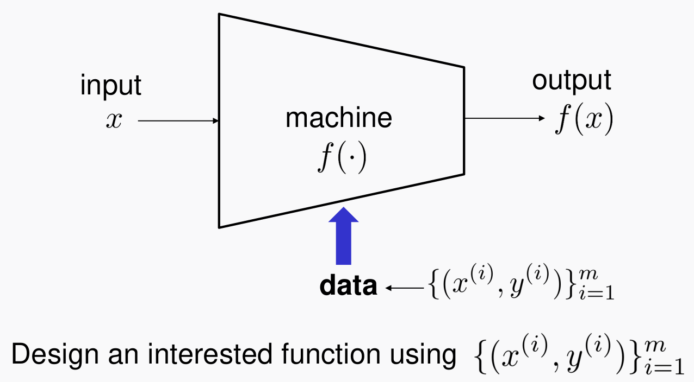

# Machine Learning and Gradient Descent
> Writer: SungwookLE    
> DATE: '22.1/16   
> REFERENCE: [#1](./img/LS1.pdf), [#2](./img/LS2.pdf), [#3](./img/LS3.pdf), [MyNote](https://github.com/SungwookLE/ReND_Car_TensorLab_with_NeuralNet/blob/master/1.Neural_Network_Study/Study_NeuralNet.md)  
> 실습 코드(python): [mnist](./img/mnist_practice.py), [iris](./img/iris_practice.py), [mnist_with_keras_framework](./img/mnist_keras_practice.py)  
- 블로그를 읽어보시고, 실습코드까지 연습해보는 것을 추천합니다 :)

## 1. 기계학습이란?
- input `x`가 들어가서 output `y`가 출력되는 시스템이 있다고 하자.
- 간단하게, **시스템**$f( .)$을 **data인** $[{x^{(i)}, y^{(i)}}]^m_{i=1}$를 가지고 Training 하는 과정이 기계학습이다.

### 1-1. 학습은 어떻게?
- Training via optimzation!

- $f$라는 시스템을 학습시키는 것은 위의 Loss 함수의 에러를 최소화시키는 과정을 말한다.

### 1-2. 기계학습의 종류와 학습 방법(GD)
- 딥러닝(뉴럴 네트워크) 외에 기계학습이라 불리우는 고전적인 방식들이 있었는데, Least Squares, Logistic Regression 이 있다.

- $f$라는 시스템을 어떻게 **parameterization** 하느냐에 따라 종류가 나뉜다.
- paramterization 이란, $f(x) = ax_1 + bx_2 + c$ 라는 식을 예시로 들어 설명하자면, x1과 x2라는 데이터가 들어왔을 때 출력값의 만들어내는 파라미터로 a,b,c를 사용하였는데 이러한 식 구성을 parameterization 이라 부픈다.

### 1-3. Least Squres(선형 회귀)
- pareamterization: $f(x) = w_1*x_1 + w_2*x_2 ...$

- closed form이라는 말이, 해당 방정식은 수학적으로 유일해를 가질 수 있는데, 파라미터(w1, w2)에 대한 Loss 함수의 편미분이 0이 되는 지점이 Loss가 가장 작은 지점이므로, 수학적인 해를 풀어볼 수 있다.

### 1-4. Logistic Regression
- 여기선, Non-linear regression을 설명한다. (Linear Regression도 있다.)
- parameterization: $f(x) = \frac{1}{1+exp(-w^Tx)}$

- Sigmoid 비선형 함수를 두어 $f$를 parameterization 하였고, Loss함수는 `Cross Entropy(CE) Loss`를 사용하였다.

- 비선형 함수 형태의 Loss 함수이므로, 이를 이용하여 에러가 최소화되는 파라미터를 구하는 과정은 **Gradient Descent**를 사용한다.

### 1-5. 학습(Gradient Descent)
- 아래의 그림과 같이, Loss Function의 편미분 값의 반대방향의 러닝레이트 $\alpha$로 Iterative하게 반복되어 Loss 함수의 최소값으로 수렴시키는 과정을 **Gradient Descent**라 한다.

- Logistic Regression과 뉴럴 네트워크(딥러닝) 등의 학습을 Gradient Descent를 따라 학습을 진행한다.

- Least Square, Regression, Neural Network의 Training 을 직접 손으로 유도하고, c++ Project를 수행할 수 있게 정리하였다. [여기 링크](https://github.com/SungwookLE/ReND_Car_TensorLab_with_NeuralNet/blob/master/1.Neural_Network_Study/Study_NeuralNet.md)를 참고하길 바란다.

## 2. Deep Neural Network(DNN)
- 뉴럴 네트워크를 여러 Layer 쌓은 것을 말한다.

- $\sigma$는 활성화 함수를 말한다. 시그모이드나 [Relu](./img/2022-01-16-23-51-51.png)가 있다.
- y 라벨의 개수가 3개 이상인 경우는 output layer의 활성화 함수로 `softmax` 를 사용한다.
- softmax는 output node들의 출력값을 (0~1)사이의 상대적인 값으로 환산해주는 함수이다. [softmax](./img/2022-01-17-11-50-05.png)

- 학습은 데이터 $[{x^{(i)}, y^{(i)}}]^m_{i=1}$ 를 가지고 Loss 함수를 최소화(최적화)하는 과정으로 진행한다. 위에서 설명한 바와 같이 Gradient Descent를 사용한다.

- 각각의 레이어는 체인처럼 이어져 있고 우리는 Layer1의 $W^{[1]}$과 Layer2의 $W^{[2]}$ 파라미터를 Gradient Descent로 학습시켜나갈 것이다.

- Loss 함수도 여러 종류가 있는데, 가장 간단하게는 $l=0.5(y-\hat{y})^2$ 있겠지만, Cross-Entropy Loss를 많이 쓴다.
    - 그 이유가 대부분의 딥러닝 네트워크에서 Optimal Solution을 제공한다는 것이 Observed 되었다나..

- 당연하게도 Loss 함수는 매끈한 선형의 형태가 아니다. 굴곡진 비선형 형태이기 때문에, Gradient Descent로 학습하였을 때, Saddle Point에 머무르게 될 수도 있다.

- 학습 iteration을 증가시키고, 데이터가 많다면 글로벌 minima에 도달할 수 있다는 것이 observed 되었다곤 한다.

## 3. Backpropagation
- BackPropagation 이라는 것이 Gradient Descent(called `GD`) 방법을 이용해서 뉴럴 네트워크들의 파라미터를 학습하는 과정을 말한다.
- GD의 chattering 이나 여러가지 단점을 보완하기 위해서 여러 테크닉이 있는데 대표적으로는 `adam` 이다.

- Backpropagation은 각 레이어마다 `chain-rule`로 계산되는 에러의 역전파율을 말한다. 

- 에러가 전파되는 과정이 서로 chain의 형태로 물려있어서 비교적 복잡한 수식의 $f$ 함수이지만 수식적 계산이 복잡하진 않다. [여기 링크](https://github.com/SungwookLE/ReND_Car_TensorLab_with_NeuralNet/blob/master/1.Neural_Network_Study/Study_NeuralNet.md)를 참고하길 바란다.

- 실제적으로 학습을 할 때에는 Batch 단위로 나누어서 학습을 진행한다. 

    - Operation per Batch is called 'step'
    - Operation per entire dataset is called 'epoch'

### 3-1. 일반적인 GD의 한계점 및 ADAM의 필요성
- 오직 현재 에러의 기울기에만 의존하여 역전파가 이루어지다 보니까, Oscillate가 크게 일어나는 단점이 있다.
- Gradual Smooth 효과를 주기 위해서 모멘텀(과거의 에러율을 어느정도 현재에도 반영)을 주어서 역전파를 시키는 방식을 `adam` GD라고 한다.

- 위의 수식은 일반적인 Momentum 방식의 GD 를 기술한 것인데, Adam은 Adaptive Momentum Optimizer로 모멘텀을 하는 이유는 동일한다. (to reduce oscillation)

## 4. 요약
- 기계학습을 소개하고(Least Square, Logistic Regression , DNN), 각 방법의 차이는 시스템 함수 $f$의 paramterization에 있음을 설명하였다. 
- 기계학습의 Loss 함수에 대해서 설명하고, 학습 원리(방법, `chain-rule`)를 설명하였다.
- GD의 단점을 극복하는 (Oscillation 감소) adam optimizer에 대해 설명하였다.

## 끝