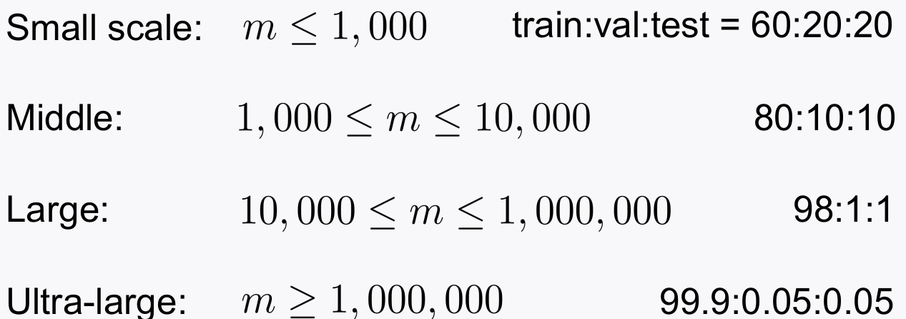
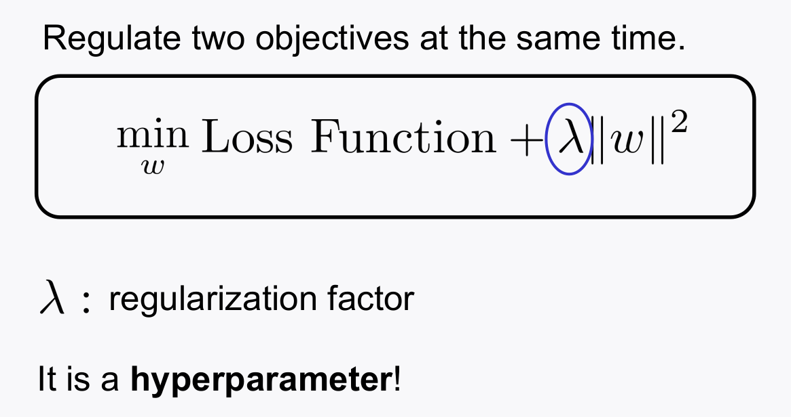
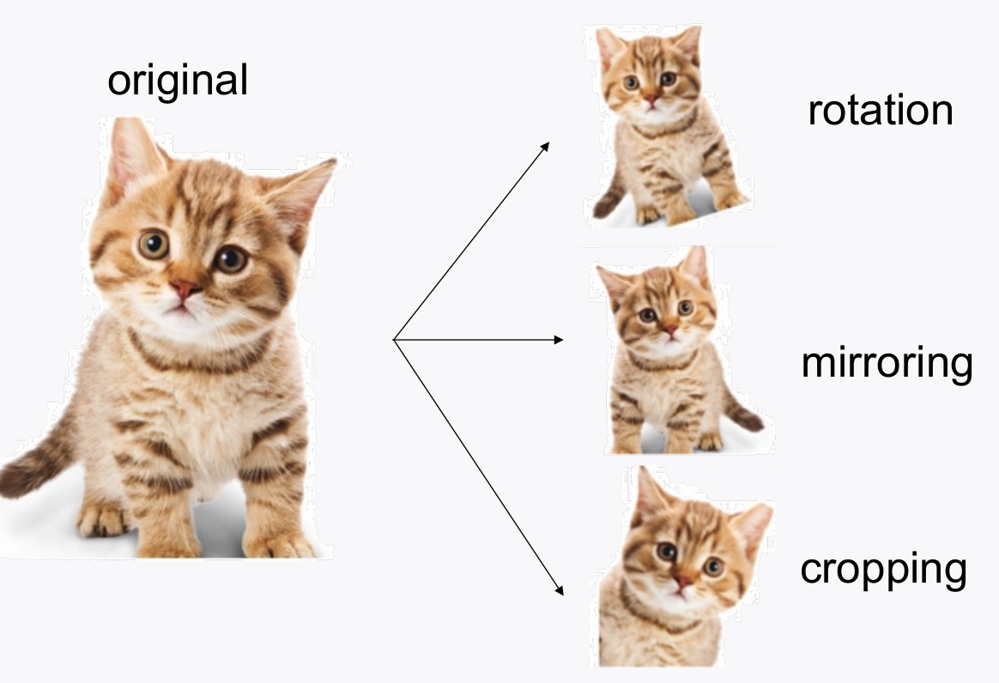
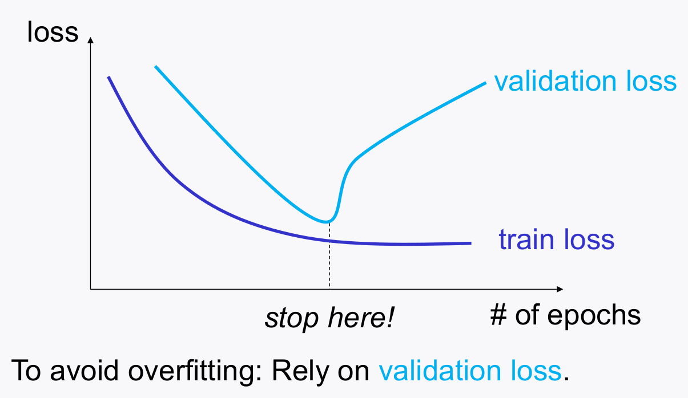
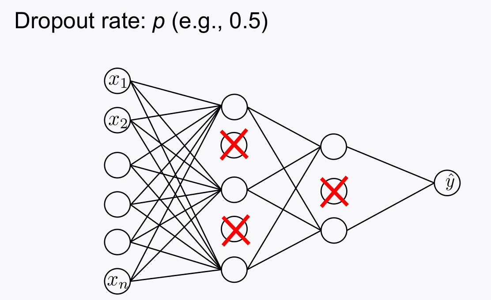
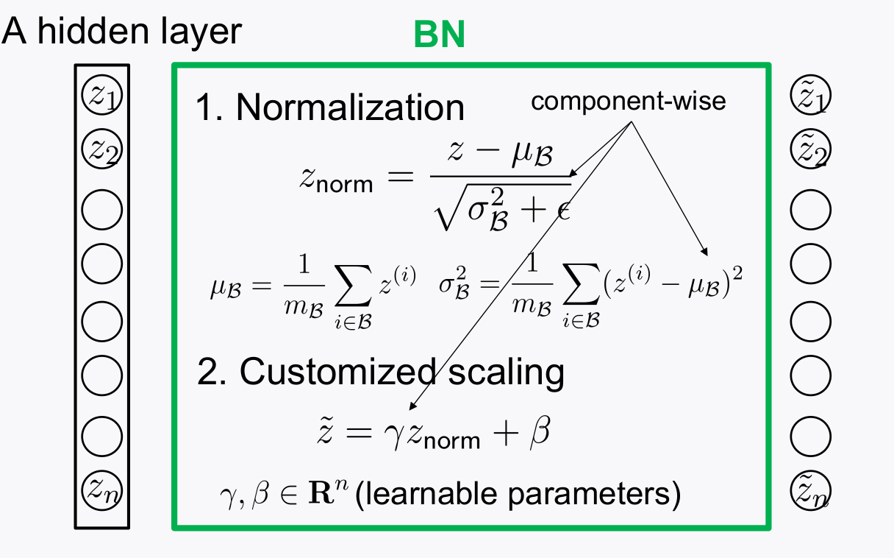
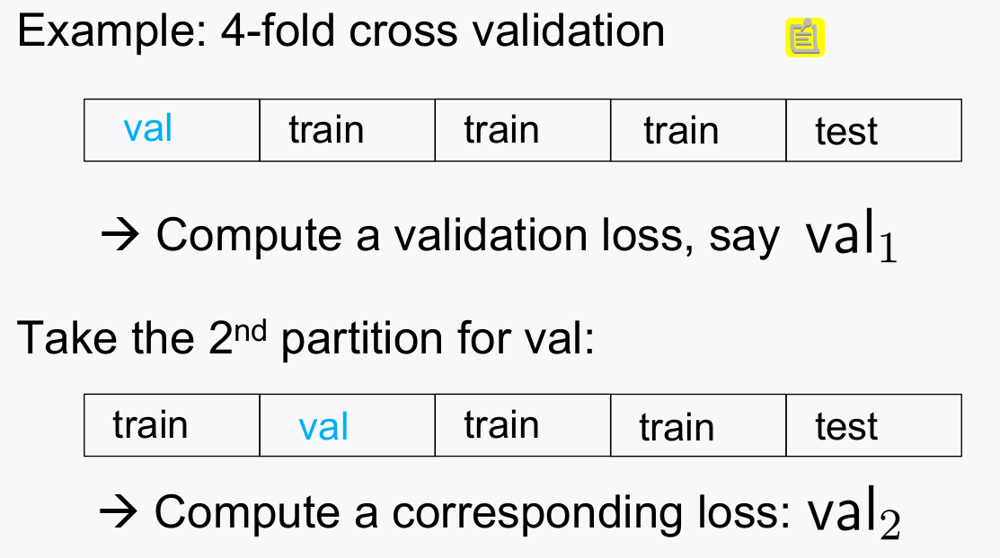

# Advanced Techniques
> Writer: SungwookLE    
> DATE: '22.1/17   
> REFERENCE: [#4](./img/LS4.pdf), [#5](./img/LS5.pdf), [#6](./img/LS6.pdf)  
> 실습코드(python): [advanced_techniques](./img/keras_with_advanced.py)  
- 블로그를 읽어보시고, 실습코드까지 연습해보는 것을 추천합니다 :)


## 1. Introduction
- Overfit, Underfit 되지 않고 학습이 잘~(well) 되게 하기 위해서 사용하는 추가적인 방법들에 대해 설명한다.
     1. Data Organization (train/validation/test sets)
     2. Generalization Techniques
        - Regularization
        - Data augmentation
        - Ealry Stopping
        - Dropout
     3. Weight Initialization
     4. Techniques for training stability
        - Adam Optimizer
        - Learning rate decaying
        - Batch Normalization
     5. Hyperparameter search
     6. Cross Validation


## 1. Data Organization
- Train/Validation/Test data를 잘 나눠서 쓰라는 말..
- Train data is for training model weights
- Validation data is for Hyperparameter Search
- Test data is for 'test' with **unseen** during trainig
- 데이터를 나눌 때는 표본의 개수에 따라 달라짐.


- 데이터를 나눌 때, data 라벨(`y`)의 distribution이 편중되지 않게 잘 나눠줘야함
- `train_test_split(x, y, test_size = 0.1 , stratify=y)`
- `stratify` 옵션을 사용해서, y라는 데이터가 split되는 양쪽에 고르게 분포되도록 한다.


## 2. Generalization Techniques

### 2-1. Regularization
- 모델 weight가 크면, 데이터의 분포에 따라서(또는 노이즈) 출려갓의 oscillation이 커지니까 이를 방지하면 general한(강건한) 성능이 나올 것이다라는 컨셉

- lambda는 하이퍼파라미터

### 2-2. Data augmentation
- 이미지 데이터에서 많이 쓰는 방식인데, 이미지 데이터를 `rotate, crop, 반전, 찌그러트리기` 등을 해서 임의로 데이터의 분포를 늘리는 것을 말한다.
- generalization 성능을 높히기 위해서 사용


### 2-3. Early Stopping
- train loss 는 조금씩 줄어들긴 하지만, validation loss가 증가하고 있는 형태라면, early stopping 하여 training 데이터에 모델이 overfit 되는 것을 방지한다.


### 2-4. Dropout
- 학습단계에서 몇 노드들을 이미로 cut-off 함으로써, 특정 노드에 크게 의존하지 않게 하는 방법
- not overfit to a particular NN: hence generalize better



## 3. Weight Initialization
- 모델의 weight(파라미터)의 초기값은 어떤 상태로 있는 것이 가장 유리할까에 대한 내용, 수식적으로 정리/증명한 제안자는 기계학습 분야에서 인싸가 되었다.
- Xavier Initailization , He's Initialization 이 있는데, weight들의 분산을 노드의 개수에 따라 제한시킨다는 컨셉이다. (레이어가 깊어질수록 발산하거나 vanishing 하는 문제를 최소화하기 위함)
- 아래와 같이 선언하여 사용한다.

```python
Hidden_2layers_MLP.add(Dense(50, kernel_regularizer =l2(0.01) , bias_regularizer=l1(0.01), 
kernel_initializer = 'he_normal' ))
```

## 4. Techniques for training stability
- Adam GD는 앞의 포스팅에서 설명하였었는데, GD law에서 에러의 전파율에 따라 weight가 oscillation 하는 것을 방지하기 위해, 이전 스텝의 에러율을 어느정도는 반영해주는 `모멘텀`을 적용한 Gradient Descent 기법을 말한다. (가장 많이 씀)

### 4-1. Learning Rate Decay
- 말 그대로, epochs가 커질수록 learning rate를 작게 조정하여 fine training 하게 하는 방법을 말한다.

### 4-2. Batch Normalization
- 데이터가 들어올 때 마다, 각 레이어의 출력값의 범위가 제 각각이다. 이러한 부분 때문에 학습이 잘 되지 않는다.
- Turns out: Different signal scalings across distinct layers incur training instability

- 레이어의 출력 값을 노말라이제이션 해서 다음 레이어에 전달해주는 것을 **Batch Normalization**이라 한다.

- tensorflow framework에서는 쉽게 사용 가능하도록 아래와 같은 패턴으로 사용하면 된다.

```python
from tensorflow.keras.models import Sequential
from tensorflow.keras.layers import Dense, Flatten, Dropout, BatchNormalization, ReLU
from tensorflow.keras.regularizers import l2, l1
from tensorflow.keras.callbacks import EarlyStopping, LearningRateScheduler
from tensorflow.keras.optimizers import Adam

def scheduler(epoch, lr):
    if epoch in [5, 10, 15]:
        lr = 0.1*lr
    return lr

es_callback = EarlyStopping(monitor='val_acc', patience=5)
lrs_callback = LearningRateScheduler(scheduler)

Hidden_2layer_MLP = Sequential()
Hidden_2layer_MLP.add(Dense(50, 
                            kernel_regularizer=l2(0.01), bias_regularizer=l1(0.01),
                            kernel_initializer= 'he_normal' ))
Hidden_2layer_MLP.add(BatchNormalization())
Hidden_2layer_MLP.add(ReLU())
Hidden_2layer_MLP.add(Dropout(0.5))
Hidden_2layer_MLP.add(Dense(1, activation='sigmoid',
                            kernel_regularizer=l2(0.01), bias_regularizer=l1(0.01),
                            kernel_initializer= 'glorot_normal'))


Hidden_2layer_MLP.compile(optimizer='adam', loss='binary_crossentropy', metrics=['acc'])
history = Hidden_2layer_MLP.fit(X_train, y_train, epochs=20, batch_size=128, shuffle=True, callbacks=[es_callback, lrs_callback], validation_data = (X_val, y_val))
```
## 5. Hyperparameter Search

- HyperParameter 종류: #L of layers, # $n^{[n]}$ of hidden neurons, activation learning rate, betas, batch size, # T of epochs, regularization factor, dropout rate ...


## 6. Cross Validation
- 목적: Obtaint reliable validation loss via averaging



- train+validation dataset안에서 validation을 돌아가면서 쓰고 이를 평균 낸 값을 가지고 분석을 함으로써, 데이터를 최대한 효율적으로 쓰는 역할을 한다.
- fold 해서 하는 것은 val은 특정 데이터로 fix안하고 돌아가면서 쓰게함으로써 데이터를 충분히 활용하기 위함이고, 또 특정 데이터로 fix할 경우 운이 나쁠경우 학습이 잘안되는 문제도 해결하기 위함
- val은 hyperparameter 튜닝을 선정하기 위한 지표로서 활용한다.
- $val_{loss} = \frac{val_1 + val_2 + val_3 + val_4}{4}$

## 끝