# Convolutional Neural Network
> Writer: SungwookLE    
> DATE: '22.1/17   
> REFERENCE: [#7](./img/LS7.pdf), [#8](./img/LS8.pdf), [#9](./img/LS9.pdf)  
> 실습코드(python): [CNN_lenet](./img/CNN_practice.py), [CNN_AlexNet_ResNet](./img/CNN_practice2.py)
- 블로그를 읽어보시고, 실습코드까지 연습해보는 것을 추천합니다 :)

## 1. Introduction
- Can `DNNs` be **specialized?**
    - CNNs: Image data
    - RNNs: Text/Audio data(Language) and any sequential data

- 이번 포스팅에서는 CNN에 대해서 이야기해보자.
1. Invetigate how CNNs were developed
2. Study the two key building blocks
    - Conv layer
    - Pooling layer
3. Discuss two popular CNN architectures.


## 2. Invetigate how CNN
- Hubel & Wiesel 이라는 사람이 어떤 사물을 시각적으로 판단할 때 특정 뇌의 부분이 활성화 된다는 사실을 알아냄
- 이미지가 들어오면 특정 `receptive field`가 반응을 한다.
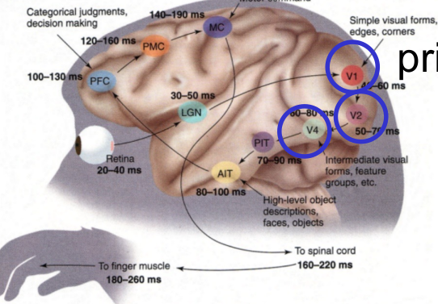
- 여러 부분을 통과하면서 최종적으로 눈으로 들어온 이미지가 정보가 되어 뇌에 저장된다.

- 이를 프로그래밍화한것을 CNN이라 할 수 있다.

## 3. Study the two key building blocks
- Convolutional layer(Conv Layer)
    - Role: Mimick(흉내내다) neurons' behaviors:
        Reacting only to receptive fields
    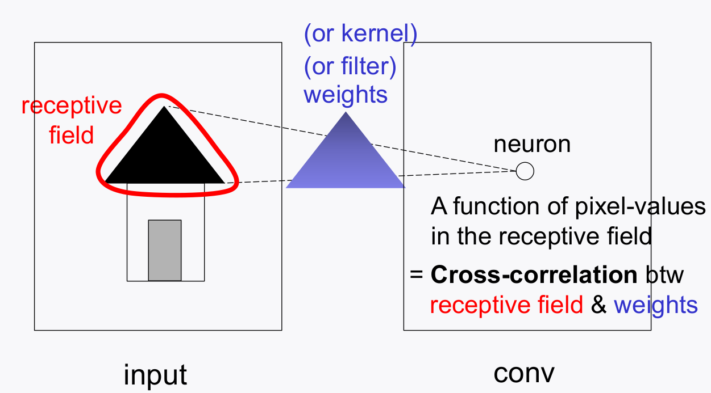

- Pooling layer
    - Role: Downsample to reduce complexity
    (# parameters & memory size)

### 3-1. Conv layer
- 픽셀 이미지가 들어오면 receptive filter(kernel, or filter, weights)가 픽셀을 순회하면서 새로운 출력갓을 만들어낸ㄷ. (pixel-wise)
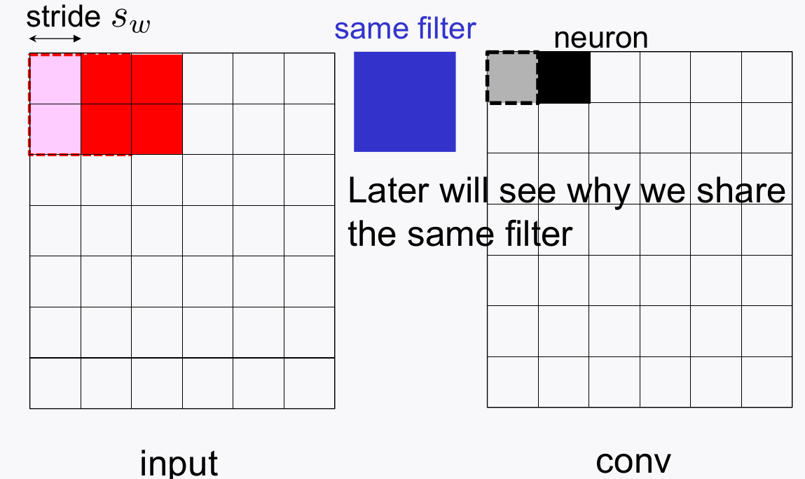

- 이미지의 끝 부분에서 filter의 사이즈와 맞지 않는 부분은 `padding`을 이용하여 사이즈를 맞추고 pixel-wise 계산을 수행한다. (called padding)
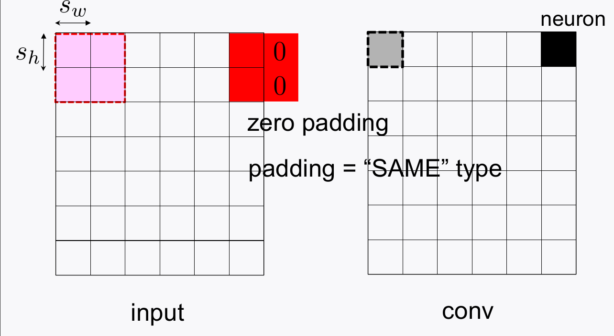

- Conv Layer를 통과해서 출력된 값들을 **feature map**이라 부른다.
    - Feature map에는 이미지의 pattern들이 담기게 된다. 이러한 필터를 학습시키는 것을 CNN이라 한다.
    - Filter를 Sharing 함으로써 이미지의 일관된 패턴을 추출하게 한다. 
    - Filter 한개는 하나의 패턴을 추출하는 목적으로 사용되고, 이러한 필터를 여러개 쌓아서 Conv Layer를 구성한다.
    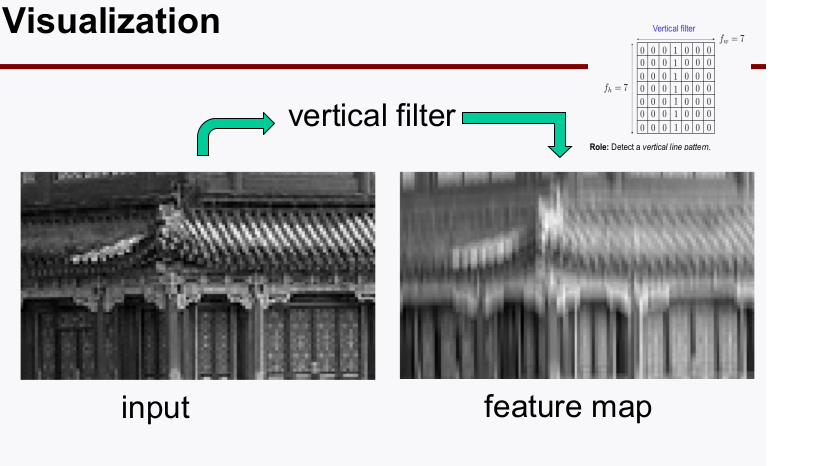
    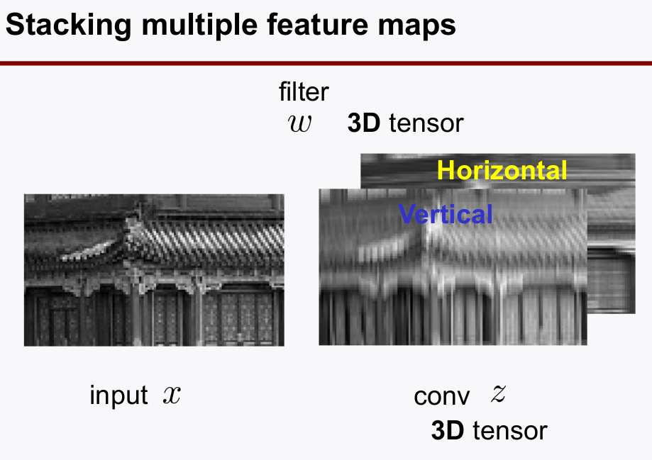
    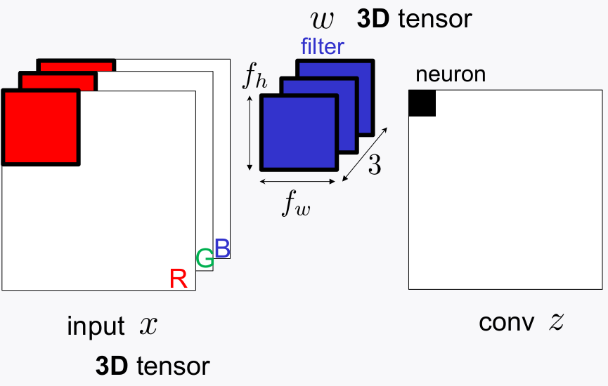

### 3-2. Pooling layer
- 파라미터의 개수를 줄여, 메모리 사용량을 줄이기 위함
- 대표적으로 Max pooling, Average Pooling 2개 있다.
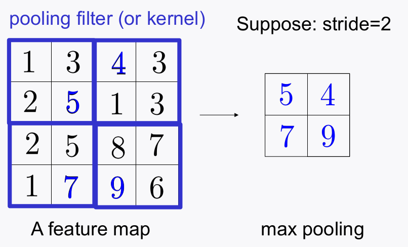


## 4. Typical CNN architecture
- `Conv + ReLU + Pooling`을 Stack 모듈 단위로, 이러한 Stack을 쌓는 방식으로 CNN 아키텍쳐 설계

    - As the network gets deeper:
        1. Feature map size gets smaller;
        2. #of feature maps gets bigger.
    
    - At the end of the stacks:
        - Fully-Connected(FC) layers + output layer (e.g., softmax activation)
    
    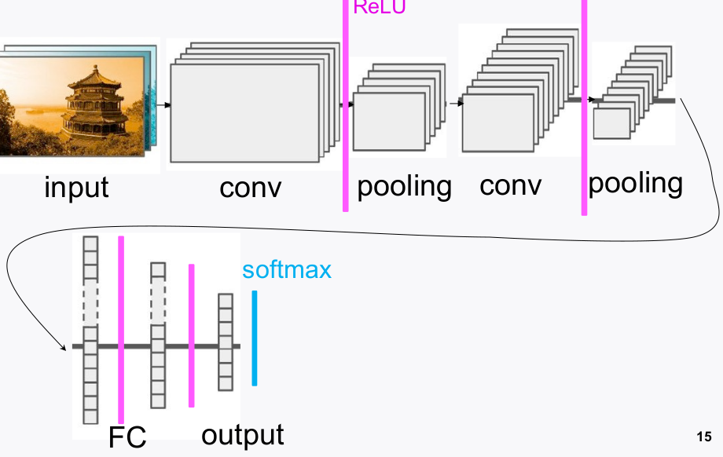

- keras 프레임워크에서 예시코드는 아래를 참고하자.

```python
# 1st stack
model_lenet.add(Conv2D(input_shape=(28,28,1),
                       kernel_size = (5,5),
                       strides=(1,1),
                       filters=32,
                       padding='same',
                       activation='relu')
                )
model_lenet.add(MaxPool2D(pool_size=(2,2),
                          strides=(2,2),
                          padding= 'valid')
                )
```


### 4-1. Popular CNN (AlexNet)
- AlexNet의 성능이 아주 우수하게 나오면서, 이후 CNN의 대표적인 아키텍쳐 패턴이 되었다.
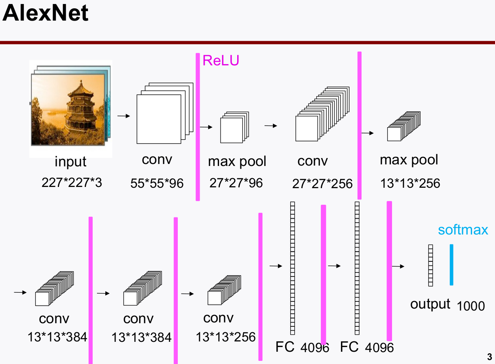

### 4-2. Popular CNN (ResNet)
- ResNet은 `skip connection`이 특징적인데, 피쳐맵을 더해서(`add`) 보는 방식으로 성능의 향상을 만들었다.
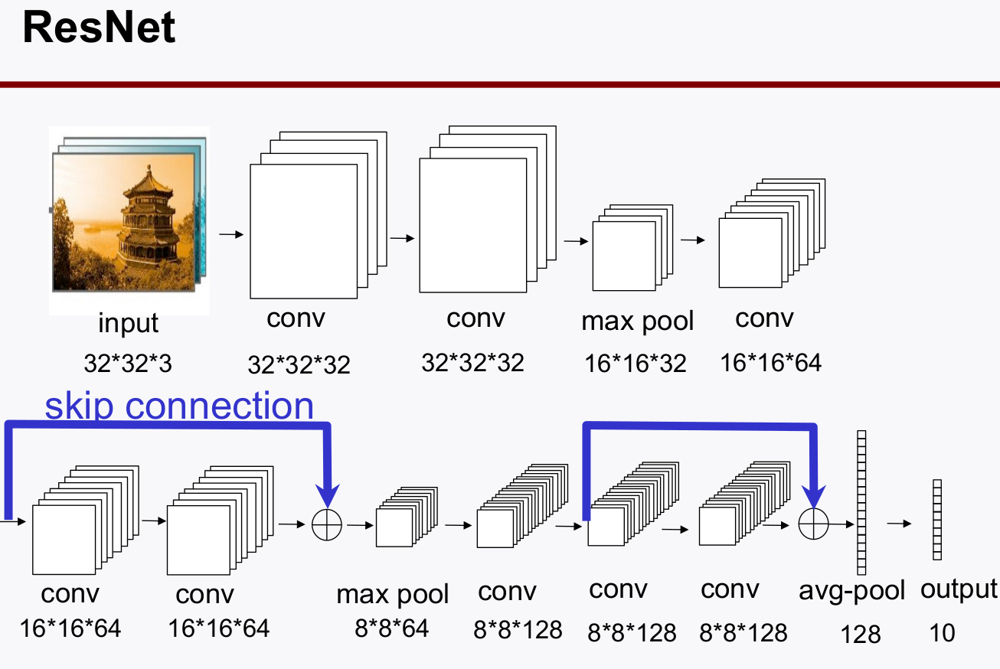

- `Skip-connection` plays a crucial role to enable **stable & fast training**.
    - gradient highway로써 기존 학습에서 나타나던 vanishing gradient 문제를 해결하고 deep network 학습을 가능하게 하였다.

### 4-3. Application of CNNs
- Any **decision** or **manipulation** w.r.t. *image* data
    - Image Recognition
    - Image inpainting
    - Object Detection
    - Coloring
    - Defect Dectection
    - Style Transfer
    - Medical Diagnosis
    - Super-resolution image ...

## 끝
