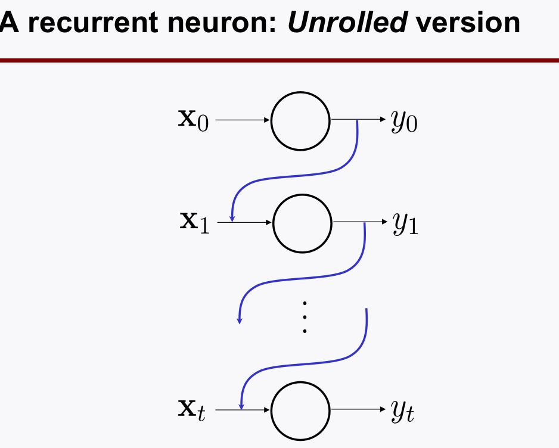

# Recurrent Neural Networks
> Writer: SungwookLE    
> DATE: '22.1/17   
> REFERENCE: [#10](./img/LS10.pdf), [#11](./img/LS11.pdf), [#12](./img/LS12.pdf)  
> 실습코드(colab): [rnn practice with movie review data](https://colab.research.google.com/drive/1CBGBeBDfKvWWrO8-YuB3A0ujJSydZE0N?usp=sharing)
- 블로그를 읽어보시고, 실습코드까지 연습해보는 것을 추천합니다 :)


## 1. Introduction

- Study two key building blocks or RNNs:
    - Reccurrent neurons
    - A memory cell
- Investigate basic RNNs
- Study LSRM(Long Short-Term Memory) cells

## 2. RNNs block

1. Recurrent Neurons
    - Role: Mimick conjectured neurons' behavior: having a loop

2. A memory cell
    - Role: Preserve some state(memory)

### 2-1. Recurrent Neurons:
- 일반적인 neurons은 feedback 루프가 없다.


- recurrent neurons은 피드백 루프를 설계하여, 출력 정보를 기억(memory)하게 하였다.


- Note: RNN에서는 LOOP 데이터의 부호를 유지하기 위해 activation function으로 `tanh`(범위 -1~1)을 많이 쓴다.
- 단일 neuron 의 `time sequence` 루프로 살펴보면: **Unrolled Version**


### 2-2. A momory cell, Basic Cell

- 여러 뉴론이 있는 `neurons`의 loop를 살펴보자 (벡터)


- 이것을 타임 시퀀스로 표시해보자 (**unrolled version**)


- Memory Cell은 Recurrent Neurons 들을 여러개 병렬로 둔, Layer를 말한다.
    - 뉴론들을 합쳐놓은 것을 편하게 `Memory Cell`이라고 한다.

- 이 때, 피드백 되는 것을 $y_t$ 전체로 하는 것이 아니고 그 중의 일부만 할 수 있다. $h_t$
- $y_t = h_t$ 인것을 **Basic Cell**이라고 한다.
- keras 프레임워크에선 `SimpleRNN`로 모델을 호출할 수 있다.


- RNN의 back-propagation은 시간 순선에 따라 진행된다.
    - Idea: BackProp Throuth Time(BPTT)
    - 이게 뭐냐면, loss function 을 계산할 때, time-window를 정해주고, time-window 상의 loss 만을 가지고  weight back-propagation을 한다.
    - 이 때, time-window가 커지면 layer가 깊어지는 것이 되니, 한번이라도 역전파 값이 작아 학습이 되지 않을 경우 연쇄적으로 학습이 안되는 `vanising gradient`가 발생할 수 있다.
    - **해결책은?** `Reduce T` time-window를 줄여야 한다.

    

    - 근데 T를 너무 줄여버리면, The model cannot learn **long-term patterns**.
    - 따라서, long-time information을 저장할 수 있는 방법이 필요하다.
    - 이것이 **LSTM**의 등장 배경..

## 3. LSTM (Long-Short Term Memory)
- 3가지를 기억하라
1. What to throw away(`forget`): **forget factor** $(0<=f_t<=1)$
2. What to remember(`input`): **input factor** $(0<=i_t<=1)$
3. What to read (`output`): **output factor** $(0<=o_t<=1)$

### 3-1. LSTM structure
-  Notation:
    - Short-term state $h_t$
    - Long-term state $c_t$

- 세세하게 수식에 신경 쓸 필요는 없다. 아래의 구조를 보고, 왜 필요한지 보자
    - 왜? Basic RNN은 오직 Time-window 정해진 구역에서의 정보만 다음 sequence에 넘겨줄 수 있었는데, 그거가지곤 한계가 있다.
    - Long-Term 메모리와 Short-Term 메모리를 잘 섞어서 결과를 추론해야 한다.


- 먼저 $f_t$는 forgetting factor로 long-term 메모리를 얼만큼 지워버릴지를 결정한다.
- $g_t$는 현재의 state가 1차적으로 학습된 결과물인데, 이 때 이것은 $i_t$라는 information factor와 곱하여 현재의 정보를 얼만큼 저장할 것인지를 반영하여 출력하고 *long term*에 전달한다.
- forget과 input factor가 반영된 정보 두개를 더하여 output 출력 연산에 사용한다.
- $o_t$는 output factor로 $X_t$중 어떤 값을 읽어서 출력할 것인지를 결정하는 factor이고 이 루트를 통해 나온 출력값이 $y_t$가 되고 동시에 $h_t$가 되어 피드백된다.
- long과 short-term information이 피드백 루프에서 순환하면서 두가지 정보를 잘 활용할 수 있게 된다.

### 3-2. GRU(Gated Reccurent units)
- 이걸 더 많이 쓴다. 해당 [블로그](https://yjjo.tistory.com/18)를 참고해보자.
- 구조는 LSTM보다 심플한데, 성능은 LSTM과 동일하기 때문이라고 함


## 4. Keras 프레임워크에서 사용법

- 참고사항: 자연어처리 분야에서 RNN을 많이 쓰는데 인풋 전처리 레이어로 `Embedding` 레이어를 많이 사용함
    - `word embedding` 역할: 단어들을 real-values dense vector로 표현하여 usage에 따른 단어의 representation을 학습할 수 있다. 그 결과 비슷한 의미를 가진 단어들이 비슷한 representation을 갖도록 돕는다. 

### 4-1. SimpleRNN

```python
from tensorflow.keras.layers import LSTM, SimpleRNN, GRU

# Embedding Layer 예제
simple_rnn = tf.keras.Sequential()
simple_rnn.add(tf.keras.layers.Embedding(input_dim=1000, output_dim = 100, input_length=256))
simple_rnn.add(SimpleRNN(units=128))
simple_rnn.add(Dense(units=1, activation='sigmoid'))
```

### 4-2. LSTM

```python
LSTM_model = Sequential()
LSTM_model.add(Embedding(input_dim= 10000, output_dim=100, input_length=256))
LSTM_model.add(LSTM(units=128))
LSTM_model.add(Dense(units=1, activation='sigmoid'))
```

### 4-3. GRU

```python
GRU_model = Sequential()
GRU_model.add(Embedding(input_dim=10000, output_dim=100, input_length=256))
GRU_model.add(GRU(128))
GRU_model.add(Dense(1, activation='sigmoid'))
```

## 끝