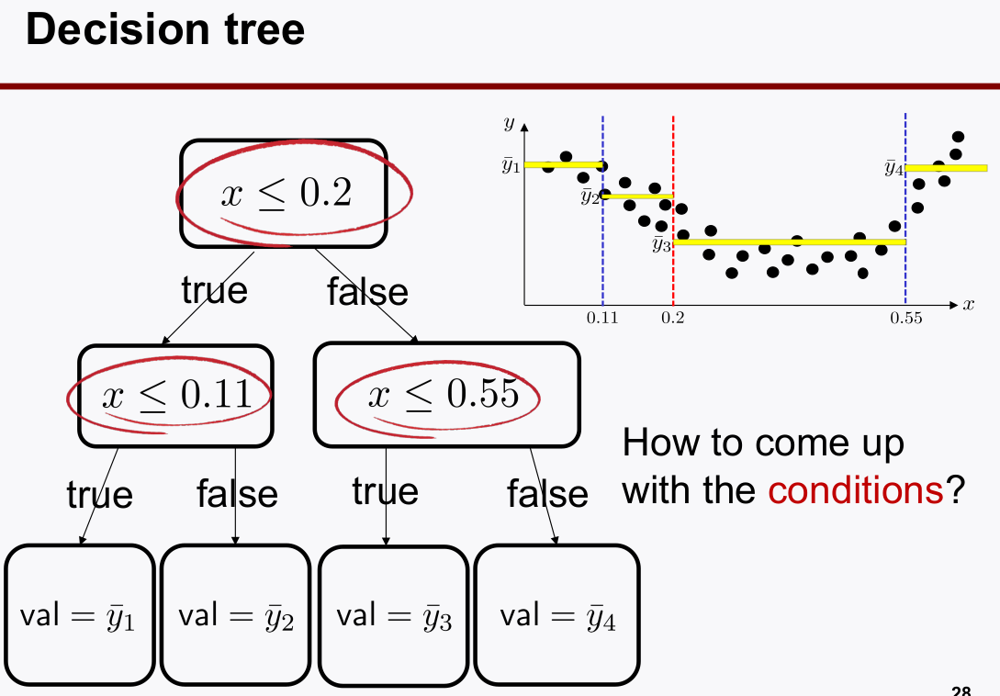

# Small data techniques
> Writer: SungwookLE    
> DATE: '22.1/17   
> REFERENCE: [#13](./img/LS13.pdf), [#14](./img/LS14.pdf), [#15](./img/LS15.pdf)  
> 실습코드(colab): [DT&RF](https://colab.research.google.com/drive/17D7PvraGMwyUv8giC9-a-eHVo3CYZBFK?usp=sharing)
- 블로그를 읽어보시고, 실습코드까지 연습해보는 것을 추천합니다 :)

## 1. DecisionTree

- Decision Tree

- Cost fcn of Decision Tree

- $m: 샘플 총 개수, m_{left}: 왼쪽의 샘플 개수, m_{right}: 오른쪽의 샘플 개수$
- 왼쪽 영역과 오른쪽 영역을 구분짓는 예시에서의 수식 설명
    - $G_{left}: 불순도를 말하는 것이고 왼쪽 Class의 Accuracy score$
    - $ G_{right}: 오른쪽 영역의 Accuracy Score$  
- **그래서,** $J(k,t_k)$는 Class classification accuracy의 불순도(loss)를 말하는 cost function이다. 
- **jini** 계수는 관심 구역에서의 `classification loss`를 말한다.

- Hyperparameter of DT

1. max_depth: 구분짓는(`split`) leaf의 최대 개수 (작을 수록 generalization 유리)
2. min_samples_split: 가를 대상으로 삼을 샘플의 개수 (최소값은 개로 설정할 수 있고, 그렇게 하면, 1 / 1개로도 나눌 수 있단 의미여서, 이게 너무 작으면 오버핏 되니까 적당히 커야 함)
3. min_sample_leaf: leaf에서 split할 때 구역 안에 들어오는 최소 샘플의 개수로서, 이게 너무 작으면 오버핏 되니까 적당히 커야 함
4. max_leaf_nodes : lead의 개수를 줄여야지 (`generalization~=`regularized`)이 된다.

- Decision Tree를 Classification 문제 뿐 아니라 regressor 문제에도 사용할 수 있다. 그 대신 출력값은 대표값이 출력값으로 사용하게 된다. (노란색 선)

## 2. Ensemble Learning

- Decision Tree는 데이터에 민감하게 overfit되어 학습되고, 데이터긔 민감(`sensitive`)하다는 단점이 있다. 이를 보완할 필요가 있다.
    - 하나의 Decision Tree에만 의존하는 것은 좋지 않겠다.
    
    - 앙상블 하자!

- Decision Tree 여러개로 앙상블을 하려고 한다면, decision tree는 데이터의 상황에 fit되기 때문에, 동일한 데이터로 여러 decision tree를 학습시켜봤자 각 tree의 모델은 동일하다.
- 따라서, 데이터도 subset으로 구성해서 각기 다른데이터로 각 decision tree를 학습시켜야 한다.

- 어떻게 subset을 구성할 수 있을까? `bootstrap`

- `bootstrap` 방법이라는 것이 랜덤하게 데이터를 분리해서 추출하는 방식을 말한다고 보면 된다. 각기 다른 decision tree 모델을 만들기 위함
    - bootstrap은 쪼개진 subset을 여러번 선택해 subset을 구성하는 방법인데, 중복되어 선택되도 상관없다.
    - random subspace는 bootstrap에서 feature도 랜덤하게 뽑아서 decision tree를 학습하자는 것이다. feature를 랜덤하게 골라서 주어진 data subset을 학습하자.

## 3. Ensemble Approach: Random Forest
- Decision Tree(`n_estimator`)를 여러개 두어 ensemble하는 방법이다.

- max_features는 낮출수록 `regularized`효과가 난다. feature를 많이 쓴다는 것은 데이터 전부를 본다는 것이니까, 당연히 조금 볼수록 generalized 성능이 나오겠지. (성능만 높게 나와준다면)
- n_estimator를 키울수록 `regularized` 효과가 커진다.

- RandowForests를 하고 나면 attribute로 `Feature Importance`라는 값을 출력할 수 있는데, 이 값을 보고 중요한 feature 를 selection 할수도 있겠다.

## 4. Further discussion

1. 데이터의 차원이 샘플의 개수보다 너무 클경우 성능이 안나올수있다. `dimension reduction`필요 : `PCA, t-SNE 등`
2. data distribution이 너무 클 경우: 데이터의 `characteristics`가 너무 차이가 나네?

## 끝

