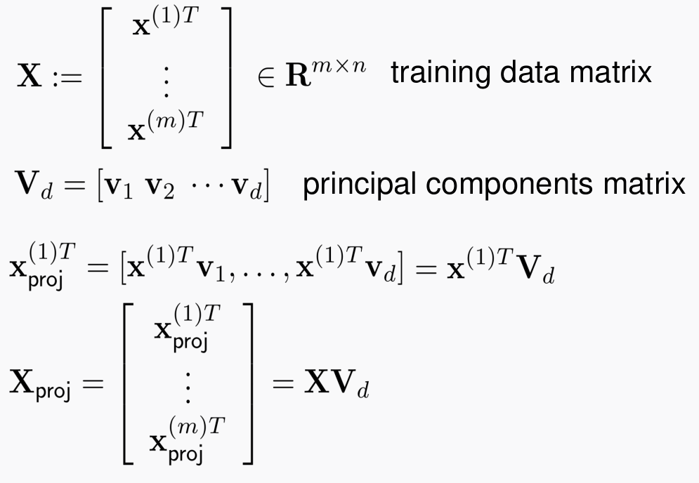
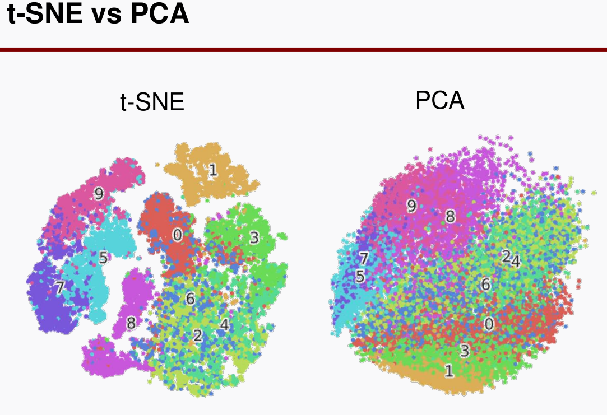

# Dimensionality reduction & clustering
> Writer: SungwookLE    
> DATE: '22.1/18   
> REFERENCE: [#16](./img/LS16.pdf), [#17](./img/LS17.pdf), [#18](./img/LS18.pdf)  
> 실습코드(colab):  [PCA&t-SNE&Clustering](https://colab.research.google.com/drive/1oXnz7GRjOo4dHmuEZ06R9Rd0o3Tnr_I4?usp=sharing)
- 블로그를 읽어보시고, 실습코드까지 연습해보는 것을 추천합니다 :)

## 1. Introduction

- 지금까지 배운것: DNNs, CNNs, RNNs & RFs
- 그럼에도 성능이 잘 나와주지 않는다면?
    - This may be due to:
        1. Feature 개수 > Sample 개수일 경우: dimension 축소 필요
        2. data distribution is pretty wide: clustering 고려 필요

## 2. PCA(주성분 분석)
- Principal Component Analysis
- 왜할까?
    - Reducing #of features in data by obtaining a set of pricipal components
        1. **Improve generalization performance**
        2. Speed up training / Data visualization

    - SVD(Singular Value Decomposition)을 수행하고 `eigen value`가 큰 값부터 추출해내는 과정을 PCA라고 한다.
    - 이 때 EVR(`Explained Variance Ratio`)가 95% 이상이 되도록 추출하는 것이 일반적이다.
    - EVR 값도 일종의 학습 하이퍼 파라미터이다.
    

    - 위의 그림과 같이 dimension reduction 된 값이 추출됨
    - PCA는 linear techniques 이다.

### 2-1. Kernel-PCA
- 비선형 PCA라고 이해하자.
- 데이터의 비선형성이 심하다고 하면 이 데이터를 하나의 커널과의 연산을 시키고 나온 매트릭스를 가지고 선형 PCA를 수행하자는게 컨셉이다.

## 3. t-SNE(data visualization)
- t-SNE는 data visualization 용도로 사용함
- t-SNE는 non-linear data reduction technique이다.


- t-SNE도 주성분 분석이 가능하긴 한데, **visualization**에 장점이 있는 것 말고는 PCA 대비 성능상 장점은 적다.
- PCA는 SVD를 이용한 closed-form 이고, t-SNE는 gradient descent를 이용하여 차원을 축소하는 방식이다.
- 변형 사용도 가능한데, `비지도학습`에서 t-sne의 축소된 결과물을 라벨이라고 보고 학습할 수도 있다. (결과는 그닥..)
- `dim=2,3`일 때 사용가능 한 알고리즘이다. 그 이상은 일반화가 잘되진 않는다.

## 4. Study Clustering Methods
- 대표적인게, K-means clustering이 있다..
- 데이터가 부족한 경우, clustering은 무조건 하는 것이라고 보면 됨
- clustering 하여, data distribution을 살펴보고, 학습 데이터 set 결정
- 보통 차원 축소를 한 다음에 클러스터링을 한다. (결과 우수)

### 4-1. K-Means
- K개의 클러스터를 군집화
- Howto?
    1. Choose K points randomly
    2. (assignment step): Map each data point to either one of the K points dependin on its distance
    3. (Update step): Compute the means of such K clusters
    4. Repeat 2 & 3 untile assignment is not changed further

### 4-2. K-methoids
- 대표값으로 K-means(평균값) 이 아니고 중앙값(median)을 사용하는 클러스터링
- 왜? Robust to outliers

### 4-3. Hierarchical Clustering
- bottom up 구조의 계층 순서로 clustering
- N개의 datae라고 하면, N-1개로 clustering 하고
- 그 다음은 N-1-1로 하면서 목표 지점인 K개로 clustering 할 때까지 군집화한다.

## 5. 코드
- 실습코드(코랩)는 포스트 상단의 [링크](https://colab.research.google.com/drive/1oXnz7GRjOo4dHmuEZ06R9Rd0o3Tnr_I4?usp=sharing)를 참고하여라..

- `PCA` , `Kernel-PCA`, CLustering (`KMeans, KMedoids, AgglomerativeClustering`)
- `AgglomerativeClustering`이 Hierachical Clustering 이다.

```python
from sklearn.cluster import KMeans, AgglomerativeClustering
from sklearn_extra.cluster import KMedoids

kmeans = KMeans(n_cluster=10, random_state=0)
kmedoids = KMedoids(n_cluster=10, random_state=0)
agglo = AgglomerativeClustering(n_cluster=10) # 이거는 룰대로 하는거니까, 따로 random_seed는 불필요함
```

## 끝
