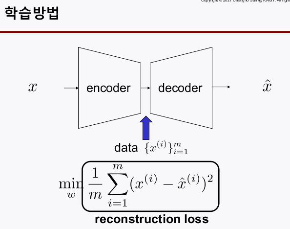

# AutoEncoder 
> Writer: SungwookLE    
> DATE: '22.1/21   
> REFERENCE: [#19](./img/LS19.pdf), [#20](./img/LS20.pdf), [#21](./img/LS21.pdf)  
> 실습코드(colab):  [코랩](https://colab.research.google.com/drive/11mCvWFgDHlMkW2LFOXpuIHk7hyrU_R93?usp=sharing)
- 블로그를 읽어보시고, 실습코드까지 연습해보는 것을 추천합니다 :)

## 1. Introduction

- Many people in Industrial Fields are interested i:
    1. Anomlay detection: **autoencoder**
    2. Fusion learning: **matrix completion**

## 2. AutoEncoder

- 구조(**Symetric** 하다는 것에 주목)

- **autoencoder** = `encoder` + `decoder`
- Training Methods: 트레이닝 과정을 보면석 역할을 이해해보자.
    1. Naive method
    2. Standard method
    3. Standard method with tying weights

- `autoencoder`는 Purely 비지도 학습이다.
  - label 정보를 가지고 트레이닝 하는 것이 아님
  - input layer의 feature 개수와 output layer의 feature 개수가 같은 `symetric` 구조임
  - **reconstruction loss`를 가지고 학습한다.
  
  - **symetric**하게 구성된 `autoencoder` 같은 경우는 naive하게 전체 layer를 한번에 학습하는 것 보단 각각의 레이어를 단계별로 학습하여 커널의 초기값을 찾고 찾아진 초기값을 기준으로 전체 layer를 fine-tuning 하여 전체적인 성능을 최적으로 찾아낸다.
  
  

- `encoder`와 `decoder` 사이에 있는 `coding layer`의 **internel feature**를 뽑기 위해 하는 것으로 **dimension reduction** techniques와 유사함

### 2-1. Discuss several other roles of `autoencoder`

1. Semi-supervised learning
2. A generative model
3. Matrix completion
4. Anomaly detection

#### 2-1-1. Semi-superviese learning(`SSL`)
- labled 데이터와 label이 없는 데이터를 같이 쓰는 방법론 전부를 `semi-supervised learning`으로 분류
- A learning methodology that exploits two datasets
  - 우리가 원하는 라벨링이 되어있는 데이터는 매우 적지만, 라벨링이 없는 데이터는 상대적으로 많다.
  - $({X^i})^m_{i=1}$: unlabeld
  - $({X^i, Y^i}) ^m_{i=1}$: labeld
  - $m_{label}$ << $m$

- 사용하는 방법 (schemetic)

- `autoencoder`를 라벨없는 데이터로 학습하고 `encoder` 부분만 분리해와서 가져온 다음 몇개의 `fully connected` layer로 구성된 **lower**를 붙여 네트워크를 구성한다.
- fine-tuning의 단계로 labeled data로 지도학습을 하여 전체 네트워크를 학습시킨다.
- `encoder`의 역할이 `internel features`를 추출하는 것이므로 위와 같이 활용하여 `ssl`을 할 수 있다.
- 이 때 `encoder`가 아니라 `PCA` 기법을 써서 `internel features`를 뽑을 수 도 있다.
    - 무얼 쓸지는 성능을 보고 결정

#### 2-1-2. A generative model
- **VAE** 라고 부름 (`Variational Autoencoder`)
- `autoencoder`의 `decoder`를 사용하는 방법
- `decoder`를 보면 입력은 `internel feature`이다.
- `autoencoder`에서 internel feature의 distribution을 보고 동일한 distribution을 갖는 랜덤값을 입력시켜 `fake data`를 만드는 방식이다.

- 이렇게 fake 데이터를 만드는 방법 중 다른 것으로는 `GANs`, `RBMs` 등이 있다.
- `GAN`은 매우 유명한데, Generative Adversarial Network로서, 아래의 그림을 보면 fake data를 생성할 때에 적대적 학습기를 넣음으로써 성능을 크게 향상시킨 것이다.
    - 다음 포스팅에서 추가 설명을 할 예정이다.

#### 2-1-3. Anomaly detection
- 아래의 프로젝트를 예시로 하여 살펴보자
- 주제: `센서 데이터를 활용한 차량 이상감지`
    1. **이상**신호 관련 example은 매우 부족: 지도학습 어려움
    
    

    2. 학습구조
    
    

        - 정상신호로만 autoencoder를 학습 시켰기 때문에, 비정상 신호를 input으로 넣으면 `reconstruction loss`가 크게 나올 것이다. 이를 가지고 **anomlay**를 판단하자.

    3. autoencoder에 들어가는 x는 scaling 처리만 한 data 일 수도 있고, feature를 선택하고 차원 축소를 하여 feed 해줄수도 있다.
        - 성능을 보고 결정..

#### 2-1-4. Matrix Completion
- matrix나 복수 개의 채널 데이터가 불완전하여 missing data가 있을 땐 어떻게 할까? 가장 간단하게는 채널별 `rank` 정보를 이용하여 아래 예시와 같이 `interpolation` 값을 채우는 형태일 것이다.

- `fusion learning` (데이터 타입이나 성격이 다른 복수개의 데이터를 활용해서 학습하는 방식)에서 데이터 matrix의 정보(`rank`)가 불완전할 때가 많은데, 이 때에도 matrix completion이 필요하다.

- `autoencder`를 활용하면 missing 데이터를 채우는 **matrix completion** 역할을 수행할 수 있다.
- 특히 노이즈에 강건한 `Denoising autoencoder`(DAE)를 설계할 수 있다.
    1. 타입1: Adding Gaussian Noise
    2. 타입2: Random Masking
    

## 3. 참고

- 승객 거동 추정에서 3D keypoints 를 추정할 때 2D keypoints 의 좌표가 필요한데, occlusion 등에 의해 2D keypoints가 추정이 잘 안되면 3D ketpoints 의 추정 성능이 전체적으로 크게 저하되는 문제가 있었다. 이를 개선하기 위한 방식으로 **DAE**를 고려해볼 수 있다.
    - encoder에서 random masking 기법을 접목하여 학습시킴으로써, 관측되지 않은 2d keypoints에 대해 민감성을 해소(강건성 확보)
    

- 승객 클래스를 구분하는 모델 개발에서 우리가 원하는 라벨링이 되어 있는 데이터의 개수는 현저히 적으나, 실내 승객 이미지는 어느정도 확보할 수 있는 상황이었다. 이러한 특징을 활용하여 아래 과제를 진행하였다. 

[Passenger Classifier 포스팅](https://sungwookle.github.io/research/2111051010/)

## 끝

