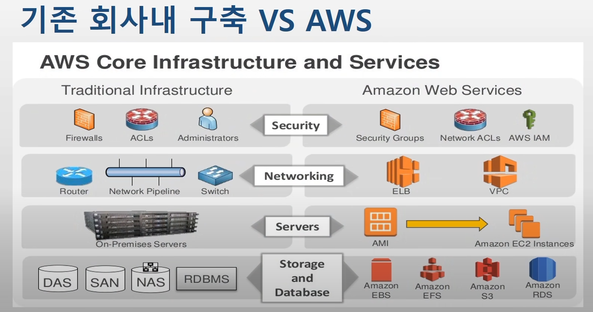

# Cloud Service 
> Writer: SungwookLE    
> DATE: '22.2/4   

# Cloud Service 조사

## 1. 클라우드 서비스란

- 클라우드(Cloud)라는 단어가 말해주듯, 인터넷 통신망 어딘가에서 구름에 싸여 보이지 않는 컴퓨팅 자원(CPU, 메모리, 디스크 등)을 원하는 대로 가져다 쓸 수 있는 서비스입니다.

### 1-1. 클라우드 서비스, 왜 쓰는 걸까요?

- 서버를 직접 구매할 때 고려해야 할 전력, 위치, 서버 세팅, 확장성을 고민하지 않고 서비스 운영에만 집중할 수 있습니다.

- 클라우드 서비스를 쓰지 않는다면 백엔드에 필요한 서버와 DB의 기능 뿐 아니라, HW + 시스템 유지 보수를 포함한 네트워크 보안 등의 관리업무가 필요합니다. 또한, 이를 저장하고 운영할 PC와 하드드라이브 구축도 필요하겠죠.



### 1-2. 클라우드 서비스 제공 업체

- AWS(아마존 웹서비스)
- MS Azure(마이크로소프프)
- GCP(구글 클라우드 플랫폼)
- 네이버 클라우드


## 2. 클라우드 서비스 구분

[클라우드 컴퓨팅의 종류(비전공자도 이해하는)](https://www.youtube.com/watch?v=oY8Tc5OQ-JI)

- 클라우드 컴퓨팅의 분류 기준은 Service Model과 Deployment Model로 나뉘어요.
    - **Service Model:** IaaS(Infrastructure as a Service), PaaS(Platform as a Sevice), SaaS(Service as a Service)
    - **Deployment Model:** Public 클라우드, Private 클라우드, Hybrid 클라우드

### 2-1. Service Model

서비스 관리 주체와 수준에 따라 클라우드 서비스를 IaaS, PaaS, SaaS로 구분

- 컴포넌트 용어 설명
    - Middleware: RDBMS 등 (DB 매니지먼트시스템)
    - Runtime: JDK, Python 등 프로그램이 작동하는 환경


- **IaaS(Infra as a Service)**
    
    **IT 기본 자원만 제공되는 형태로 Server, Storage, Network 제공 (컴퓨터 하나 구매하는 개념)**
    
    - 인프라 수준의 클라우드 컴퓨팅을 제공해 사용자가 서버 OS부터 미들웨어, 런타임 그리고 데이터와 어플리케이션까지 직접 구성하고 관리할 수 있다.
    - 클라우드 서비스 제공업체(Cloud Service Provider)는 데이터센터를 구축해 다수의 물리 서버를 가상화해 제공하며, 네트워크, 스토리지, 전력 등 서버 운영에 필요한 모든 것은 CSP가 책임지고 관리
    - 대표적인 IaaS: **AWS EC2(Elastic Compute Cloud)**와 Google의 Compute Engine(GCE), MS Azure
- **PaaS(Platform as a Sevice)**
    
    **IaaS에 OS, Middleware, Runtime 추가한 형태로 코드 개발만 해서 배포하면 서비스 되는 환경 제공**
    
    - PaaS는 IaaS 형태의 가상화된 클라우드 위에 사용자가 원하는 서비스를 개발할 수 있도록 개발 환경(Platform)을 미리 구축해, 이를 서비스 형태로 제공하는 것을 의미한다.
    - PaaS는 운영체제, 미들웨어, 런타임 등을 미리 구축한 상태로 제공하기 때문에 IaaS보다 관리상의 자유도가 낮음
    - 하지만, PaaS 사용자는 서비스 외적인 부분에 신경 쓸 필요가 없고, 애플리케이션 개발과 비즈니스에만 집중할 수 있음
    - IaaS와 마찬가지로 별도의 인프라를 유지하고 운영하는 데 별도의 인력이 소요되지 않기에 하드웨어 및 소프트웨어 인프라 관리에 드는 비용을 절약할 수 있다.
    - 대표적인 PaaS: **AWS Elastic Beanstalk**, Google App Engine, MS Azure
- **SaaS(Service as a Service)**
    
    **모든 기능이 동작하는 SW를 제공**
    
    - SaaS는 클라우드 서비스 형태 중 가장 완성된 형태의 클라우드 서비스입니다.
    - 클라우드 인프라 위에 소프트웨어를 탑재해 제공하는 형태로 IT 인프라 자원 뿐만 아니라 소프트웨어 및 업데이트, 버그 개선 등의 서비스를 업체가 도맡아 제공합니다.
    - 별도의 비용을 들여 소프트웨어 라이센스를 구입할 필요 없이 월간/연간 구독 형태의 사용료를 지불하고 제공 업체의 소프트웨어를 이용하게 됩니다.
    - 대표적인 SaaS:  구글 드라이브, Dropbox, Office365

### 2-2. Deployment Model

- 퍼블릭 클라우드
    - 인터넷에 접속 가능한 모든 사용자를 위한 클라우드 서비스 (AWS, GoogleCloud)
- 프라이빗 클라우드
    - 제한된 네트워크 상에서 특정 기업이나 특정 사용자만을 대상으로 하는 클라우드로 서비스의 자원과 데이터는 기업 내부에 저장됩니다.
- 하이브리드 클라우드
    - 퍼블릭 클라우드와 프라이빗 클라우드 혼합 방식 또는 가상 서버와 물리 서버를 결합한 형태를 하이브리드 클라우드라고 부른다.

## 3. 클라우드 서비스 용어

- 클라우드 서비스 사용을 위해선 먼저 가상 컴퓨팅 환경을 설정해주어야 합니다. 유저의 개별적인 가상 컴퓨팅 환경을 인스턴스라고 부르고, 설정은 인스턴스 단위로 이루어집니다.
- 클라우드 서비스를 설정/사용을 위한 기본 용어를 설명하고, AWS EC2를 기준으로 추가 용어 설명을 해볼게요.

### 3-1. 기본적인 용어

- Data Center: 서버와 네트워크 자원 등을 제공하는 시설
- Region: Data Center가 구축 된 국가/도시
- Availability Zone은 고가용성 위한 Region 내 분산 된 Data Center
    - 물리적 거리가 가까울수록 전송속도가 빠름

- Virtualization은 SW 기술로 가상의 Machine을 생성하는 기술
    - 가상의 하드웨어는 VM: Virtual Machine이라 부름
    - Cloud 서비스에서 서버를 사용할 때, 가상화된 서버를 제공받음


### 3-2. 사용 비용

- 클라우드 서비스는 Computing Resource 자원을 원하는 만큼 쓰고 쓴 만큼 비용을 지불합니다.
    - OnDemand: 사용한 만큼 돈을 내는 방식
    - 대규모 확장성에 유리하다
    - 종량제 과금
- ~~개인 웹사이트를 운영할 경우에 월 2~3만원 정도에서 과금된다는 포스팅이 있었음~~

### 3-3. AWS EC2를 기준으로 추가 용어 설명

- AWS EC2 제공 기능/용어
    - **인스턴스**: 가상 컴퓨팅 환경
    - **Amazon 머신 이미지(AMI):** 서버에 필요한 운영체제와 여러 소프트웨어들이 적절히 구성된 상태로 제공되는 템플릿을 이용하여 인스턴스를 쉽게 만들 수 있음
    예: 운영 체제, 애플리케이션 서버, 애플리케이션
    - **인스턴스 유형(Types):** 인스턴스를 위한 CPU, 메모리, 스토리지, 네트워킹 용량의 여러가지 구성 제공
    - **키페어**: 인스턴스 생성 시, 발급되는 키페어를 사용하여 인스턴스 로그인 정보 보호(AWS는 퍼블릭 키를 저장하고 사용자는 개인 키를 안전한 장소에 보관하는 방식)
    - **인스턴스 스토어 볼륨**: 임시 데이터를 저장하는 스토리지 볼륨으로 인스턴스 중단, 최대 절전 모드로 전환 또는 종료 시 삭제됨
    - **Amazon Elastic Block Store(EBS)**: Amazon EBS 볼륨을 사용해 영구 스토리지 볼륨에 데이터 저장
    - 인스턴스와 Amazon EBS 볼륨 등의 리소스를 다른 물리적 장소에서 액세스할 수 있는 **리전 및 가용 영역**
    - **보안 그룹**을 사용해 인스턴스에 연결할 수 있는 프로토콜, 포트, 소스 IP 범위를 지정하는 방화벽 기능
    - **탄력적 IP 주소(EIP)**: 동적 클라우드 컴퓨팅을 위한 고정 IPv4주소
    - **Virtual Private Clouds(VPC):** AWS 클라우드에서는 논리적으로 격리되어 있지만 원할 때마다 고객의 네트워크와 간편히 연결할 수 있는 가상 네트워크

[AWS 공부 2주차 - EC2 개념정리](https://velog.io/@swhan9404/EC2-%EA%B0%9C%EB%85%90%EC%A0%95%EB%A6%AC)

- 인스턴스 유형
    - 인스턴스 유형에 따라 인스턴스에 사용되는 호스트 컴퓨터의 하드웨어가 결정됨
    - 각 인스턴스 유형은 서로 다른 컴퓨팅, 메모리, 스토리지 용량을 제공하는데, 이 용량에 따라 서로 다른 인스턴스 패밀리로 분류
    - 인스턴스에서 실행하려는 애플리케이션 또는 소프트웨어의 요구 사항에 따라 인스턴스 유형을 선택


- 인스턴스 종료와 중지
    - 비용이 청구되느냐, 안되느냐에 있어서 구분하는 것이 매우 중요해요 😢
    - ~~저는 이것저것 건들면서 하다보니 저는 매우 조금의 비용이 청구되었더라구요...~~

| 번호 | 인스턴스 상태 | 설명 | 인스턴스 사용 요금 |
| --- | --- | --- | --- |
| 1 | pending | 인스턴스는 running 상태로 될 준비를 하고 있습니다. 인스턴스를 처음 시작하거나 stopped 상태의 인스턴스를 다시 시작하면 pending 상태가 됩니다. | 미청구 |
| 2 | running | 인스턴스를 실행하고 사용할 준비가 되었습니다. | 청구 |
| 3 | stopping | 인스턴스가 중지 또는 중지-최대 절전 모드로 전환할 준비를 하고 있습니다. | 중지 준비 중인 경우 미청구최대 절전 모드로 전환 준비 중인 경우 청구 |
| 4 | stopped | 인스턴스가 종료되고 사용이 불가합니다. 언제든지 인스턴스를 다시 시작할 수 있습니다. | 미청구 |
| 5 | shutting-down | 인스턴스가 종료할 준비를 하고 있습니다. | 미청구 |
| 6 | terminated | 인스턴스가 영구적으로 삭제되었으며 시작할 수 없습니다. | 미청구참고종료된 인스턴스에 적용되는 예약 인스턴스는 결제 옵션에 따라 기간이 종료될 때까지 요금이 청구됩니다. 자세한 내용은 예약 인스턴스 섹션을 참조하세요. |

- 인스턴스 중지
    - 인스턴스를 중단하면 실행종료 과정이 이루어지고 `stopped` 상태가 됨
        - 인스턴스의 모든 Amazon EBS 볼륨이 연결된 상태로 유지되므로 나중에 언제든지 다시 사작할 수 있음
        - 인스턴스가 중지됨 상태에 있는 동안에는 추가 인스턴스 사용량에 대한 요금이 부과되지 않음
    - 인스턴스가 중지인 상태에서 EBS 볼륨을 연결하거나 분리할 수 있음
        - 모든 연결 Amazon EBS 루트 디바이스 사용을 비롯한 인스턴스 사용에 관련된 비용은 일반 Amazon EBS 요금이 적용
    - 인스턴스가 중인 상태에서 커널, 램, 디스크, 인스턴스 유형을 변경할 수 있음
- 인스턴스 종료
    - 인스턴스가 종료될 때 인스턴스는 일반 종료를 수행
        - **루트 디바이스 볼륨은 기본적으로 삭제되지만 모든 연결된 Amazon EBS 볼륨은 기본적으로 유지**
        - 각 볼륨의 deleteOnTermination 속성 설정에 따라 조정 가능
        - 인스턴스 자체도 삭제되므로 나중에 다시 시작할 수 없음

- EC2 스토리지
    
    스토리지 옵션은 독립적으로 또는 요구 사항에 맞춰 조합하여 사용할 수 있음
    
    - Block Storage
    - File Storage
    - Object Storage


- 제공되는 스토리지 옵션
    - Amazon Elastic Block Store(EBS)
        - SSD와 HDD로 구분됨
        - EBS 볼륨이 인스턴스에 연결되면, 다른 물리적 하드 드라이브처럼 사용할 수 있음
        - 한 인스턴스에서 EBS 볼륨을 분리한 다음 다른 인스턴스에 연결하는 것도 가능, 스냅샷을 생성하여 백업도 가능
    - Amazon EC2 인스턴스 스토어
        - stop/start 로 인해 하드웨어가 바뀌면 사라짐(휘발성)
        - 디스크 오류, 인스턴스 중지, 인스턴스 종료 시 데이터 소실
    - Amazon EFS(파일 스토리지)
        - EC2 인스턴스를 위한 완전 관리형 네트워크 파일 시스템
        - EFS 파일 시스템을 만든 후 파일 시스템을 마운트하도록 인스턴스를 구성할 수 있음
    - Amazon S3(Simple Storage Service)
        - 웹에서 사용 가능한 오브젝트 저장소
- CloudWatch 모니터링
    - Amazon CloudWatch는 Amazon Web Sevices(AWS) 리소스와 AWS에서 실시간으로 실행 중인 애플리케이션을 모니터링
    - 지표를 모니터링 하여 알림을 보내거나 임계값을 초과한 경우 리소스를 자동으로 변경할 수 있음
        - 인스턴스 지표
        - CPU 크레딧 지표
        - Nitro 기반 인스턴스용 Amazon EBS 지표
        - 상태 확인 지표
        - 트래픽 미러링 지표
        - Amazon EC2 사용량 지표

## 4. 클라우드 서비스 튜토리얼

- 무료버전(프리티어)을 활용하여 AWS 클라우드 서비스(EC2, Sagemaker)를 사용해봅시다.
- **AWS 프리 티어**는 언제 만료됩니까?
    - 12개월 **프리 티어**에 해당하는 서비스를 사용하면 고객이 계정을 생성한 날부터 1년 동안 지정된 한도 내에서 제품을 무료로 사용할 수 있습니다.

### 4-1. AWS EC2(IaaS)

- **아래의 순서대로 진행해볼게요! 😃**
    1. **oruum backend 환경 `docker`이미지 빌드**
    2. **AWS EC2 인스턴스 생성**
    3. **인스턴스에 도커 설치하기**
    4. **인스턴스에 도커 image 가져온 후, 컨테이너 실행**
    5. **인스턴스 내 컨테이너에 위치한 mysql 데이터베이스 세팅**
    6. **oruum backend webserver 실행**
    7. **public IP를 이용하여 oruum backend webserver 접근**


#### 1. oruum backend 환경 `docker` 이미지 빌드
- 도커 사용법 및 사용 이유
    - 도커는 리눅스 상에서 컨테이너 방식으로 프로세스를 격리해서 실행하고 관리할 수 있도록 도와주며, 계층화된 파일 시스템에 기반해 효율적으로 이미지(프로세스 실행 환경)을 구축할 수 있도록 해줍니다.
    - 도커를 사용하면 이 이미지를 기반으로 컨테이너를 실행할 수 있으며, 다시 특정 컨테이너의 상태를 변경해 이미지로 만들 수 있습니다. 이렇게 만들어진 이미지는 파일로 보관하거나 원격 저장소를 사용해 쉽게 공유할 수 있으며, 도커만 설치되어 있다면 필요할 때 언제 어디서나 컨테이너로 실행하는 것이 가능합니다.
    - 이미지가 미리 구성된 환경을 저장해 놓은 파일들의 집합이라면, 컨테이너는 이러한 이미지를 기반으로 실행된 격리된 프로세스입니다.
    - 왜, 도커를 사용하는가?
        
        [왜 굳이 도커(컨테이너)를 써야 하나요? - 컨테이너를 사용해야 하는 이유](https://www.44bits.io/ko/post/why-should-i-use-docker-container)
        
    - 도커 설치방법
        
        [Ubuntu 18.04 AWS EC2에서 Docker 설치하기](https://deepmal.tistory.com/21)
        
    - 도커 입문자 메뉴얼
        
        [도커(Docker) 입문편: 컨테이너 기초부터 서버 배포까지](https://www.44bits.io/ko/post/easy-deploy-with-docker)
        
- (참고) 쿠버네티스도 들어보셨죠?
    
    [[Kubernetes] 도커와 쿠버네티스 간단 비교](https://wooono.tistory.com/109)
    
    - 쿠버네티스는 **'컨테이너 오케스트레이션 툴'** 이다.
        - **오케스트레이션**이란?
            - 컨테이너 역시 그 수가 많아지게 되면 **관리와 운영**에 있어서 어려움이 따른다.
            - 컨테이너 오케스트레이션은 이러한 **다수의 컨테이너 실행을 관리 및 조율**하는 시스템이다.
            - 오케스트레이션 엔진을 통해 컨테이너의 **생성과 소멸, 시작 및 중단 시점 제어, 스케줄링, 로드 밸런싱, 클러스터링** 등 컨테이너로 **어플리케이션을 구성하는 모든 과정을 관리**할 수 있음
            - 다른 컨테이너 오케스트레이션 툴로는 '도커 스웜', 'ECS', 'Nomad'등이 있다.
    - 한 개의 인스턴스만 이용하면 쿠버네티스는 필요 없다.
    - 지금은 쿠버네티스는 많은 **컨테이너 관리**에 유용한 것으로 알고 계시면 될 것 같아요.
- **docker**를 사용하면 간편하게 서버를 분할하고 이식하고 관리할 수 있어요..
    - 튜토리얼 만드는 김에 `oruum backend` 기준으로 docker 이미지를 생성하였습니다.
    - 해당 작업은 최초 1회만 하면 되는 것으로, 향후에는 서버관리자가 해주면 될 것 같습니다.
        - oruum backend 구동을 위한 도커 이미지 만들기
            - docker 이미지 만드는 과정!!!
                1. docker 공식 이미지 중 `mysql`를 가져와 컨테이너 실행하기
                    
                    [Docker를 사용하여 MySQL 설치하고 접속하기](https://poiemaweb.com/docker-mysql)
                    
                    ```python
                    docker pull mysql #도커 공식 이미지 중 mysql 이름을 갖는 이미지 다운로드
                    docker run --name mysql-container -e MYSQL_ROOT_PASSWORD=<password> -d -p 3306:3306 mysql:latest
                    # mysql의 root 계정 비밀번호를 test로 하여 3306 포트에 mysql:latest 이미지를 갖는 컨테이너 생성
                    docker exec -it mysql-container bash # mysql-container 라는 이름의 컨테이너 실행
                    ```
                    
                2. 실행한 docker 컨테이너 안에서 커스텀 환경 설치하기
                    
                    ```python
                    apt update
                    apt-get install python3-pip #pip 설치
                    apt install -y git #git 설치
                    git clone https://github.com/YuhyeokJo/oruum_backend.git #oruum clone
                    apt install vim #에디터 설치
                    
                    # 설치 중에 문제가 있더라구요, 아래 라인 실행
                    pip3 install --upgrade --ignore-installed pip setuptools
                    # 보니까 requests 설정값이 문제가 있어 에러가 뜨는데, requests>=2.24.0 라인 삭제하고 진행
                    pip3 install -r requirements.txt
                    
                    pip3 install sqlalchemy #sqlalchemy 설치
                    # 문제 없음
                    
                    ## docker shell이 아닌 다른 bash창 실행하여 3306 포트가 쓰이고 있는지 체크
                    netstat -nlpt
                    docker diff <contrainer-id> | head #docker diff를 걸어보면 초기 이미지에서 얼마나 달라졌는지 확인할 수 있다.
                    ```
                    
                    
                    
                3. 이제 oruum backend만의 이미지를 생성할 수 있어요: `docker commit <container-id>`
                    
                    
                    
                    ```python
                    # doker 이미지로 커밋하기 전에 `mysql` 접속 문제 없는지 확인하고 커밋하기
                    docker commit 65721 mysql:oruum # 65721* ID의 컨테이너를 mysql:oruum 이라는 이미지로 생성
                    docker ps -a # 실행중인 컨테이너 확인
                    docker stop <container-id> # <container-id> 중지
                    docker rm <container-id> # <container-id> 삭제 
                    ```
                    
                4. 만든 이미지로 docker 컨테이너 실행해서 체크하기
                    - docker 커맨드라인 옵션 설명 참고: https://www.daleseo.com/docker-run/
                    
                    ```python
                    docker run --name mysql-container -e MYSQL_ROOT_PASSWORD=<password> -d -p 3306:3306 mysql:oruum
                    docker exec -it mysql-container bash
                    # 잘되는지 확인
                    ```
                    
                5. docker 이미지를 hub repository에 업로드하기(docker hub에 push하기)
                    
                    ```python
                    docker push <docker_hub>
                    docker pull <docker_hub>
                    ```
                    
                    [Docker 이미지 추출 및 저장소 생성(2/2)](https://mingyucloud.tistory.com/entry/Docker-%EC%9D%B4%EB%AF%B8%EC%A7%80-%EC%B6%94%EC%B6%9C-%EB%B0%8F-%EC%A0%80%EC%9E%A5%EC%86%8C-%EC%83%9D%EC%84%B122)
                    
                6. 이제 `docker pull joker1251/oruum_backend:oruum` 을 실행하면 완성된 docker_backend 이미지를 다운받을 수 있습니다!!! 😊
    - 미래의 백엔드 서버 관리자들은 저장소에 push 해둔 docker 이미지를 pull (`docker pull joker1251/oruum_backend:oruum`)하여 이미지를 다운받고 컨테이너를 실행시키는 방식으로 서버 환경을 배포/사용하면 될 것 같아요.

#### 2. AWS EC2 인스턴스 생성
- AWS EC2의 공식 튜토리얼

[Amazon EC2 시작하기](https://aws.amazon.com/ko/ec2/getting-started/)

- 해당 포스팅에 잘 정리해 놓았더라구요. 공유드립니다.
    - 저도 아래의 포스팅을 따라 인스턴스를 설정하였어요.

[AWS 튜토리얼(1) - Ec2 생성하기](https://youngjinmo.github.io/2020/03/aws-tutorial-create-ec2/)

- AWS 가입 진행하고, AWS 페이지 내에서 EC2 서비스를 검색하여 실행하고 인스턴스를 생성합니다.
    - 인스턴스의 AMI(이미지), 스토리지 등의 옵션을 적절한 것으로 선택해주세요.
    - 인스턴스 생성을 마치면, 키페어가 발급되는데 키페어를 가지고 있어야지만 인스턴스에 접속 가능하므로 매우 중요합니다.
        - 키페어는 보안 관련하여 중요한 파일이기 때문에 잘 관리해주세요!
        - 터미널에서 ssh로 ec2 접속할 때 키페어 권한을 바꿔 주어야 합니다.
        `chmod 600 <키페어파일이름> #읽기 쓰기 권한 부여`
- 생성한 EC2 인스턴스에 연결하는 방법
    - 아래와 같이 접속하면 됩니다.
        
        
        
    - bash에서 실행하면 아래와 같이 `ubuntu@ip-172-31-2-249` 표시되며 EC2 인스턴스에 접속됨
        
        
        
#### 3. 인스턴스에 도커 설치하기
- 생성하여 push 해 둔 oruum의 도커이미지를 가져오기 위해 docker를 설치하였어요.
- 아래 포스팅의 안내를 따라 인스턴스에 도커를 설치하였습니다.
    
    [Ubuntu 18.04 AWS EC2에서 Docker 설치하기](https://deepmal.tistory.com/21)
    
#### 4. 인스턴스에 도커 image 가져온 후, 컨테이너 실행
- 도커이미지를 가져온다.
    - `docker pull joker1251/oruum_backend:oruum`
- 컨테이너를 실행시킨다.
    - 컨테이너의 이름은 `mysql-container` 로 한다.
    - 환경변수로 `MYSQL_ROOT_PASSWORD=test` 를 주어서, mysql의 root계정 비밀번호를 `test`로 한다.
    - `-d` 옵션을 주어 백그라운드로 컨테이너가 실행되게 한다.
    - `-p` 옵션을 주어 컨테이너의 포트와 인스턴스의 포트를 매핑해주었다. 아래에선, 컨테이너의 3306포트를 인스턴스의 3306포트에 이어주고, 컨테이너의 5000포트를 인스턴스의 5000포트에 이어주었음, 설정한 3306포트는 mysql의 포트이고, 5000포트는 orrum backend webserver 포트이다.
    - 사용한 docker 이미지는 `joker1251/oruum_backend:oruum`
    - `docker run --name mysql-container -e MYSQL_ROOT_PASSWORD=<password> -d -p 3306:3306 -p 5000:5000 joker1251/oruum_backend:oruum`
- 컨테이너의 bash창을 실행시킨다.
    - `docker exec -it mysql-container bash`

#### 5. 인스턴스 내 컨테이너에 위치한 mysql 데이터베이스 세팅
- mysql 데이터베이스 세팅을 도커 컨테이너 상에서 mysql에 접속하여 쿼리문으로도 진행할 수 있을거예요. 그러나 약간은 불편함이 있습니다.
- 인스턴스 위 컨테이너에 위치한 mysql을 외부의 로컬에서 mysql-workbench로 접속하는 방법을 알려드릴게요. 아래 포스팅을 참고하였습니다.

[[AWS] AWS EC2 인스턴스 (Ubuntu) 에서 MySql 세팅하기](https://devkingdom.tistory.com/84)

- 인스턴스의 보안그룹 설정에 인바운드 규칙으로 3306 포트를 열어주고 모든 사용자(`0.0.0.0/0`)가 접근할 수 있도록 아래와 같이 설정해주어야 합니다.
    
    
    
    - backend server나 mysql에 모든 사용자가 접근 가능한 것이 아닌, 특정 IP만 접근 가능하도록 설정할수도 있습니다.
- 이제 로컬에서 인스턴스 컨테이너에 위치한 mysql에 접속해봅시다.
    - 아래의 화면에서 퍼블릭 IPv4 주소를 확인할 수 있어요
    - 해당 주소는 인스턴스가 실행될 때마다 바뀐다고 하는데, 이런 부분을 방지하기 위해 탄력적 IP 주소 설정을 하여 IP 주소가 고정되보이게끔 설정할 수 있다고 합니다.
        
        
        
    - 로컬에서 `mysql-workbench` 를 실행해 주시고, 연결 설정을 아래와 같이 해줍니다.
        
        
        
        - Hostname의 IP로 인스턴스의 퍼블릭 IP를 입력하였고, Port는 3306, Username은 root, 비밀번호는 컨테이너 실행할때 설정한 비밀번호를 입력하였습니다.
    - `mysql-workbench` 로 인스턴스 컨테이너 상의 mysql로 접속 성공하였다면, database , table 등을 세팅해주세요.
        
        
        
- 이렇게 하면, 인스턴스 내의 mysql database도 세팅이 끝납니다.
    - 이렇게 신규로 설정해주는 방법 외에도, 기존에 사용하고 있던 db 데이터를 통째로 AWS EC2로 옮기는 방법도 있습니다. `filezila` 를 이용하는 방법이예요.

#### 6. oruum backend webserver 실행
- 인스턴스의 컨테이너 bash 창으로 옵니다.
    - 참고로 컨테이너의 bash창은 여러개를 켜놓을 수 있으니, 여러개 켜놓고 작업해도 됩니다.
- 컨테이너에서 oruum_backend 깃 레포지토리를 clone해서 가져옵니다.
    - `git clone [https://github.com/YuhyeokJo/oruum_backend.git](https://github.com/YuhyeokJo/oruum_backend.git)`
- 이미 필요한 패키지나 환경값들은 도커 이미지에 다 씌워놓았기 때문에 해당 폴더로 경로 이동하여 실행만 해주면 됩니다.
    - `python3 oruum_backend_launcher.py`
    
    
    
#### 7. public IP를 이용하여 oruum backend webserver 접근
- 인스턴스의 public IPv4 주소를 입력하고 포트에 접근하면, 아래와 같이 웹서버가 열려 있을거예요!
    
    
    
- `api_samples_codes/database_api_login.py` 샘플 코드를 실행시켜 제대로 웹서버가 반응하고 mysql db에서 데이터가 조회되고 입력되는지 확인해볼게요.
    - 이를 위해서 해당 코드 상의 database_ip 주소를 바꿔주어야 합니다. (바뀌었으니까~)
    - `vim api_sample_codes/database_api_login.py` 를 실행하여 ip주소 현재 실행된 백엔드 서버의 IP주소로 바꿔줍니다.
        
        
        
        
        
    - 외부 PC에서도 샘플코드를 실행하면 AWS EC2 서버와 잘 정보를 주고받아 아래와 같이 출력됨을 확인할 수 있어요. 이 때 IP 주소는 퍼블릭 IP 주소를 써주어야 겠죠. 같은 local에 존재하는 것이 아니니까
        
        
        

**튜토리얼 끝 😃**

### 4-2. AWS Sagemaker(PaaS)

- Amazon SageMaker는 Machine Learning을 위한 PaaS
- 아래의 튜토리얼을 따라 진행하였다.
    
    [Amazon SageMaker로 기계 학습 모델을 구축, 훈련 및 배포하는 방법 AWS](https://aws.amazon.com/ko/getting-started/hands-on/build-train-deploy-machine-learning-model-sagemaker/?trk=el_a134p000003yWILAA2&trkCampaign=DS_SageMaker_Tutorial&sc_channel=el&sc_campaign=Data_Scientist_Hands-on_Tutorial&sc_outcome=Product_Marketing&sc_geo=mult)
    
    [Amazon SageMaker를 사용해서 기계학습 모델을 구축, 학습 및 배포를 해보았습니다 DevelopersIO](https://dev.classmethod.jp/articles/yjsong_sagemaker_xgboost/)
    
- **Sagemaker**, Google 코랩이랑 무엇이 다를까?
    - 머신러닝 프레임워크를 사용하는 것에 있어선 데이터 전처리, 저장, 모델 설계 등 구글 코랩이 편리하다.
    - 그러나, AWS의 **Sagemaker**는 학습한 모델을 바로 배포할 수 있다. `endpoint`에 deploy 하는 형태로 학습 결과를 바로 유저에게 배포할 수 있다.

## 5. 기타

- ASW EC2를 사용하면 서버 관리에 있어 부담이 사라지고, 도커나 쿠버네티스 같은 툴을 사용하여 나름 편리하게 서버를 운영하고 관리할 수 있겠습니다.
- **클라우드서비스 비용이 걱정이 되는 것인데, 사실 우리의 시간도 다 돈이니까요.., 
월 2~3만원이면 해볼만 하지 않을까요? ㅎㅎ**