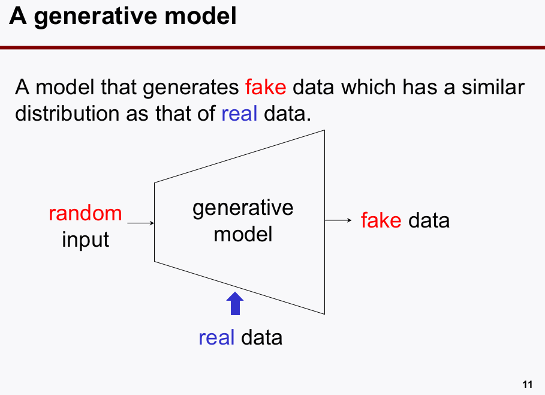
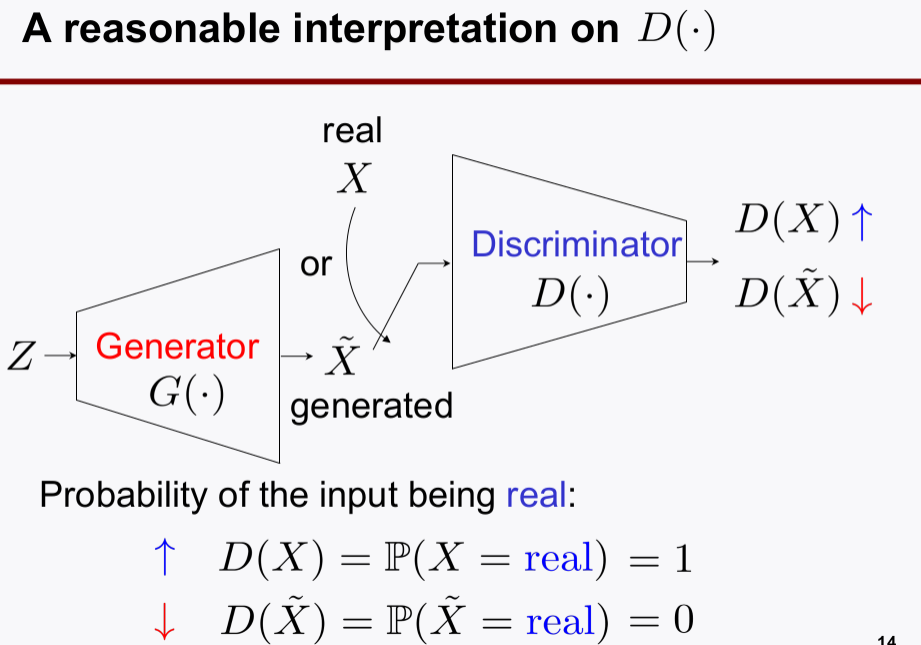
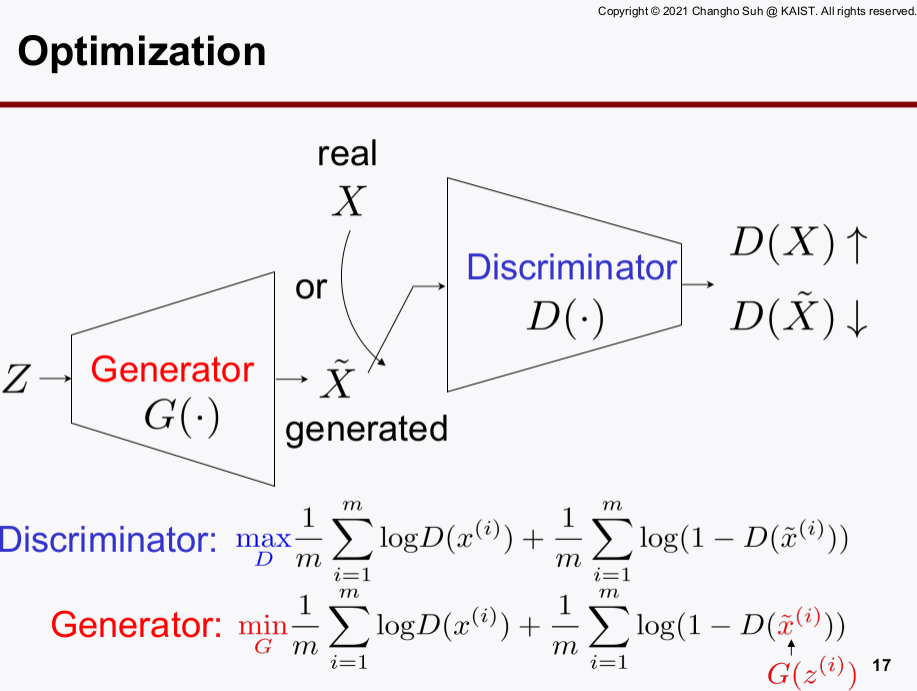
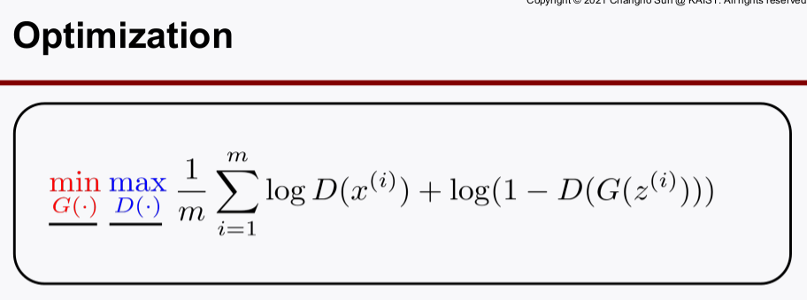
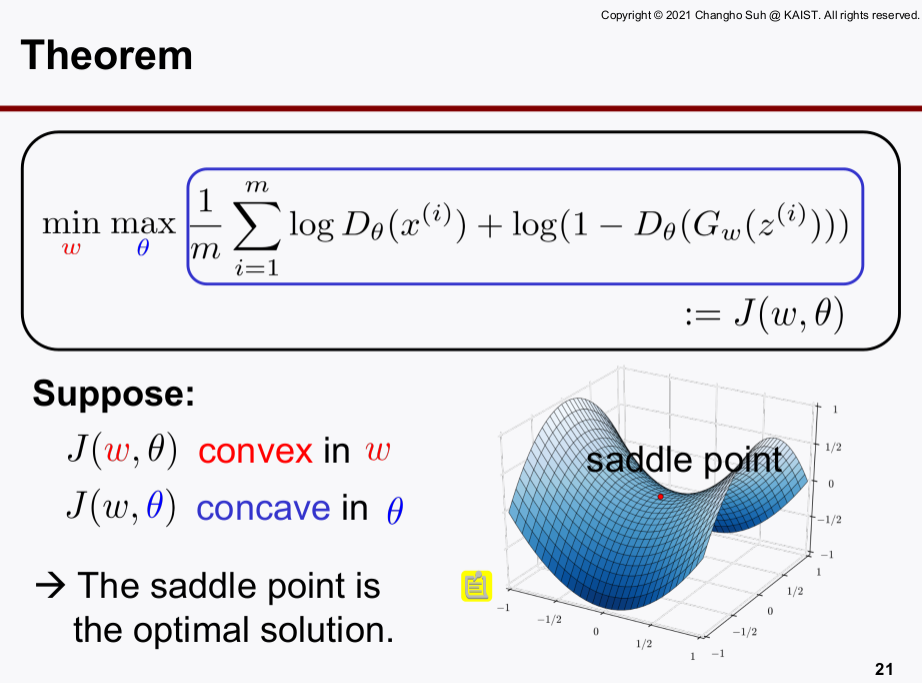
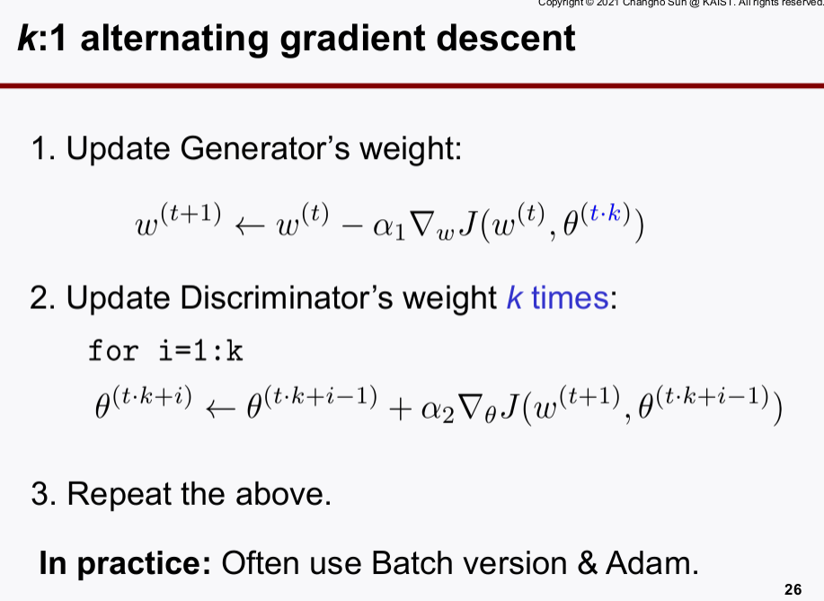
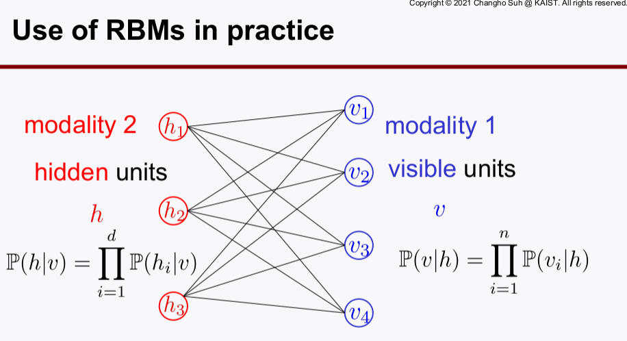
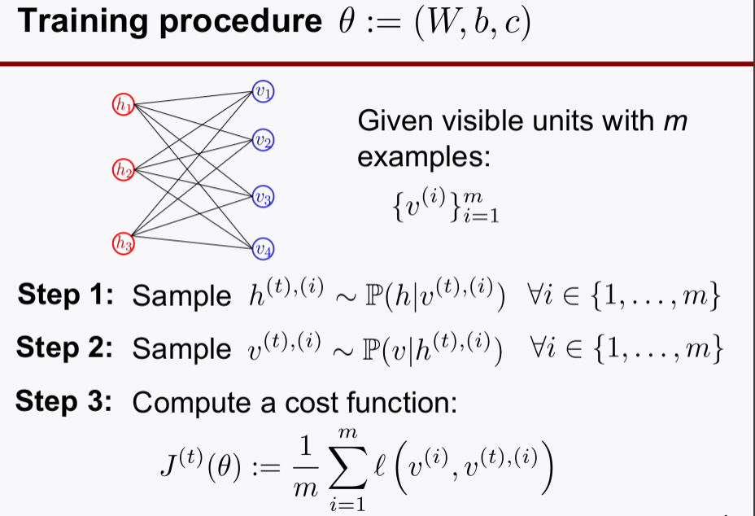

# GAN & RBMs 
> Writer: SungwookLE    
> DATE: '22.2/6   
> REFERENCE: [#22](./img/LS22.pdf), [#23](./img/LS23.pdf), [#24](./img/LS24.pdf)  
> 실습코드(colab):  [코랩](), [부연 자료.pdf](./img/Day8_PS.pdf)  
- 블로그를 읽어보시고, 실습코드까지 연습해보는 것을 추천합니다 :)

## 1. Introduction
- There is a more powerful generative model based on: Generative Adversarial Networks(GANs)
- Prior to GANs, a classical method was often employed: Restricted Boltzmann Machines (RBMs)

## 2. GANs(Generative Adversarial Networks)

### 2-1. GAN 등장 배경
- Generative Model(`Generator`)은 기본적으로 아래와 같은 형태이다.
    - `오토인코더`의 경우에 `decoder` 부분을 잘라내어, generative model로 사용할 수 있었다.
    
- GAN(Generative Adversarial Networks)은, 일반적인 generative model을 통해 나온 결과물 보다 성능을 향상시키기 위한 방법으로 `Discriminator`를 추가하였다. 

- `GAN` 네트워크로 `Generator`와 `Discriminator`를 학습시키고, 학습이 끝나면 `Generator`를 잘라내어 가져와서 사용한다.

### 2-2. GAN의 역할
1. `Generator`: 성능이 뛰어난 fake 생성기
2. `Discriminator`: fake 를 구별해낼 수 있는 감별기

### 2-3. GAN 네트워크 이해
- 목적함수를 살펴봄으로써, GAN의 학습원리와 네트워크를 이해하자.

- 위의 그림을 잘 이해하는 것이 중요한데, 어떻게 `GAN`네트워크가 성능의 뛰어난 `Generator`와 `Discriminator`를 학습시킬 수 있는 구조인지 살펴보자.
    1. `Discriminator`의 D(x)는 real 데이터가 X로 들어오면 큰 값이 출력되게 한다. fake 데이터가 X로 들어오면 작은 값이 출력되게 한다. `Discriminator`의 목적함수를 maximize함으로써, real과 fake를 더 잘 구별해내는 `discriminator`로 학습시킨다.
    2. 같은 **iteration**에서 `discriminator`의 학습이 끝나면, `generator`를 학습시킨다. `generator`는 `discriminator`의 목적함수를 minimize하게 학습시키는 것인데, minimize 한다는 것의 의미는 fake 데이터를 넣어도 `discriminator`가 real 데이터라고 착각하게 만들 수 있는 수준의 fake 데이터를 만들어내게 하겠다는 의미이다. 이미 `discriminator`의 네트워크 파라미터는 고정(`fix, not trainable`)되어 있으니, `discriminator`의 눈치를 보면서 `generator`를 학습시키는 꼴이 된다.
    3. 이 때, `discriminator`는 조금 더 fine tune을 해주기 위해 `alternating gradient descent`를 사용하고 이 방법은 K번 `discriminator`를 작업 learing rate로 학습시키는 방법이다.
    4. 이 과정을 계속 반복함으로써 `generator`가 더 그럴싸한 fake 데이터를 만들게 한다.

- 위 수식의 `min/max` 목적함수를 구하는 과정을 살펴보자.
    1. D와 G 함수 class를 `neural network`로 파라미터라이제이션하여 문제를 구체화하고 Gradient-Descent로 해를 찾는다.
    2. `min/max` 문제는 게임이론과 같이 하는 최대화, 하나는 최소화하여야 하기 때문에 목적함수는 `convex+concave` 형태이다.
    3. `min/max` 문제를 푸는 것이고, saddle point가 최적 해이기 때문에 `training instability`가 존재하는 것이 고질적인 문제이다.
    4. `training instability`를 조금이나마 해소하고 `discriminator`와 `generator`의 학습을 조금 더 잘 되게 하기 위해 **Alternating Gradient Descent**라는 것을 이용한다.
    5. **Alternating Gradient Descent**는 `generator`를 한번 학습할 때, `discriminator`는 **k**번 반복학습하는 것으로 *highly nonlinear*할 때 러닝레이트를 작게하고, 여러번 반복시킴으로써 학습을 조금 더 잘되게 하는 테크닉이다.
    

- `GANs`는 아주 성능이 뛰어난 fake data `generator`이고, 성능도 우수하다. 초기값과 random seed에 의해 성능이 크게 좌지우지되는데 이는 `training instability`가 존재하여서이다.

### 2-4. 참고
- `Generator`로 사용할 수 있는 것 중 배운 것들을 소개해보자
    - `autoencoder` 학습 후 `decoder` 추출 사용: `decoder`의 입력값이 되는 internel feature는 가우시안 distribution 의 랜덤값으로 대체하고, 출력값을 fake data로 한다.
    - `PCA`: 일종의 generator로 쓸 수 있다. (성능이 안좋음)
    - `RBMs`: 밑에서 소개하겠으나, 성능은 글쎄..
    - **`GAN`**: 성능이 매우 뛰어남

## 3. RBMs(Restircted Boltzmann Machines)
- 수식을 파고들 것 까지는 없고, 컨셉만 잡고 가자 (`sklearn.neural_network`에 잘 구현되어 있음)
- 본 강의에서는 binary random data를 예시로 하여 <1,0>이 나오는 데이터에서 확률만 주어지면 데이터를 생성해낼 수 있다는 예시를 베이스로 해서 시작하겠다. (이를 `Gibs Sampling` 이라고 한다 함)
    - 만약, binary data CASE가 아니라면 본 컨셉을 확장시켜야 함

### 3-1. RBMs 역할
- 역할: data `generator` 또는, `matrix completion`에 사용한다.

### 3-2. RBMs 독특한점
- training path가 단방향이 아니고 visible layer -> hidden layer -> visible layer로 찍고 돌아오는 루트이다. (joint 관계를 표현하기 위한 수식들이 있음)

- 모든 수식을 확률 관계로 표현하였다. 따라서, 조건부 확률이 계속 등장하고 독립이라는 가정을 통해 수식을 유도하는 점에서 특이하다.
- 단방향으로만 에러가 흐르는 뉴럴 넷의 경우도 파라미터라이제이션을 가중치과 바이어스, 비선형함수로만 구성하였는데, `RBMs`에서는 조건부 확률이라는 개념으로 함수의 파라미터라이제이션을 하였다.
- 확률 자체를 에너지 관점에서 해석할 수도 있는데, 에너지가 크다는 것은 입자의 운동에너지가 커서 일정 지점에 고정되어 있을 확률은 낮아진다. 즉, 에너지가 낮을수록 확률은 커진다로 해석할 수 있다.

### 3-3. Training Step
- 학습과정이 hidden layer를 찍고 다시 visible로 돌아오는 과정을 포함하고 있다.

- RBMs는 목적함수로 `cross entropy` 비슷한 것을 사용함으로 `ML(Maximum Likelihood)` optimal sense를 갖는다.
- 뉴럴 넷도 목적함수로 크로스 엔트로피 함수를 사용하면 `ML` 측면에서 optimal sense를 갖는다.
- 기계학습 방식은 pre-knowledge, previous belief 정보를 사용하지 않기 때문에 `ML` 관점에서 접근하여 학습하는 것이다.
- 참고로, 칼만필터 등은 `covariance`를 계속 Recursive하게 가지고오기 때문에 (`Marcov Chain`), `MAP(Maximum a Posterior)`에 속한다.

## 끝