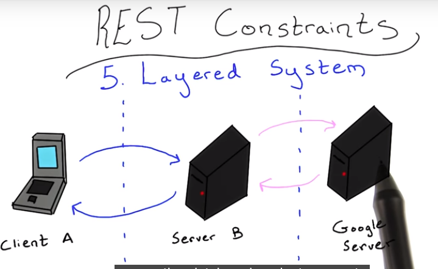
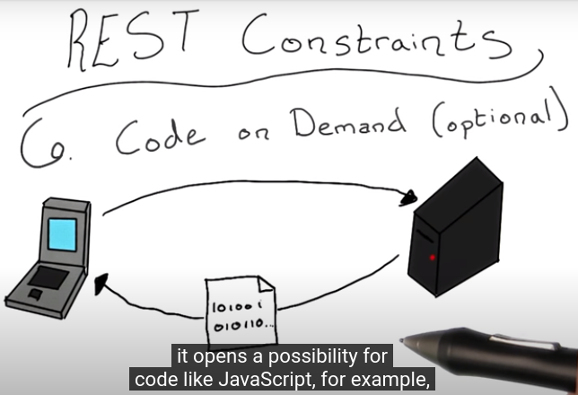

# LS1. What's and Why's of APIs
> Designing RESTful APIs  
> Writer: SungwookLE    
> DATE: '22.2/11   

## 1. APIs
- **Application Programming Interface**
    - 의미 그대로, 앱과 앱 사이의 프로그래밍 인터페이스를 의미
- API is a great way for controlling the exposure of code, allowing internal functionalities of an application to be used from the outside world without exposing all of the internal code.

1. **예시1**: 같은 machine 내부에서의 API 구성
    - OS운영시스템이 어플리케이션과 프로그래밍 입출력값을 주고 받음 (`import os`)
    

2. **예시2**: 서로 다른 machine 끼리 프로그램 입출력 값을 주고 받음
    - 기상/교통 정보를 가지고 있는 서버와 내 machine이 입출력값을 `web`환경(인터넷)을 통해 주고 받음
    
    - 이런 구조의 API를 **Web APIs**라고 부른다.

## 2. Web APIs
- How API's can enable communication between several machines?
    - through `Internet`
    - A machine can use multiple web APIs to create a new application

- Why is this important?
    - 개발단계에서 기능개발을 위해서도 중요하고
    - 자신의 비즈니스를 확장시키는 것에도 중요하다. (재사용성 및 ..)

## 3. Web API Protocols
- 다양한 머신(different os, specifications, data structures .. )들이 커뮤니케이션하기 위해선 동일한 규칙의 방법이 필요하다.
    - It is called `protocol`.
- 이러한 프로토콜의 하나로 `OSI model`이 있다.
- [Open System Interconnection(OSI)](https://en.wikipedia.org/wiki/OSI_model)

- OSI 모델의 프로토콜을 따라 어떤 메시지를 다른 machine으로 송신한다고 했을 때, 아래의 그림처럼 진행된다고 보면 된다.

    - `Application`은 실제 발송하고자 하는 메세지라고 보면 된다.
    - 이를 `Presentation, Session, Transport, Network, DataLink, Physical` 레이어 단계를 거치면서 계속 포장해나간다.
    - 최종적으로 `Physical`에 담긴 정보는 물리적으로 전압신호로 다른 외부로 송출되게 된다.
    - 송출된 정보를 수신하고자 할 때에는, OSI 레이어의 역순으로 데이터를 해체해서 받으면 된다.
    - 각 단계를 거치면 발송자의 Appication(message)를 확인할 수 있다.

- The most popular Application level protocol is `HTTP`(Hypertext Transfer Protocol)
    - HTTP 외에도 FTP, IMAP, POP, SSH 등이 존재한다.
    
- HTTP fuctions via a series of requests and responses between clients and servers respectively
    - HTTP protocol is the foundation of data communication for the World Wide Web

## 4. Web Service & Message Formatting Layer
- `Web API`에서의 프로토콜을 이해하기 위해서, `OSI model`의 Application Layer 위에 2개의 레이어(`Web Service, Message Formatting` Layers)를 추가하여 살펴보아야 도움이 된다.

1. Web Service Layer
    - Web Service Layer 중 유명한 것 중 하나가 `SOAP`
    

    - `REST`(REpresentational State Transfer) 매우 유명함
        - REST is more of a set of styles and guidelines than a protocol
        

2. Message Formatting Layer
    - These protocols focus mainly on the data structues that contain the information we want to communicate, 

    - 흔희 쓰는 방식은 `json`이나 `xml`일 것이다.
        - xml(eXtensible Markup Language): `HTML`과 매우 유사함
        
        - json(Java Script Object Notation): `python`의 `dict`와 동일
        

- 내가 구현하고자 하는 API의 특성에 따라, Web Service & Message Formatting 레이어의 구현 형태를 선택하면 된다.

### 4-1. Chossing the Right Technologies

1.  Web Service Layer

- 최근 `REST` 방식의 구현이 `SOAP`보다 많은데, `SOAP`보다 구현이 쉽기 때문이다.

2. Message Formatting Layer

- `json`이 `xml`을 많이 따라온 상황이고, 아무래도 `json`이 사람이 보기 더 편한 데이터 구조여서 그렇다.

## 5. Rest Constraints
- `REST`는 일종의 가이드라인이기 때문에, 제대로 `REST`를 구현하기 위해선 몇가지 constraints를 지켜주어야 한다.
    - [Video](https://classroom.udacity.com/courses/ud388/lessons/4594018829/concepts/52981798390923)
    - HTTP 프로토콜 위에서 제대로 동작되어야 하므로..

1. Client-Server

    - `Request` & `Response`
2. Stateless

    - `State`(상태)에 영향을 받지 않게
3. Cacheable

    - 받은 정보에서 변함이 없다면 또 받지 않게끔
4. Uniform Interface

    - 모든 machine에서 동일한 인터페이스 구성
5. Layered System

    - endpoint로 한번에 갈 수 없고 각 layer로 분리
6. Code on Demand(optional)

## 끝