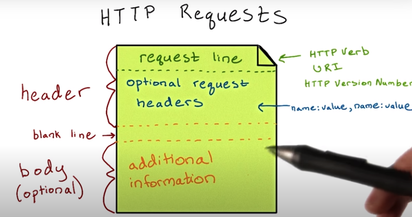

# LS2. Accessing Published APIs
> Designing RESTful APIs  
> Writer: SungwookLE    
> DATE: '22.2/11   

## 1. HTTP 이해하기
- `REST` 이해를 위해 `HTTP`를 알아보자 

1. `HTTP` *client-server* 플로우

    - 클라이언트가 서버에 요청하면 Response로 다양한 형태의 데이터를 받을 수 있다.

2. `HTTP` requests는 아래와 같이 구성된다.

    - 예시:
    

3. `HTTP` Response

    - 예시:
    

## 2. 실습1: Request & Response using `postman`

- `postman`이라는 크롭 확장프로그램을 이용하여 간단하게 HTTP request를 보내고 response를 받아보자.

1. [코드](./img/api_server.py)를 `python` 으로 실행하여 localhost 서버를 열어두고,

2. `postman`을 실행시켜 나의 서버 'url'에 method와 함께 요청을 보내면, response가 날라오는 것을 확인할 수 있다.

- `HTTP`와 `CRUD` 사이의 관계

|HTTP|CRUD|
|----|----|
|GET|READ|
|POST|CREATE|
|PUT|UPDATE/CREATE|
|PATCH|UPDATE|
|DELETE|DELETE|

## 3. 실습2: google map API Request & Response using `postman`

- `google map API`를 이용하여 `request`와 `response`를 주고받자.

1. google cloud platform 가입
    - 가입을 해야, Google Maps API key를 준다.
2. 계정정보에서 `API키`를 저장해둔다.

3. [공식 튜토리얼](https://developers.google.com/maps/documentation/geocoding/overview)을 따라 `Google Maps Geocoding API`를 사용한다.
4. `request` 보내고, `response` 받기
    - [해당 튜토리얼](https://developers.google.com/maps/documentation/geocoding/web-service-best-practices) 을 살펴보면, request [방법](./img/2022-02-11-20-53-28.png)이 나오는데, 아래의 코드를 복사하여 postman 프로그램에 입력하여 `request`를 보냈다.
    - 실행결과:
    

5. 사용법보다 더 중요한건, google map API도 REST로 이루어졌다는 것인데, stateless한 url(`geocode/address=Los Angeles California, USA`)에 요청을 하면 `json` 형태로 response가 날라왔다.

## 4. 실습3: google map API Request & Response using `python`

- [구글맵API튜토리얼](https://developers.google.com/maps/)
- `python` 프로그램에선 아래와 같이 `http` request & response를 하면된다.
    - 패키지 `httplib2, json`을 이용 
    - google API url을 입력해주고, 생성한 `h`라는 http 객체에 `request`를 보내 return 값으로 `response`와 `content`를 받는다.
    - `content`는 `json` 포맷으로 변환하여 최종적으로 `python` 코드에 return한다.
    
    - 실행결과
    

## 5. 실습4: `google map API` 와 `foursquares API`를 활용한 Mashup 프로젝트 in `python`

- `foursquare API` 사용시 참고
    - `foursquare` API가 회원가입시, 200달러 토큰 주고, 한번 `API` 호출할 때마다 0.01$ 정도 나가니, 아껴서 사용 ㅠ 
    - 회원가입시 받은 credit이 모두 소진되면 유료로 전환하거나, 회원가입을 다시 해서 하면됩니다.
    - 중요한 것이, 해당 강의에서는 `foursquare` **v2**를 기준으로 진행하는데 찾아보니, **v2**는 서비스가 종료되었고 **v3**을 사용하여야 함.
    - `http` 호출할때 url 주소와 파라미터값에 차이가 있으니 참고 아래의 튜토리얼 참고 (다행인것은 튜토리얼이 잘되어 있다.)
    - [포스퀘어 place API 튜토리얼](https://developer.foursquare.com/docs/places-api-overview)

- Input: `mealType`, `location`
- 프로젝트 구성: `mealType`과 `location`을 입력하면 location 주변의 mealType을 갖는 식당의 이름, 주소, 대표사진을 리턴해줌
    - 실행결과: `findeARestaurant.py` 코드를 실행하면, 아래와 같이 주변의 식당값을 반환해준다.
    - 코드: [findARestautant.py](./img/findARestaurant.py), [geocode.py](./img/geocode.py)
    

    1. google API를 이용하여 `inputString`을 입력하면 `latitude`, `longitude`를 리턴
    2. return 받은 `latitude`와 `longitude`를 기준으로 주변의 `mealType`의 식당을 검색
    3. 주변의 식당값이 return되면, return 값을 기준으로 값(이름, 주소, 대표사진)을 추출

## 끝
