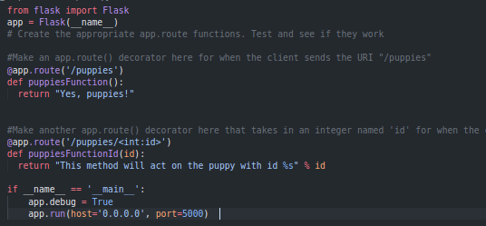
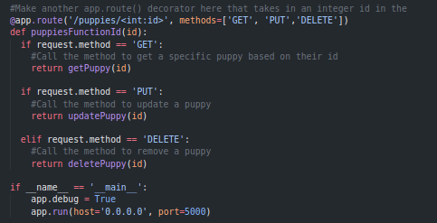
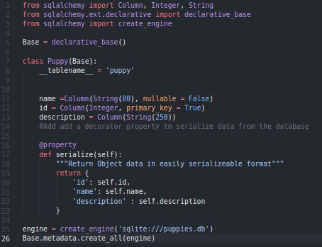
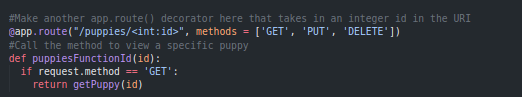
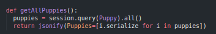
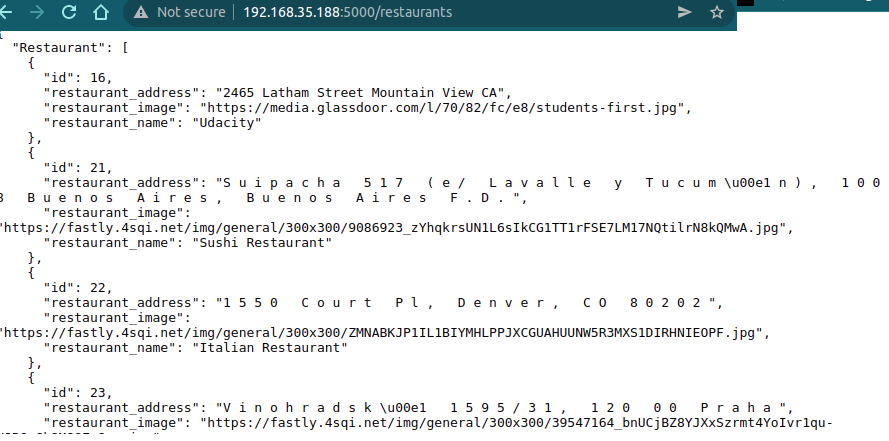

# LS3. Creating your own API endpoints
> Designing RESTful APIs  
> Writer: SungwookLE    
> DATE: '22.2/12   

## 1. Flask 사용하기: 기본

- 파이썬 기반의 마이크로 웹 프레임워크
    - 간단한 웹 또는 API 서버를 만드는 데 사용
    - [공식 튜토리얼](https://flask.palletsprojects.com/en/1.0.x/quickstart/)

- 기본적인 사용 형태
    1. main이 되는 app을 선언하고, `@app.route` 형태의 `decorator`를 사용하여 url 경로를 추가한다.
    

    2. 코드를 실행하면, API 서버가 작동한다.
    3. API 서버와 `request, response` 하는 형태는 아래와 같다.
        ```python
        address = 'http://localhost:5000'
        url = address + "/puppies"
        h = httplib2.Http()
        response, result = h.request(url, "GET")
        ```
## 2. Flask 사용하기: method 추가

- `flask`에서 `method: GET, POST, PUT, DELETE`를 추가하고 싶을 땐, `decorator`에서 지정해주면 된다.
 

## 3. Flask 사용하기: `sqlalchemy DB` 추가

- `sqlalchemy` 패키지를 이용하여, 즉석으로 db를 생성하고, 생성한 db에 데이터를 가져오고 업데이트 해보자.

    - View the [starter code](https://github.com/udacity/APIs/tree/master/Lesson_3/05_Serializing%20data%20from%20the%20database/Starter%20Code) for this exercise.
    - View the [solution code](https://github.com/udacity/APIs/tree/master/Lesson_3/05_Serializing%20data%20from%20the%20database/Solution%20Code) for this exercise.


1. datadb class 설계하고 `serialize` method 설계 
    

2. http 요청으로 데이터를 request 할때, 출력의 형태를 `jsonify` 함수를 이용. 
    - `jsonify` 하기 위해 `serialize` method 설계 필요한 것이었다.




- `python` 코드에서 `@property`가 나오는데, 해당 기능은 이번에 알았는데, `getter` method로 변환시켜주는 기능을 부여한다고 한다. 
    - `python`의 class들은 원칙적으로 `private`, `public` 변수 분리가 안되서, `private`로 따로 지정할 수 없기 때문에 생기는 클래스 변수 오용/오염 문제가 있는데, 이를 코딩 가이던스로서 해결하고자 해당 기능이 있다고 함
    - [코드잇: @property설명](https://blog.naver.com/codeitofficial/221684462326)


## 4. Flask 사용하기: `google API` + `foursquare API` + `sqlalchemy DB` 연동


- `flask`로 웹 API 서버를 열어두고, 유저로부터 요청이 오면, 요청에 따라 레스토랑의 정보를 불러오고, 입력하고, 업데이트하고, 삭제하는 (`CRUD, Create, Read, Update, Delete`) 하는 프로젝트
- 실습 코드(직접 프로그래밍): [findARestaurant.py](./img/findARestaurant.py), [geocode.py](./img/geocode.py), [models.py](./img/models.py), [views.py](./img/views.py), [tester.py](./img/tester.py)
    - views.py 는 웹API 서버를 열어주는 코드
    - models.py 는 DB의 구조를 선언한 코드
    - tester.py 는 테스트 코드

- `sqlalchemy`를 활용하여 DB를 만들고 업데이트하고 입력해주었다.
- 실행결과:
    


## 끝

