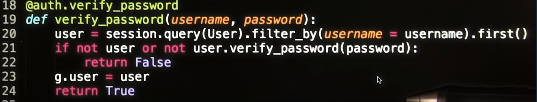
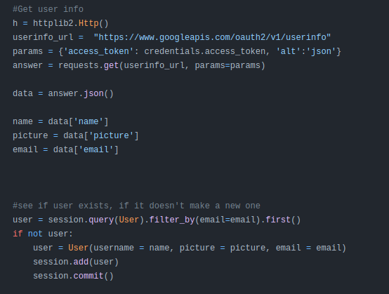
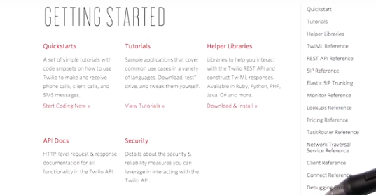
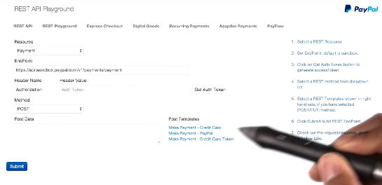
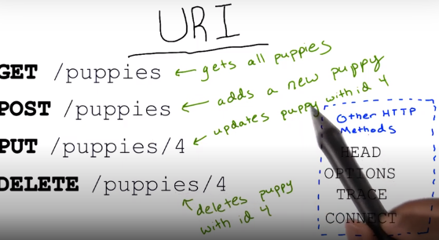

# LS4&LS5. Securing your API, Writing Developer-Friendly APIs
> Designing RESTful APIs  
> Writer: SungwookLE    
> DATE: '22.2/16

## 1. Adding Users and Logins
- 유저 계정의 비밀번호를 저장하고 확인할 때, `HASH`기반의 암호화가 필요하다.

- 이 때, 사용할 수 있는 것이 `passlib`이다.
- [passlib 패키지](http://passlib.readthedocs.io/en/stable/lib/passlib.ifc.html#passlib.ifc.PasswordHash.hash)

- `flask`에서는 로그인 정보 보안을 위해 `@auth.login_required` 방식의 데코레이터가 존재하며, `from flask_httpauth import HTTPBasicAuth` 패키지 가져와서 사용할 수 있다.

    - [the flask_httpauth docu](https://flask-httpauth.readthedocs.io/en/latest/)

- 실습 프로젝트
    - [실습코드](https://github.com/udacity/APIs/tree/master/Lesson_4/05_Mom%20%26%20Pop%E2%80%99s%20Bagel%20Shop/Solution%20Code)
    - 실행결과: 유저의 계정 정보(아이디,비번)을 제대로 입력해야 `bagels` 데이터에 접근할 수 있게 인증 절차가 작동한다.

## 2. Implementing Token Based Authentication in `Flask`

- 실습 프로젝트
    - [코드](https://github.com/udacity/APIs/tree/master/Lesson_4/08%20_Regal%20Tree%20Foods/Solution%20Code)
- HTTP와 HTTPS 차이
    - [HTTP와 HTTPS 차이점](https://brunch.co.kr/@hyoi0303/10)

## 3. OAuth 2.0

- 구글 Oauth API가 대표적인데, 구글의 로그인 DB에 접속해서, 구글 계정의 정보를 연동하고, 허용된 데이터를 액세스할 수 있게 해줌
- [구글OAuth2.0 공식 튜토리얼](https://developers.google.com/identity/protocols/oauth2)
- 실습 프로젝트
    - [코드](https://github.com/udacity/APIs/tree/master/Lesson_4/11_Pale%20Kale%20Ocean%20Eats/Solution%20Code)

## 4. Rate Limiting

- API나 서버에 대한 client의 request 속도를 제한시키는 것
- 실습 프로젝트
    - [코드](https://github.com/udacity/APIs/tree/master/Lesson_4/13_BargainMart/Solution%20Code)

## 5. Developer Friendly API

1. API documentation을 작성하라

2. Using Proper URIs

- REST하게 API URI를 `naming` 하라.

3. Versioning API
- 예를들어
    - `GET /api/v1/puppies`
    - `GET /api/v2/puppies`

4. Communicating With Developers

5. Learning From The Best

## 끝