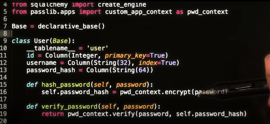
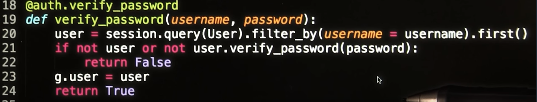

# LS4. Securing your API
> Designing RESTful APIs  
> Writer: SungwookLE    
> DATE: '22.2/16

## 1. Adding Users and Logins
- 유저 계정의 비밀번호를 저장하고 확인할 때, `HASH`기반의 암호화가 필요하다.

- 이 때, 사용할 수 있는 것이 `passlib`이다.
- [passlib 패키지](http://passlib.readthedocs.io/en/stable/lib/passlib.ifc.html#passlib.ifc.PasswordHash.hash)

- `flask`에서는 로그인 정보 보안을 위해 `@auth.login_required` 방식의 데코레이터가 존재하며, `from flask_httpauth import HTTPBasicAuth` 패키지 가져와서 사용할 수 있다.

    - [the flask_httpauth docu](https://flask-httpauth.readthedocs.io/en/latest/)

- 실습해보기
    - [실습코드](https://github.com/udacity/APIs/tree/master/Lesson_4/05_Mom%20%26%20Pop%E2%80%99s%20Bagel%20Shop/Solution%20Code)
    - 실행결과: 유저의 계정 정보(아이디,비번)을 제대로 입력해야 `bagels` 데이터에 접근할 수 있게 인증 절차가 작동한다.

## LS4의 6강부터 듣기