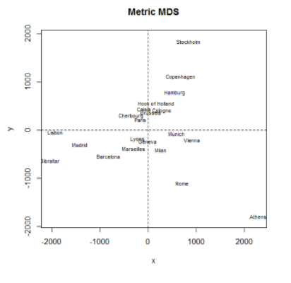
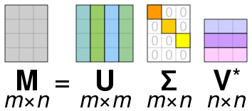
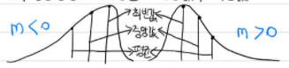
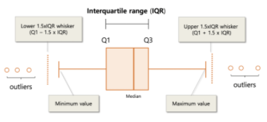
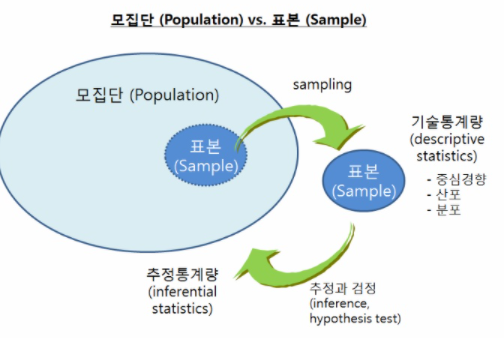
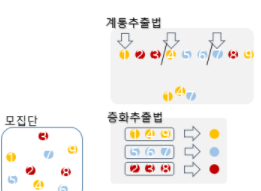
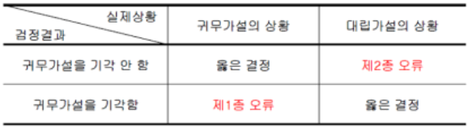

# 빅데이터분석기사 준비: 필기편
> Writer: SungwookLE    
> DATE: '22.3/30  
> REFERENCE: [노트정리 블로그 참고용](https://eatchu.tistory.com/6)

## 1. 빅데이터 분석 기획
### 1. 빅데이터의 이해
- 데이터의 유형
    - 정성적 데이터(qualitative): 언어, 문자 등 주로 주관적, 비정형 데이터 (Unstructured Data) 
    - 정량적 데이터(qualititative): 수치, 도형, 기호 등 주로 객관적, 정형, 반정형 데이터(Structured, Semi-structured)

- 데이터 유형(구조적 관점)
    - 정형(Structured): RDB, CSV 등
    - 반정형(Semi-Structured): JSON, XML, HTML 등
    - 비정형(Unstructured): 동영상, 이미지, 오디오 등

- **데이터 기반 지식 구분**
    - 지식창조 메커니즘
        - 
    - DIKW 피라미드
        - 

- 빅데이터 특징
    - 3V: Volume(대용량), Variety(다양화), Velocity(고속화)
    - 5V: $+$ Veracity(품질), Value(가치)

- **빅데이터 위기요인 및 통제 방안**
    - 사생활 침해 가능성: 개인정보 데이터를 목적 외에 사용
        - 제공자의 '동의'에서 사용자의 '책임'으로
    - 책임원칙 훼손 가능성: 예측 알고리즘의 희생양이 됨
        - 결과기반 책임원칙 고수
    - 데이터 오용 가능성: 잘못된 지표 사용 등
        - 알고리즘 접근 허용 (알고리즈미스트: 알고리즘 해석)

- 데이터 분석조직의 구조
    - 

- 데이터베이스의 활용
    1. OLTP(Online Transaction Processing)
        - 데이터베이스의 데이터를 수시로 갱신하는 프로세싱을 말함
        - 현재의 데이터
        - 데이터 액세스 빈도 높음, 빠름

    2. OLAP(Online Analytical Processing)
        - OLTP에서 처리된 데이터를 분석해 추가 정보를 프로세싱하는 것을 말함
        - 데이터를 읽어와 분석 정보 생산

- 빅데이터 처리 과정
    - 데이터(생성) $\rightarrow$ 수집(ETL) $\rightarrow$ 저장(공유) $\rightarrow$ 처리 $\rightarrow$ 분석 $\rightarrow$ 시각화
    - ETL: 추출Extract / 변환Transform / 저장Load

- 빅데이터 저장
    - 전통적인 RDBMS(관계형 데이터베이스): `mysql`이 대표적
        - 행과 열로 이루어진 데이터베이스로 `foreign key` 관계 정보를 이용하여 데이터간의 관계정보 구축
        - sql 쿼리문을 이용하여 데이터를 취급
        - ACID의 특징을 갖는다.
            1. Atomicity(원자성): 트랜잭션은 실행되다가 중단되지 않음 
            2. Consistency(일관성): 트랜잭션 수행 후에도 도메인 유효범위, 무결성 제약조건 등을 위배하지 않음
            3. Isolation(독립성): 트랜잭션 수행 시 다른 트랜잭션 연산은 끼어들 수 없음 
            4. Durability(지속성): 성공한 트랜잭션은 영원히 반영되어야함
        
    - NoSQL(Not-only SQL): `mongoDB` 대표적
        - JSON 타입의 데이터 (key: dictation)를 저장할 수 있음
        - SQL을 사용하지 않고, 별도의 API를 통해 데이터를 취급
        - 기존의 RDBMS의 특징인 ACID를 포기하는 대신, 최신성과 유연성, 확장성을 강조

        - NoSQL의 데이터 모델
            1. 키-값(key-value) 데이터베이스
            2. 칼럼기반(column-oriented) 데이터베이스
            3. 문서기반(document-oriented) 데이터베이스
    
    - 그 외 참고

        - 공유 데이터 시스템(Shared-data System)
            - 어떤 DB시스템이든 간에, 일관성, 가용성(Availability), 분할 내성(Partition Tolerance) 중에서 최대 두개의 속성만 보유할 수 있다. (CAP 이론)
            - 3개 속성을 동시에 가질 수 없다는 의미로, 최근에는 NoSQL을 활용하여 Availability, Partition Tolerance를 취하여 높은 성능과 확장성을 제공하는 DB 시스템을 개발하는 추세
            - RDBMS는 일관성, 가용성을 모두 취하는 방식으로 확장성이 떨어짐

        - 분산 파일 시스템
            - 데이터를 분산하여 저장하면, 데이터 추출 및 가공 시 빠르게 처리 가능
            - HDFS(Hadoop Distributed File System), 아마존 S3 파일 시스템이 대표적

- 빅데이터 처리 기술
    - 분산 병렬 컴퓨팅 시 고려사항
        1. 전체 작업의 배분 문제
        2. 각 프로세서의 중간 계산 값을 주고받는 문제
        3. 서로 다른 프로세서 간 동기화 문제
    - 하둡
        - 분산 처리 환경에서 대용량 데이터 처리 및 분석을 지원하는 오픈 소스 프레임워크
    - 아파치 스파크
        - 실시간 분산형 컴퓨팅 플랫폼, 빠르다.
    - 맵리듀스
        - 구글에서 개발, 방대한 데이터를 신속하게 처리하는 모델, 효과적인 병렬 및 분산 처리 지원
    - 

### 2. 데이터분석 계획
    
- 분석의 기획
    - 
    - 예를 들어, 분석 대상의 정의는 불분명하지만, 다른 분야에서 사용하던 분석방법을 가지고 적용해보았을 때, 문제에 대한 Insight를 얻을 수 있다.
    - 분석 대상에 대한 정의와 분석 방법을 알고 있을 땐, 분석 방법에 대한 Optimization을 진행해야 한다.

- 하향식 접근법(Top Down)
- 상향식 접근법(Bottom Up)

- 데이터 분석방법론
    - 일반적 분석 방법론 절차: 분석기획 $\rightarrow$ 데이터준비 $\rightarrow$ 데이터분석 $\rightarrow$ 시스템구현 $\rightarrow$ 평가전개

- KDD 분석 방법론
    - Knowledge Discovery in Database, 통계적인 패턴이나 지식을 탐색하는 데 활용할 수 있도록 체계적으로 정리한 데이터 마이닝 프로세스
    - 데이터셋 선택 $\rightarrow$ 데이터전처리 $\rightarrow$ 데이터변환 $\rightarrow$ 데이터마이닝 $\rightarrow$ 데이터마이닝 결과 평가

- CRISP-DM 분석 방법론
    - Cross Industry Standard Process for Data Mining, 계측적 프로세스 모델의 데이터 마이닝 프로세스
    - 업무 이해 $\rightarrow$ 데이터 이해 $\rightarrow$ 데이터 준비 $\rightarrow$ 모델링 $\rightarrow$ 평가 $\rightarrow$ 전개
    - 

- SEMMA 분석 방법론
    - Sample, Explore, Modify, Model and Assess, 기술과 통계 중심의 데이터 마이닝 프로세스
    - 추출 $\rightarrow$ 탐색 $\rightarrow$ 수정 $\rightarrow$ 모델링 $\rightarrow$ 평가

### 3. 데이터 수집 및 저장 계획

- 데이터 보안 적용 기술
    - 사용자 인증, 접근제어, 암호화, 개인정보비식별화, 개인정보암호화

- 비식별화 기술
    - 가명처리: 다른값 대체 (휴리스틱익명화, 암호화, 교환방법)
    - 총계처리(Aggregation): 통계값 적용 (총합처리, 부분총계)
    - 데이터 삭제: 특정값 삭제 (식별자 삭제)
    - 범주화: 랜덤 라운딩(올림), 범위 처리, 대표값 및 구간값 변환
    - 마스킹: 특정값 가리기

- 프라이버시모델 추론 방지 기술
    - K-익명성: 일정확률 수준 이상 비식별 조치
        - 동일한 값을 가진 레코드를 k개 이상으로 하기
    - L-다양성: 민감한 정보의 다양성을 높여 추론 가능성을 낮추는 기법
        - 각 레코드는 최소 l 개 이상의 다양성을 가지게 그룹핑
    - T-근접성: 민감한 정보의 분포를 낮추어 추론 가능성을 찾추는 것
        - 전체 데이터 집합의 정보 분포와 특정 정보의 분포 차이를 t이하로 하여 추론 방지

## 2. 빅데이터 탐색

### 1. 데이터전처리
- 결측치(NULL, Missing Data)
    - 결측데이터 유형
        1. 완전 무작위 결측(MCAR: Missing Completely At Random): 아무 연관 X
        2. 무작위 결측(MAR: Missing At Random): 영향은 받지만, 연관 X
        3. 비 무작위(NMAR: Not Missing At Random): 연관 있음, 예를 들어 몸무게가 많이 나가는 사람의 몸무게 데이터는 결측되기 쉽다.
    - 결측데이터 처리
        1. 단순대치법
            - 단순삭제, 평균대치, 회귀대치법, 단순확률 대치법, 최근접 대치법
        2. 다중대치법
            - 단순대치법을 m번 수행
        
- 데이터 이상값 처리(Outlier)
    - 이상치 판별
        - 사분위수, 정규분포, 군집화 등
    - 이상치 처리
        - 결측처리: 존재할 수 없는 값 제거
        - 극단치 기준 이용: 사분위수 적용하여 제거
        - 극단값 절단, 조정

- 데이터 통합
    1. 스키마 통합과 개체의 매칭
    2. 데이터 중복
    3. 하나의 속성에 대해 여러 상충되는 값

- 데이터 축소
- 데이터 변환
    1. 데이터 형식 및 구조 변환
    2. 데이터 스케일링
        - 표준화: Z-score($\mu=0, \sigma=1$, 평균0, 표준편차1)
        - 정규화: min-max scaling
    3. 평활화
        - 데이터를 매끄럽게 처리(구간화/군집화)
    4. 비정형데이터 변환

- 변수 선택
    1. 필터방법: 데이터의 통계적 특성을 활용해 변수 선택
        - 0에 가까운 분산 / 큰 상관계수의 변수 제거
    2. 래퍼방법: 변수의 일부를 사용해 모델링 수행
        - 전진선택/후진제거/단계별 선택 등

- 차원 축소
    - 다차원 척도법(MDS, Multidimensional scaling): 변수 값을 scaling  하여 척도를 균등하게 한 후, 2차원 공간상  에 점으로 표현하여 유사성/비유사성 분석(군집분석 방법과 유사)
    
    - 주성분 분석(PCA, Principal component analysis)
    - 요인분석(Factor Analysis)
        - 기술 통계 정보를 활용하여 변수간의 상관관계 파악
    - 특이값분해(SVD, Singular Value Decomposition)
        - $M=U\Sigma V^t$
        - $(m*n)=(m*m)(m*n)(n*n)$
        - 

- 파생변수
- 변수변환
    - 변수구간화방법
        - Binning: 연속형 $\rightarrow$ 범주형 변환
        - Decision Tree: 분리기준 사용
    - 더미 변수 (예, to_categorical)
    - 정규분포화: 로그변환, 제곱근변환
- 불균형데이터처리
    - 오버샘플링: 적은 클래스의 데이터를 많이 추출되도록 반복 샘플링
    - 언더샘플링: 많은 클래스의 데이터를 적게 추출되도록 샘플랭

### 2. 데이터 탐색
- 탐색적 데이터 분석(EDA, Exploratory Data Analysis)
    - 데이터 시각화 및 데이터 통계 정보 등 다양한 방법을 통해 feature 분석
- 기초통계량의 의해
    1. 중심 경향도: 평균(mean), 중앙값(median), 최빈값(mode)
    
        - m<0: skewness 음수
            - 왜곡(skewness)가 음수인 경우는 평균<중앙값<최빈값
            - Negative skewness를 제거하기 위해서는 데이터에 $ln(x)$ 연산을 통해 skewness를 해소할 수 있다.
        - m>0: skewness 양수
            - skewness가 양수인 경우는 평균>중앙값>최빈값
            - Positive skewness를 제거하기 위해서는 $x^2$ 연산을 통해 skewness를 해소할 수 있다.

    2. 산포도: 범위, 분산, 표준편차, 사분위수
        - 모분산: $\sigma^2=\frac{1}{N}\Sigma^N_{i=1}(x_i-\mu)^2$
        - 모표준편차: $\sigma$
        - 표본분산: $s^2=\frac{1}{n-1}\Sigma^n_{i=1}(x_i-\bar{x})^2$
        - 표본표준편차: $s$
            - 분모의 $\frac{1}{n-1}$은 표본의 개수가 적어서 생기는 문제를 보상하기 위한 보상식이다.

    3. 자료분포의 비대칭도
        - Skewness(왜도): 중심값이 좌우로 치우친 정도
        - Kurtosis(첨도): 중심값이 뾰족한 정도  

- 데이터 시각화
    - 막대그래프, 원그래프, 도수분포표(Frequency Table, 빈도), 히스토그램, 줄기잎그림, 산점도, 상자그림(box plot) 등..
    - box plot
        - 

- 상관관계 분석
    - 상관분석(Correlation Analysis)
        - 산점도, 공분산, 상관계수로 선형관계 파악
        - 공분산(covariance): 두 변수의 공통분포를 나타내는 분산
            - $Cov(X,Y)=E[(x-\mu_x)(y-\mu_y)]$
    - 상관계수
        |상관계수|피어슨|스피어만|
        |--|--|--|
        |변수|등간, 비율|서열자료|
        |계수|$\rho=\frac{Cov(x,y)}{\sigma_x\sigma_y}$|-|

### 3. 통계기법의 이해

- 기본용어
    - 
        - 모집단(population): 표본조사에서 조사하고자 하는 대상 집단 전체
        - 원소(element): 모집단을 구성하는 개체
        - 표본(sample): 조사하기 위해 뽑은 모집단의 일부
        - 모수(parameter): 표본을 통해 구하고자 하는 모집단에 대한 정보
- 표본추출 방법
    1. 확률표본추출법
        - 단순무작위 추출법
        - 계통추출(Systematic Sampling)
            - Sampling Interval을 설정하여 간격 사이에서 무작위로 추출하는 방법이다.
        - 층화추출법(Stratification Sampling)
            - 클래스 라벨의 비율을 균등하게 샘플링
        
        - 군집추출
    2. 비확률추출법
        - 편의(간편)표본추출
        - 판단추출법
        - 눈덩이추출법(Snowball Sampling)
            - 사람을 타고 타고 들어가서 표본을 선정
            - 지인의 지인..

- 이산형확률분포
    - 베르누이확률분포, 이항분포, 기하분포, 다항분포, 포아송분포(단위 시간 안에 어떤 사건이 몇 번 발생할 것인지를 표현)
- 연속형확률분포
    - 균일분포, 정규분포, 지수분포, t-분포, 카이제곱분포, F-분포

- 중심극한정리
    - 표본이 크면 분포와 상관없이 정규분포를 따름

- 점추정(Point Estimate)
    - 불편성(Unbiasedness)
    - 효율성: 추정량 중에서 최소의 분산을 가진 추정량이 가장 효율적이다.
    - 일치성, 충분성 ...

- 구간추정

- 가설검정(검정: Test)

    - 귀무가설(Null Hypothesis, $H_0$)
    - 대립가설(Alternative Hypothesis, $H_1$)
    - 유의수준$\alpha$(significance level)
        - 
    - 가설검정의 유의수준은 귀무가설이 참인데도 이것을 기각하게 될 확률을 말한다. 일반적으로 1%, 5%, 10% 등을 쓴다.
    - p-value가 유의수준보다 낮으면 대립가설을 채택하게 된다.
    

## 3. 빅데이터 모델링
### 1. 분석모형설계