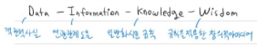
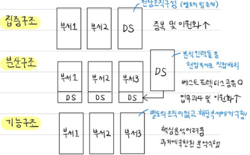
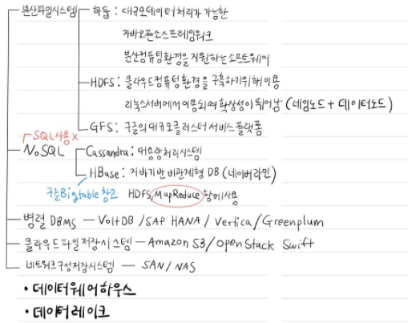
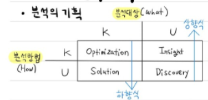
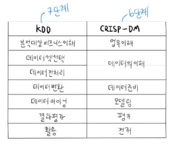

# 빅데이터분석기사 준비(1)
> 빅데이터분석기사 필기 준비
> Writer: SungwookLE    
> DATE: '22.3/30  
> REFERENCE: [노트정리 블로그 참고용](https://eatchu.tistory.com/6)

## 1. 빅데이터 분석 기획
### 1. 빅데이터의 이해
- 데이터의 유형
    - 정성적 데이터(qualitative): 언어, 문자 등 주로 주관적, 비정형 데이터 (Unstructured Data) 
    - 정량적 데이터(qualititative): 수치, 도형, 기호 등 주로 객관적, 정형, 반정형 데이터(Structured, Semi-structured)

- 데이터 유형(구조적 관점)
    - 정형(Structured): RDB, CSV 등
    - 반정형(Semi-Structured): JSON, XML, HTML 등
    - 비정형(Unstructured): 동영상, 이미지, 오디오 등

- **데이터 기반 지식 구분**
    - 지식창조 메커니즘
        - 
    - DIKW 피라미드
        - 

- 빅데이터 특징
    - 3V: Volume(대용량), Variety(다양화), Velocity(고속화)
    - 5V: $+$ Veracity(품질), Value(가치)

- **빅데이터 위기요인 및 통제 방안**
    - 사생활 침해 가능성: 개인정보 데이터를 목적 외에 사용
        - 제공자의 '동의'에서 사용자의 '책임'으로
    - 책임원칙 훼손 가능성: 예측 알고리즘의 희생양이 됨
        - 결과기반 책임원칙 고수
    - 데이터 오용 가능성: 잘못된 지표 사용 등
        - 알고리즘 접근 허용 (알고리즈미스트: 알고리즘 해석)

- 데이터 분석조직의 구조
    - 

- 데이터베이스의 활용
    1. OLTP(Online Transaction Processing)
        - 데이터베이스의 데이터를 수시로 갱신하는 프로세싱을 말함
        - 현재의 데이터
        - 데이터 액세스 빈도 높음, 빠름

    2. OLAP(Online Analytical Processing)
        - OLTP에서 처리된 데이터를 분석해 추가 정보를 프로세싱하는 것을 말함
        - 데이터를 읽어와 분석 정보 생산

- 빅데이터 처리 과정
    - 데이터(생성) $\rightarrow$ 수집(ETL) $\rightarrow$ 저장(공유) $\rightarrow$ 처리 $\rightarrow$ 분석 $\rightarrow$ 시각화
    - ETL: 추출Extract / 변환Transform / 저장Load

- 빅데이터 저장
    - 전통적인 RDBMS(관계형 데이터베이스): `mysql`이 대표적
        - 행과 열로 이루어진 데이터베이스로 `foreign key` 관계 정보를 이용하여 데이터간의 관계정보 구축
        - sql 쿼리문을 이용하여 데이터를 취급
        - ACID의 특징을 갖는다.
            1. Atomicity(원자성): 트랜잭션은 실행되다가 중단되지 않음 
            2. Consistency(일관성): 트랜잭션 수행 후에도 도메인 유효범위, 무결성 제약조건 등을 위배하지 않음
            3. Isolation(독립성): 트랜잭션 수행 시 다른 트랜잭션 연산은 끼어들 수 없음 
            4. Durability(지속성): 성공한 트랜잭션은 영원히 반영되어야함
        
    - NoSQL(Not-only SQL): `mongoDB` 대표적
        - JSON 타입의 데이터 (key: dictation)를 저장할 수 있음
        - SQL을 사용하지 않고, 별도의 API를 통해 데이터를 취급
        - 기존의 RDBMS의 특징인 ACID를 포기하는 대신, 최신성과 유연성, 확장성을 강조

        - NoSQL의 데이터 모델
            1. 키-값(key-value) 데이터베이스
            2. 칼럼기반(column-oriented) 데이터베이스
            3. 문서기반(document-oriented) 데이터베이스
    
    - 그 외 참고

        - 공유 데이터 시스템(Shared-data System)
            - 어떤 DB시스템이든 간에, 일관성, 가용성(Availability), 분할 내성(Partition Tolerance) 중에서 최대 두개의 속성만 보유할 수 있다. (CAP 이론)
            - 3개 속성을 동시에 가질 수 없다는 의미로, 최근에는 NoSQL을 활용하여 Availability, Partition Tolerance를 취하여 높은 성능과 확장성을 제공하는 DB 시스템을 개발하는 추세
            - RDBMS는 일관성, 가용성을 모두 취하는 방식으로 확장성이 떨어짐

        - 분산 파일 시스템
            - 데이터를 분산하여 저장하면, 데이터 추출 및 가공 시 빠르게 처리 가능
            - HDFS(Hadoop Distributed File System), 아마존 S3 파일 시스템이 대표적

- 빅데이터 처리 기술
    - 분산 병렬 컴퓨팅 시 고려사항
        1. 전체 작업의 배분 문제
        2. 각 프로세서의 중간 계산 값을 주고받는 문제
        3. 서로 다른 프로세서 간 동기화 문제
    - 하둡
        - 분산 처리 환경에서 대용량 데이터 처리 및 분석을 지원하는 오픈 소스 프레임워크
    - 아파치 스파크
        - 실시간 분산형 컴퓨팅 플랫폼, 빠르다.
    - 맵리듀스
        - 구글에서 개발, 방대한 데이터를 신속하게 처리하는 모델, 효과적인 병렬 및 분산 처리 지원
    - 

### 2. 데이터분석 계획
    
- 분석의 기획
    - 
    - 예를 들어, 분석 대상의 정의는 불분명하지만, 다른 분야에서 사용하던 분석방법을 가지고 적용해보았을 때, 문제에 대한 Insight를 얻을 수 있다.
    - 분석 대상에 대한 정의와 분석 방법을 알고 있을 땐, 분석 방법에 대한 Optimization을 진행해야 한다.

- 하향식 접근법(Top Down)
- 상향식 접근법(Bottom Up)

- 데이터 분석방법론
    - 일반적 분석 방법론 절차: 분석기획 $\rightarrow$ 데이터준비 $\rightarrow$ 데이터분석 $\rightarrow$ 시스템구현 $\rightarrow$ 평가전개

- KDD 분석 방법론
    - Knowledge Discovery in Database, 통계적인 패턴이나 지식을 탐색하는 데 활용할 수 있도록 체계적으로 정리한 데이터 마이닝 프로세스
    - 데이터셋 선택 $\rightarrow$ 데이터전처리 $\rightarrow$ 데이터변환 $\rightarrow$ 데이터마이닝 $\rightarrow$ 데이터마이닝 결과 평가

- CRISP-DM 분석 방법론
    - Cross Industry Standard Process for Data Mining, 계측적 프로세스 모델의 데이터 마이닝 프로세스
    - 업무 이해 $\rightarrow$ 데이터 이해 $\rightarrow$ 데이터 준비 $\rightarrow$ 모델링 $\rightarrow$ 평가 $\rightarrow$ 전개
    - 

- SEMMA 분석 방법론
    - Sample, Explore, Modify, Model and Assess, 기술과 통계 중심의 데이터 마이닝 프로세스
    - 추출 $\rightarrow$ 탐색 $\rightarrow$ 수정 $\rightarrow$ 모델링 $\rightarrow$ 평가

## 3. 데이터 수집 및 저장 계획

- 데이터 보안 적용 기술
    - 사용자 인증, 접근제어, 암호화, 개인정보비식별화, 개인정보암호화

- 비식별화 기술
    - 가명처리: 다른값 대체 (휴리스틱익명화, 암호화, 교환방법)
    - 총계처리(Aggregation): 통계값 적용 (총합처리, 부분총계)
    - 데이터 삭제: 특정값 삭제 (식별자 삭제)
    - 범주화: 랜덤 라운딩(올림), 범위 처리, 대표값 및 구간값 변환
    - 마스킹: 특정값 가리기

- 프라이버시모델 추론 방지 기술
    - K-익명성: 일정확률 수준 이상 비식별 조치
        - 동일한 값을 가진 레코드를 k개 이상으로 하기
    - L-다양성: 민감한 정보의 다양성을 높여 추론 가능성을 낮추는 기법
        - 각 레코드는 최소 l 개 이상의 다양성을 가지게 그룹핑
    - T-근접성: 민감한 정보의 분포를 낮추어 추론 가능성을 찾추는 것
        - 전체 데이터 집합의 정보 분포와 특정 정보의 분포 차이를 t이하로 하여 추론 방지

