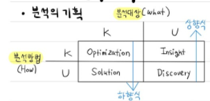

# 빅데이터분석 (1)
> Writer: SungwookLE    
> DATE: '22.3/30  

## 1. 빅데이터 분석 기획
### 1. 빅데이터의 이해
- 데이터의 유형
    - 정성적 데이터(Qualitative): 언어, 문자 등 주로 주관적, 비정형 데이터 (Unstructured Data) 
    - 정량적 데이터(Quantitative): 수치, 도형, 기호 등 주로 객관적, 정형, 반정형 데이터(Structured, Semi-structured)

- 데이터 유형(구조적 관점)
    - 정형(Structured): RDB, CSV 등
    - 반정형(Semi-Structured): JSON, XML, HTML 등
    - 비정형(Unstructured): 동영상, 이미지, 오디오 등

- **데이터 기반 지식 구분**
    - 지식창조 메커니즘(내면화-공통화-표츌화-연결화: 내공표연)
        - 
    - DIKW 피라미드
        - 

- 빅데이터 특징
    - 3V: Volume(대용량), Variety(다양화), Velocity(고속화)
    - 5V: $+$ Veracity(품질), Value(가치)

- **빅데이터 위기요인 및 통제 방안**
    - 사생활 침해 가능성: 개인정보 데이터를 목적 외에 사용
        - 제공자의 '동의'에서 사용자의 '책임'으로
    - 책임원칙 훼손 가능성: 예측 알고리즘의 희생양이 됨
        - 결과기반 책임원칙 고수
    - 데이터 오용 가능성: 잘못된 지표 사용 등
        - 알고리즘 접근 허용 (알고리즈미스트: 알고리즘 해석)

- 데이터 분석조직의 구조
    - 

- 데이터베이스의 활용
    1. OLTP(Online Transaction Processing)
        - 데이터베이스의 데이터를 수시로 갱신하는 프로세싱을 말함
        - 현재의 데이터
        - 데이터 액세스 빈도 높음, 빠름

    2. OLAP(Online Analytical Processing)
        - OLTP에서 처리된 데이터를 분석해 추가 정보를 프로세싱하는 것을 말함
        - 데이터를 읽어와 분석 정보 생산

- 빅데이터 처리 과정
    - 데이터(생성) $\rightarrow$ 수집(ETL) $\rightarrow$ 저장(공유) $\rightarrow$ 처리 $\rightarrow$ 분석 $\rightarrow$ 시각화
    - ETL: 추출Extract / 변환Transform / 저장Load

- 빅데이터 저장
    - 전통적인 RDBMS(관계형 데이터베이스): `mysql`이 대표적
        - 행과 열로 이루어진 데이터베이스로 `foreign key` 관계 정보를 이용하여 데이터간의 관계정보 구축
        - sql 쿼리문을 이용하여 데이터를 취급
        - ACID의 특징을 갖는다.
            1. Atomicity(원자성): 트랜잭션은 실행되다가 중단되지 않음 
            2. Consistency(일관성): 트랜잭션 수행 후에도 도메인 유효범위, 무결성 제약조건 등을 위배하지 않음
            3. Isolation(독립성): 트랜잭션 수행 시 다른 트랜잭션 연산은 끼어들 수 없음 
            4. Durability(지속성): 성공한 트랜잭션은 영원히 반영되어야함
        
    - NoSQL(Not-only SQL): `mongoDB` 대표적
        - JSON 타입의 데이터 (key: dictation)를 저장할 수 있음
        - SQL을 사용하지 않고, 별도의 API를 통해 데이터를 취급
        - 기존의 RDBMS의 특징인 ACID를 포기하는 대신, 최신성과 유연성, 확장성을 강조

        - NoSQL의 데이터 모델
            1. 키-값(key-value) 데이터베이스
            2. 칼럼기반(column-oriented) 데이터베이스
            3. 문서기반(document-oriented) 데이터베이스
    
    - 그 외 참고

        - 공유 데이터 시스템(Shared-data System)
            - 어떤 DB시스템이든 간에, 일관성, 가용성(Availability), 분할 내성(Partition Tolerance) 중에서 최대 두개의 속성만 보유할 수 있다. (CAP 이론)
            - 3개 속성을 동시에 가질 수 없다는 의미로, 최근에는 NoSQL을 활용하여 Availability, Partition Tolerance를 취하여 높은 성능과 확장성을 제공하는 DB 시스템을 개발하는 추세
            - RDBMS는 일관성, 가용성을 모두 취하는 방식으로 확장성이 떨어짐

        - 분산 파일 시스템
            - 데이터를 분산하여 저장하면, 데이터 추출 및 가공 시 빠르게 처리 가능
            - HDFS(Hadoop Distributed File System), 아마존 S3 파일 시스템이 대표적

- 빅데이터 처리 기술
    - 분산 병렬 컴퓨팅 시 고려사항
        1. 전체 작업의 배분 문제
        2. 각 프로세서의 중간 계산 값을 주고받는 문제
        3. 서로 다른 프로세서 간 동기화 문제
    - 하둡
        - 분산 처리 환경에서 대용량 데이터 처리 및 분석을 지원하는 오픈 소스 프레임워크
    - 아파치 스파크
        - 실시간 분산형 컴퓨팅 플랫폼, 빠르다.
    - 맵리듀스
        - 구글에서 개발, 방대한 데이터를 신속하게 처리하는 모델, 효과적인 병렬 및 분산 처리 지원
    - 

### 2. 데이터분석 계획
    
- 분석의 기획
    - 
    - 예를 들어, 분석 대상의 정의는 불분명하지만, 다른 분야에서 사용하던 분석방법을 가지고 적용해보았을 때, 문제에 대한 Insight를 얻을 수 있다.
    - 분석 대상에 대한 정의와 분석 방법을 알고 있을 땐, 분석 방법에 대한 Optimization을 진행해야 한다.

- 하향식 접근법(Top Down)
- 상향식 접근법(Bottom Up)

- 데이터 분석방법론
    - 일반적 분석 방법론 절차: 분석기획 $\rightarrow$ 데이터준비 $\rightarrow$ 데이터분석 $\rightarrow$ 시스템구현 $\rightarrow$ 평가전개

- KDD 분석 방법론
    - Knowledge Discovery in Database, 통계적인 패턴이나 지식을 탐색하는 데 활용할 수 있도록 체계적으로 정리한 데이터 마이닝 프로세스
    - 데이터셋 선택 $\rightarrow$ 데이터전처리 $\rightarrow$ 데이터변환 $\rightarrow$ 데이터마이닝 $\rightarrow$ 데이터마이닝 결과 평가

- CRISP-DM 분석 방법론
    - Cross Industry Standard Process for Data Mining, 계측적 프로세스 모델의 데이터 마이닝 프로세스
    - 업무 이해 $\rightarrow$ 데이터 이해 $\rightarrow$ 데이터 준비 $\rightarrow$ 모델링 $\rightarrow$ 평가 $\rightarrow$ 전개
    - 

- SEMMA 분석 방법론
    - Sample, Explore, Modify, Model and Assess, 기술과 통계 중심의 데이터 마이닝 프로세스
    - 추출 $\rightarrow$ 탐색 $\rightarrow$ 수정 $\rightarrow$ 모델링 $\rightarrow$ 평가

### 3. 데이터 수집 및 저장 계획

- 데이터 보안 적용 기술
    - 사용자 인증, 접근제어, 암호화, 개인정보비식별화, 개인정보암호화

- 비식별화 기술
    - 가명처리: 다른값 대체 (휴리스틱익명화, 암호화, 교환방법)
    
    - 총계처리(Aggregation): 통계값 적용 (총합처리, 부분총계)
    
    - 데이터 삭제: 특정값 삭제 (식별자 삭제)
    
    - 범주화: 랜덤 라운딩(올림), 범위 처리, 대표값 및 구간값 변환
    
    - 마스킹: 특정값 가리기
    


- 프라이버시모델 추론 방지 기술
    - K-익명성: 일정확률 수준 이상 비식별 조치
        - 동일한 값을 가진 레코드를 k개 이상으로 하기
    - L-다양성: 민감한 정보의 다양성을 높여 추론 가능성을 낮추는 기법
        - 각 레코드는 최소 l 개 이상의 다양성을 가지게 그룹핑
    - T-근접성: 민감한 정보의 분포를 낮추어 추론 가능성을 찾추는 것
        - 전체 데이터 집합의 정보 분포와 특정 정보의 분포 차이를 t이하로 하여 추론 방지


## 2. 빅데이터 탐색

### 1. 데이터전처리
- 결측치(NULL, Missing Data)
    - 결측데이터 유형
        1. 완전 무작위 결측(MCAR: Missing Completely At Random): 아무 연관 X
        2. 무작위 결측(MAR: Missing At Random): 영향은 받지만, 연관 X
        3. 비 무작위(NMAR: Not Missing At Random): 연관 있음, 예를 들어 몸무게가 많이 나가는 사람의 몸무게 데이터는 결측되기 쉽다.
    - 결측데이터 처리
        1. 단순대치법
            - 단순삭제, 평균대치, 회귀대치법, 단순확률 대치법, 최근접 대치법
        2. 다중대치법
            - 단순대치법을 m번 수행
        
- 데이터 이상값 처리(Outlier)
    - 이상치 판별
        - 사분위수, 정규분포, 군집화 등
    - 이상치 처리
        - 결측처리: 존재할 수 없는 값 제거
        - 극단치 기준 이용: 사분위수 적용하여 제거
        - 극단값 절단, 조정

- 데이터 통합
    1. 스키마 통합과 개체의 매칭
    2. 데이터 중복
    3. 하나의 속성에 대해 여러 상충되는 값

- 데이터 축소
- 데이터 변환
    1. 데이터 형식 및 구조 변환
    2. 데이터 스케일링
        - 표준화: Z-score($\mu=0, \sigma=1$, 평균0, 표준편차1)
        - 정규화: min-max scaling
    3. 평활화
        - 데이터를 매끄럽게 처리(구간화/군집화)
    4. 비정형데이터 변환

- 변수 선택
    1. 필터방법: 데이터의 통계적 특성을 활용해 변수 선택
        - 0에 가까운 분산 / 큰 상관계수의 변수 제거
    2. 래퍼방법: 변수의 일부를 사용해 모델링 수행
        - 전진선택/후진제거/단계별 선택 등
    3. 

- 차원 축소
    - 다차원 척도법(MDS, Multidimensional scaling): 변수 값을 scaling  하여 척도를 균등하게 한 후, 2차원 공간상  에 점으로 표현하여 유사성/비유사성 분석(군집분석 방법과 유사)
    
    - 주성분 분석(PCA, Principal component analysis)
    - 요인분석(Factor Analysis)
        - 기술 통계 정보를 활용하여 변수간의 상관관계 파악
    - 특이값분해(SVD, Singular Value Decomposition)
        - $M=U\Sigma V^t$
        - m by n=m by m * m by n * n by n
        - 

- 파생변수
- 변수변환
    - 변수구간화방법
        - Binning: 연속형 $\rightarrow$ 범주형 변환
        - Decision Tree: 분리기준 사용
    - 더미 변수 (예, to_categorical)
    - 정규분포화: 로그변환, 제곱근변환
- 불균형데이터처리
    - 오버샘플링: 적은 클래스의 데이터를 많이 추출되도록 반복 샘플링
    - 언더샘플링: 많은 클래스의 데이터를 적게 추출되도록 샘플랭

### 2. 데이터 탐색
- 탐색적 데이터 분석(EDA, Exploratory Data Analysis)
    - 데이터 시각화 및 데이터 통계 정보 등 다양한 방법을 통해 feature 분석
- 기초통계량의 의해
    1. 중심 경향도: 평균(mean), 중앙값(median), 최빈값(mode)
    
        - m<0: skewness 음수
            - 왜곡(skewness)가 음수인 경우는 평균<중앙값<최빈값
            - Negative skewness를 제거하기 위해서는 데이터에 $ln(x)$ 연산을 통해 skewness를 해소할 수 있다.
        - m>0: skewness 양수
            - skewness가 양수인 경우는 평균>중앙값>최빈값
            - Positive skewness를 제거하기 위해서는 $x^2$ 연산을 통해 skewness를 해소할 수 있다.

    2. 산포도: 범위, 분산, 표준편차, 사분위수
        - 모분산: $\sigma^2=\frac{1}{N}\Sigma^N_{i=1}(x_i-\mu)^2$
        - 모표준편차: $\sigma$
        - 표본분산: $s^2=\frac{1}{n-1}\Sigma^n_{i=1}(x_i-\bar{x})^2$
        - 표본표준편차: $s$
            - 분모의 $\frac{1}{n-1}$은 표본의 개수가 적어서 생기는 문제를 보상하기 위한 보상식이다.

    3. 자료분포의 비대칭도
        - Skewness(왜도): 중심값이 좌우로 치우친 정도
        - Kurtosis(첨도): 중심값이 뾰족한 정도  

- 데이터 시각화
    - 막대그래프, 원그래프, 도수분포표(Frequency Table, 빈도), 히스토그램, 줄기잎그림, 산점도, 상자그림(box plot) 등..
    - box plot
        - 

- 상관관계 분석
    - 상관분석(Correlation Analysis)
        - 산점도, 공분산, 상관계수로 선형관계 파악
        - 공분산(covariance): 두 변수의 공통분포를 나타내는 분산
            - $Cov(X,Y)=E[(x-\mu_x)(y-\mu_y)]$
    - 상관계수

    |상관계수|피어슨|스피어만|
    |--|--|--|
    |변수|등간, 비율|서열자료|
    |계수|$\rho=\frac{Cov(x,y)}{\sigma_x\sigma_y}$|-|

### 3. 통계기법의 이해

- 기본용어
    - 
        - 모집단(population): 표본조사에서 조사하고자 하는 대상 집단 전체
        - 원소(element): 모집단을 구성하는 개체
        - 표본(sample): 조사하기 위해 뽑은 모집단의 일부
        - 모수(parameter): 표본을 통해 구하고자 하는 모집단에 대한 정보
- 표본추출 방법
    1. 확률표본추출법
        - 단순무작위 추출법
        - 계통추출(Systematic Sampling)
            - Sampling Interval을 설정하여 간격 사이에서 무작위로 추출하는 방법이다.
        - 층화추출법(Stratification Sampling)
            - 클래스 라벨의 비율을 균등하게 샘플링
        
        - 군집추출
    2. 비확률추출법
        - 편의(간편)표본추출
        - 판단추출법
        - 눈덩이추출법(Snowball Sampling)
            - 사람을 타고 타고 들어가서 표본을 선정
            - 지인의 지인..

- 이산형확률분포
    - 베르누이확률분포, 이항분포, 기하분포, 다항분포, 포아송분포(단위 시간 안에 어떤 사건이 몇 번 발생할 것인지를 표현)
    - 베르누이 분포에서의 기대값은 P, 분산은 pq
    - 이항분포(베르누이 시행을 n번 독립적으로 시행할 때) 기대값은 np, 분산은 npq

- 연속형확률분포
    - 균일분포, 정규분포, 지수분포, t-분포, 카이제곱분포, F-분포

- 중심극한정리
    - 표본이 크면 분포와 상관없이 정규분포를 따름

- 점추정(Point Estimate)
    - 불편성(Unbiasedness)
    - 효율성: 추정량 중에서 최소의 분산을 가진 추정량이 가장 효율적이다.
    - 일치성, 충분성 ...

- 구간추정
    - 신뢰수준(z값)
        - 90%: 1.64
        - 95%: 1.96
        - 99%: 2.57
    - $\bar{x}-z_{\alpha/2}\frac{\sigma}{\sqrt{n}} <= \mu <= \bar{x}+z_{\alpha/2}\frac{\sigma}{\sqrt{n}}$
    - 정규화 $z=\frac{x-\mu}{\sigma}$

- 가설검정(검정: Test)

    - 귀무가설(Null Hypothesis, $H_0$)
    - 대립가설(Alternative Hypothesis, $H_1$)
    - 유의수준$\alpha$(significance level)
        - 
    - 가설검정의 유의수준은 귀무가설이 참인데도 이것을 기각하게 될 확률을 말한다. 일반적으로 1%, 5%, 10% 등을 쓴다.
    - p-value가 유의수준보다 낮으면 대립가설을 채택하게 된다.
    

## 3. 빅데이터 모델링
### 1. 분석모형설계
- 데이터 분석 모델 유형
    - 통계분석: 회귀분석, 분산분석(=`F-검정`, `analysis of variance, ANOVA`), 판별분석, 주성분분석, 상관분석
    - 데이터마이닝
        - 분석: 로지스틱회귀, 의사결정나무, SVM, 나이브베이즈, KNN, ANN
        - 예측: 회귀분석, 시계열 분석, KNN, ANN, 의사결정나무, 장바구니 부넉
        - 연관:  연관성분석, 숫자패턴분석
        - 군집화: 군집분석, K-means

    - 머신러닝
        - 지도학습: 분류 / 회귀
        - 비지도학습: 군집화 / 차원축소 / 연관규칙
        - 강화학습: 보상
    
    - 비정형데이터분석
        - 텍스트마이닝, 오피니언마이닝, 소셜네트워크분석
    
- 분석모형구축절차
    1. 분석데이터 수집/ 처리
    2. 분석알고리즘 수행
        - 분석알고리즘선정 
            - 분석목적: 지도 / 비지도
            - 데이터유형 
            - 데이터볼륨
            - 분석 인프라: 하둡/패키지 등
        - 분석알고리즘 수행
            - 데이터셋준비 $\rightarrow$ 파라미터 선정 $\rightarrow$ 분석모델수행 $\rightarrow$ 분석결과 기록
    3. 분석결과평가및 모델산정
        1. 평가기준 선정
        2. 분석결과 검토
        3. 알고리즘 결과비교

- 데이터 분류 방법
    1. 홀드아웃(holdout) 방법
        - 랜덤하게 train/val/test 분리
    2. 교차검증(cross-validation) 방법
        - k개로 분리한 데이터를 순차적으로 학습 검증하여 얻어낸 K개의 MSE 값들을 평균내어 최종적으로 사용

### 2. 통계분석기법
- 회귀분석
    - 회귀분석의 변수
        X: 독립변수
        Y: 종속변수
    - 선형 회귀분석의 가정
        - 잔차의 독립성, 잔차의 등분산성, 정규성 등
    - 단순 선형 회귀
        - 독립변수가 한개인 경우 아래와 같다.
        - $Y_i = \beta_0+\beta_1x_1+\epsilon_i$

        - 회귀계수 추정방법: 최소제곱법
            잔차의 제곱합을 최소로 만드는 직선을 찾는 것
            - RSS = $\Sigma^n_{i=1}(y_i-\hat{y_i})^2$
            - 미분값 0이되는 지점의 계수값을 찾는 문제
    
    - 단순 선형 회귀분석 결과해석
        1. 적합도 검정
        2. 결정계수 $R^2$: 회귀모형이 실제값에 대해 얼마나 잘 적합하는 지에 대한 비율이다(Determination Coefficient).
            - 
            - 결정계수가 1에 가까울수록 설명력이 높다고 판단.
        3. 모형의 데이터를 잘 적합하고 있는가?

    - 다중선형회귀
        - $Y_i = \beta_0+\beta_1x_1+\beta_2x_2+\beta_3x_3+...+\epsilon_i$: 두개 이상의 독립변수

        - 다중공산성 문제발생: 독립변수들간의 강한 상관관계가 정확한 회귀계수 추정을 방해
            1. 독립변수들간의 상관계수를 구함
            2. 허용 오차를 구함
            3. 분산팽창용인 구함

    - 최적 회귀 방정식 선택
        1. 단계적 변수선택(래퍼 방법)
            - 전진선택법: 변수의 수가 많은 경우 사용 가능
            - 후진 제거법: 전체 변수의 정보 이용
            - 단계적 방법: 전진+후진

        2. 수정된 결정계수
            - 다중선형회귀의 경우 결정계수의 값이 높아지므로 이를 보완하기 위해 보상식 적용
    
- 다차원척도법
    - 다차원 척도법이란 개체들 사이의 유사성/비유사성을 측정하여 개체를 2,3차원 공간에 점으로 표현해 개체간 근접성과 집단화를 시각화
    - 다차원척도법 목적
        - 데이터 속 잠재된 패턴을 발견하고 공간에 기하하적으로 표현
        - 데이터 축소의 목적, 데이터 정보 발견을 위한 탐색 수단
        - 데이터가 만들어진 현상이나 관점에서 고유의 구조로 의미 부여
    - 다차원척도법 분석방법
        - 유클리드거리행렬

- 다변량분석
    1. 주성분분석(PCA)
        - 아이겐밸류가 큰 값대로 데이터의 주성분을 분석하는 것
        - SVD(Singular Value Decomposition)
    2. 요인분석(Factor Analysis)
        - 변수들의 상관관계를 고려해 유사한 변수들을 묶어 새로운 잠재요인들을 추출
        - 즉, 다수의 변수들 간 정보손실을 최소화하면서 소수의 요인(Factor)으로 축약하는 것이다.

- 시계열분석
    - 정상성(Stationarity): 시계열의 확률적인 성질들이 시간의 흐름에 변하지 않음을 의미, 일반적으로 시계열 데이터가 정상성을 가지면 분석이 용이한 형태로 볼 수 있다.
        1. 평균이 일정: 모든 시점에 대해 일정, 차분을 통해 정상화, $E(y_t)=\sigma^2$
        2. 분산이 일정: 시점에 의존 X, $var(y_t)=\sigma^2$
        3. 공분산은 시차에만 의존, 특정 시점에 의존 X, $cov(y_t,y_{t+s}) = cov(y_t, y_{t-s}) = \gamma_s$

    - 단순한 방법1: 이동평균법(Moving Average Method)
        - 시계열 데이터를 가장 단순하게 단순하는 방법으로, 이동평균값을 구하는 것
    - 단순한 방법2: 지수평활법(Exponential Smoothing Method)
        - 최근의 값에 더 큰 가중치를 부여하여 시계열 데이터를 필터링하는 것을 의미함
            - $Z_n=\lambda{x_n}+(1-\lambda)\lambda{x_{n-1}}+(1-\lambda)^2\lambda{x_{n-2}}+...$

    - 모델을 이용한 방법1: 자기회귀모형
    - 모델을 이용한 방법2: 자기회귀이동평균모형
    - 모델을 이용한 방법3: 자기회귀누적이동평균모형
        - 말 어렵게도 번역해 두었는데, 그냥 선형시스템 말하는 것입니다.
        - $\dot{X} = AX +Bu$
        - dynamic system에 적합한 시계열 추정 방식임.

### 3. 정형데이터분석기법(structured)
- 분류분석
    - Logistic Regression(로지스틱 분류 회귀)
        - sigmoid 함수를 이용하여 데이터를 가지고 분류 회귀 수행
        - $sigmoid = \frac{1}{1+exp(-x)}$
        
    - Decision Tree
        - 의사결정나무 알고리즘: CART(Classification and Regression Trees), 지니 지수를 이용하여 분류문제 풀이
    - Support Vector Machine(SVM)
        - 분류, 회귀문제 풀이에 사용가능하고,
        - 본래는 선형 분류가 가능한 알고리즘이지만,
        - 커널들을 접목하여 사용하는 방법으로 비선형 분류에도 적용 가능함
    - kNN
        - k개 군집화
        - k 개수 선택: 훈련 데이터 개수의 제곱근
        - 거리 계산법: 유클리디안(2norm) / 맨하탄(1norm) 등
    
    - Naive Bayes Classification
        - 베이즈 정리 이용

    - Ensemble(앙상블 기법)
        - 여러개의 예측 모형을 만들어 조합해 하나의 최종 모형을 만드는 기법
        - 배깅(Bagging): 일반적인 모델 생성
        - 부스팅(Boosting): 잘 틀리는 문제를 맞추는 모델 생성
        - 

        - 배깅을 활용한 모델이 랜덤 포레스트이다.
- 연관분석
    - 연관성 규칙
        - 장바구니 분석, 서열 분석이라고 불리며 일련의 사건들 간에 규칙을 발견하기 위해 적용, 조건-반응(IF-THEN) 형태
        - 연관규칙의 측도
            - 지지도(support)=P(A∩B)
            - 신뢰도(confidence)=$\frac{(A∩B)}{P(A)} = \frac{Support}{P(A)}$

            - 향상도(Lift) = 1이라면 서로 독립관계라는 의미

- 군집분석
    - 각 객체의 유사성을 측정하여 유사성이 높은 대상 집단을 분류
    - 거리측정 방법
        - 연속형 변수: 유클리디안(2-norm), 맨하단(1-norm) 등

        - 범주형 변수: 자카드계수 등
    
    - 비계층적 군집분석(분할적)
        - k-Means, k-Median .. 등이 여기에 속함
        - 밀도기반 클러스터링(DBSCAN)

### 4. 딥러닝
- ANN(인공신경망)
    - 뉴런의 활성화 함수
        1. 계단함수(step)
        2. 시그모이드함수($y=\frac{1}{1+exp(-x)}$)
        3. softmax(클래스 개수가 여러개 일때) $y_i=\frac{exp(z_i)}{\Sigma_{i=1}exp(z_i)}$
        4. RELU함수: $y=0 or, x$
            - ```
                 if x>0, y=x
                 else x<=0, y=0
              ```
        5. Hyperbolic Tangent 함수: $tanh(x)=2\sigma(2x)-1$
        
    - 단층 퍼센트론
        - 퍼셉트론: 선형 합 + 활성화 함수로 이루어져 있음
            - $f(weight_1x_1+weight_2x_2 ...+bias)$      
- DNN(Deep Neural Network)
    - 다층의 은닉층을 포함하는 인공신경망

- CNN
- RNN
    - 학습방법: BPTT(Back Propagation Through Time)을 활용
    - 에러 배니싱 현상이 있기 때문..
- LSTM(Long Short-Term Memory Network)
    - Input Gate, Output Gate, Forget Gate가 있따.
    - GRU는 좀 더 간결한 구조인데 LSTM 역할 비슷함

- 오토인코더(비지도학습)
- GAN(Generative Adversarial Network)
    - Generator(생성기), Discriminator(판별기)

### 5. 비정형 데이터 분석 기법
- 비정형(Not-structured) 데이터 마이닝
    - 텍스트 마이닝(문서분류/군집/정보추출)
        - 텍스트 마이닝 과정
            1. 텍스트 수집
            2. 텍스트 전처리 (토큰화, 불용어 처리, 정제 및 정규화, 텍스트 인코딩(원-핫인코딩 등))
            3. 텍스트 분석
            4. 텍스트 시각화(워드 클라우드)
    
    - 사회연결망분석
        - SNA(Social)


## 4. 빅데이터 결과 해석
### 1. 분석모형 평가 및 개선

- 범주형 변수 모델
    - 오차행렬(Confusion Matrix)
        - 
        - 정확도(accuracy)
        - 정밀도(Precision)
        - 재현율(Recall)

    - ROC(Receiver Operating Characteristic) 곡선
        - FPR(False Positive Rate)이 변할 때 민감도인 TPR(TRue Positive Rate)이 어떻게 변화하는지 나타내는 곡선
    
    - AUC(Area Under Curve): ROC 커브 하단 면적의 값으로 1에 가까울수록 좋다.

- 분석모형 개선
    - 과대적합방지
        1. 훈련데이터 증가시키기
        2. 가중치 감소 
            - L1: $\lambda {abs(w)}$
            - L2: $\lambda w^2$
        3. 모델의 복잡도 감소: 은닉층 개수 조정
        4. 드롭아웃: 은닉층의 뉴런 무자위 삭제

    - 매개변수 최적화(Optimizer)
        - 경사하강법(Gradient Descent)
            - SGD(Sthochastic GD)
        
        - 모멘텀 방식(LPF 결합)
        - 아담 방식 (모멘텀, 가변 웨이트)
        - 추가 학습을 원할 경우 해당 [페이지](http://sungwookle.github.io/research/2201161010/#3-1-%EC%9D%BC%EB%B0%98%EC%A0%81%EC%9D%B8-gd%EC%9D%98-%ED%95%9C%EA%B3%84%EC%A0%90-%EB%B0%8F-adam%EC%9D%98-%ED%95%84%EC%9A%94%EC%84%B1)에서 adam과 모멘텀 방식에 대해 알아보자

### 2. 분석결과 해석 및 활용
- 데이터 시각화
    - 시각화 개요
        1. 정보전달: 객관적 표현 및 데이터 저널리즘 역할

    - 시각화 기능
        1. 분석결과해석: 설명/탐색/표현
        2. 규칙화 패턴검증
            - 범주, 비율
            - 추세, 패턴
            - 관계, 연결
        3. 시각화 표현
    
    - 시각화 절차
        - 구조화 $\rightarrow$ 시각화 $\rightarrow$ 시각표현

    - 시각화도구
        - 시각화 플랫폼 / 시각화라이브러리 / 인포그래픽스
    - 시각화 유형
        - 시각시각화: 시계열 데이터 변화에 대한 패턴을 표현
            - 이산형: 누적막대/ 막대/ 점그래프
            - 연속형: 히스토그램/ 선/ 계단식
        - 공간시각화: 지도상에 해당하는 위치정보를 표현
            - 카토그램: 지리적 형상 크기를 조절해 재구성(직관적)
    - 관계시각화: 데이터 사이의 연관성 및 분포와 패턴을 찾음
        - 산점도 행렬/ 버블차트/ 히스토그램
    - 비교시각화: 다변량 변수를 제한된 2차원에 표현
        - 히트맵, 평행좌표계, 스타차트, 다차원척도법
    - 분포시각화: 파이차트, 도넛차트, 트리맵
    
    - 인포그래픽

- 분석결과활용
    - 모델 배포 과정 이슈
        - 서로 다른 환경, 모델 저장 공간, 성능 모니터링 부재, 규제 요구사항 준수 등
    - 분석 결과 활용 시나리오 개발
        - 분석 결과 활용 가능분야 파악 $\rightarrow$ 활용가능분야 분류 $\rightarrow$ 활용가능서비스 영역 도출 $\rightarrow$ 서비스모델개발

--- 

## 모의고사 오답노트

### '22 수제비 모의고사 1회
- 7번. 분석 가치 에스컬레이터에 대한 설명으로 가장 옳바르지 않은 것은?
    - 1) 묘사 분석은 과거에 어떤 일이 일어났고, 현재는 무슨 일이 일어나고 있는지 확인하는 분석이다. (O)
    - 2) 진단 분석은 데이터를 기반으로 왜 발생했는지 이유를 확인하는 분석이다. (O)
    - 3) (정답) 예측 분석은 무엇을 해야 할 것인지를 확인하는 분석이다. (X): 처방 분석에 대한 설명이다.
    - 4) 분석 가치 에스컬레이터에서는 높은 난도를 수반하는 데이터 분석은 더 많은 가치를 창출한다. ($\Delta$)
        - 4번을 골라서 틀렸음        
        - 예측분석은 무슨 일이 일어날 것인지를 예측하는 분석이란다.... 참..

- 8번. 하둡시스템
    - 네임 노드(Master)와 데이터 노드(Slave)로 구성되어 있고 대용량 파일을 저장하고 처리하기 위해서 개발된 파일 시스템은 하둡 분산 파일 시스템이다.

- 9번 하둡 에코시스템 중에서 비정형 데이터 수집을 위한 시스템으로 가장 부적절한 것은?
    - 1) 척와(Chukwa)
    - 2) 플럼(Flumne)
    - 3) 스크라이브(Scribe)
    - 4) (정답) 피그(Pig)
        - 몰라서, 찍음
        - 척와, 플럼, 스크라이브는 비정형 데이터 수집을 위한 것이라고 함

- 11번. 기업의 데이터 분석 수중을 파악하기 위한 조직 평가 성숙도 단계에 대한 설명으로 적절하지 않은 것은?
    - 1) (정답) 도입 단계는 분석을 시작하는 단계로 환경과 시스템을 구축하고, 전문 담당 부서에서 분석을 수행하는 단계이다.(X): 아직 전문 담당부서는 없다. 담당자 역량에 크게 의존하는 단계
    - 2) 활용 단계는 분석 결과를 실제 업무에 적용하는 단계로 분석 기법을 도입하는 단계이다. (O)
    - 3) 확산 단계는 전사 차원에서 분석을 관리하고 공유하는 단계이다. (O)
    - 4) 최적화 단계는 분석을 진화시켜서 혁신 및 성과 향상에 기여하는 단계이다.
        - 3번으로 찍어서 틀맀음
        - 도입 단계는 전문부서가 없다고 한다.

- 22번. 데이터 결측값 처리 방법에서 단순 확률 대치법이란 평균 대치법에서 관측된 자료를 토대로 추정된 통계량으로 결측값을 대치할 때 어떤 적절한 확률값을 부여한 후 대치하는 방법이다. 다음 중 단순 확률 대치법의 유형으로 가장 적절한 것은 무엇인가.
    - 1) 평균대치법
    - 2) (정답) 핫뎃(Hot-Deck) 대체
    - 3) 완전 분석법
    - 4) 다중 대치법
        - 1번을 골라서 틀림: 평균대치법은 단순 대치법중의 하나고, 단순 확률 대치법으로는 hot-deck, cold-deck 대체법이 있다고 한다.
        - 단순 확률 대치법에는 Hot-Deck 대체, Cold-Deck 대체, 혼합 방법이 있닥 한다.
        - Hot-Deck 대체는 결측값으로 비슷한 성향의 응답자의 응답값으로 대체하는 방법이다.

- 23번. 데이터 이상값 검출 방법이 아닌 것은 무엇인가?
    - 1) 시각화
    - 2) (정답) 다중 대치법
    - 3) 머신러닝 기법
    - 4) 마할노비스 거리 활용
        - 3번을 골랐는데, 생각해 보니, 오토인코더 등을 사용하여 비지도 이상값 검출 모델 설계가 가능하겠네.
        - 다중 대치법은 결측값을 대치하는 방법이다.

- 28번. 데이터를 탐색하기 위한 시각화 기법을 설명한 것으로 가장 부적절한 기법은 무엇인가?
    - 1) 자료 분포의 형태를 직사각형 형태로 보여주기 위해 히스토그램을 사용한다. (O)
    - 2) 많은 데이터를 그림을 이용하여 집합의 범위와 중앙값을 빠르게 확인할 수 있으며, 또한 통계적으로 이상값이 있는지 빠르게 확인하기 위해 박스 플롯을 사용한다. (O)
    - 3) (정답) 데이터값이 큰 지역의 면적을 시각적으로 더 크게 표시하여 데이터를 직관적으로 보기 위해 버블 플롯맵을 사용한다. ($\Delta$)
    - 4) 가로축과 세로축의 좌표평면상에서 각각의 관찰점들을 표시하여 2개의 연속형 변수 간의 관계를 보기 위하여 산점도를 사용한다. (O)
        - 1번을 골라서 틀렸는데, 히스토그램이 도수빈도표 이니까, 맞는 설명인 것 같음
        - 다시 고른다면, 다 맞는것 같은데 3번이라고 하네 ㅎ;;
        - 3번은 카토그램에 대한 설명이라고 하는데, 버블 플롯맵도 원의 사이즈로 데이터 크기의 직관성을 보여주는 플롯이다. 해당 문제는 **무시**해도 될듯 하다

- 45번. CNN에서 Conv 연산 후 feature 맵의 사이즈
    - 매트릭스를 그려서 풀어서, 맞추었는데, 공식이나 한번 적어놓고 넘어가자
    - $w_{output}=\frac{w_{input}+2*padding-w_{filter}}{stride}+1$

- 52번 다음 중에서 회귀 모형의 가정이 아닌 것은 무엇인가?
    - 1) (정답) 상관성
    - 2) 선형성
    - 3) 독립성
    - 4) 정상성
        - 4번을 골라서 틀렸는데, (2,3)은 확실하고
        - 정답은 1번
        - 변수들을 독립성이 있어야 한다. 상관성이 있으면 안됨

- 54번. 연관성 분석, 사과를 구매한 고객 중에서 우유를 구매한 고객의 신뢰도는 얼마인가?
    - 사과: 4,000건
    - 우유: 2,000건
    - 사과, 우유 동시 구매: 1,000건
    - 커피: 3,000건
    - 전체 거래량: 10,000
        - 신뢰도(confidence) 조건부 확률로서 P(우유\|사과)를 구하는 문제
        - 지지도(support)는 P(AnB)/전체
        - 
        - 실수한 부분이, 1000/4000을 계산했는데, P(사과)는 4000만 있는게 아니고, 4000+1000(사과, 우유 동시 구매) =5000건 이므로...
        - 1000/5000이 정답이다.

- 56번. 로지스틱 회귀 분석에 대한 설명으로 가장 바르지 않는 것은?
    - 1) 로지스틱 회귀 분석은 반응 변수가 범주형인 경우 적용되는 회귀 분석 모델이다.: (O)
    - 2) 로지스틱 회귀 분석은 분류하는 목적으로 사용된다. :(O)
    - 3) (정답) 독립변수가 한 개인 경우 회귀계수의 부호와 상관 없이 그래프이 형태는 S자 모양이다. (X)
        - 3번이 정답인데, 회귀계수 부호가 -이면, sigmoid 출력함수의 형태가 역 S가 되니까. 부호와 상관있음.

- 58번. 비정형 데이터 분석 기법에 대한 설명으로 부적절한 것은?
    - 1) 사회 연결망 분석(SNA)은 그룹에 속한 사람들 간의 네트워크 특성과 구조를 분석하고 시각화하는 분석 기법이다. (O)
    - 2) (정답) 오피니언 마이닝은 비정형화된 로그 데이터에서 정보를 수집하는 기법이다. (X)
    - 3) 웹마이닝은 웹이서 발생하는 고객의 행위 분석과 특성 데이터를 추출, 정제하여 의사결정에 활용하기 위한 기법이다.
    - 4) 텍스트 마이닝은 텍스트 형태로 이루어진 비정형 데이터들을 자연어 처리방식을 이용해 정보를 추출하는 기법이다.
        - 2번 설명은 크롤링에 대한 설명이다. 오피니언 마이닝은 긍정/부정을 분류해나는 기법이다.

- 63번. 교차검증 중 홀드 아웃 교차 검증을 설명한 것으로 가장 적합한 것은 무엇인가?
    - 홀드 아웃 교차: 전체 데이터를 비복원 추출 방식을 이용하여 랜덤하게 훈련 데이터(Training Set)와 평가 데이터(Test Set)로 나눠 검증하는 기법

- 64번. 두 개 이상의 집단 간 비교를 수행하고자 할 때 집단 내의 분산, 총 평균과 각 집단의 평균 차이에 의해 생긴 집단 간 분산 비교로 얻은 F-분포를 이용하여 가설검증을 수행하는 방법은 무엇인가?
    - 정답: 분산분석(=`F-검정`)
    - 분산 비교로 얻은 F-분포를 이용하여 가설 검증 --> 분산분석(=`F-검정`)

- 68번. 데이터 시각화 기법을 설명한 것으로 가장 적합한 것은 무엇인가?
    - 1) 시간의 변화에 따른 경향을 파악하기 위해 산점도를 사용한다. (X)
    - 2) 집단 간의 상관관계를 확인하여 다른 수치의 변화를 예측하기 위해 히트맵을 사용한다. (X)
    - 3) (정답) 지도를 통해 시점에 따른 경향, 차이 등을 확인하기 위해 카토그램을 사용한다. (O)
    - 4) 전체에서 부분 간 관계를 설명하기 위해 막대그래프를 사용한다. (X)
        - 2번을 골랏는데, 보기의 목적을 달성하기 위해선 산점도를 사용하는 것이 조금 더 적합하겠다. (관계시각화)
        - 정답 3번

- 73번 ROC 곡선에 대한 설명으로 가장 옳지 않은 것은 무엇인가?
    - 1) AUC는 ROC 곡선 아래의 면접으로 면적을 모형의 평가지표로 삼는다. (O)
    - 2) (정답) ROC곡선은 가로축을 특이도, 세로축을 참 금정률로 두어 시각화 한다. (X)
    - 3) AUC 값은 0.5~1 사이이고,1에 가까울 수록 좋다. (O)
    - 4) FPR(거짓긍정률), 참긍정률(TPR)은 어느정도 비례관계 (O)
        - 4로 찍었는데, 정답은 2번
        - 가로축은 FPR(거짓긍정률), 세로축은 (참긍정률)이다.
        - 가로축은 1-특이도(Specificity) 이다.
        - 
        - 
        - 

- 74번. 버블 차트의 시각화 유형과 같은 것은 무엇인가?
    - 1) 체르노프 페이스
    - 2) (정답) 산점도
    - 3) 트리맵
    - 4) 히트맵
        - 1번을 골랐는데, 공간을 나타낸다고 생각해서
        - 체르노프 페이스는 비교 시각화의 방법이고, 버블차트나 산점도는 관계를 보여주는 것에 공통점이 있다고 한다.

- 79번. 부트스트랩의 설명으로 가장 부적합한 것은?
    - 1) 무작위로 복원추출하는 기법
    - 2) 전체 데이터에서 중복 허용
    - 3) 데이터 크기만큼 샘플을 추출하고 이를 훈련 데이터로 한다.
    - 4) (정답) 샘플에 한번도 선택되지 않는 원 데이터가 발생할 수 없다.
        - 3번 골랐는데, 정답은 4번,
        - 부트스트랩은 무작위 복원 추출이고, 데이터 크기만큼 뽑는다고한다.
        - 무작위다 보니, 한번도 선택되지 않는 데이터도 있을 수 있겠다.

### '22 수제비 모의고사 2회

- 3번. 데이터 거버넌스의 구성요소로 올바르지 않은 것은?
    - 1) 원칙 (O)
    - 2) (정답) 플랫폼 (X)
    - 3) 조직 (O)
    - 4) 프로세스 (O)
        - 솔직히 억지..
        - 원칙/조직/프로세스가 거버넌스의 구성요소라고 함

- 4번. 아래 그림의 빅데이터 조직 구조로 가장 적절한것은?
    - 
    - 그림을 외우긴 해야할듯
    - 집중구조는 전담조직이 있는 것 / 분산구조는 전담조직이 있고, 이를 부서에 배치시킨 것
    - 기능구조는 부서에서 알아서 하는 것 (별도 조직 X)

- 8번. 개인정보 비식별 조치 방법으로 가장 적절한 것은 무엇인가
    - 조치전: 주민등록번호 901212-1234567
    - 조치후: 90년대생, 남자

    - 정답: 데이터 삭제.

- 13번. CRISP-DM 분석 방법론 단계
    - 정답: 업무 이해 - 데이터 이해 - 데이터 준비 - 모델링 - 평가 - 전개

- 16번. 데이터로부터 잡음을 제거하기 위해 데이터 추세에 벗어나는 값들을 변환하는 기법으로 구간화, 군집화 등의 기법을 적용하는 데이터 변환 기술은 무엇인가?
    - 정답: 평활화..

- 18번. 암묵지와 형식지 간의 4단계 지식 전환 단계를 순서대로 가장 바르게 나타내는 것은 무엇인가?
    - 정답: 내공표연! (내면화-공통화-표출화-연결화)
    - 내면화-공통화: (암묵지 단계) / 표출화-연결화: (형식지 단계)

- 21번. 실기간으로 발생하는 이벤트 처리에 대한 결과값을 수집하고 처리하는 기술은 무엇인가?
    - 정답: CEP(Complex Event Processing)
        - CEP: IoT 센싱 데이터 로그, 음성 데이터 등 실시간 데이터 처리

- 26번. 다수 클래스에 밀집된 데이터가 없을 때까지 데이터를 제거하여 데이터 분포에서 대표적인 데이터만 남도록 하는 방법으로 가장 적절한 것은?
    - 정답: Condensed Nearest Neighbor 라고 한다...

- 29번. 변수의 속성에 따른 분석 방법에 대한 설명 중 틀린 것은?
    - 1) 수치로 표현을 할 수 있는 측정 가능한 데이터 변수는 피어슨 상관계수를 통해서 분석한다. (O)
    - 2) (정답) 데이터 순서에 의미를 부여한 데이터 변수는 T-분포를 통해서 분석한다. : 스피어만 상관계수를 통해 분석한다.(X)
    - 3) 명목적 데이터는 카이제곱 검정을 통해서 분석한다.
    - 4) 데이터에 대한 분류의 의미를 지닌 명목적 데이터 변수 사이의 상관계수를 계산하는 것은 큰 의미가 없다. (O)
        - 분석 방법: 
            - 수치적 데이터: 피어슨 상관계수 분석
            - 순차적 데이터: 스피어만 순위 상관 분석
            - 명목적 데이터: 카이제곱 검정(교차 분석)

- 34번. 일변량 데이터 탐색 방법으로 가장 알맞은 것은 무엇?
    - 정답: 기술 통계량

- 35번. 확률변수의 분산에 대한 성질로서 바르지 않은 것은? (단, X, Y는 확률변수이고 서로 독립이며, a는 상수이다.)
    - 1) V(X-Y) = V(X)-V(Y): 틀림 V(X)+V(Y)여야 함
    - 2) V(a) = 0
    - 3) V(aX) = a^2*V(X)
    - 4) V(X+Y) = V(X) + V(Y)
        - 정답: 1번
        - V(X-Y) = V(X) + V(Y) - 2Cov(X,Y)

- 41번. 의사결정나무의 알고리즘
    - CART은 목적변수가 이산형일 경우에 불순도의 측도로 **지니 지수**를 이용한다.

- 48번. 의사결정나무의 분석 과정으로 가장 알맞는 것은
    - 의사결정나무 성장 - 가지치기 - 타당성평가 - 해석 및 예측

- 54번. 다음이 설명하는 의사결정나무 분석 과정 단계는 무엇인가?
    - 분석 목적과 자료구조에 따라 적절한 분리 규치(Splitting Rule) 및 정지 규칙(Stopping Rule)을 지정함
    - 정답: 의사결정나무 성장(Growing)

- 57번. 다음의 변수 거리 측정 방법은 무엇인가?
    - 명목형 변수의 거리 측정 방법
    - 두 집합 사이의 유사도를 측정하는 방법
    - 0과 1 사이의 값을 가지며 두 집합이 동일하면 1의 값, 공통의 원소가 하나도 없으면 0의 값을 가짐
    
    - 정답: 자카드계수
    - 자카드계수는 두 집합의 합집합과 교집합에 대한 비율이다.

- 64번. 범주에 따라 분류된 변수가 정규 분포되어 있다면 빈도가 실제 기대되는 값으로부터 유의미한 차이가 관찰되는가를 보기 위한 검증으로 가장 알맞는 것은?
    - 정답: 카이제곱 검정

- 65번. 적합도 검정 방법 중에서 정규성 검정에 사용되는 방법
    - 샤피로월크 검정
    - 콜모고로프스미르노프 적합성 검증
    - Q-Q 플롯
    

- 68번. 훈련 데이터를 중복하여 사용하지 않고 훈련 데이터 세트를 나누는 기법으로 가장 알맞는 것은?
    - 정답: 페이스팅 

- 73번. 관계 시각화에 대한 설명으로 가장 알맞지 않은 것은?
    - 1) 다변량 데이터 사이에 존재하는 변수 사이의 연관성, 분포와 패턴을 찾는 시각화 방법이다. (O)
    - 2) 변수 사이의 연관성인 상관관계는 한 가지 요소의 변화가 다른 요소의 변화와 관련이 있는지를 표현하는 시각화 기법이다. (O)
    - 3) 산점도 행렬은 산점도에서 데이터값을 나타내는 점 또는 마크에 여러 가지 의미를 부여하여 확장된 차트이다. (X): 버블 차트에 대한 설명이다.
    - 4) 관계 시각화의 유형으로 산점도, 산점도 행렬, 버블 차트, 히스토그램 등이 있다. (O)
        - 2번을 골랐으나, 3번이 정답
        - 산점도 행렬은 다변량 변수를 갖는 데이터에서 가능한 모든 변수 쌍에 대한 산점도를 행렬 형태로 표현한 그래프이다.
        

- 76번. confusion matrix 에서 정확도, 정밀도, 재현율(민감도), 특이도가 재정리
    - 
    - 정확도 = (TN + TP)/(TN + FP + FN + TP)
    - 정밀도 = TP / (FP + TP), 예측 관점
    - 재현율(민감도) = TP / (FN + TP), 실제 관점
    - 특이도 = TN / (TN + FP), 실제 관점
    - F1 스코어: 


### '22 수제비 모의고사 3회

- 4번. 1996년 Fayyad가 프로파일링 기술을 기반으로 통계적 패턴이나 지식을 찾기 위해 체계적으로 정리한 방법론으로 분석 절차가 데이터 세트 선택, 데이터 전처리, 데이터 변환, 데이터 마이닝, 마이닝 결과 평가 단계로 이루어진 분석 방법론은?
    - 정답: KDD 분석 방법론
    - 유사품: CRISP-DM 방법론
    - 

- 13번. SEMMA 분석 방법론에 대한 설명으로 가장 올바르지 않은 것은?
    - 1) (정답) SEMMA 분석 방법론의 분석 절차는 샘플링, 탐색, 수정, 최적화, 검증의 5단계로 되어 있다. (X) 틀린 설명
    - 2) SAS가 주도한 통계 중심의 방법론이다. (O)
    - 3) 탐색 단계에서는 기초통계, 그래프 탐색, 요인별분할표, 클러스터링, 변수 유의성 및 상관 분석을 통한 분석 데이터를 탐색한다. (O)
    - 4) 수정 단계에서는 수량화, 표준화, 각종 변환, 그룹화를 통한 분석 데이터 수정 및 변환을 한다.
        - 정답은 1번이다. 데이터 분석방법론에 어지간하면 `모델링` 단계가 들어있는듯하다.
        - SEMMA 분석 방법론
            - Sample, Explore, Modify, Model and Assess, 기술과 통계 중심의 데이터 마이닝 프로세스
            - 추출 $\rightarrow$ 탐색 $\rightarrow$ 수정 $\rightarrow$ 모델링 $\rightarrow$ 평가

- 14번. 원천 데이터 수집 유형에 대한 설명으로 틀린 것은?
    - 1) 내부 데이터는 조직 내부에 데이터가 위치하며, 데이터 담당자와 수집 주기 및 방법 등을 협의하여 데이터를 수집한다. (O)
    - 2) 내부 데이터는 내부 조직 간 협의를 통한 데이터를 수집해야한다. (O)
    - 3) 내부 데이터는 주로 수집이 용이한 정형 데이터이고, 서비스의 수명 주기 관리가 용이하다. (O)
    - 4) (정답) 내부 데이터의 유형으로는 센서 데이터, 장비 간 발생 로그, LOD 등이 있다. (X)
        - 3번을 골라서 틀렸는데, 비정형도 내부데이터도 있지 않나? ㅎㅎ
        - 4번이 틀린 이유는 센서데이터, 장비 간 발생 로그 등은 외부데이터라고 한다.

- 15번. 익명화 기법 중 동일한 확률적 정보를 가지는 변형된 값에 대하여 원래 데이터를 대체하는 기법은 무엇인가?
    - 정답: 섭동(Perturbation)
    - 유사 익명화 기법 중 치환(Permutation)이란, 속성 값을 수정하지 않고 레코드 간에 속성 값의 위치를 바꾸는 기법을 말한다.

- 18번. 상향식 접근 방식 절차는?
    - 정답: 프로세스 분류 $\rightarrow$ 프로세스 흐름 분석 $\rightarrow$ 분석 요건 식별 $\rightarrow$ 분석 요건 정의

- 20번. NoSQL의 유형
    - Key-Value Store, Column Familiy Data Store, Document Store, Graph Store는 NoSQL의 유형이다.

- 27번. 확률함수에서의 분산 계산 (한번 정리해 두자)
    - V(x): 분산, E(x): 평균, f(x): 확률함수라고 할 때, 아래 수식처럼 유도할 수 있다.
    - $V(x) = \Sigma(x-xf(x))^2f(x)$
        - = $\Sigma(x^2f(x) - 2x^2(f(x))^2 + x^2(f(x))^2))$
        - = $\Sigma(x^2f(x) - x^2(f(x))^2)$
        - = $E(x^2) - (E(x))^2$
    - Y = 2X+3 인 경우, $V(Y) = 4V(X)$
    
- 38번. 이산확률분포(Discrete Probability Distribution)에 대한 설명으로 올바르지 않은 것은?
    - 1) 이산확률분포는 확률변수 X가 0, 1, 2, 3, ...와 같이 하나씩 셀 수 있는 값을 갖는 이산확률변수 X가 가지는 확률분포이다. (O)
    - 2) (정답) 확률질량함수는 이산확률변수가 특정 값보다 작거나 같을 확률을 나타내는 함수이다. (X, 누적확률질량함수에 대한 설명)
    - 3) 포아송 분포는 이산형 확률분포 중 주어진 시간 또는 영역에서 어떤 사건의 발송 횟수를 나타내는 확률분포이다. (O)
    - 4) 베르누이 분포는 특정 실험의 결과가 성공 또는 실패로 두 가지의 결과 중 하나를 얻는 확률분포이다. (O)
        - 4번을 골랏는데, 베르누이가 여러번 독립 시행 케이스라고 생각해서 틀렸다고 생각했음
        - 아래를 참고하자. 
            - 베르누이 분포에서의 기대값은 P, 분산은 pq
            - 이항분포(베르누이 시행을 n번 독립적으로 시행할 때) 기대값은 np, 분산은 npq
        - 확률질량함수는 특정값에 대한 확률을 나타내는 함수이다.

- 45번. 군집분석(Cluster Analysis)에 대한 설명으로 가장 옳지 않은 것은?
    - 1) 관측된 여러 개의 변숫값들로부터 유사성에만 기초하여 n개의 군집으로 집단화하고, 형성된 집단의 특성으로부터 관계를 분석하는 다변량 분석 기법이다. (O)
    - 2) 군집 간의 거리측정 방법으로는 최단연결법, 최장연결법, 중심연결법 등이 있다. (O)
    - 3) (정답) 군집 간의 거리 계산을 위해 다익스트라 알고리즘을 활용한다. (X)
    - 4) 순위 상관계수(Rank Correlation Coefficient)를 이용하여 거리를 측정한다. (O)
        - 군집간의 거리계산은 유클리드 거리, 맨하튼 거리, 만코프스키 거리, 표준화 거리, 마할라노비스 거리 등을 활용한다.
    
- 49번. 다중선형 회귀 분석(다변량 회귀 분석; Multi Linear Regression Analysis)의 모형의 통계적 유의성 검증 방법은?
    - 정답: F-통계량을 통해 확인한다.
        - 유의수준 5%이하에서 F-통계량의 p-값이 0.05보다 작으면 추정된 회귀식은 통계적으로 유의하다고 볼 수 있다.
        - F-검정(=`분산분석`)은 두 모집단의 분산의 차이가 있는가를 검정할 때 사용한다. 
            - 두 집단의 평균의 차이가 존재하는가가 아니라 분산의 차이가 있는가를 검정한다.
            - F값이 클수록 두 집단간의 분산의 차이가 존재하는 것을 의미한다
        - 분산분석 검증을 F-검정이라고 하고 F-통계량을 살펴본다. = `ANOVA, analysis of variance`


- 50번. 의사결정나무(Decision Tree)에 대한 설명으로 가장 올바르지 않은 것은?
    - 1) (정답) 의사결정나무는 주어진 입력값에 대하여 출력값을 예측하는 모형으로 예측나무 모형과 군집나무 모형이 있다. (X)
    - 2) 의사결정나무 알고리즘 중 CART는 가장 성취도가 좋은 변수 및 수준을 찾는 것에 중점을 둔 알고리즘으로 개별 입력변수뿐 아니라 입력변수들의 선형 결합 중에서 최적의 분리를 구할 수 있다 (O)
    - 3) 의사결정나무의 분석 과정은 의사결정나무 성장, 가지치기, 타당성 평가, 해석 및 예측 순으로 되어 있다. (O)
    - 4) 의사 결정 나무는 데이터들이 가진 속성들로부터 분할 기준 속성을 판별하고, 분할 기준 속성에 따라 트리 형태로 모델링하는 분류 예측 모델이다. (O)
        - 군집나무 모형은 없다. 분류나무 모형과 회귀나무 모형이 있다.

- 54번. 시계열 구성요소
    - 정답: 추세 요인(Trend Factor), 순환 요인(Cyclical Factor), 계절 요인(Seasonal Factor)

- 57번. 비모수 통계 검정 방법 중
    - 부호 검정(Sign Test)는 차이의 크기는 무시하고 차이의 부호만을 이용한 중위수의 위치에 대한 검정 방법으로 자료를 중위수와 차이의 부호인 +와 -의 부호로 전환한 다음 부호들의 수를 근거로 검정한다.

- 64번. 교차 검증(Cross Validation)에 대한 설명으로 가장 올바르지 않은 것은?
    - 1) 홀드 아웃 교차 검증은 전체 데이터를 비복원 추출 방식을 이용하여 랜덤하게 훈련 데이터와 평가데이터로 나눠 검증하는 기법이다. (O)
    - 2) 홀드 아웃 교차 검증에서 훈련 데이터는 분류기를 만들 때 사용하는 데이터이고, 검증 데이터는 분류기들의 매개변수를 최적화하기 위해 사용하는 데이터이다. (O)
    - 3) (정답) 랜덤 서브샘플링은 모집단으로 부터 조사의 대상이 되는 표본을 무작위로 추출하는 기법으로 모든 데이터를 학습과 평가에 사용할 수 있으나, K값이 증가하면 수행 시간과 계산량도 많아진다. (X): k-fold split cross validation에 대한 설명이다.
    - 4) 부트스트랩은 주어진 자료에서 단순 랜덤 복원추출 방법을 활용하여 동일한 크기의 표본을 여러개 생성하는 샘플링 방법이다 (O)

---

## 빅데이터 분석 기출 분석

### 2회차 필기

1. 데이터 분석에 있어 필수적인 절차
    - 정답: EDA; 수집한 데이터를 분석하기 전에 그래프나 통계적인 방법을 이용하여 다양한 각도에서 데이터의 특징을 파악하고 자료를 직관적으로 바라보는 분석 방법

2. 분석 과제도출(문제정의) 방법 중 상향식 접근법의 절차로 올바른 것은?
    - 정답: `프로세스 분류-프로세스 흐름 분석-분석요건 식별-분석요건 정의`
    - 참조: 하향식 접근법 절차; 분석 요건 정의 - 분석 요건 식별 - 프로세스 흐름 분석 - 프로세스 분류

3. 비식별화 기술이 아닌 것은
    - 정답: 특이화
    - 비식별화 기술은 익명화, 가명화, 데이터 삭제, 마스킹, 범주화, 총계처리 등이 있다.

4. 진단 분석에서 목적에 맞는 질문은?
    - 정답: 원인이 무엇인가?
    - 참조: 진단 분석; 과거나 현재에 발생한 문제에 대한 원인 분석, 데이터 간의 관계 및 발생 원인 설명

5. ETL이란?
    - 정답: Extract, Transform, Load 로서 데이터 전처리/저장 기술을 말함

6. Box Plot을 보고 해석이 옳지 않은 것을 고르시오
    - 
    - 사분위수를 이용해서 보는 플롯으로... 분포는 알수있지만 분산값은 계산해봐야 아는것으로 플롯을 보고 바로 알수없다. 이런식... ㅎㅎ.

7. 변수 선택 기법이 아닌 것을 선택하시오
    - 정답: PCA
    - 변수 선택 기법: 필터기법(통계정보), 래퍼기법(전진선택/후진소거), 임베디드기법

8. 파생 변수 생성 사례로 보기 어려운 것은?
    - 정답: 특정 조건을 만족하거나, 특정 함수에 의해 값을 만들어 의미를 부여한 함수
    - 특정값에만 의존하는 파생 변수를 만들면 오버피팅 문제가 발생할 수 있으니, 좋지 않다.

9. 불균형 데이터 처리 방법 설명
    - 오버 샘플링: 데이터 표본을 더 많이 추출하여 데이터 불균형을 해결하는 방법
    - 언더 샘플링: 더 많은 수의 데이터를 가지고 있는 집단의 일부만 추출하여 샘플링을 수행하는 방법

10. 측정 대상은 변수 값에 따라 위 아래로 이어지는 연결선으로 그려 지며 대상이 많은 데이터에서 집단적인 경향성을 쉽게 분석할 수 있는 그래프는?
    - 정답: 평행 좌표(Parallel Coordinate) 그래프

11. 다음 중 성격이 다른 하나를 고르시오.
    - F분포, 이항분포, 지수분포, 정규분포
    - 이항분포는 이산확률 분포이고, 나머지는 연속확률 분포이다.

12. 보기와 같은 데이터셋이 주어졌을 때, 알고리즘 사례는?
    - 
    - 숫자 분류(Classifier)

15. 데이터세트를 training, validation, test의 3단계 또는 training, test의 2단계로 분할하여 교차 검증하는 방법은?
    - 정답: Hold-out(홀드아웃)
    - 유사품: K-Fold 교차검증

16. 앙상블 분석에서 예측력이 약한 학습기를 가중치를 적용, 연결하여 강한 예측 모형을 만드는 방법으로 가장 적절한 것을 고르시오
    - 정답: `부스팅-GBM(Gradient Boosting Machine)`

17. K-Means 군집화 모델 평가 시, K를 구하는 방법으로 알맞는 것은?
    - 정답: `Elbow`

18. 인포그래픽의 특징은 복잡한 빅데이터 시각화를 최대한 이해하기 쉽게 만들어주는 것


### 3회차 필기

1. 빅데이터의 3V
    - Volume, Variety, Velocity

2. 하둡 기반 대용량 데이터의 분산 분석과 ETL을 지원하는 프로젝트로 옳은 것은?
    - 정답: Tajo
        - 하둡기반의 대용량 데이터의 분산 분석을 지원하는 플랫폼, ETL과 Low-Latency 지원, Long Term Query / AD Hoc Query 지원

3. 마이데이터란?
    - 본인 데이터에 대한 개방을 요청하면, 기업이 보유한 데이터를 개인 또는 개인이 지정한 제 3자에게 개방하도록 하는 것

4. 데이터 분석 마스터 플랜에 대한 설명
    - 수행순서: 분석 과제 도출 $\rightarrow$ 우선 순위 평가 $\rightarrow$ 우선순위 정렬 $\rightarrow$ 중장기 분석 로드맵 수립이다.

5. 빅데이터 분석 절차는 빅데이터 분석 방법론을 토대로 5단계 절차로 수행된다.
    - 절차: 분석 기획 $\rightarrow$ 데이터 준비 $\rightarrow$ 데이터 분석 $\rightarrow$ 시스템 구현 $\rightarrow$ 평가 및 전개

6. 데이터 분석에 있어 필수적인 절차는?
    - 정답: EDA(수집한 데이터를 분석하기 전에 그래프나 통계적인 방법을 이용하여 다양한 각도에서 데이터의 특징을 파악하고 자료를 직관적으로 바라보는 분석 방법)

7. 민감정보가 아닌 것은?
    - 민감정보: 개인의 사생활을 드러낼 수 있는 속성
        - 종교, 정치성향, 주문 금액
    - 신용등급은 예외적으로 신용기관에서 수집 가능하다.

8. 재현자료(Synthetic data)에 대한 설명으로 옳은 것은  
    - 원본과 통계적으로 유사하나 가상으로 다시 만들어진 데이터
    - 참고
        - 동형 암호화: 기존 암호화 방법과 달리 암호화 상태에서 데이터를 결합하고 연산/분석 등이 가능한 4세대 암호화 기법
    
9. 데이터웨어하우스 특성    
    - 주제 중심, 통합 구조, 시계열성, 비휘발성(영속성)

10. 데이터 정제 단계로 옳은 것은?
    - 정답: 결측값 처리 $\rightarrow$ 이상값 처리

11. 다음에서 설명하는 표본추출 방법은?
    - 문제: 서로 인접한 기본 단위들로 구성된 군집을 만들고, 추출된 집락 내의 일부 또는 전체를 조사하여 표본을 추출하는 방법
    - 정답: 집락표본추출법(군집)

12. 만약 X가 팝콘 기계가 고장 나는 횟수를 나타내고(포아송분포), Y가 음료수 기계가 고장 나는 횟수를 나타내면, X~Po(3.4)이고 Y~Po(2.3)일 때, X+Y의 분포를 구하시오
    - 정답: X+Y ~ Po(5.7)

13. 데이터 분할에 대한 설명으로 틀린 것은?
    - 정답: 검증데이터와 테스트 데이터는 같아도된다.
    - 같으면 안돼요.

14. 다중공선성 문제의 해결 방법
    - 릿지함수 사용
    - 박스-콕스 최적화는 해결방법이 아니다.
        - 박스-콕스 최적화는 정규분포성을 확보하기 위해 데이터에 박스콕스 최적 변환을 수행하여 skewness를 해소하게해주는 방법이다.
        ```python
            # box-cox 변환
            df_boxcox = pd.Series(stats.boxcox(df_train['LotArea'])[0])
            # skewness 확인
            print(df_boxcox.skew())
            # KDE plot 출력
            sns.distplot(df_boxcox);
        ```

15. MAPE(mean absolute percentage error)
    - 

16. Adam과 Adaboost는 다르다.
    - Adam은 그래디언트 디센트 방식 중 하나이고,
    - Adaboost는 Adaptive Boosting으로서, 부스팅 방식을 이용한 분류기 학습 방법을 말한다.


## REFERENCE
> REFERENCE1: [노트정리 블로그 참고용](https://eatchu.tistory.com/6)    
> REFERENCE2: [유튜브 기출 분석](https://www.youtube.com/playlist?list=PLDI0745yTBjUzg8xmGcCITAsIZAX-ns3w)    
> 모의 고사: 필요하신 분 댓글로 알려주세요.    