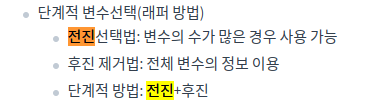
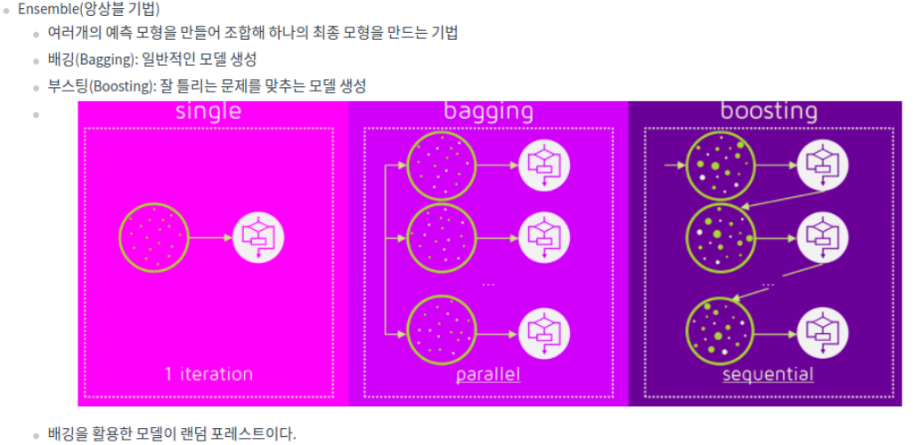
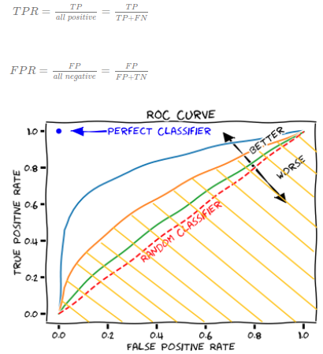
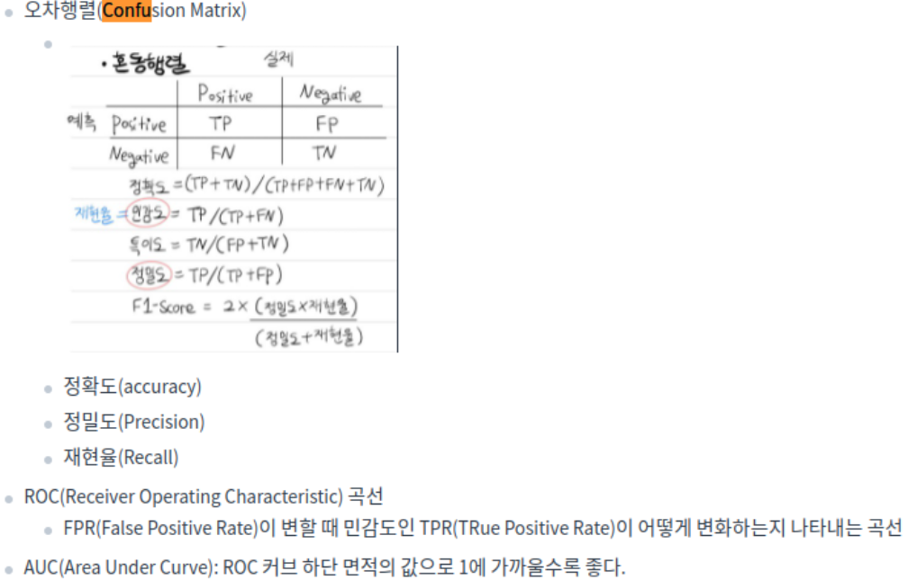
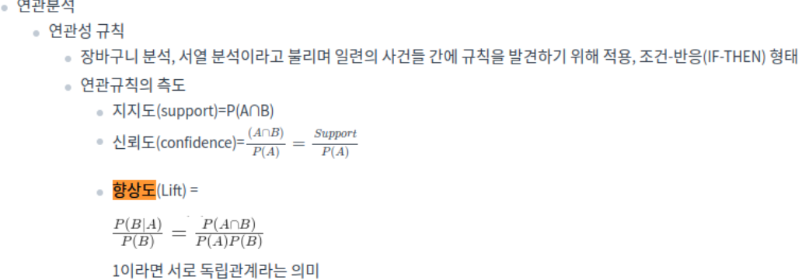
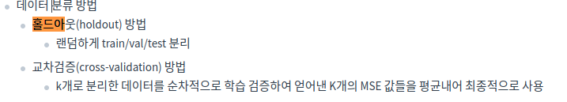
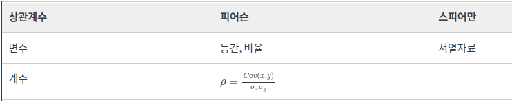
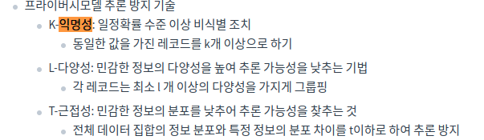
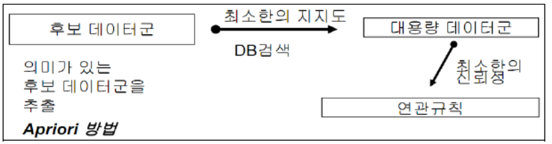
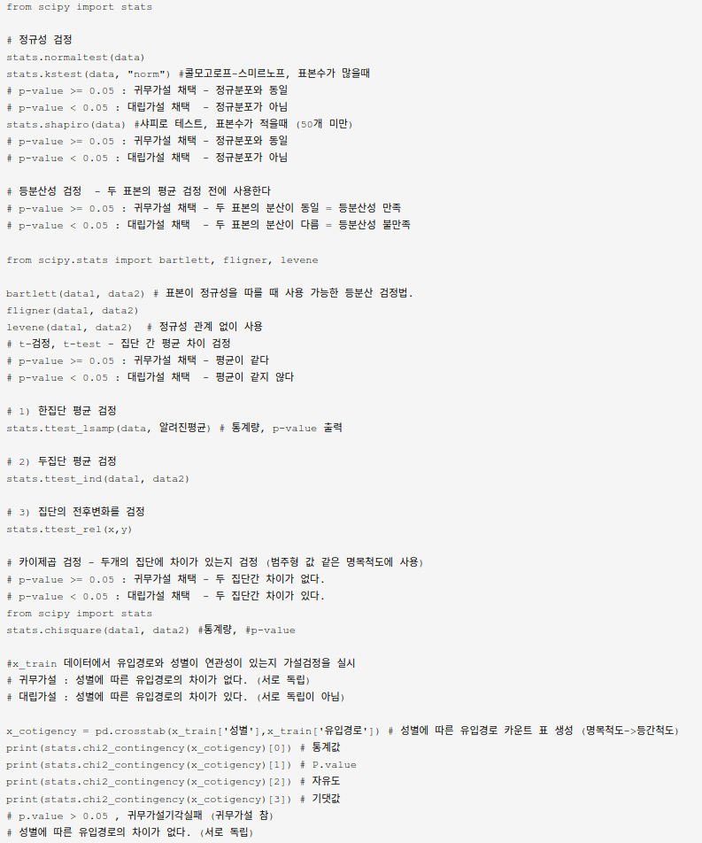

# 빅데이터분석 (2)
> Writer: SungwookLE    
> DATE: '22.6/21  

## 1. ML분석 모델 선택 가이드
- 데이터셋의 사이즈, 목적에 따라 적합한 모델을 선택합시다.
[](https://scikit-learn.org/stable/tutorial/machine_learning_map/index.html)

- 모델 평가지표는 여러가지가 있으니, 링크 페이지를 읽어봅시다: [scoring parmeter](https://scikit-learn.org/stable/modules/model_evaluation.html#scoring-parameter)

## 2. 시험 구성
1. 단답형(10문항)
2. 작업형 1유형(3문항)
3. 작업형 2유형(1문항)
    - 샘플 테스트 환경(구름IDE): [샘플 링크](https://dataq.goorm.io/exam/116674/체험하기/quiz/3)

## 3. 단답형 준비
- [필기 준비 문답](http://sungwookle.github.io/research/2203301700/)을 같이 참고해서 보면 좋습니다.

1. 데이터 정제 과정에서 처리해야 하는 것으로, 데이터가 정상의 범주를 벗어난 값은?: `이상치(outlier)`
2. 결측값 처리를 위한 단순 대치법에서 얻어진 데이터자료의 평균값으로 대체하는 방법은?: `평균대치법`
3. 모델에서 외적인 요소로 데이터 분석을 통해 얻어지는 값이 아니라, 사용자가 직접 설정해주는 값은?: `하이퍼파라미터`
4. 데이터 라벨이 없고, 특징, 패턴 도출을 위해 사용하는 것으로 대표기법으로는 군집화, 클러스터링 등이 있는 학습 방법은?: `비지도 학습(unsupervised learning)`
5. 훈련데이터에 대해서는 높은 성능을 보이지만, 테스트셋에서는 아닌 경우 모델을 `오버피팅`되었다고 한다.
6. 회귀분석에서 전체 변수에서 시작하여 가장 적은 영향을 주는 변수를 하나씩 제거하면서 더 이상 유의하지 않은 변수가 없을 때가지 설명변수를 제거하는 방법은?: `후진제거법`

7. 앙상블 분석에서 잘못 분류된 개체들에 가중치를 적용하여 새로운 분류 규칙을 만들고 이 과정을 반복해 최종 모형을 만드는 알고리즘은? `부스팅`

8. 앙상블 모형 알고리즘 중 하나로, 회귀 분류 모델링이 사용되며 부스팅에 속하고, 경사하강법(Gradient Descent)을 이용하여 가중치를 업데이터하여 최적화된 결과를 얻는 알고리즘은? `GBM(Gradient Boost Machine)`
    - `from sklearn.ensemble import GradientBoostingClassifier`
    - `from sklearn.ensemble import GradientBoostingRegressor`
9. 혼동행렬(Confusion matrix)의 세로축(TPR), 가로축(FPR)으로 하는 곡선은? `ROC`
    - 
    - 
10. 여러 명의 사용자들이 컴퓨터에 저장된 많은 자료들을 쉽고 빠르게 조회, 추가, 수정, 삭제할 수 있도록 해주는 SW는? `DBMS`
11. 머신러닝에서 데이터를 민맥스 정규화를 통해 단위가 다른 것을 정규화할 수 있다. kNN(kNeighbor)에서는 단위가 다른 경우 데이터 간 `거리`가 달라져 성능에 영향을 준다.
12. 범주형(categorical) 변수 안에 속한 자료형: `순서형(ordinal), 명목형(nominal)`
    - nominal: 남자/여자, A/B/O형 등
    - ordinal: 소형/중형/대형, 불만족/평범/만족 등
13. 데이터의 분포를 알 수 없을 때 주료 활용하는 정규화방법으로서 데이터를 0과 1 사이의 값으로 만드는 방법은 무엇인가? `Min-Max Scaler`
     - `standard scaler`는 평균이 0, 표준편차가 1이 되도록 변환하는 방법이다.
14. 군집화시 군집간 거리를 계산하는 방법 중 군집을 합칠 때 사용하는 가중 평균을 사용하는 방법은 무엇인가? `중심연결법`
    - 군집 간의 거리측정 방법으로는 최단연결법, 최장연결법, 중심연결법, 와드연결법 등이 있다.
16. 여러가지 동일한 종류 또는 상이한 모형들의 예측 및 분류 결과를 종합하여 최종적인 의사 결정에 활용하는 기법은으로서, 여러 개의 학습 모델을 훈련하고 투표를 통해 최적화된 예측을 수행하고 결정하는 방법을 무엇이라고 하는가?: `앙상블 기법`
17. raw 데이터를 그룹화하는 데이터 변환 중 하나로서, 예를 들어 일별 매출건수를 월별, 분기별로 변환하는 것을 무엇이라고 하는가?: `데이터 범주화`
18. 회귀와 분류 모두 사용가능한 지도학습 알고리즘으로 경계와 데이터가 멀수록 가장 좋은 모델로 선정하는 알고리즘을 무엇이라고 하는가?: `SVM`
19. 연관성 분석에서 규칙이 우연히 나타난 것이 아님을 확인하기 위해서 사용하는 척도는?: `Lift(향상도)`
    - 
20. 큰 용량과 복잡성을 가진 데이터셋은? `빅데이터`
21. 현실에서 관찰하거나 측정하여 수집한 사실: `데이터`
22. 데이터를 통해 도출된 다양한 정보를 구조화하여 유의미한 정보를 분류하고 개인적인 경험을 결합해 내재화한 것: `지식`
23. 지식의 축적과 아이디어가 결합된 창의적 산물: `지혜`
24. 빅데이터의 특징인 3V는?: `Volume, Velocity, Variety`
25. 고객의 대규모 거래데이터로부터 함께 구매가 발생하는 규칙을 도출하는 등, 어떤 변인 간에 주목할 만한 상관관계가 있는지 찾아내는 방법: `연관성분석 (연관규칙 분석)`
26. 새로운 사건이 속할 범주를 찾아내는 일: `유형 분석`
27. 최적화가 필요한 문제의 해결책을 자연선택과 같이 점진적으로 진화시키는 방법: `유전 알고리즘`
28. 데이터 베이스를 관리하며 응용 프로그램들이 데이터베이스를 공유하며 사용할 수 있는 환경을 제공하는 소프트웨어: `DBMS(DataBase ManagementSystem)`
29. 사용자 의사결정에 도움을 주기 위해 수집된 대량의 비즈니스 데이터 베이스 / 주제 중심적으로 통합적이며 시간성을 가지는 비휘발성 데이터의 집합: `데이터웨어하우스`
30. 데이터의 원래 소유자인 개인이 데이터에 대한 권리를 소유하고 행사할 수 있어야한다는 개념: `마이데이터`
31. 전사 차원의 모든 데이터에 대해 정책 및 지침, 표준화, 운영 조직 및 책임 등의 표준화된 관리체계를 수집하고 운영을 위한 프레임워크 및 저장소를 구축하는 것: `데이터거버넌스`
32. 데이터 3법의 3가지는?: `개인정보보호법, 정보통신망법, 신용정보법`
33. 고정된 구조로 정해진 필드에 저장된 데이터, 스프레드시트, RDBMS, csv 등이 대표적: `정형(structured data)데이터`
34. 고정된 필드에 저장되어 있진 않지만, 데이터와 메타데이터, 스키마 등을 포함하는 데이터(xml, html 등) 규칙이 있어, 필요 시 정형데이터로 변환 가능: `반정형 데이터`
35. 정해진 구조가 없고 고정된 필드가 없는 데이터 구조: `비정형 데이터`
36. 데이터에 개인을 식별할 수 있는 정보가 있는 경우 일부 또는 전체를 삭제하거나 일부를 대체 처리함으로써 개인을 식별할 수 없게 하는 것: `데이터 비식별화`
37. 어떤 변수의 변량을 서로 상관성이 높은 변수들의 선형 조합으로 만든 새로운 변수로 축소하는 기법: `PCA`
38. 전체 데이터 중 분석에 필요한 데이터만 선택적으로 이용하는것: `샘플링`
39. 관계형 데이터베이스를 SQL을 사용해 CRUD(Create, Read, Update, Delete)를 수행하고 관리할 수 있는 소프트웨어: `RDBMS`
40. Not only SQL의 약자로 SQL을 사용하는 전통적인 관계형 데이터베이스보다 상대적으로 제한이 덜한것: `NoSQL`
41. 데이터 원천으로부터 데이터를 추출 및 변환하여 데이터 웨어하우스 등에 데이터를 적재하는 작업: `ETL(Extraciton, Transformation and Load)`
42. 모든 독립변수 가운데 기준 통계치에 가장 많은 영향을 줄 것으로 판단되는 변수값(p값 기준으로 유의한 변수) 부터 하나씩 추가하면서 모형을 선택하는 방법: `전진선택법`
43. 회귀분석에서 사용된 모형의 일부 설명 변수가 다른 설명 변수와 상관정도가 높아 데이터 분석 시 부정적 영향을 미치는 것은? (회귀분석의 기본 가정인 독립성에 위배): `다중공선성` Multicollinearity
44. 변수를 연속적으로 추가 혹은 제거하면서 [AIC, Akaike information criterion]가 낮아지는 모델을 찾는 방법: 단계적 방법
45. 고차원에 존재하는 데이터 간의 거리를 최대한 보존하면서 데이터 간의 관계를 저차원으로 축소해 시각화 하는 방법: `t-SNE`
46. 행렬의 크기가 다른 MxN 행렬에 대해 세 행렬의 곱으로 분해하는 것으로 데이터 압축 등의 많은 분야에서 활용하는 것: `SVD` 특이값 분해
47. 데이터를 이해하고 의미있는 관계를 찾아내기 위해 데이터의 통계값과 분포 등을 시각화하고 분석하는 것: `EDA(Exploratory Data Analysis)`
48. 데이터 분포의 비대칭성을 나타내느 지표: `왜도(skewness)`
49. 데이터 분포가 중심에 어느정도 몰려있어 뾰족한지 나타내는 척도: `첨도(kurtosis)`
50. 다양한 문서 자료 내 비정형 텍스트 데이터에 자연어 처리(NLP) 기술 및 문서처리 기술을 활용해 인사이트를 도출하는 기술: `텍스트마이닝`
51. 모집단의 특성을 나타내는 대표값(평균, 분산), 표본을 통해 구하고자 하는 모집단에 대한 정보: 모수
52. 모집단을 어떤 특성에 따라 서로 겹치지 않는 여러 개의 층으로 분할한 후 각 층에서 표본을 단순 무작위 추출법에 따라 추출하는 방법: `층화 표본 추출(stratify)`
53. 모집단의 분포를 모르더라도 표본의 크기가 충분히 크면 표본 평균들의 분포가 정규분포에 근사하게 되는 것: `중심극한정리`
54. 실험. 연구를 통해 기각하고자 하는 어떤가설: `귀무가설(null)`
55. 실험. 연구를 통해 증명하고자 하는 새로운 가설: `대립가설(alternative hypothesis)`
56. 귀무가설 분포에서 검정통계량보다 극단적인 값이 관측될 확률값. 이 값이 작을수록 검정통계랑이 귀무가설의 내용에 적합하지 않음을 나타낸다: `유의확률(p-value)`
57. 대규모로 저장된 데이터 속에서 분석을 통해 유의미한 패턴과 규측을 찾아내는 과정: `데이터 마이닝`
58. 재표본추출 방법의 일종으로 중복추출을 허용하는 방법 / 주어진 자료에서 단순 랜덤 복원 추출 방법을 활용하여 동일한 크기의 표본을 여러개 생성하는 샘플링 방법: `부트스트랩`
59. 회귀분석의 5가지 기본 가정: `선형성, 독립성, 등분산성, 정규성, 비상관성`
60. 회귀모형에 의해 설명되는 변동의 비율로, 표본에 의해 추정된 회귀식이 주어진 자료를 얼마나 잘 설명하는지를 보여주는 값으로, 주어진 데이터에 회귀선이 얼마나 잘 맞는지, 적합 정도를 평가하는 척도이자, 독립변수들이 종속변수를 얼마나 잘 설명하는지 보여주는 지표, 회귀제곱합을 총제곱합의 값으로 나눈 것: `결정계수`
61. 이진(binary) 분류에서 모형이 예측한 값과 실제 값의 조합을 교차표 형태로 정리한 행렬: `confusion mtx, 혼동행렬`
62. 정밀도와 재현율의 조화평균 값으로, 정밀도와 재현율 중 한쪽만 클 때보다 두 값이 골고루 클 때 큰 값이 된다: `F1 스코어`
63. 주어진 원천 데이터를 랜덤하게 두 분류로 분리하여 교차 검정을 실시하는 방법으로, 하나는 train, 하는 validation 데이터로 활용하는 것: `홀드아웃`
    - 
64. 인터넷상의 서버에서 데이터 저장, 처리, 등 서로 다른 물리적인 위치에 존재하는 컴퓨팅 자원을 가상화 기술을 퉁해 IT 관련 서비스를 한번에 제공하는 혁신적인 컴퓨팅 기술은?: `클라우드 컴퓨팅`
65. 데이터에 관한 구조화된 데이터 / 데이터 그 자체가 아니라, 자료의 속성, 구조 등을 설명하는 데이터: `메타데이터`
66. 주어진 시간 또는 영역에서 어떤 사건의 발생 횟수를 나타내는 확률 분포는? `포아송분포`
67. 비선형적인 관계도 파악할 수 있는 상관계수는: `스피어만 상관계수`
    - 
68. 동일한 상대적 거리를 가진 공간의 점들로 데이터를 배치시키고, 개체들 사이의 유사성, 비유사성을 측정하여 공간상에 점으로 표현하여 개체들의 관계를 시각적으로 표현 분석하는 방법: `다차원 분석법`
69. 전체 데이터에서 부트스트래핑 -> 배깅방식으로 decision tree를 학습하고 이를 앙상블하여, 최종 성능을 voting을 통해 예측값을 결정하는 알고리즘은: `랜덤포레스트`
70. 군집내 거리와 군집간의 거리를 기준으로 군집 분할 성과를 측정하는 방식은? / 군집 내의 데이터 응집도와 군집 간 분리도를 계산하는 지표는?: `실루엣 계수` 
71. 대량의 자료를 처리하기 위한 분산 처리 시스템을 제공하는 오픈소스 프레임워크: `하둡`
72. 당사자의 동의 없는 개인정보 수집 및 활용하거나 제3자에게 제공하는 것을 금지하는 등 개인정보보호를 강화한 내용을 담아 제정한 법률: `개인정보보호법`
73. 정보통신망의 개발과 보급 등 이용 촉진과 함께 통신망을 통해 활용되고 있는 정보보호에 관해 규정한 법률: `정보통신망법`
74. 사생활 침해를 방지하기 위해 데이터에 포함된 개인정보를 삭제하거나 알아볼 수 없는 형태로 변환하는 방법: `익명화`
75. 개인 식별이 가능한 데이터를 직접적으로 식별할 수 없는 다른 값으로 대체하는 비식별화 방법: `가명처리`
76. 통계 값을 적용하여 특정 개인을 식별할 수 없도록 하는 비식별화 방법: `총계처리`
77. 특정 정보를 해당 그룹의 대표값 또는 구간값으로 변환하는 비식별화 방법: `데이터 범주화`
78. 주어진 각 개체들의 유사성을 분석해서 높은 대상끼리 일반화된 그룹으로 분류하는 기법: `군집분석`
79. 하나 이상의 변수에 대해서 변수 사이의 차이와 유사성 등을 표현하는 방법: `비교 시각화`
80. 장소나 지역에 따른 데이터의 분포를 표현하는 것: `공간 시각화`
81. 고정된 훈련데이터 세트와 테스트 검증데이터 세트로 평가하여 반복적으로 튜닝할 시 테스트 데이터에 과적합되는 결과가 생기는 것을 방지하는 방법: `교차검증`
82. 분석 대상 데이터 집합에서 준식별자 속성이 동일한 레코드가 적어도 K개 이상 존재하도록 제한하는 개인정보 보호 기법: `K-익명성`
    - 
83. 구글에서 대용량 데이터 처리를 분산 병렬 컴퓨팅에서 처리하기 위한 목적으로 만든 프레임워크, 구글에서 개발, 방대한 데이터를 신속하게 처리하는 모델, 효과적인 병렬 및 분산 처리 지원: `맵리듀스`
84. 데이터 안의 두 변수 간의 관계를 알아보기 위해 사용하는 값으로, 공분산: `상관계수`
85. 대용량의 정형 및 비정형 데이터를 저장하고 손쉽게 접근할 수 있게 하는 대규모저장소: `Data Lake`
86. 데이터의 결측값을 채우거나 이상값을 제거하여 데이터 품질을 높이는 과정: `데이터 정제`
87. 주어진 자료에서 단순랜덤 복원추출 방법을 활용하여 동일한 크기의 표본을 여러개 생성하는 샘플링 방법은?: `부트스트래핑`
88. L1 정규화를 위해 가중치의 절댓값과 동일한 패널티를 추가 제약조건으로 사용하는 임베디드 기법은: `라쏘`
89. 긍정으로 예측한 범주에서 실제로 긍정인 비율: `정밀도(precision)`
90. 연관 규칙의 측정지표 중 하나로 품목 A가 포함된 거래 중에서 품목 A,B를 동시에 포함하는 거래일 확률은 어느정도인가를 나타내는 지표는?: `신뢰도(confidence)`
91. 수집 대상데이터를 추출, 정제 후 데이터 웨어하우스나 데이터 마트에 저장하는 기술을 의미하는 용어: `ETL`
92. 불순도 측도로 출력변수가 범주형일 경우 지니지수를 이용하고, 연속형인 경우 분산을 이용한 이진분리를 사용하는데 이러한 의사결정나무 알고리즘은 무엇인가?: `CART`
93. 데이터 정제 기술 중 하나로 데이터를 정제 규칙 적용하기 위해 최소 단위로 분할하는 작업은?: `파싱`
94. 실제값이 False인 관측치 중 예측치가 적주안 정도를 나타내는 분류모델의 평가방식은?: `특이도(specificity)`
95. 잔차가 정규분포를 잘 따르고 있는지를 확인하는 그래프를 나타내는 용어로 잔차들이 그래프 선상에 있어야 이상적이다. 그래프 이름은?: `Q-Q 플롯`
96. 표준편차를 평균으로 나눈 것으로, 단위가 다른 두 집단간의 산포를 비교할 때 가장 적합한 척도는: `변동계수`
97. 계층적 군집 수행시 거리측정 방법 중 하나로, 모든 항목에 대한 거리 평균을 구하면서 군집화를 하는 방식은?: `평균연결법`
98. 데이터베이스 구조와 조건에 관한 전반적인 명세서로서, 개체, 속성, 관계 및 제약조건 등에 대해 정의한 것은?: `스키마`

99. 최소 지지도 보다 큰 집합만을 대상으로 높은 지지도를 갖는 품목집합을 찾는 연관분석 알고리즘으로 다음의 절차를 가지는 알고리즘의 이름은? 1. 최소 지지도 설정 2. 개별 품목 중에서 최소 지지도를 넘는 모든 품목찾음 3. 2에서 찾은 개별 품목만을 이용하는 알고리즘은? `Apriori 알고리즘`
    - 

100. 우리가 예측하려는 임의의 데이터와 가장 가까운 거리의 데이터 K개를 찾고, K개가 속한 그룹 중 다수결에 의해 라벨을 예측하는 방법은? : kNN(k nearest neighbor)

## 4. 작업형 1유형
- [주요코드정리](https://github.com/inrap8206/Bigdata_Analyst_Certificate_Korean/blob/main/01_%EC%A3%BC%EC%9A%94%EC%BD%94%EB%93%9C%EC%A0%95%EB%A6%AC.ipynb)

- 아웃라이어(이상치) 제거
    ```
    for col in columns:
        col_IQR = df[col].quantile(0.75) - df[col].quantile(0.25)
        df=df.loc[df[col].between(df[col].quantile(q=0.25)-ratio_IQR*col_IQR, df[col].quantile(q=0.75)+ratio_IQR*col_IQR)]
    ```
- 결측값 처리 `fillna(), dropna(). interpolate()`
    - 아래 코드와 같이 어떤 값이 비었을 때, 같은 행의 다른변수 집단의 평균값을 가져와서 대체하는 방법도 있음
        ```
        per_age = train.groupby("aged")["bmi"].mean() #연령대별 bmi 평균을 저장한다음에
        train.loc[train["bmi"].isnull(), "bmi"]=train.loc[train["bmi"].isnull()]["aged"].apply(lambda x: per_age[x]) #결측값에 연령대별 bmi 평균을 넣는다.
        ```
- `pandas` method 정리
- Scaler
- PCA, Clustering
- shapiro 정규성 검정, 등분산성 검정, t-검정(집단 간 평균 차이), 카이제곱 검정(두 집단 차이 유무), ANOVA

<details>
<summary>기술통계 `scipy` 코드</summary>

</details>

## 5. 작업형 2유형
- [연습문제 풀이](https://github.com/inrap8206/Bigdata_Analyst_Certificate_Korean/blob/main/02_%EC%8B%A4%EA%B8%B0_%EC%9E%91%EC%97%85%ED%98%95_%EC%97%B0%EC%8A%B5%EB%AC%B8%EC%A0%9C%ED%92%80%EC%9D%B4.ipynb)
- 분류문제: roc_acu_score
    - [대표 풀이, 케글](https://www.kaggle.com/code/sungwookle/rf-classifier-w-gridsearch-roc-auc-75-59)
- 회귀문제: 결정계수 R2
    - [대표 풀이, 케글](https://www.kaggle.com/code/sungwookle/rf-regressor-w-gridsearch-r2-92-8)
- 클러스터링: 실루엣계수
- 여러 모델을 사용하고 조합하거나 비교하여 score를 끌어올려 제출할 것
    - 성능을 끌어올리기 위한 전처리, Feature Engineering, 분류 모델 검토, 하이퍼파라미터 최적화, 모델 앙상블이 수반되어야 한다.
    - 수험번호.csv 파일이 만들어지도록 코드를 제출한다.
    - 제출한 모델의 성능은 ROC-AU 평가지표에 따라 채점한다.

## 6. 그 외 개념 정리

### 6-1. 공분산(Covariance)
 - [참고 사이트](https://www.notion.so/sungwookle/22-b446be4170974c0cad657b909aa7822e#baac1a8b64704468afeb1e05ace34ee6)

 - $Cov(X,Y) = E[ (X-\mu_X)(Y-\mu_Y) ]$
 
 - **X와 Y가 의존성이 높다는 것은 그렇다면 뭘 의미할까?**
 - X가 증가할 때, Y도 증가하려고 하고, X가 감소할 때, Y도 감소하려고 하는 것이다. 따라 하니깐, 의존성이 높은 거다.
 - 의존성이 낮은 상황을 보자.
    가장 의존성이 낮은 상황은 당연히 서로 독립인 상황이다. X가 어떻게 되든 상관 없이 Y는 어떤 값이든 가질 수 있다. 즉, X가 높은 값을 가졌을 때, Y는 높은 값일 수도 있고, 아닐 수도 있다. 그것이 완전히 랜덤이라면, 편차의 곱 항이 양수와 음수가 골고루 나올 것이고, 그걸 평균하면 0에 가까울 것이다.
 - 공분산은 서로 다른 변수들 사이에 얼마나 의존하는지를 수치적으로 표현하며, 그것의 직관적 의미는 어떤 변수(X)가 평균으로부터 증가 또는 감소라는 경향을 보일 때, 이러한 경향을 다른 변수(Y 또는 Z 등등)가 따라 하는 정도를 수치화 한 것이다.
    - 공분산은 또한 두 변수의 선형관계의 관련성을 측정한다라고도 할 수 있다.

### 6-2. 결정계수
 - Coefficeint of Determination (결정계수, Regressor 문제)
 - [참고 사이트](https://ko.khanacademy.org/math/statistics-probability/describing-relationships-quantitative-data/assessing-the-fit-in-least-squares-regression/a/r-squared-intuition)

 - $R^2  = 1-\frac{SSR}{SST}$
 
 - SST(Total Sum of Squared): Sigma( (y - y.mean())^2 )
 - SSR(Total Sum of Residual): Sigma( (y_pred - y)^2 )
 - `1, (100%)`일수록 잘 Fitting 되었다는 의미이다.

 - white noise를 참값으로 하는 어떤 데이터가 있다고 생각해보자.
    y.mean() = 0 이 될것이고, 이에 대한 SST 값이 존재할 것이다. (예를 들어 10이라고 하자)
    white noise를 선형회귀 하여도 나올 수 있는 y_pred 의 값은 0일 것이다.
    각 데이터에 대한 잔차 제곱의 합, 즉 SSR을 계산하면 SST와 같은 값이 것이다.
    1-SSR/SST = 0%, 즉, white noise를 회귀예측한 모델은 설득력 0%의 모델이라는 의미가 된다.

- `sklearn` regressor에서 `.score` 메쏘드를 호출하면 return 값으로 R^2을 반환한다.

### 6-3. 클러스터링 
* 클러스터링 분석에 대한 추가 설명
    1. 계층 분석
        - 덴드로그램이라 불리는 그래프를 기반으로 군집을 분석, 별도의 클러스터 개수를 선언할 필요 없음
        - 평균연결법, 와드연결법, 최단연결법, 최장연결법
    2. 분할 분석
        - 정해진 군집(클러스터 개수)에 할당
        - K-평균 군집분석, 밀도기반클러스터링(DBSCAN), 확률분포기반 클러스터링

## REFERENCE
> 1. [Choosing the right estimator](https://scikit-learn.org/stable/tutorial/machine_learning_map/index.html)
> 2. [참고용 실기 코드 깃헙](https://github.com/inrap8206/bigdata_analyst_certificate_korean)
> 2. [실기단답형대비1](./img/빅분기실기단답형대비_1.pdf)
> 3. [실기단답형대비2](./img/빅분기실기단답형대비_2.pdf)  
> 4. [실기형단답대비3](./img/빅분기예상.docx)  
> 5. [문제은행, 데이터마님](https://bit.ly/3rbIlt5)
> 6. [케글 데이터셋, 데이터마님](https://www.kaggle.com/discussions/general/286991)  
> 7. [스코어 sklearn](https://scikit-learn.org/stable/modules/model_evaluation.html#scoring-parameter)

## 끝