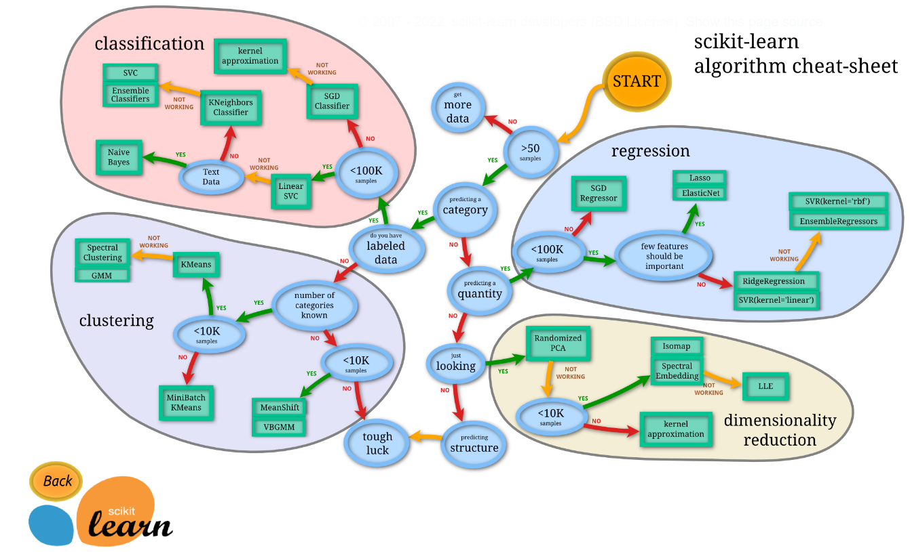
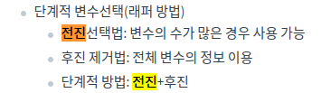
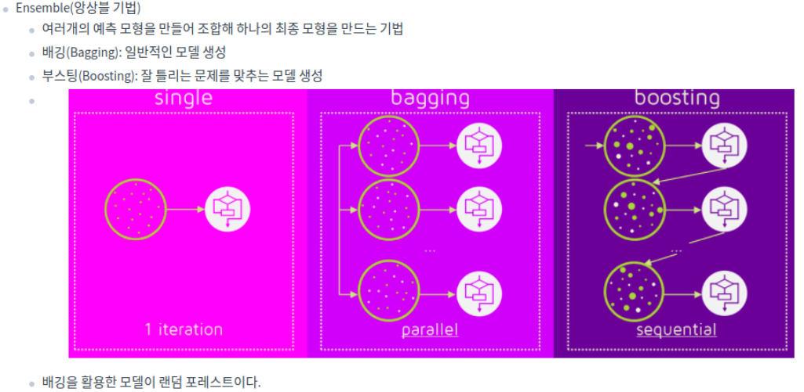
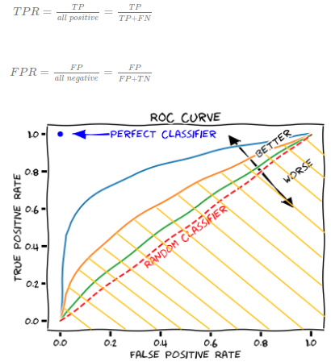
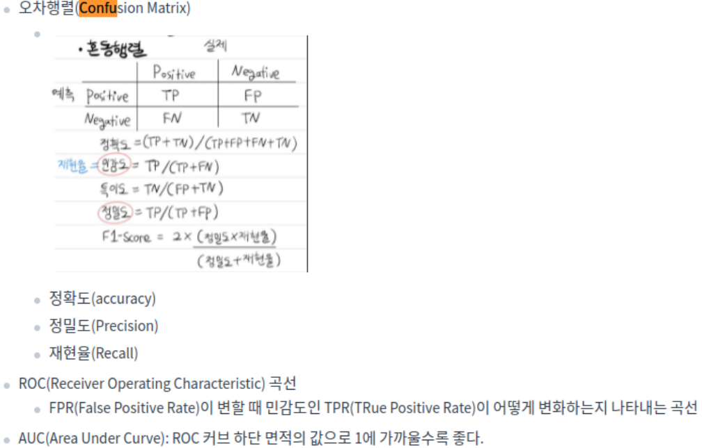
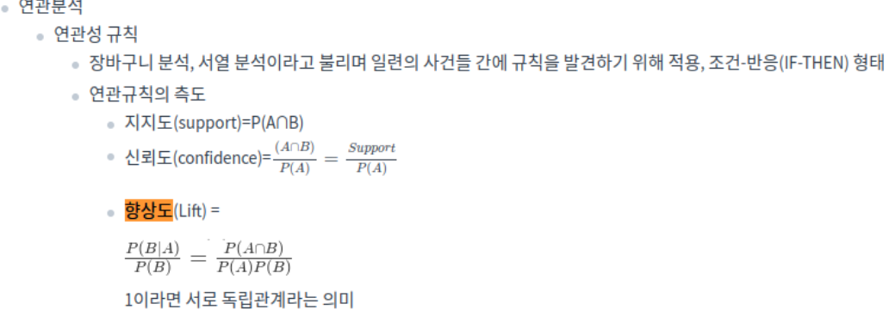

# 빅데이터분석기사: 실기
> Writer: SungwookLE    
> DATE: '22.6/21  

## 1. ML분석 모델 선택 가이드
- 데이터셋의 사이즈, 목적에 따라 적합한 모델을 선택하여야 해요.

## 2. 시험 구성
1. 단답형(10문항)
2. 작업형 1유형(3문항)
3. 작업형 2유형(1문항)
- 응시환경: [파이썬 패키지리스트](./img/4회차_파이썬패키지.txt)
- 샘플 테스트 환경(구름IDE): [샘플](https://dataq.goorm.io/exam/116674/체험하기/quiz/3)

## 3. 단답형 준비
1. 데이터 정제 과정에서 처리해야 하는 것으로, 데이터가 정상의 범주를 벗어난 값은?: `이상치(outlier)`
2. 결측값 처리를 위한 단순 대치법에서 얻어진 데이터자료의 평균값으로 대체하는 방법은?: `평균대치법`
3. 모델에서 외적인 요소로 데이터 분석을 통해 얻어지는 값이 아니라, 사용자가 직접 설정해주는 값은?: `하이퍼파라미터`
4. 데이터 라벨이 없고, 특징, 패턴 도출을 위해 사용하는 것으로 대표기법으로는 군집화, 클러스터링 등이 있는 학습 방법은?: `비지도 학습(unsupervised learning)`
5. 훈련데이터에 대해서는 높은 성능을 보이지만, 테스트셋에서는 아닌 경우 모델을 `오버피팅`되었다고 한다.
6. 회귀분석에서 전체 변수에서 시작하여 가장 적은 영향을 주는 변수를 하나씩 제거하는 방법은?: `후진제거법`

7. 앙상블 분석에서 잘못 분류된 개체들에 가중치를 적용하여 새로운 분류 규칙을 만들고 이 과정을 반복해 최종 모형을 만드는 알고리즘은? `부스팅`

8. 앙상블 모형 알고리즘 중 하나로, 회귀 분류 모델링이 사용되며 부스팅에 속하고, 경사하강법(Gradient Descent)을 이용하여 가중치를 업데이터하여 최적화된 결과를 얻는 알고리즘은? `GBM(Gradient Boost Machine)`
    - `from sklearn.ensemble import GradientBoostingClassifier`
    - `from sklearn.ensemble import GradientBoostingRegressor`
9. 혼동행렬(Confusion matrix)의 세로축(TPR), 가로축(FPR)으로 하는 곡선은? `ROC`
    - 
    - 
10. 여러 명의 사용자들이 컴퓨터에 저장된 많은 자료들을 쉽고 빠르게 조회, 추가, 수정, 삭제할 수 있도록 해주는 SW는? `DBMS`
11. 머신러닝에서 데이터를 민맥스 정규화를 통해 단위가 다른 것을 정규화할 수 있다. kNN(kNeighbor)에서는 단위가 다른 경우 데이터 간 `거리`가 달라져 성능에 영향을 준다.
12. 범주형(categorical) 변수 안에 속한 자료형: `순서형(ordinal), 명목형(nominal)`
    - nominal: 남자/여자, A/B/O형 등
    - ordinal: 소형/중형/대형, 불만족/평범/만족 등
13. 데이터의 분포를 알 수 없을 때 주료 활용하는 정규화방법으로서 데이터를 0과 1 사이의 값으로 만드는 방법은 무엇인가? `Min-Max Scaler`
     - `standard scaler`는 평균이 0, 표준편차가 1이 되도록 변환하는 방법이다.
14. 군집화시 군집간 거리를 계산하는 방법 중 군집을 합칠 때 사용하는 가중 평균을 사용하는 방법은 무엇인가? `중심연결법`
    - 군집 간의 거리측정 방법으로는 최단연결법, 최장연결법, 중심연결법, 와드연결법 등이 있다.
16. 여러가지 동일한 종류 또는 상이한 모형들의 예측 및 분류 결과를 종합하여 최종적인 의사 결정에 활용하는 기법은으로서, 여러 개의 학습 모델을 훈련하고 투표를 통해 최적화된 예측을 수행하고 결정하는 방법을 무엇이라고 하는가?: `앙상블 기법`
17. raw 데이터를 그룹화하는 데이터 변환 중 하나로서, 예를 들어 일별 매출건수를 월별, 분기별로 변환하는 것을 무엇이라고 하는가?: `데이터 범주화`
18. 회귀와 분류 모두 사용가능한 지도학습 알고리즘으로 경계와 데이터가 멀수록 가장 좋은 모델로 선정하는 알고리즘을 무엇이라고 하는가?: `SVM`
19. 연관성 분석에서 규칙이 우연히 나타난 것이 아님을 확인하기 위해서 사용하는 척도는?: `Lift(향상도)`
    - 
20. 

## 4. 작업형 1유형

## REFERENCE
> 1. [Choosing the right estimator](https://scikit-learn.org/stable/tutorial/machine_learning_map/index.html)
> 2. [실기단답형대비1](./img/빅분기실기단답형대비_1.pdf)
> 3. [실기단답형대비2](./img/빅분기실기단답형대비_2.pdf)
