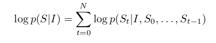
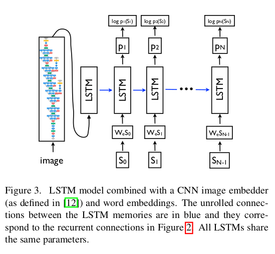
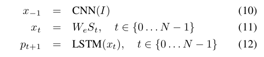
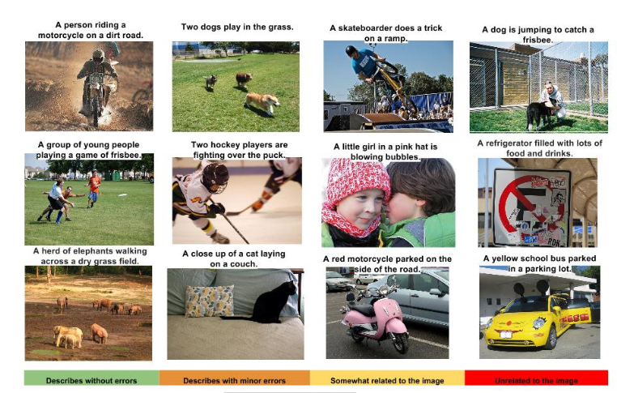
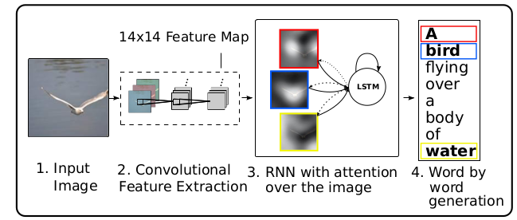

# Paper Review: Image Captioning
> Writer: SungwookLE    
> DATE: '22.9/9    
> Paper: [Review this >> Paper1](./img/Show%20and%20Tell%3A%20A%20Neural%20Image%20Caption%20Generator.pdf), [Additional paper >> Paper2](./img/Show%2C%20Attend%20and%20Tell%3A%20Neural%20Image%20Caption.pdf)  
> 겉핡기 논문 리뷰이오니, 참고바랍니다.  

Image Captioning 관련한 논문

## 1. Introduction
- Being able to automatically describe the content of an image using properly formed English sentences is a very challenging task, but it could have great impact, for instance by helping visually impaired people better understand the content of images.
- This paper proposed the Neural Image Caption(or `NIC`). it is to use a CNN as an image "encoder", by first pre-training if for an images classification task and using the last hidden layer as an input to the RNN decoder that generates sentences.
    1. This paper present an `end-to-end` system for the problem. It is a neural net which is fully trainable using stochastic gradient descnet.
    2. Second, this model combines the state-of-art sub-networks for vision and language models. Thest can be pre-trained on larger corpora and thus can take advantage of additional data.
    3. Finally, it yields significantly better performance compared to others

## 2. Model
- The model makes use of a recurrent neural network which encodes the variable length input into a fixed dimensional vector, and uses this representation to "decode" it to the desired output sentence. Thus, it is natural to use the same approach where, given an image (instead of an input sentence in the source language), one applies the same principle of "translating" it into its description.
- it is common to apply the chain rule to model the joint probability over $S_0, ..., S_N$, where N is the length of this particular example as  where we dropped the dependancy on $theta$ for convenience.
    - $theta$ are the parameters of our model, $I$ is an image, and $S$ its correct transcription.
- It is natural to model 
$ P(S_t|I, S_{0}, ..., S_{t-1}) $ with a Recurrent Neural Network(RNN), where the variable number of words we condition upon up to t-1 is expressed by a fixed length hidden state or memory $h_t$. 
- This memory is updated after seeing a new input $x_t$ by using a non-linear function $f$: $h_{t+1}=f(h_t, x_t)$.
- For $f$ we use a Long-SHort Term Memory (LSTM) net, which has shown state-of-the art performance on sequence tasks such as translation. 
- For the representation of images, we use a Convolutional Neural Network(CNN).

- 

## 3. LSTM 
- **training**
    - The LSTM model is trained to predict each word to the sentence after it has seen the images as well as all preceding words as defined by $ P(S_t \| I,S_0,...,S_{t-1}) $
    - 
        - where we represent each word as a one-hot vector $S_t$ of dimension equal to the size of the dictionary.

    - Both the image and the words are mapped to the same space, the image by using a vision CNN, the words by using word embedding {W_e}.
    - The image $I$ is only input once, at t=-1, to inform the LSTM about the image contents. 

- **inference**
    - There are multiple approaches that can be used to generate a sentence given an image, with `NIC`. The first one is **Sampling** where we just sample the first word according to $p_1$, then provide the corresponding embedding as input and sample $p_2$, continuing like this until we sample the special end-of-entence token or some maximum length.
    - The second one is BeamSearch: iteratively consider the set of the $k$ best sentences up to time $t$ as candidates to generate sentences of size $t+1$, and keept only the resulting best $k$ of them.

## 4. Training Detail
- Indeed, purely supervised approaches require large amounts of data, but the datasets that are of high quality have less thatn 100000 images. The task of assigning ad description is strictly harder than object classification and data driven approaches have only recently become dominant thanks to datasets as large as ImageNet.
- The most obvious way to not overfit is to initialize the weights of the CNN component of our system to a pretrained model (e.g., on ImageNet).
- Another set of weights that could be sensibly initialized are $W_e$, the word embeddings.
- Lastl, we did some model level overfitting-avoiding techinques. We tried dropout and ensembling models, as well as exploring the size of the model by trading off number of hidden units versus depth.
- We used 512 dimensions for the embeddings and the size of the LSTM memory.

## 5. Human Evaluation
- 
- 결론: 비교 모델 대비 성능 좋음
- 

## 6. pytorch로 LSTM
- hidden_state (= short-term memory)
- cell_state (= long-term memory)
- [colab 코드 실습](https://colab.research.google.com/drive/1YV6HiMhohTuBOsyOw9zEyTN2g9vYF13p#scrollTo=jkXZp2R9SEkk)
- [블로그](https://m.blog.naver.com/PostView.naver?isHttpsRedirect=true&blogId=songblue61&logNo=221853600720)

## 끝