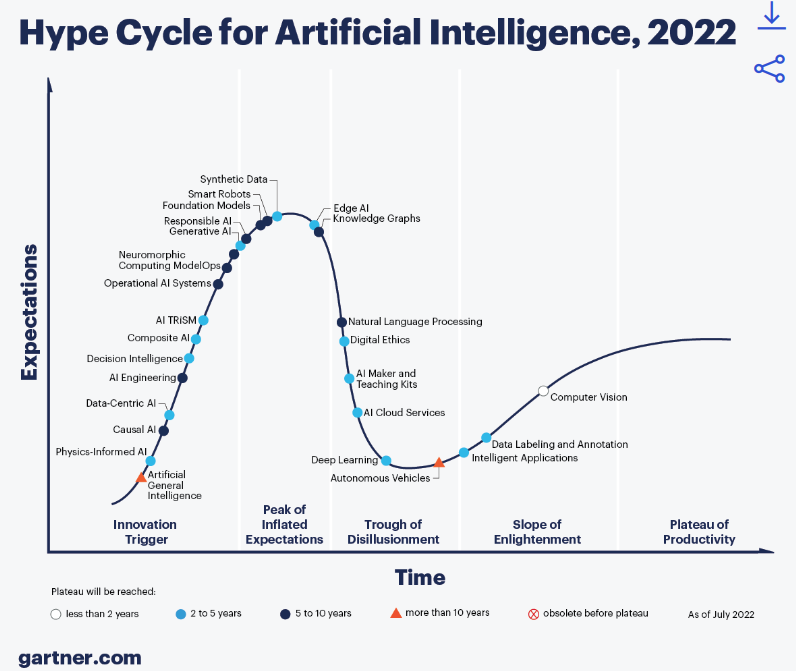
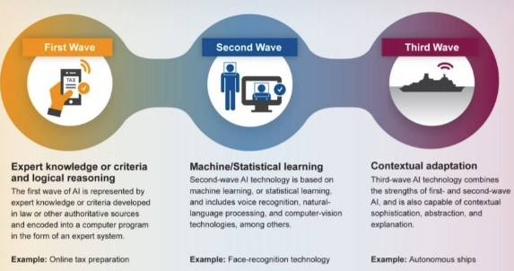
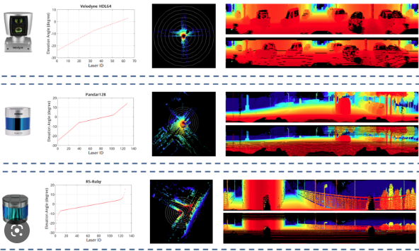
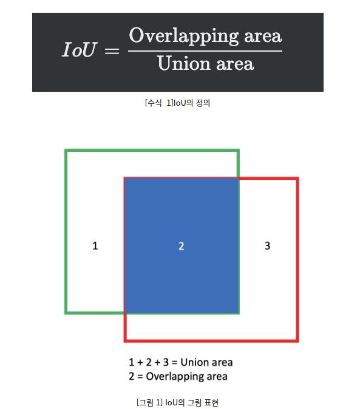

# AI 컨퍼런스
> Writer: SungwookLE    
> DATE: '22.11/16    

## 1. AI를 이용한 서비스 동향

- AI Hype Cycle
    - 
      1. 음성인식
      2. 자연어 이해 (Transformer: self-attention, bert) -> 비전 영역으로 확대
      3. 챗봇
      4. 영상 인지

- Three Waves of AI(Darpa)
    
    1. 1st Wave(1990~2010): Logical Represent, Explicit, Deductive Reasoning
        - `Knowledge Base`
    2. 2nd Wave(2010~2020): Statistical Represent, Implicit, Inductive Reasoning
        - `Machin Learning`
    3. 3rd Wave(2020~2030): Explainable AI, Neuro-Symbolic, Hybrid Reasoning
        - `Knowledge Embedding`
        - Neuro-Symbolic?
            - Logical한 숫자 정보와 패턴 정보를 동시에 학습

- Multi-modal intelligence
    - Perception/Generation
        - voice, text, touch, smell, vision(face, motion,...)
    - 통합해서 하나의 모델로 개발

## 2. Domain Adaptation 관련

- 서로 다른 라이다 데이터 Domain Adaptation 기반 Semantic Segmentation
- 기존 문제: 특정 차종 및 Lidar 장착 위치 바뀔 경우 data shift 발생하여 활용하기 어려움

- 활용 데이터 셋: kitti (독일) 라벨O, 직접 취득 데이터(서울) 라벨X
- 3D 라이다 데이터를 2D Range View Image로 변환하여 입력값으로 사용
    - 
    - 3D 데이터를 원주 방향으로 쭉펼쳐서 2d 이미지로 만든 것을 2D Range View Image라고 함

1. Sensor Domain Adapation 
    - 데이터 전처리
        - 지면 높이 값을 맞추고, 영상의 너비를 근사하게 조정
        - 장착 위치에 따라 hole 마스킹 영역도 맞춰줌

2. Feature Domain Adaptation
    - `mIOU` SCore (meau Intersection Over Union)
    - 

    - GAN 모델을 활용하여 GT(ground truth)가 있는 kitti 데이터와 서울 직접 취득한 라벨링이 없는 데이터를 입력으로 하여, 학습
    - kitti 데이터는 GT 값이 나오도록 학습하고,
    - GAN의 discriminator가 kitti 데이터인지, 서울 데이터인지 분간할 수 없게끔 적대적 학습을 수행하여 Domain Adaptation 을 진행
    - 최종적으로 나온 모델은 라벨링(GT)가 없는 서울 데이터를 넣었을 때에도 어느정도의 `mIOU` 스코어가 나오게끔 모델 개발

## 3. 앞으로의 연구 생각해보기

- [TensorRT 플랫폼](https://eehoeskrap.tistory.com/414)에서 tensorflow framework 사용이 가능하므로, 임베디드 목적으로 연구 진행해볼만 함

1. GAN 모델을 활용한, 돌발 상황에서의 자차량의 미래 경로 예측 연구
    - 왜? [오픈 데이터(+GT)](https://www.nuscenes.org/nuscenes?tutorial=prediction) , 라벨링이 없는 취득 데이터를 이용하여 GT 값도 잘 맞으면서, 실제 취득한 데이터에서도 유효 성능이 나오도록 하기 위함
    - https://www.nuscenes.org/prediction?externalData=all&mapData=all&modalities=Any
    - https://paperswithcode.com/sota/trajectory-prediction-on-nuscenes
        - nuscene에서 오픈데이터가 있으니, 관련한 논문 서치하고, 목적 및 구현 난이도 등을 확인하며 스터디 진행하기

## 끝