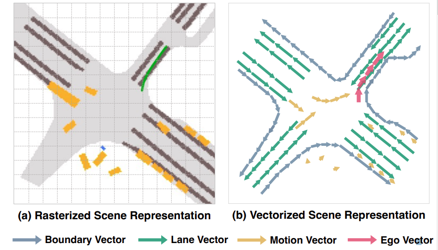
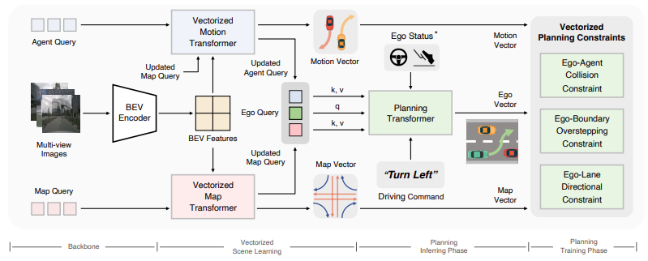
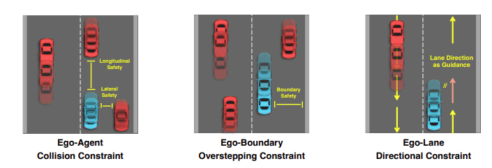
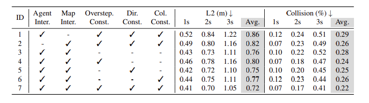
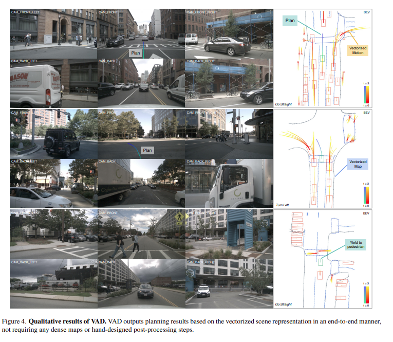

# Paper Review: Vectorized Scene Representation for Efficient Autonomous Driving
> Writer: SungwookLE    
> DATE: '24.08/03    
> [Paper](https://arxiv.org/pdf/2303.12077), [Git](https://github.com/hustvl/VAD)

- 23년 8월에 SOTA 성능을 보여준 E2E Planning 논문임**
- VAD v2가 출판되었음 
    - VADv2: End-to-End Vectorized Autonomous Driving via Probabilistic Planning [2024 arXiv]

## Abstraction
- 자율주행차량의 경로 계획을 위해선 주변 환경에 대해 comprehensive understanding이 필요함
- 이를 위해선 Raseterized Scene이 아닌 Vectorized Scene이 필요하다.

- 본 논문은 end-to-end fully Vectorized 패러다임을 제시함
    1. Agent의 움직임과 맵 정보를 vectorized 해서, 경로 계획에 더 효과적임
    2. 더 빠르다. better than sparsed rasterized information

## 1. Introduction
- Traditional autonomous driving 은 모듈러 패러다임으로 설계되었다.
    - 즉, 인지, 예측, 판단, 계획 모듈 들로 이루어져 있었다.
    - 이러한 모듈로 인해 플래닝 모듈은 cannot access the original sensor data (풍부한 의미적 정보를 담고 있는)
    - 플래닝은, 모든 처리가 완료된 정보만을 수신함으로써, 인지 오차 등이 경로 계획에 큰 에러를 발생시켰다. (안전 측면에서 안좋음)

- 최근의 End-to-End 접근은 센서의 로우 데이터를 입력받아 플래닝을 출력하는 통합 디자인 되는 방식으로 진행되었고, 어떤 연구는 학습 방식이 아닌 방법으로 접근되기도 하였으나, 최적화가 매우 어려운 한계가 있다. (학습된 무언가가 필요해)
- 대부분의 End-to-End AI 접근은 rasterized scene을 이용해서 플래닝을 수행하였다.
    - 그러나, 이러한 방식은 메모리측면에서 비효과적이고, 또, 몇몇 중요한 데이터 (예를들면 장애물) 같은 정보 표현에 있어 해상도 문제등으로 누락되는 큰 문제가 있다.
    - vectorized 방식(본 논문에서 제시하는)이 더 우수하다
        1. 교통 흐름, 주행방향(일방통행 등) 까지도 수월하게 표현이 가능해서, 경로 계획을 수행할 때 공간 탐색에 더 유용한 정보를 제공한다.
        2. 연산도 효율적이고..,
- 이를 위해, SW 적으로는 map queries 와 agent queries 를 이용해서 현재 필요한 정보는 interaction 한다.
- 또, VAD(본 논문에서 제시하는 모델의 이름)는 3개의 instance-level planning constraints를 제시하였다.
    1. Ego-agent 충돌 제약조건
    2. Ego-boundary 제약 조건 (도로 경계)
    3. Ego-LaneDirection 제약 조건 (역주행)

## 2. Related Work
- **Perception**
    - Bird's-eye view (BEV) representation has become popular and has greatly contributed to the field of perception.
    - `BEVFormer` 라는 모델은 카메라 only 정보만을 가지고 spartial(공간적) and temporal attention 을 제안했고, BEV feature를 효과적으로 인코딩했다.
    - 본 논문에서는 BEVFormer과 MapTR(hdmap 을 vectorized하는 네트워크임)을 이용해서 Perception 네트워크를 구성했다.

- **Motion Prediction**
    - traditional 한 방식은 perception 정보를 참값으로 가정한 뒤 이를 통해 경로를 예측하는 것임
    - 다른 연구에서는 네트워크를 이용한 방식이 있었는데, 이미지 기반의 네트워크라던지(BEV 이미지), 그래프네트워크가 제안되기도 하였음
    - 최신의 연구는, perception와 prediction을 동시에 수행하는 (jointly) 연구가 있었음
    - [PIP](https://arxiv.org/pdf/2212.02181)라는 네트워크에서는 Vectorized map 정보와 Agent의 인터랙션을 반영해서 경로를 예측하였음 (SOTA)
    - 본 논문에서는 PIP 의 정보를 기반으로 Prediction 정보를 생성함

- **Planning**
    - 최근에 연구들은 perception과 prediction을 생략하고, 바로 planning 또는 제어입력을 만들어내는 연구가 수행 중임.
    - 이런 컨셉은 간단해보이기는 하나, 해석불가능한 단점이있고 또, 최적화도 어렵다.
    - 강화학습은 플래닝에 적합한 방식이며, 많은 연구가 시도되고 잇음.
    - dense한 cost map 기반의 플래닝도 다양히 연구되고 있으며, 최소 cost 지점으로 도달하기 위한 플래닝 방식임
    - 근데, 이런 방식은 hand-craft 하기도 하고, 잘 튜닝되면 성능이 좋으나, 그게 어려움 (후처리는 안하는게 좋아)
    - 본 논문에서는 vectorzied로 표현된 장면을 이용해서 플래닝을 시도해보았다.

## 3. Method

- **Overview**
    - 
    - 여러 프레임의 멀티 카메라의 이미지를 입력받고, BEV Encoding을 수행함
    - agent(인식된 트랙의 센서 로우값?) 및 map 쿼리를 이용해서, 정보를 입력받은뒤 각각의 vectorized transformer를 이용해서 입력정보를 처리한다.
    - VAD는 ego 쿼리라는걸 생성해서 이용하는데, ego 쿼리는 agent와 map 쿼리의 정보의 내재된 정보를 학습시키는 목적임.
    - ego 쿼리, ego 상태, 드라이빙 커맨드를 기반으로, Plannig 네트워크는 경로를 생성한다. 

- Vectorized Map
    - VAD는 vectorized map 정보를 생성하기 위해, 일단 쿼리로 부터 map 정보를 받은 뒤에 BEV(bird-eye) 변환을 수행함.
    - vector 정보로 표현했을 때, lane direction 표현에 장점을 갖는다.
- Vectorized Agent Motion
    - Agent의 정보도 vectorized를 위해, 먼저 BEV를 거침
    - Agent의 Motion Prediction을 더 정확하게 수행하기 위해, Agent-Agent, Agent-Map 인터렉션을 attention 메카니즘을 통해 feature를 추출하였음
    - 그 다음, 예측 시간 길이의 경로를 예측한다. VAD는 타깃의 modality를 확률 스코어 정보로 출력한다.
    - agent의 motion prediction 정보는 scene information에 포함되어 palnning에 사용되게 된다.

- Planning via Interaction
    - vectorized scene 정보를 입력받았으면, 이제 플래닝을 할 차례
    1. Ego-Agent Interaction
        -  Ego와 Agent의 인터랙션을 트랜스포머 디코더를 통해 학습함
    2. Ego-Map Interaction
        - Ego-Map 인터랙션을 트랜스포머를 통해 학습함
    3. Planning Head
        - 운전자 커맨드 (좌회전, 우회전, 직진 등)에 따른 플래닝

- Vectorized Planning Constraint
    - Vectorzied 된 제약조건을 생성하기 위함
    

    1. Ego-Agent Collision Constraint
        - 충돌이 발생하는 경로여선 안된다.
        - 예측 정확도가 높은 motion trajectory에 대해서만 학습을 진행함.
        - 종방향,횡방향 충돌이 없게끔 하는 목적함수를 디자인
    2. Ego-Boundary Overstepping Constraint
        - 도로 바운더리에도 닿아선 안된다.
        - 마찬가지로, 어느정도 confidence가 보장된 상태의 boundary만 학습을 진행함
    3. Ego-Lane Directional Constraint
        - 방향에 대한 제약조건임
        - 먼저 자차 위치를 기준으로 가장 가까운 레인 벡터(+방향)을 찾은다음.
        - 그 레인벡터를 기준으로 학습을 진행함

-  End-to-End Learning 
    - Vectorized Scene Learning Loss
        - map 과 관련한 Loss 'Lmap'
        - agent의 motion prediction 과 관련된 Loss 'Lmot'
            - minFDE 정보를 가지고 Loss를 계산하였음
    - Vector Contraint Loss
        - Ego-Agent 충돌 관련한 Loss `Lcol`
        - Ego-boundary 관련한 Loss `Lbd`
        - Ego-directional 관련한 Loss `Ldir`
    - Imitation Learning Loss
        - `Limi`: Planning Trajectory와 참값이 되는 Trajectoy 사이의 차이값
        - 참값은 충돌이 안나는 운전자(전문가)의 데이터를 참값이라고 두고,
        - VAD는 end-to-end learning을 하기 위해서 위의 모든 것들은 한번에 학습한다(motion prediction 등 다 포함, ego-agent 충돌 등)

## 4. Experiments
- nuScene(한 데이터가 20초 정도 되는): 1.4M 3D bounding boxeds of 23 categories
- closed-loop 시뮬레이션을 위해 CARLA 시뮬레이터를 활용했고, Town5 벤치마크 시뮬레이션 진행하였음
- VAD에서 제시하는 모듈들이 효과가 있었음, 다 사용했을 때 성능이 괜찮았음

- VAD can predict multi-modality agent motions and map elements accurately, as well as plan the ego future movements reasonably according to the vectorized scene representation.

## 5. Conclusion
- End-to-End Planning 패러다임을 제시하였고, Vectorized Scene understanding이 효과가 있었음
- 이러한 방식은 성능 뿐 아니라, computational effective 함
- VAD는 타깃의 경로 예측도 내부에서 수행하게 되는데, 멀티 트래젝토리 중, 가장 confidence가 높은 경로에 대해서만 collision 을 고려하게 하였음
    - 멀티 모달 경로에 대해서, 어떻게 활용하는게 좋을지는 추가적으로 연구를 더 해볼만함

--- 

전체 논문을 리뷰하였음
1. 자율주행 모듈러 디자인의 단점은 다음 모듈은 이전 모듈의 출력값만을 참고하니, 추정 에러가 누적되는 단점을 갖고 있다.
2. 즉, low level 정보를 활용하는데 제한이 있음, 자율주행 Planning에 사용하는 정보에 에러가 있을 수 밖에 없다면, 차라리 End-to-End 로 해보자.
3. 다만, 이걸 AI 없이 하려고 하면 최적화가 불가능한 수준인데, AI로 한다면 본 논문에서처럼 괜찮은 성능을 보여줄 수 있다.
4. 인지 뿐 아니라, agent의 경로 예측도 End-to-End 모델 안에서 한번에 수행되며, 경로 예측은 멀티 모달리티(복수 개의 경로 후보)로 출력한다. 본 논문에서는 End-to-End 시퀀스로, 복수 경로마다 가지고 잇는 confidence를 활용해서 예측 경로를 잘 활용해서 전체 모델을 학습하였음
5. 기술적인 측면에서 구조는 트랜스포머 메카니즘을 이용해서 비교적 심플하게 구성된 것으로 보인다.
6. 오히려, 해당 모델을 인퍼런싱 하기 위해서 map 쿼리나 agent 쿼리들을 처리하는 시퀀스가 복잡할 것 같다. 어떻게 시스템이 구성되어 있느냐(예를 들면, 어떤 정밀지도를 쓰느냐, 어떤 맵 정보를 입력 받느냐 등)에 따라, 실차 구현하려고 한다면 실전적인 어려움도 있어 보인다.

# 끝