# Transformer Review
> Writer: SungwookLE    
> DATE: '24.08/10    
> 출처: 혁펜하임님의 강의 TTT(Transformer)    

## 01. RNN
- 연속적인 데이터 (자연어 등)
- 단어 -> 숫자로 바꾼 뒤, MLP에 하나씩 순차적으로 넣어보자

- RNN 동작 방식(Recurrent Neural Network)
    - 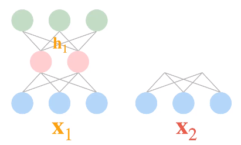
    - 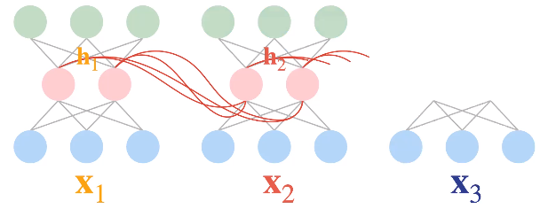
    - $h_t = tanh(x_tW_x + h_{t-1}W+b)$
        - $h_1 = tanh(x_1W_x + b)$
        - $h_2 = tanh(x_2W_x + h_1W_h+b)$
        - 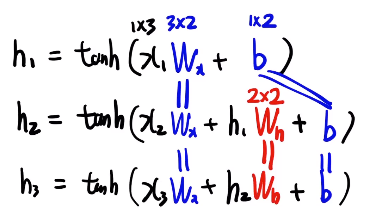
        - $\hat{y_3} = h_3W_y + b_y$

- 이렇게 함으로써 얻는 효과는?
    - h가 이전 정보를 담는 역할을 함 (RNN은 이전 정보를 담아낸다)
    - 가변적인 입력을 처리할 수 있다.
        - `나는 OO 입니다` 라는 문장의 토큰이 3개이든, `나는 OO 옷을 입을 OO입니다.` 라는 문장의 토큰이 5개이든, 토큰의 길이가 달려져도 RNN의 파라미터 $W_x, b, W_h$ 학습이 수월하다.
        - 반면, RNN이 아닌 MLP 였다면 토큰의 길이가 통일되어야지만 동일한 네트워크를 사용할 수 있었겠음
        - RNN의 이런 구조 때문에, 아래의 특징이 있음(RNN의 구조적 한계)
        - `next token prediction: GPT`
            1. 멀수록 잊혀진다(`back propagation`) 
            2. 갈수록 흐려진다(`forward propagation`): tanh 때문
            - `vanishing gradient`
    - $L_{total} = L_1 + L_2 + L_3 + L_4 + ...$
        - $\frac{\partial L_4}{\partial W} = weight_1 X_1 + weight_2 X_2 + weight_3 X_3 + weight_4 X_4 + ... $
        - $weight_1 << weight_2 << weight_3 << weight_4 $ 라는 특징이 있다는 의미임
 

- 멀수록 잊혀지는 특징은, 직전 입력에만 큰 학습이 이뤄지게 된다.
    - 멀리있는 단어는 활성화함수의 미분이 중첩(`곱`)되면서 매우 작은 값이 되어지기 때문

- 갈수록 잊혀지는 특징은, forward inferencing에 있어서, `tanh`에 의해서 곱해지는 과정에서 1보다 작은값이 누적곱되면서 작아지기 때문임


- 유형
    1. One to Many : 대표적으로 image captioning
    2. Many to One : 문장의 Score, 감정 점수 등 
    3. Many to Many : 번역기 등 (seq2seq)
        - seq2seq
            - 인코더와 디코더를 각각의 rnn을 붙여놓은것
            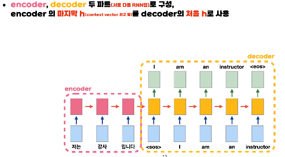
            - decoder는 `next token predictor`임
            - encoder의 마지막 h(context vector)를 decoder의 처음h로 사용
            - cell은 plain RNN보다는 LSTM이나 GRU를 주로 사용
                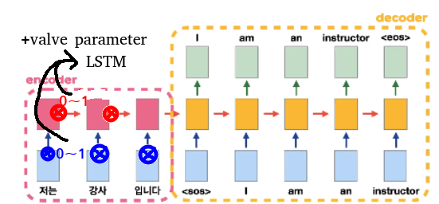
                - 그러나, 멀수록 잊혀지는 문제는 해결되지 못함
                - LSTM은 인풋(X)와 히든(h)에 대한 밸브(0~1)를 두고 학습시킴으로써 문제를 해결하려고 했으나, 여전히 멀리 위치할 수록 학습 시에 누적(곱)에 의해 영향을 덜 받게 됨
        - seq2seq 구조의 문제점
            1. 멀수록 잊혀진다. (인코더, 디코더 모두에 해당)
            2. context vector에 마지막 단어의 정보가 가장 뚜렷하게 담기니, 그런 h로 decoder가 번역하다 보니 마지막 단어만 제일 열심히 본다. (인간의 사고 방식이 아님)
                - 트랜스포머는 'Attention`을 이용한 것으로, 어떤 단어에 집중할지를 선택할 수 있게 된다.

- Insight for Attention
    - 직관적 이해를 위한 [어텐션 강의](https://www.youtube.com/watch?v=8E6-emm_QVg)
    - `RNN+Attention`
        - 인식한 문제점 
            1. seq2seq는 왜 마지막 context vector만을 디코더에 전달하느냐,
            2. 입력된 단어 토큰 중, 어떤것을 더 집중해야할지를 반영할 수 있어야 하는데 말이지.
        - 개선 
            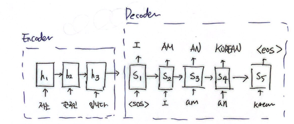
            1. 디코더에서 사용하는 context vector를 전달하는 부분에서 Attention mechanism을 이용하자!
            2. seq2seq에서 $\hat{y_4} = s_4W+y + x_4W_x$였다면, $\hat{y_4} = s_4W_y + c_4W_y'+x_4W_x$로 바꾼 뒤 $c_4$를 attention으로 만들어보자
                - 내적과 가중합을 이용
                - $c_4 = <s_4,h_1>h_1 + <s_4, h_2>h_2 + <s_4, h_3>h_3$로 구함으로써, 어떤 임베딩 벡터 $h$에 주목하여야할지를 학습하자.
        - 한계
            1. 문제는 여전히 h와 s를 RNN의 chain을 이용하기 때문에 발생하는 멀수록/갈수록 잊혀지는 문제
            2. 디코더에서만 attention된 context vector를 사용하는 것이기 때문에 `멀수록 잊혀지는 문제`는 여전함
            3. 심지어, 시점상 뒤에 있는 단어는 참고조차 하지 않는 문제가 있음 (Chain으로 이어져 있으니까)
            - 즉, 의미를 제대로 못 담은 h에 attention 한다.

    - 트랜스포머는 위의 문제를 해결하기 위해, chain을 다 끊어버림
        - chain을 끊었다는 의미가, RNN을 없애고 self-attention을 사용했다는 의미임
        - [트랜스포머는 attention을 적극 활용](./img/필기1.jpg)
            - RNN을 완전히 버렸다.
            1. Decoder가 마지막 단어만 열심히 보는 문제(갈수록 흐려진다)를 attention으로 해결
            2. 학습 시, 멀수록 잊혀지는 문제를 self-attention으로 해결 
            3. 의미를 제대로 못 담은 h에 attention (갈수록 흐려진다)를 self-attention으로 해결
        - `Self Attention` 
            - c: context vector (attention, 인코더-디코더 연결)
                - $c_4 = <s_4, h_1>h_1 + <s_4, h_2>h_2 + <s_4, h_3>h_3$
            - s: sequence vector (self-attention, decoder, `masked self attention`)
                - $s_4 = <s_4, s_1>s_1 + <s_4, s_2>s_2 + <s_4, s_3>s_3 + <s_4, s_4>s_4 $
                - $s_5$는 정답이기 때문에 알려주어선 안되지
                    - ~~+<s_5, s_4>s_5~~
            - h: word embedding vector (self-attention, encoder)
                - $h_2 = <h_2, h_1>h_1 + <h_2, h_2>h_2 + <h_2, h_3>h_3$
            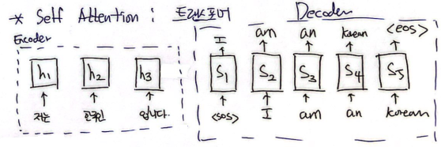
            - 참고: 위의 수식에서 h를 생성하는데 사용하는 x는 (단어와 위치 정보)가 임베딩된 상태여야 한다.
                - chain을 끊어냈기 때문에, 순서정보를 담아서 전달해 주어야함

## 02. Transformer - Attention is all you need

- 자연어 언어 모델에서 강력한 성능
- 이미지 분야에서 CNN이 있다면, 언어 분야에는 트랜스포머(self-attention)가 있는 것
- self-attention을 활용한 모델로, 내적을 이용한 weighted sum을 이용하여 단어 간의 관계를 효과적으로 학습하고 표현함
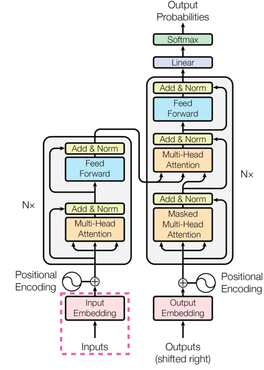

1. Transformer
    1. Embedding 구조
        - input이 이미지라면 (`개수x채널x사이즈hx사이즈w`)
            - 개/채/행/열
        - input이 문장이라면 (`문장 개수x가장 긴 문장의 단어 개수x임베딩된 단어의 차원 크기`)
            - 개/단/차
            - 문장마다 단어 개수가 다르니, 이를 맞춰주기 위해 <pad> 토큰을 이용해서 길이를 맞춰준다.

        1. Input Embedding
            - one-hot 인코딩 되어 있는 것을 FC layer에 통과시키는 것
        2. Positional Encoding 
            - Embedding만 되어서는 순서정보를 담을 수 없다.
            - 단어의 위치를 one-hot 해서, 그것을 FC layer에 통과시키는 것
            - 순서 정보를 알려주어야 한다.
            - `트랜스포머 논문 자체`에서는 Positional Encoding 자체의 FC는 학습시키지 않고 고정된 벡터를 사용함
                - `sin, cos` 함수 사용함
            - 이후 논문에서는 여기에서의 파라미터도 학습의 대상으로 함
        3. Input Embedding + Positional Encoding 두개를 더하여 Embedding 정보를 만든다.

    2. Encoder 전체 구조
        - Multi-Head Attention
            - 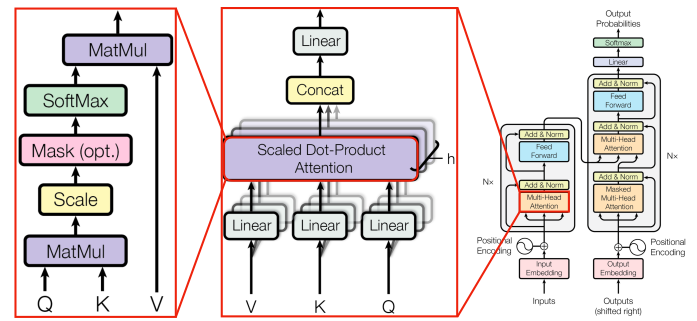
            - Key, Query, Value
                - 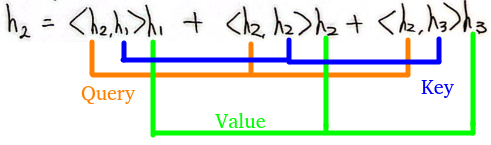
            - Query: 관계를 물어볼 기준 단어 벡터 
                - `질문`
            - Key: Query와 관계를 알아볼 단어 벡터
                - `답변`
            - Value: 키 단어의 의미를 담은 벡터
                - `표현`
            - 키,쿼리,밸류의 역할은 각각 다르기 때문에 이를 각각의 FC 레이어로 학습함
            - 이러한 키,쿼리,밸류 set을 CNN의 필터 개수처럼 여러개 배치한 것을 `Multi-Head Attention`이라 부름
                - 멀티 헤드에서 똑같은 Loss를 가지고 Back-propagation 하더라도, 파라미터 초기값이 서로 다르니, 각각 다르게 바이어스를 가지게끔 학습됨
                - 멀티 헤드를 둠으로써, 여러 필터를 두는 것과 같은 효과가 발생한다. (~=CNN의 복수개의 필터)
            - `Multi-Head Attention`의 효과
                - 멀티 헤드의 하나의 헤드 헤드가 각각 바이어스를 가지고 학습되니, 앙상블의 효과, `집단지성`과 유사한 효과가 나타남
            - Scaled Dot-Product Attention 이후 Concat->Linear를 통과하게 되면서 여러 헤드의 출력이 조화가 이루어지게 됨
                - `의견교류`
            - 이 전체를 N번 반복하여 인코더에서 `word embedding vector(h)`를 만들어냄
        
    3. Decoder 구조
        - `Masked Multi-Head Attention`
        - 학습 시에는 `next token`의 참값을 집어넣어서 지도학습하고, test 땐 자신의 출력을 입력으로 사용함
        - `Masked`를 해주어야 하는 이유는 정답을 보여주고 학습시킬 순 없으니까..!
    4. Encoder-Decoder Attention 구조
        - 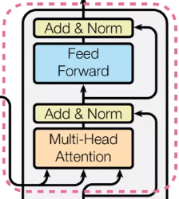
        - Q로는 디코더 레이어에서의 출력 임베딩 벡터를, K/V는 인코더 레이어에서의 출력 임베딩 벡터를 사용함

        - 3번+4번 `self-atten -> enc-dec-atten -> FF` 순서로 통과하게됨
            - 디코더로 문장을 파악 -> 입력 문장에서 뭘 주목하는지 보고 -> 다음 단어 예측
        
    - softmax(내적+가중합)를 수행하는 attention 함수
        - 이를 통해 어떤 것에 주목하여야하는지를 학습할 수 있게 됨
        - 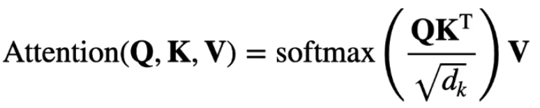
        - 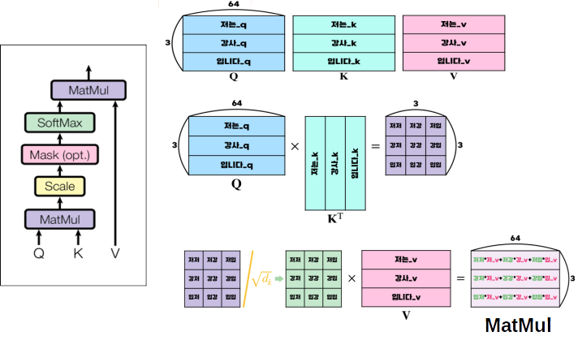

    - 단어 사이 사이에 어떤 단어 끼리 관계가 있는지를 학습하는 것이 Attention 임
        - 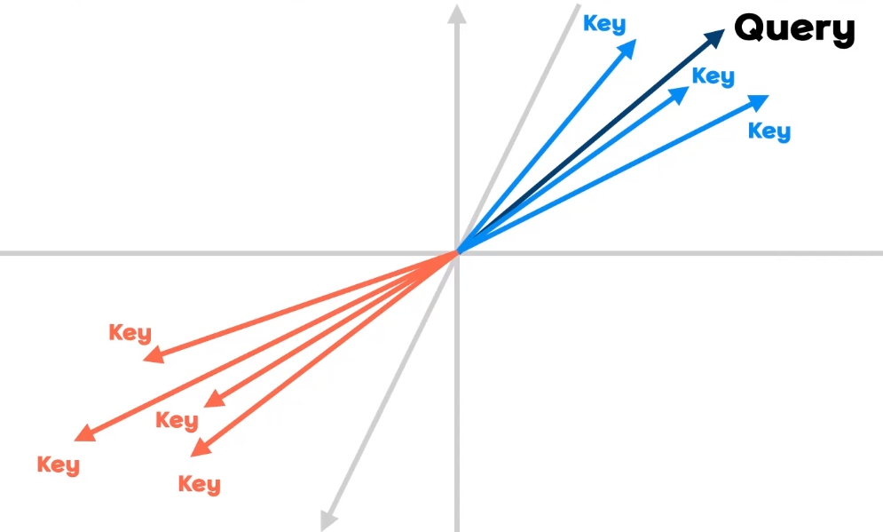
        - 왜 관련 없는 단어이 벡터가 Query에 수직이 아닐까?
            - 수직이면 cos 내적은 0이 될텐데
            - 소프트맥스를 취하였기 때문임
                - 내적이 0이 나오는거 보다 음수로 나오는게 더 작은 값이 되니까

    - 추론할때는 단어 SET을 넣어주어야함
        - `next token predictor`이기 때문에 알고자하는 단어 이전에 등장한 모든 단어를 입력해주어야함

2. Transformer Evaluation
    - 평가를 위한 지수임
    - 문장은 주관적이니까, 이미지 분류 문제처럼 1 또는, 0으로 평가할 수는 없음
    - `PPL, BLEU score`를 주로 사용함
    
    1. PPL(Perplexity)
        - 당혹감, 헷갈려하는 정도를 평가하기 위한 것
        - CrossEntropy에 exp를 취하면 PPL이 됨
        - 문장 전체에 대해서 헷갈려하는 정도에 대한 metric임

    2. BLEU score
        - 번역task에 있어선 많이 쓰이는 편
        - N-gram precision을 이용: 연속한 n 개 단어가 정답 문장에 존재하는지
        - Unigram이 아니라, N-gram을 쓰는 이유는 순서까지도 맞추어야하기 때문임

3. Overall
    - attention 구조에 FC만을 사용하였는데, (학습 대상은 오직 FC임) 혁신적 성능을 보여줌
    - 여러 문제 (이미지: `ViT`)에 적용이 확장되고 있다.

## 03. Code

### 1. Basic 블록

1-1. 멀티 헤드 어텐션

```python
        class MHA(nn.Module):
        def __init__(self, d_model, n_heads):
            super().__init__()

            self.n_heads = n_heads

            self.fc_q = nn.Linear(d_model, d_model) # 차 or 개x차 or 개x개x차 로 입력해줘야
            self.fc_k = nn.Linear(d_model, d_model)
            self.fc_v = nn.Linear(d_model, d_model)
            self.fc_o = nn.Linear(d_model, d_model)

            self.scale = torch.sqrt(torch.tensor(d_model / n_heads))

        def forward(self, Q, K, V, mask = None):
            Q = self.fc_q(Q) # 개단차
            K = self.fc_k(K)
            V = self.fc_v(V)

            Q = rearrange(Q, '개 단 (헤 차) -> 개 헤 단 차', 헤 = self.n_heads) # 개단차 -> 개헤단차
            K = rearrange(K, '개 단 (헤 차) -> 개 헤 단 차', 헤 = self.n_heads)
            V = rearrange(V, '개 단 (헤 차) -> 개 헤 단 차', 헤 = self.n_heads)

            attention_score = Q @ K.transpose(-2,-1)/self.scale # 개헤단단

            if mask is not None:
                attention_score[mask] = -1e10

            attention_weights = torch.softmax(attention_score, dim=-1) # 개헤단단

            attention = attention_weights @ V # 개헤단차

            x = rearrange(attention, '개 헤 단 차 -> 개 단 (헤 차)') # 개헤단차 -> 개단차
            x = self.fc_o(x) # 개단차

            return x, attention_weights
```

1-2. Feed Forward(FC)
```python
    class FeedForward(nn.Module):
        def __init__(self, d_model, d_ff, drop_p):
            super().__init__()
            self.linear = nn.Sequential(nn.Linear(d_model, d_ff),
                                        nn.ReLU(),
                                        nn.Dropout(drop_p), 
                                        nn.Linear(d_ff, d_model))

        def forward(self, x):
            x = self.linear(x)
            return x
```
### 2. Encoder 모듈

2-1. 인코더 레이어

```python
    class EncoderLayer(nn.Module):
    def __init__(self, d_model, d_ff, n_heads, drop_p):
        super().__init__()

        self.self_atten = MHA(d_model, n_heads)
        self.self_atten_LN = nn.LayerNorm(d_model)

        self.FF = FeedForward(d_model, d_ff, drop_p)
        self.FF_LN = nn.LayerNorm(d_model)

        self.dropout = nn.Dropout(drop_p)

    def forward(self, x, enc_mask):
        residual, atten_enc = self.self_atten(x, x, x, enc_mask) # 인코더에도 마스크 존재함: 패딩 토큰이 학습에 영향을 주지 않게 하려고
        residual = self.dropout(residual)
        x = self.self_atten_LN(x + residual)

        residual = self.FF(x)  
        residual = self.dropout(residual)
        x = self.FF_LN(x + residual)

        return x, atten_enc
```

2-1. 인코더 모듈(`Nx`번 인코더를 배치)

```python
    class Encoder(nn.Module):
    def __init__(self, input_embedding, max_len, n_layers, d_model, d_ff, n_heads, drop_p):
        super().__init__()

        self.scale = torch.sqrt(torch.tensor(d_model))
        self.input_embedding = input_embedding
        self.pos_embedding = nn.Embedding(max_len, d_model)

        self.dropout = nn.Dropout(drop_p)

        self.layers = nn.ModuleList([EncoderLayer(d_model, d_ff, n_heads, drop_p) for _ in range(n_layers)])

    def forward(self, src, mask, atten_map_save = False): # src.shape = 개단, mask.shape = 개헤단단
        pos = torch.arange(src.shape[1]).expand_as(src).to(DEVICE) # 개단

        x = self.scale*self.input_embedding(src) + self.pos_embedding(pos) # 개단차
        # self.scale 을 곱해주면 position 보다 token 정보를 더 보게 된다 (gradient에 self.scale 만큼이 더 곱해짐)
        x = self.dropout(x)

        for layer in self.layers:
            x, atten_enc = layer(x, mask)

        return x, atten_encs
```

### 3. Decoder 모듈
3-1. 디코더 레이어

```python
    class DecoderLayer(nn.Module):
    def __init__(self, d_model, d_ff, n_heads, drop_p):
        super().__init__()

        self.self_atten = MHA(d_model, n_heads)
        self.self_atten_LN = nn.LayerNorm(d_model)

        self.enc_dec_atten = MHA(d_model, n_heads)
        self.enc_dec_atten_LN = nn.LayerNorm(d_model)

        self.FF = FeedForward(d_model, d_ff, drop_p)
        self.FF_LN = nn.LayerNorm(d_model)

        self.dropout = nn.Dropout(drop_p)

    def forward(self, x, enc_out, dec_mask, enc_dec_mask):
        residual, atten_dec = self.self_atten(x, x, x, dec_mask)
        residual = self.dropout(residual)
        x = self.self_atten_LN(x + residual)

        residual, atten_enc_dec = self.enc_dec_atten(x, enc_out, enc_out, enc_dec_mask) # Q는 디코더로부터 K,V는 인코더로부터!!
        residual = self.dropout(residual)
        x = self.enc_dec_atten_LN(x + residual)

        residual = self.FF(x)
        residual = self.dropout(residual)
        x = self.FF_LN(x + residual)

        return x, atten_dec, atten_enc_dec
```

3-2. 디코더 모듈(`Nx`번 디코더를 배치)

```python
    class Decoder(nn.Module):
    def __init__(self, input_embedding, max_len, n_layers, d_model, d_ff, n_heads, drop_p):
        super().__init__()

        self.scale = torch.sqrt(torch.tensor(d_model))
        self.input_embedding = input_embedding
        self.pos_embedding = nn.Embedding(max_len, d_model)

        self.dropout = nn.Dropout(drop_p)

        self.layers = nn.ModuleList([DecoderLayer(d_model, d_ff, n_heads, drop_p) for _ in range(n_layers)])

        self.fc_out = nn.Linear(d_model, vocab_size)

    def forward(self, trg, enc_out, dec_mask, enc_dec_mask, atten_map_save = False): # trg.shape = 개단, enc_out.shape = 개단차, dec_mask.shape = 개헤단단
        pos = torch.arange(trg.shape[1]).expand_as(trg).to(DEVICE) # 개단

        x = self.scale*self.input_embedding(trg) + self.pos_embedding(pos) # 개단차
        # self.scale 을 곱해주면 position 보다 token 정보를 더 보게 된다 (gradient에 self.scale 만큼이 더 곱해짐)
        x = self.dropout(x)

        for layer in self.layers:
            x, atten_dec, atten_enc_dec = layer(x, enc_out, dec_mask, enc_dec_mask)

        x = self.fc_out(x)

        return x, atten_decs, atten_enc_decs
```

### 4. Transformer 조립

```python
class Transformer(nn.Module):
    def __init__(self, vocab_size, max_len, n_layers, d_model, d_ff, n_heads, drop_p):
        super().__init__()

        self.input_embedding = nn.Embedding(vocab_size, d_model)
        self.encoder = Encoder(self.input_embedding, max_len, n_layers, d_model, d_ff, n_heads, drop_p)
        self.decoder = Decoder(self.input_embedding, max_len, n_layers, d_model, d_ff, n_heads, drop_p)

        self.n_heads = n_heads

        # for m in self.modules():
        #     if hasattr(m,'weight') and m.weight.dim() > 1: # layer norm에 대해선 initial 안하겠다는 뜻
        #         nn.init.kaiming_uniform_(m.weight) # Kaiming의 분산은 2/Nin

        for m in self.modules():
            if hasattr(m,'weight') and m.weight.dim() > 1:
                nn.init.xavier_uniform_(m.weight) # xavier의 분산은 2/(Nin+Nout) 즉, 분산이 더 작다. => 그래서 sigmoid/tanh에 적합한 것! (vanishing gradient 막기 위해)

    def make_enc_mask(self, src): # src.shape = 개단

        enc_mask = (src == pad_idx).unsqueeze(1).unsqueeze(2) # 개11단
        enc_mask = enc_mask.expand(src.shape[0], self.n_heads, src.shape[1], src.shape[1]) # 개헤단단
        """ src pad mask (문장 마다 다르게 생김. 이건 한 문장에 대한 pad 행렬)
        F F T T
        F F T T
        F F T T
        F F T T
        """
        return enc_mask

    def make_dec_mask(self, trg): # trg.shape = 개단

        trg_pad_mask = (trg == pad_idx).unsqueeze(1).unsqueeze(2) # 개11단
        trg_pad_mask = trg_pad_mask.expand(trg.shape[0], self.n_heads, trg.shape[1], trg.shape[1]) # 개헤단단
        """ trg pad mask
        F F F T T
        F F F T T
        F F F T T
        F F F T T
        F F F T T
        """
        trg_future_mask = torch.tril(torch.ones(trg.shape[0], self.n_heads, trg.shape[1], trg.shape[1]))==0 # 개헤단단
        trg_future_mask = trg_future_mask.to(DEVICE) # pad_mask | future_mask 할 때 같은 DEVICE 여야
        """ trg future mask
        F T T T T
        F F T T T
        F F F T T
        F F F F T
        F F F F F
        """
        dec_mask = trg_pad_mask | trg_future_mask # dec_mask.shape = 개헤단단
        """ decoder mask
        F T T T T
        F F T T T
        F F F T T
        F F F T T
        F F F T T
        """
        return dec_mask

    def make_enc_dec_mask(self, src, trg):

        enc_dec_mask = (src == pad_idx).unsqueeze(1).unsqueeze(2) # 개11단
        enc_dec_mask = enc_dec_mask.expand(trg.shape[0], self.n_heads, trg.shape[1], src.shape[1]) # 개헤단단
        """ src pad mask
        F F T T
        F F T T
        F F T T
        F F T T
        F F T T
        """
        return enc_dec_mask

    def forward(self, src, trg):

        enc_mask = self.make_enc_mask(src)
        dec_mask = self.make_dec_mask(trg)
        enc_dec_mask = self.make_enc_dec_mask(src, trg)

        enc_out, atten_encs = self.encoder(src, enc_mask)
        out, atten_decs, atten_enc_decs = self.decoder(trg, enc_out, dec_mask, enc_dec_mask)

        return out, atten_encs, atten_decs, atten_enc_decs 
```

### 5. feature map (attention) 분석
- 헤드마다의 attention이 어느 토큰을 보고 피처를 만들어내는지 살펴보니, 잘 학습된 것을 확인할 수 있음


## 04. More
- ViT(Vision Transformer)
    - 패치를 나눠서 입력해주는 게 `ViT`인데, 이건 무슨 역할을 한걸까?
        1. 기존 CNN은 receptive field의 사이즈를 하이퍼 파라미터로 고정한 뒤, 레이어가 깊어질 수록 이미지픽셀을 작게보다가 점점 넓게보는 (즉, 작은 픽셀에서 큰 픽셀로의 inductive bias가 설정되어지는) 네트워크의 특징이 있었음
        2. receptive filed의 사이즈도 적절하게 학습되도록 AI가 해주게 한다면 더 나아지지 않을까? -> `ViT`
        3. 이를 위해, 패치를 쪼개서 입력하면, attention mechanism에 의해 필요한 부분에서 자기가 attention 해서 recpetive field 사이즈를 학습하게 되는 것임
        4. 그래서, 성능이 좋았다. (데이터가 많아진다면,)

- 그 외1: Batch Normalization, Layer Normalization
    - [정규화 관련 강의](https://www.youtube.com/watch?v=daDQUBTISVg&list=PL_iJu012NOxdDZEygsVG4jS8srnSdIgdn&index=26)
    - 비유: 모래알들을 들어서 activation 함수의 어디에다가 뿌려줄지를 학습시키기 위함임
        - 그렇게 되면, vanishing gradient도 해결해줄 수 있고, 필요에 따라 비선형 activation을 필요로하는지, 선형 activation을 필요로하는지도 학습시킬 수 있기 때문

- 그 외2: Resnet의 Skip Connection
    - [Skip Connection 강의](https://www.youtube.com/watch?v=Fypk0ec32BU&list=PL_iJu012NOxd_lWvBM8RfXeB7nPYDwafn&index=14)
    - 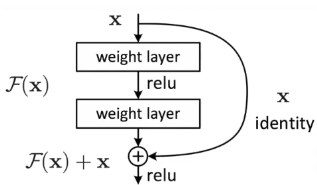
    - 레이어가 깊을 수록.., 한 레이어가 학습의 모든 역할을 담당하는게 아니고, 적절하게 분배해서 가져가는 것이 성능이 더 좋을 것이다. 한 쪽에 모든걸 다 담당하게 되면 오버피팅될 가능성이 높다는 의미니까.
    - 해서 skip connection을 두어서 천천히 학습되게끔 한것이다.
        - `X'=f(X)+X`
        - `X'=f(X)` 
    - 위의 두 식이 있다고 헀을 때, 첫번째 수식은 `f`는 0이면 달성가능할 거고, 두번째 수식은 `f`는 1이면 달성가능할거다
    - weight의 초기값은 0근처의 값으로 하니까, Loss는 크지 않게 나오겠지.
    - 그렇게 됨으로써, 천천히 학습하라고 하는 네트워크 설계를 통한 가이드가 이루어지는 것임


## 05. TO DO
1. 코드와 논문, 강의를 살펴보며 체득화한 포스팅 작성 하기 (8/18)


## 끝