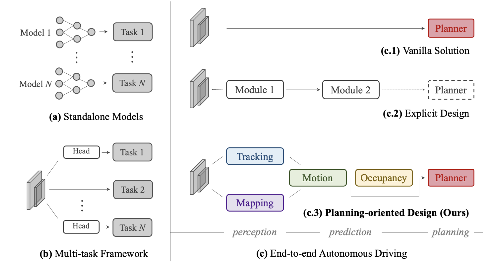
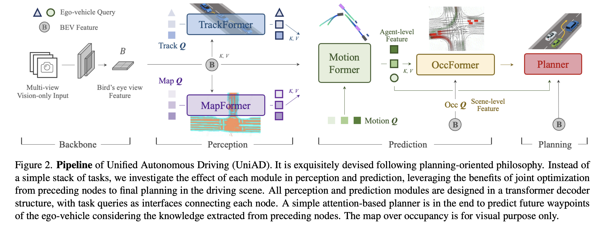
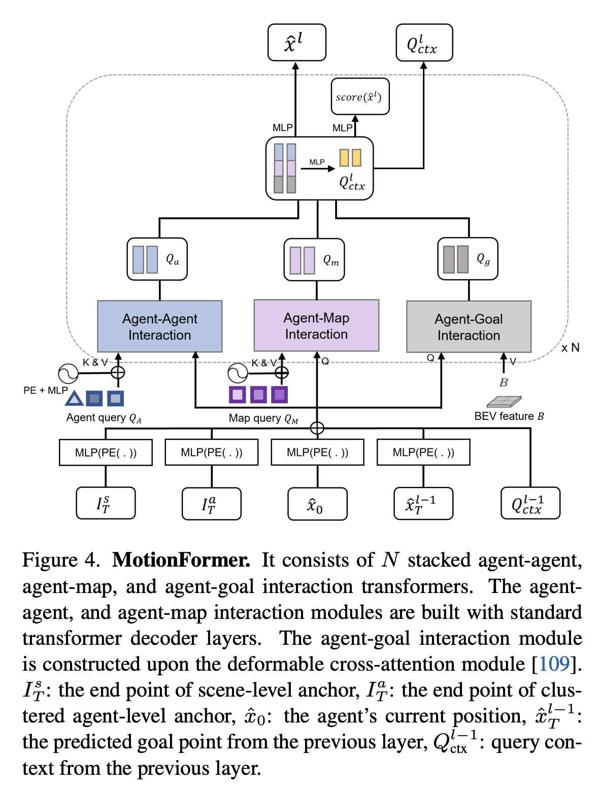
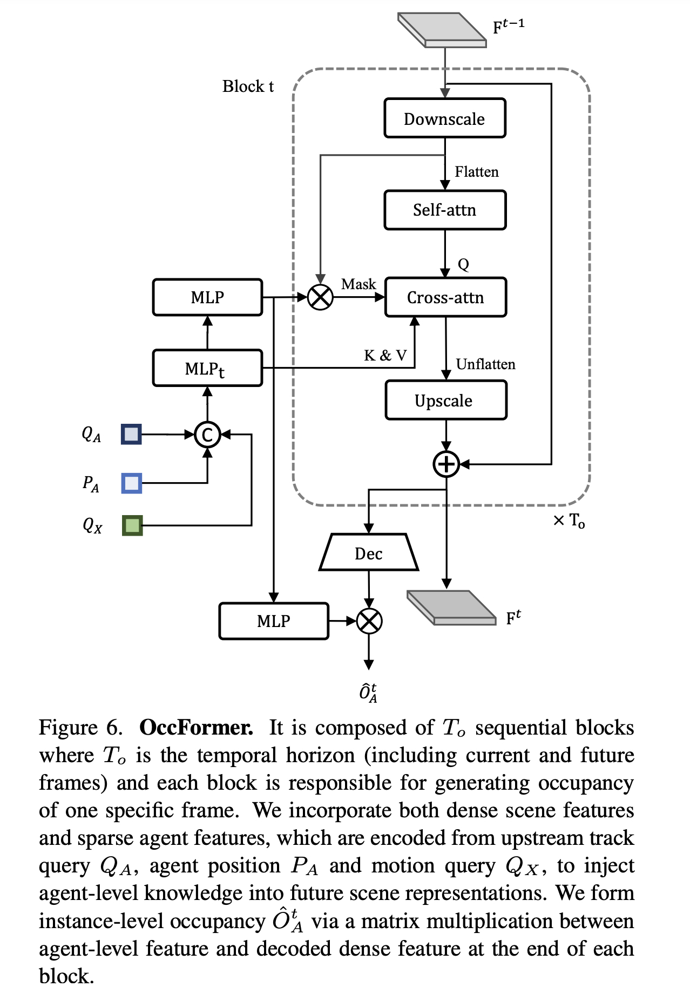
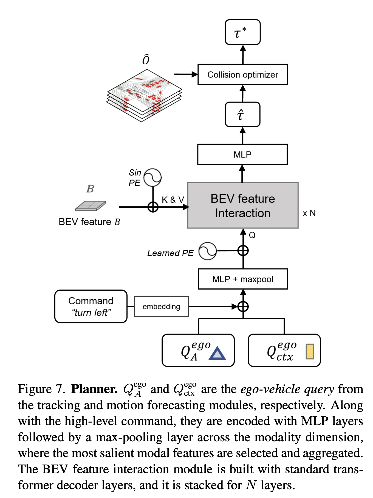
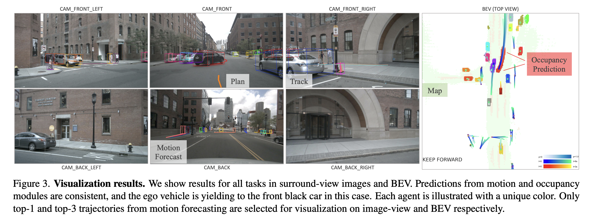
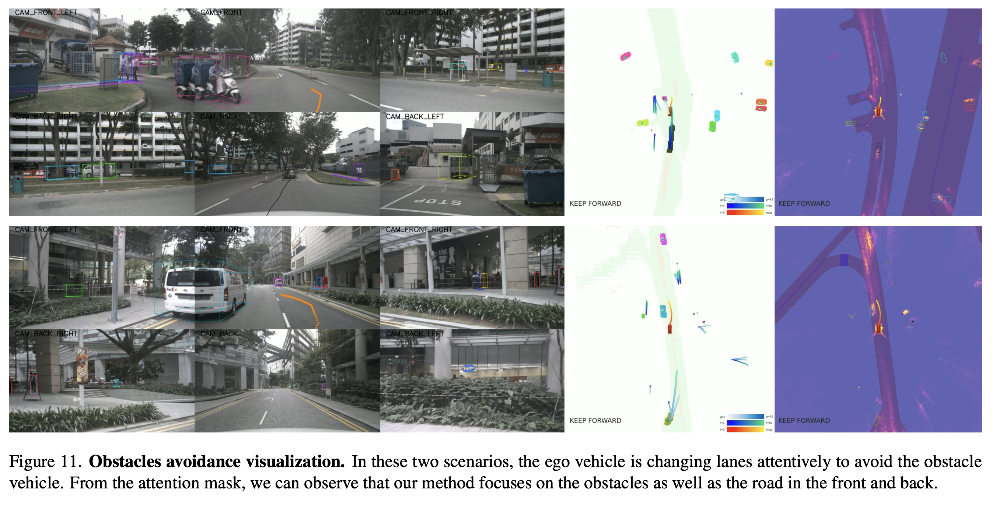
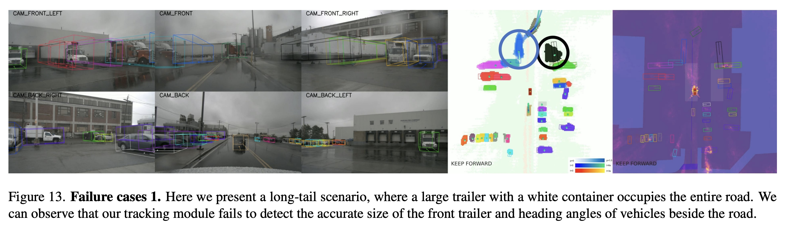

# Paper Review
> Writer: SungwookLE    
> DATE: '24.9/1    
> [UniAD:Planning-oriented Autonomous Driving](https://arxiv.org/pdf/2212.10156)

## 1. Abstract
- 모듈러 방식으로 구성된 자율주행 SW는 모듈을 통과할 때마다의 출력 오차가 누적되는 현상으로 인해, 많은 문제를 겪고 있음
- 자율주행에서 인지/예측 등의 모듈들은 planning을 위해 필요한 것이므로, `Unified Autonomous Driving(UniAD)` 라는 풀스택 네트워크를 제안한다.
    - Prediction and planning as a whole
    - Planning-oriented
- End-To-End 네트워크에서도 구조화를 통해 모듈화를 달성할 수 있고, 효과적이다. (`c-3`)
    - 

## 2. Methodology
- 
- UniAD는 트랜스포머 디코더로 구성되어 있음(Perception, Prediction, Planner)
    - `TrackFormer, MapFormer, MotionFormer, Planner`
1. Perception: Tracking and Mapping
    - TrackFormer: 트랙 정보 (detect)
        - Detection과 Multi-Object Tracking을 수행하는 역할임
        - BEV(Bird-eye view) feature 정보를 입력으로 받음
    - MapFormer: Semantic 도로 정보
        - Panoptic SegFormer
2. Prediction: Motion Forecasting
    - MotionFormer: agent의 미래 경로를 예측
        - agent-agent, agent-map, agent-goal point 정보를 입력으로 받음
        - 
    - OccFormer: occupancy 맵 상의 정보를  (Occupancy Prediction)
        - pixel-agent interaction, instance-level occupancy
        - 
3. Planning
    - Planner: 플래닝 결과를 출력 (without HD maps)
    - 
- Learning
    - 2개의 stage로 나뉨: Perception parts를 학습 시킨 다음에, End-To-End 전체 모델을 학습시킴

## 3. Experiments
- 
- 결과는 우수하였음 (기존 제시된 E2E 모델 대비,)

## 4. Conclusion
- Planning oriented pipeline을 제시하였음
- 통합시킴으로써, 얻는 이점이 있음 (원하는건 결국 planning 결과이니까)
- 장애물 회피 주행
    - 
- 개선이 필요한 부분
    - 객체 인식이 잘되지 않았고, 그로 인해 플래닝이 잘되지 못함
    - 

## 끝