## 리눅스 임베디드 시스템
> [강의문서](https://docs.google.com/document/d/1cJHVAYuQCFqRORgQLozT6TiK2WVpNRngGoonO2fJtYg/edit)  
> [Git](https://github.com/AI-SoC/EMLINUX_20240902)  
> 작성일: 24.9/8  

## 1. 임베디드 시스템 (Embedded, Microcontroller, System-on-Chip)
- CPU+Data Memory(SRAM)+Code Memory(Flash)+Peripherals(주변장치) 구성됨
    - CPU: 연산 장치
    - Data Memory: SRAM
    - Code Memory: Flash

- 임베디드 시스템을 하나의 칩에 집적한 것을 System on Chip 이라고 함
- 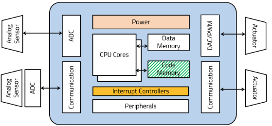
- Firmware는 칩의 flash 메모리에 저장된 SW를 의미함 (주로 하드웨어 관련된)
- 자동차 SW를 비롯한 제어기는 주로 `Non-OS`의 MCU에 임베디드된 시스템이었지만, 수행해야할 기능이 늘어남에 따라 `OS` 기반 시스템의 필요성이 증대하고 있음
    - ex: `AP` 기반의 OS가 탑재된 플랫폼 제어기

- 전체 시스템 아키텍처 관점
    - AS-IS: 분산 제어
        - 각 엣지 장치에 독립적인 임베디드 시스템 위치
        - inner control loop 중첩으로 복잡도 증대될 수 있음
        - 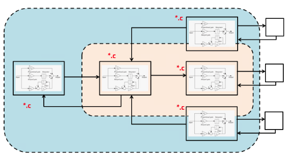
        - 엣지 장치에서 프로그램이 항상 물리 메모리에 올라가 있으니, 자원낭비가 있음

    - TO-BE: 중앙 제어
        - big & little 구조로 비대칭 아키텍처 구성(통합)
        - 어플리케이션 프로그램과 시스템 관련한 프로그램을 분리하여 구성 가능함
        - 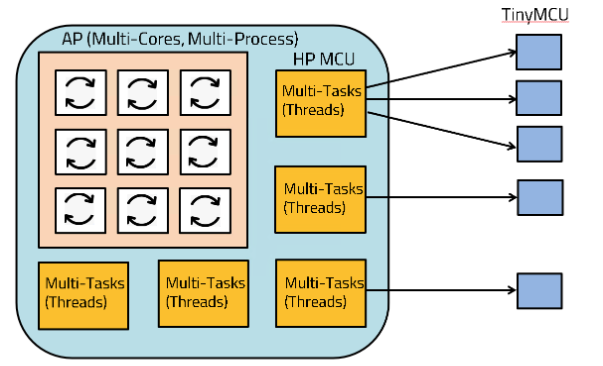
        - 이런 구성은 OS 기반의 가상화 기술로, 자원을 효율적으로 사용할 수 있게 함

- `OS`가 있는 것과 없는 것의 가장 큰 차이는,
    1. 가상화를 통한 멀티 프로세스/쓰레드 가능 여부와 
    2. 이를 가능케 하는 자원관리(Memory Management Unit)
    3. 이를 위한 추상화 아키텍처 (커널을 통한 SW,HW 디커플링) 
    이다.

- OS는 사용자 Application과 하드웨어 장치를 디커플링함
    - 사용자 코드에서는 장치 메모리에 대해서 알 필요가 없게 해줌
    - 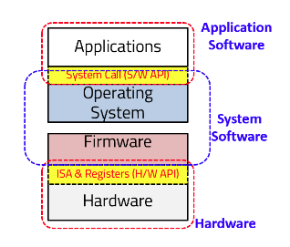
    - 즉, OS는 사용자에게 cpu와 메모리 자원 가상화를 제공하며 내장 하드웨어 장치 접근을 위한 추상화를 제공함

- 리눅스 OS로 제어시스템 구현시 커널에 대한 이해가 필요함
    - non-OS의 MCU 제어기와는 달리, application이 직접 장치를 제어하는 게 아니라, OS의 커널이 장치에 접근하여 제어하므로
    - `Kernel-Aware`, 커널 동작에 대한 이해를 바탕으로 원하는 특성에 맞게 사용자 코드 또한 작성되어야 함 (멀티 프로세스, 멀티 쓰레드)

- 참고: 멀티 프로세스와 멀티 쓰레드 차이 설명
    - 멀티프로세스:`main`이 복수개 (별도의 프로그램)
    - 멀티쓰레드: `main`은 1개이고 그 안에 task가 복수개 (한개의 프로그램)

## 2. OS기반 임베디드 시스템
- non-OS와 가장 큰 차이는, `MMU: Memory Management Unit`을 통한 가상화 지원과 이를 통한 멀티 프로세스, 멀티 쓰레드 기술임
- 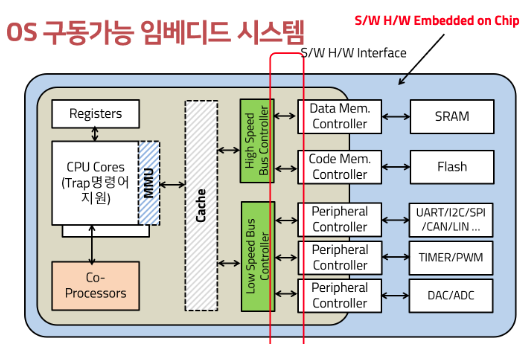
- 빌드(컴파일/링킹) 단계에서 실제 메모리 영역에 프로그램 이지미를 생성하는 것이 아니라, 가상 메모리 영역을 대상으로 프로그램 이미지를 생성함
    - 런타임때, 실제 물리 메모리에 가상 메모리에 쓰여진 프로그램을 매핑함
    - 이를 위해, MMU와 Cache가 필요함

- 이에 반해, non-OS MCU에서는 물리메모리에 프로그램이 직접 매핑되어서 구동되었음

### 시스템별 SW 실행방식 차이
1. Single Process
- function call 형태로 싱글 flow의 실행
- 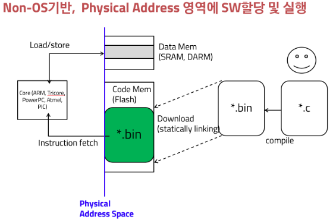

2. Single Procee + HW Interrupt에 의한 콜백 병행처리(ISR: 인터럽트 서비스 루틴)
- 
- Non-OS의 MCU 임베디드 시스템에서도 버튼을 눌렀을 때, 어떤 함수가 실행되던 이유(Context Switching)

3. Single process + HW interrupt + SW interrupt 에 의한 callback 병행처리 
- 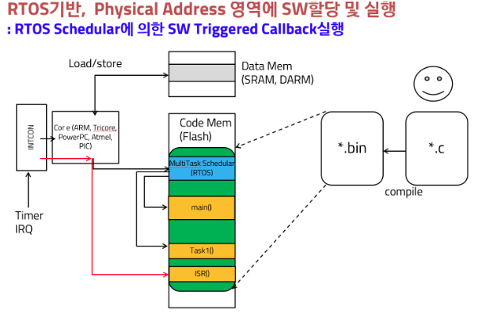
- HW Task(ISR)은 인터럽트 컨트롤러에 의해 런타임에 분기 (하드웨어적 context switching)
- SW Task는 내장 RTOS같은 SW의 policy에 따라, 중요한 task를 호출하는 것 (소프트웨어적 context switching)
- SW API(SW 인터럽트), HW API
    - SW API는 시스템콜 (스위칭)
    - HW API는 ISR (인터럽트 서비스 루틴)
- RTOS는 진짜 OS는 아님
    - MMU도 없고, 가상화도 지원안됨
    - 다만, SW 시스템콜을 통한 Task 스위치기가 가능하기 때문에 RTOS라고 부른는 것임

4. OS 기반 동적 프로그램 invoke
- 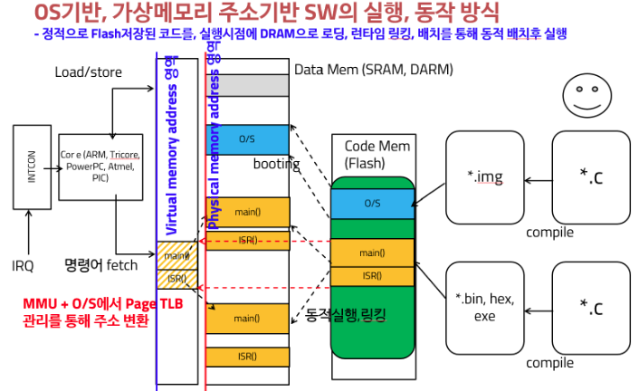
- 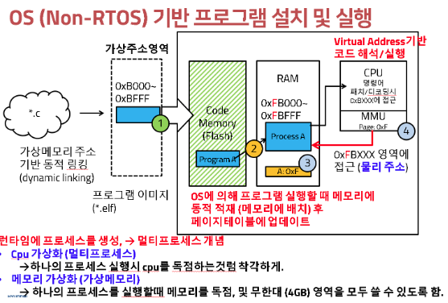
- 빌드(컴파일+링킹) 단계에서는 어느 물리 메모리 영역에 배치될지 모름(가상화)
- 32비트 주소라면 4기가 영역을 다 쓸 수 있다고 가정하고, 그 영역에 컴파일러가 배치함(가상 주소)
- 이후, 물리 메모리에 로딩될 때, 빈 공간을 찾아 그 영역에 배치될 수 있도록 프로그램 이미지를 동적 링킹
- 링킹 결과로 결정된 주소를 바탕으로 MMU에 위치 정보를 기록
    - 이걸 `Page In, Paging`이라고 함
- CPU는 가상메모리를 대상으로 컴파일된 프로그램 이미지를 실행하게 되면, MMU가 물리 주소 메모리 영역으로 리다이렉션함

### 실행 흐름
1. 싱글 프로세스 + 싱글 테스크
2. 싱글 프로세스 + 멀티 테스크
- 하나의 프로그램 안에서, 테스크 단위로 쪼개어서 프로그램 동작
- 아래 서술한 멀티 프로세스의 효과가 멀티 테스크에서도 동일하게 적용됨
    - 다만, 멀티 테스크는 사용자가 직접 코드 구현하였다는 차이가 있음
3. 멀티 프로세스
- 만약 CPU가 1개라면, 동시 진행되는 것은 아니고 프로세스마다 CPU 타임을 할당을 골고루 부여받아 실행한다고 보면됨
    - 이렇게 함에도 효과가 있는 이유는, 모든 프로그램은 I/O와 읽고,쓰는 과정에서 기다리고 있는 시간이 긴데,
    - 이 때, CPU도 같이 기다리게 하는 게 아니라 다른 프로세스를 실행하면 효율적이기 때문임
    - 이를 `IDLE효과`라고 함
4. 멀티 프로세스+멀티 테스크

5. 순서대로 싱글프로세스 / 싱글프로세스의 멀티테스크 / 멀티프로세스의 멀티테스크
- 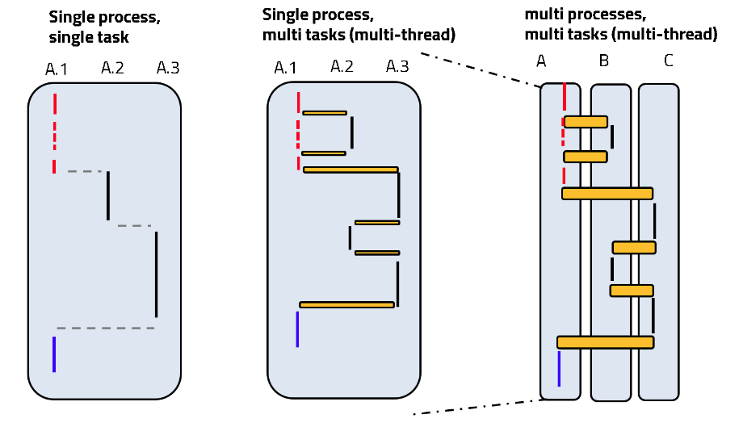

### 프로세스 간의 상태변환
- 멀티프로세스에서 CPU에 할당되는 프로세스의 상태변환은 다음과 같다.
    - 실행 가능 상태에 있는 프로세스 대기열 중 균등하게(이를 `round robin`이라고 함) CPU 타임을 할당하여 실행시킴
    - 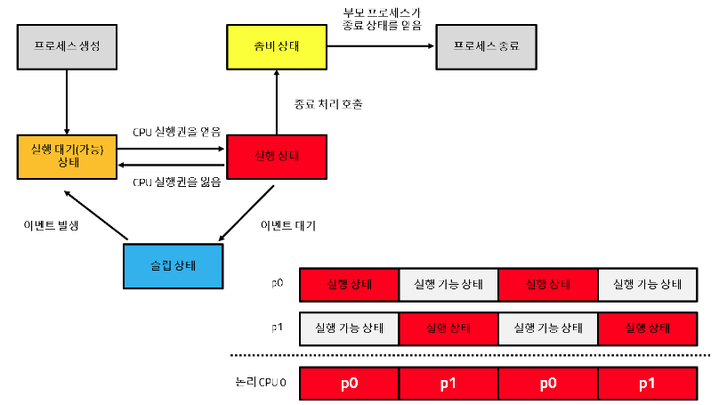

- 멀티 프로세스를 통해 동시에 실행시키는 원리
    1. 사용자 프로세스와 커널 프로세스
    - 사용자 프로세스와 커널 프로세스가 번갈아 가면서 cpu 시간을 할당받는다.
    - 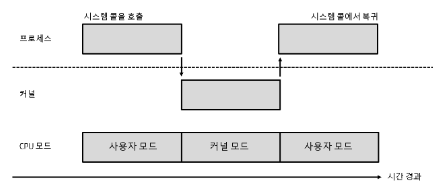
    2. 프로세스의 상태변환
    - 실행대기(가능) 상태
        - 프로세스가 여전히 할일이 남았으나, 균등 배분을 위해 잠시 실행대기된 것
    - 슬립상태
        - i/o 기다리는 등의 과정이므로 잠시동안은 cpu가 할일이 없기 때문에 슬립상태로 전환되는 것
        - 슬립상태에 있다가 준비 완료되면 다시 이벤트가 발생해서 실행대기 상태 큐에 들어감
        - 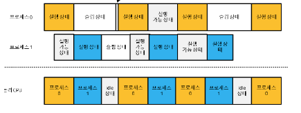

- Non-OS 타입의(RTOS 포함) 임베디드 시스템에서는 멀티 태스크를 구현하기 위해선, 프로그래머가 어떤 특정 상태(`wait`와 같이) 구간에 특정 프로세스가 진입하면, 다른 프로세스가 실행될 수 있도록 직접 프로그래밍해주었야 하였음
- 리눅스와 같이 OS시스템에서는 커널이 관리를 해주므로, wait 들어가면 다른 프로세스를 실행시켜 편리한 측면이 있음
    - 다만, 커널은 모든 프로세스를 연결리스트로 관리하기 때문에 기대에 비해 느릴 수 있음
    - 임베디드 리눅스 시스템에서는 목적에 맞게 커널을 손보는 방식으로 성능을 더 빠르게 할 수 도 있음

## 3. OS(리눅스)
- **리눅스의 철학 중 가장 대표적인 것은 모든 장치를 파일로 추상화하여 접근하는 것임**
    - 리눅스에서 모든 장치는 file로 추상화한다.
    - file에 읽고 쓰는 과정이 표준 커널과의 인터페이스임
- 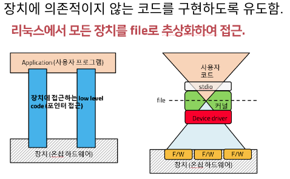 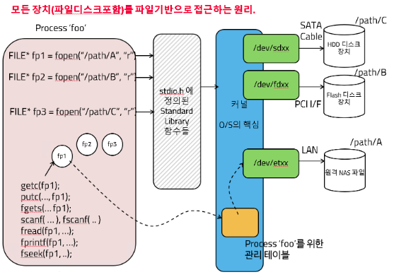

- 블록 단위의 바이너리 데이터로 장치 파일 데이터를 관리함
    - 바이너리로 관리하면, 비트연산 등을 통한 랜덤액세스(원하는 위치의 값만 쓰고 지우기)가 수월하기 때문임

- 커널 드라이버가, 장치에서의 읽고/쓰기 속도 차이에 의한 것들을 관리함
    - 자동으로 O/S callback에서 시간 지연 등을 통해 버퍼 오버런/언더런 등을 방지함
    - 이를 통해 싱크가 맞아지도록 관리함

- 시스템 콜을 이용한 HW 접근
    - 반드시, 시스템 콜(SW API)을 통해 OS 내부에 정의된 콜백을 통해 내장 하드웨어를 접근함
    - 그렇게 함으로써, 커널이 모든 프로그램의 메모리를 관리할 수 있게함
    - 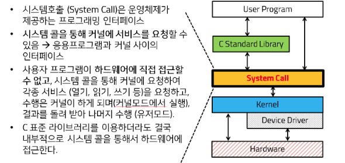

- 시스템콜이 커널에 요청을 하는 원리
    1. 온칩 레지스터를 경유한 argument passing
    2. trap을 통한 SW 인터럽트 발생
    3. trap을 이용하여 요구 프로그램 실행되도록 콜백
        - 특정 커널 위치에 사용자가 요구한 프로그램의 주소를 매핑해둠으로써, 자연스럽게 해당 프로그램이 실행(Context Switching)되게 하는 원리임
        - 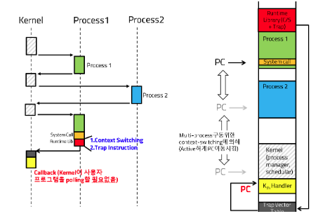

- 파일(모든 장치)에 대한 공유 영역 관리
    - 같은 파일에 대해 접근하려는 복수개의 프로세스가 있다면, 공유 자원에 대한 관리가 필요함
    - `race condition`
    - 이를 위해 lock이 필요함
        - 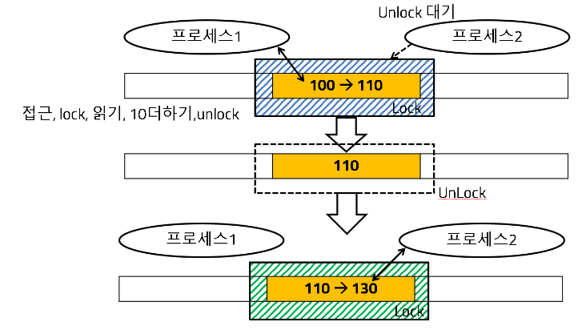
    - 프로세스가 `lock`영역에 접근 시 wait polling 하지 않음
        1. 커널은 해당 프로세스를 별도 테이블에 기록(Queue in)
        2. 무한히 기다리지 않고 `sleep` 상태로 전환됨
            - `sleep`에 있게됨으로써, cpu 타임이 할당되지 않고 다른 프로세스가 실행되게됨
        3. 해당 영역이 lock에서 풀리면, 커널에서 확인 후, 큐에서 가장 먼저 예약한 프로세스를 wake up 시켜서, 공유 자원을 사용케함

## 4. 프로세스 Management
1. 프로세스 생성
- 모든 프로세스는 `id`를 갖는다. `pid`
- `fork()` 시스템콜을 통한 프로세스 생성
    - 부모 프로세스의 메모리 공간의 값(상태값)을 모두 자식으로 복제함 
    - lambda의 capture의 방식을 떠올리면 됨 (자식이 생성된 순간에 존재하는 부모의 변수를 복제함)
    - 자식 프로세스의 실행위치도 fork() 다음이 됨. `fork()` 다음 라인부터 프로그램이 시작됨
        - 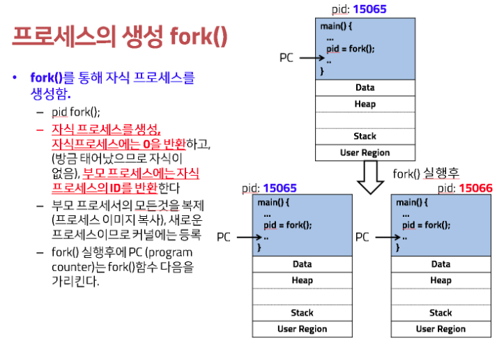
    
    - `fork()` 함수는 자식 프로세스의 ID를 반환함
        - 부모 프로세스는 자식 프로세스의 ID를 리턴받는 반면, 자식 프로세스는 자식이 없으므로 리턴되는 ID는 0임
        - 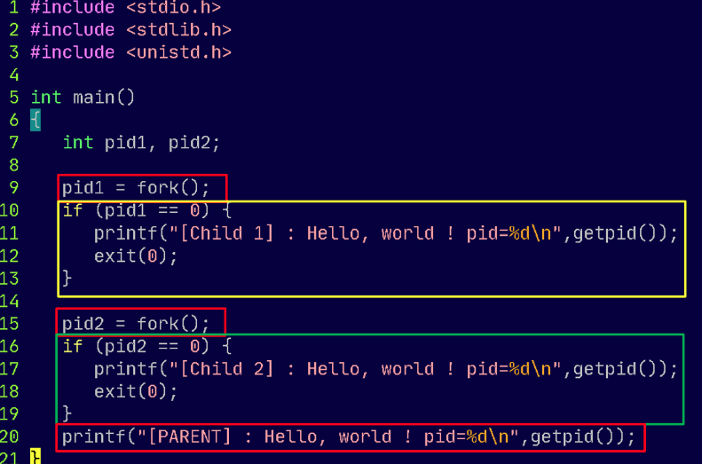

    - 부모 프로세스와 자식프로세스는 독립된 프로세스이므로 concurrent(병행적으로)하게 코드 진행됨
        - 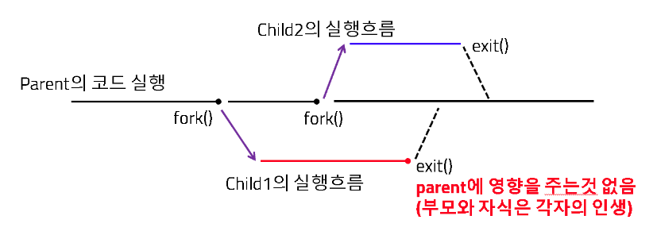
    
2. `exec()`를 통한 프로세스 생성
- `exec()` 실행시, 부모프로세스는 종료되고, 새로운 프로세스가 실행됨
    - 부모 프로세스를 유지하려면  `fork()`를 통해 자식프로세스를 만들고, 그 안에서 `exec`를 호출하면됨
    - 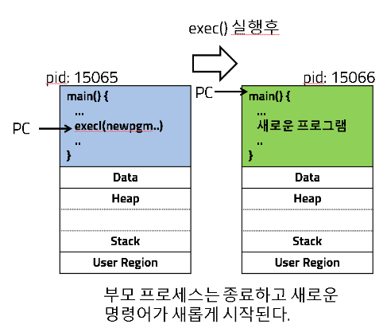

3. `fork()`, `exec()`를 결합해서 프로세스 생성
- 자식 프로세스를 위한 메모리 공간을 `fork()`로 만든 후, 그 공간에서 `exec()`를 실행하므로써, 빌드된 임의의프로그램을 실행시킴
    - 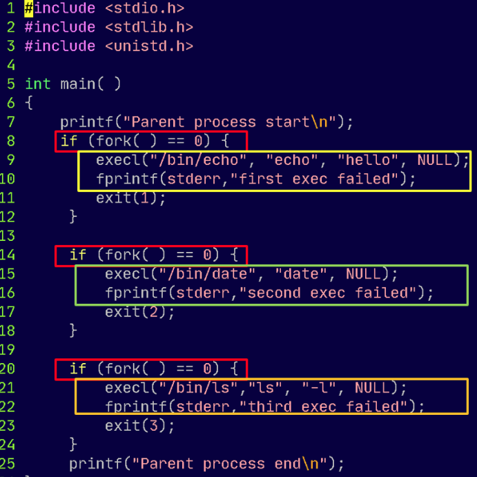

4. 프로세스 간 결과 전달
- 장치를 파일로 다루는것과 같이, 프로세스의 입출력(데이터)도 파일 스트림으로 추상화한다.
- 따라서, 프로그램의 실행결과는 `printf()` 등과 같이 출력하고, 단지 출력 결과를 어디로 전달할지만 `redirect`로 조정하면됨
- 결과를 주고 받는 방식으로는, `pipe`를 이용한 방법, `shared memory`를 이용하는 방법 또는 `IPC(inter process communicate)` 방법이 있다.
    - `pipe`를 이용하는 것이 버퍼 언더런/오버런을 방지하는 리눅스 기반 OS 커널에서 제공하는 가장 안정적인 방법이긴 함

## 5. 멀티프로세스를 위한 가상메모리
- 멀티프로세스가 실현되기 위해서는 가상메모리 개념과 이를 실현하기 위한 MMU가 지원되어야함
1. 가상메모리가 지원되지 않는다면,
- 물리 메모리에 프로세스의 메모리가 할당되어 있어야 하므로, 만약 복수개의 프로세스가 있다면 프로세스간 메모리 영역 침범이 불가피하다.
- 이걸 수동으로 다 관리해주던 것이 `Non-OS` 기반의 임베디드 시스템 (메모리 주소를 직접 매핑하여 관리)

2. 가상메모리를 이용한 프로세스 관리 
- 모든 프로그램을 가상메모리 영역을 대상으로 컴파일/링킹하여 파일에 저장
- 따라서, cpu가 이 프로그램을 읽어 디코딩하여도 접근할 메모리 영역은 가상메모리 상의 주소로 나타내어짐
- 이 프로그램을 실제 메모리(DRAM)에 동적 배치되는 시점에, 커널(MMU)에서는 물리 메모리에 배치하고 이 위치를 별도의 테이블로 기록/관리하고, 이 테이블을 이용해서, 가상 메모리에 접근하는 CPU에 대해 실제 물리 메모리 주소로 변환(리다이렉트)해주는 방식으로 동작하게된다.
    - 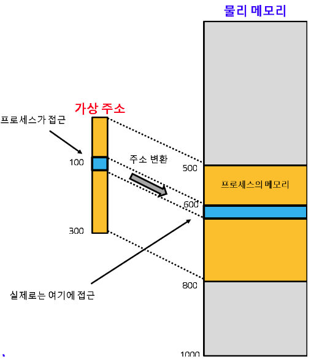

3. 가상메모리의 효과
- 이 개념을 통해 모든 프로그램은 각자 가상메모리 영역을 모두 사용할 수 있고, 컴파일/링킹되어 프로그램 이미지가 생성됨
- 프로그램이 실행되어 DRAM에 동적 배치되어 프로세스가 생성될 때, 각 프로세스마다 주소영역 변환 테이블 (페이지 테이블)을 생성/업데이트 한다.
- 페이지 크기를 잘게 쪼개면, 아래 오른쪽 처럼 메모리의 작은 가용영역 조차 매핑해서 재사용할 수 있다.
    - 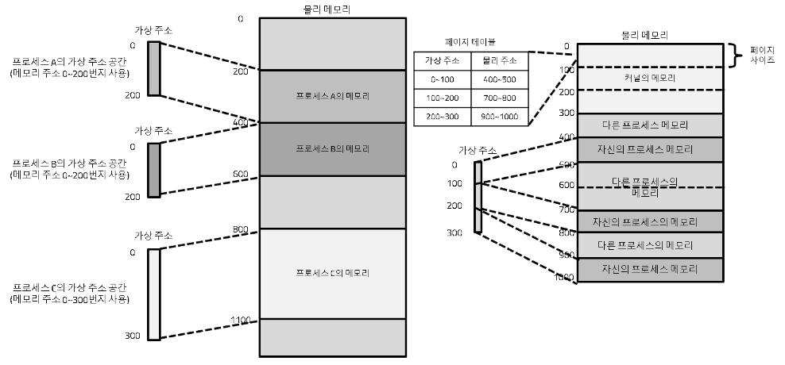

4. 스왑
- 프로세스의 개수가 늘어남에 따라, 실제 배치할 물리메모리(DRAM)의 공간을 전부 사용하여도 계속해서 동작할 수 있는 이유
- DRAM이 가득차게되면 하드메모리 공간에 swap해서 가상메모리를 매핑하게 된다.
    - 매우 느리게 동작하게됨, 실제로는 멈춘것처럼(흔히 표현하기로 터진 것처럼) 보여짐

5. 온디멘트 페이징
    - 요구가 있으면 페이징하는것(가상메모리->물리RAM 메모리)

## 6. 프로세스 간 통신
- 프로세스가 다른 프로세스에 직접 접근하는 것은 리눅스 철학에 위배됨

1. 공유 메모리를 통한 프로세스간 통신
- 프로세스가 다른 프로세스에 직접 접근하는 것은 리눅스 철학에 위배됨
- 공용공간을 만들고 여기에 써두면, 상대방은 여기서 읽어가는 것
- 그렇기 떄문에 상대방이 읽은게 맞는지, 쓴게 맞는지를 확인하는 `hand-shake` 가 필요함
    - 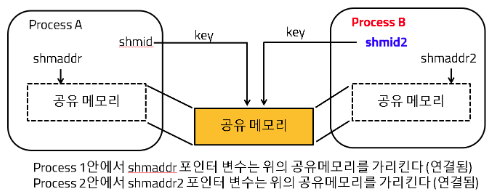

2. 파이프 
- 프로그램의 출력이 어디로 갈지 고려하지 않고 출력만 내도록 구현
- 파이프 안에는 오버런/언더런 이슈 방지를 위한 구조가 내장되어 있으므로, `hand-shake` 필요없음
- 파이프를 이용하는것이 구조적으로 잘 만들어진 커널을 이용하게 되니까, 유저 프로그램 입장에서도 유리하다고 함
    - 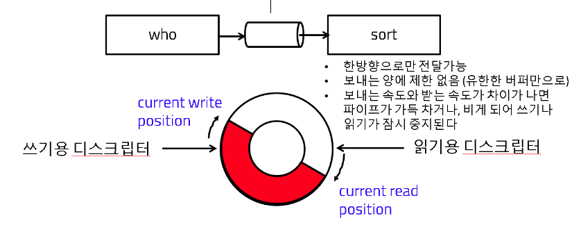

3. IPC(Inter-Process-Communicate)
- 표준은 아니지만, 편리한 측면이 있어 `ROS`와 같은 프레임워크에서 채택한 프로세스간 통신 방식임

## 7. 하드웨어 장치 접근
- 장치(파일)에 접근하기 위해, 기존에는 하드웨어의 물리 주소를 알아내서 그 주소에 어떤 값을 쓰거나 읽는 방식으로 하드웨어를 제어함
- 또는 `mmap`를 통해 가상메모리로 빌드되어진 프로그램 내부에 하드웨어 주소를 매핑하여 제어할 수도 있었음

1. 디바이스 드라이버를 이용한 방식
- 커널 모듈의 필요성
    - 하드웨어와 프로그램의 디커플링을 위해, 커널에 중간에서 하드웨어에 접근하는 역할을 수행함
    - 커널에서 동작하는 하드웨어 제어를 위한 SW를 `드라이버`라고 부름
    - 장치 드라이버도 동적 라이브러리로 빌드한 후 커널에 동적 삽입을 통해, 커널을 확장시킬 수 있음
    - 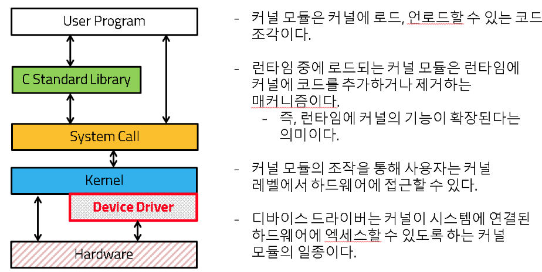

- 커널 모듈 빌드 및 실행 (드라이버 적재를 위한 과정)
    - 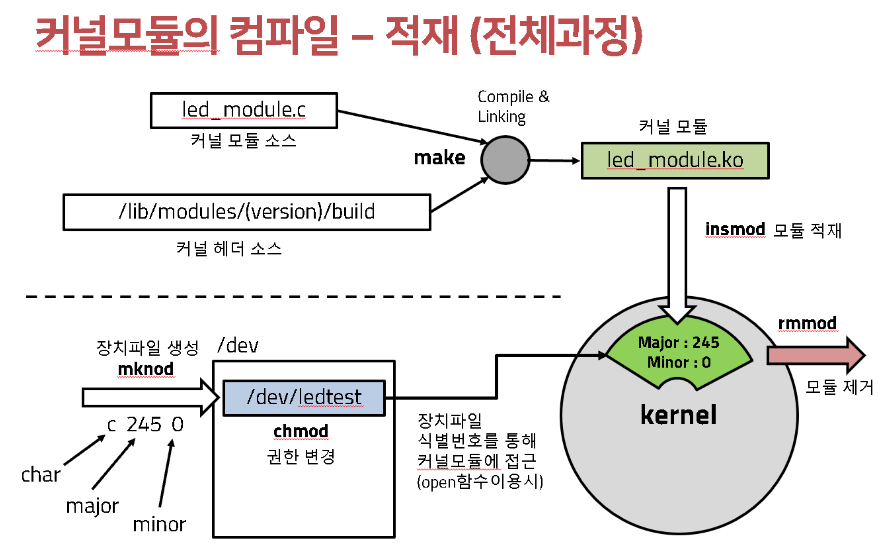
    - 빌드
        - `*.ko`가 생성됨, 커널용 오브젝트 파일이라는 의미임
    - 커널에 삽입
        - `sudo rmmod 기존 커널`
        - `sudo insmod 신규 커널`
    - 장치 드라이버 생성
        - `sudo rm -rf /dev/led_test`
        - `sudo mknod /dev/led_test c 246 0`
        - `sudo chmod 666 /dev/led_test`
    
## 기타 
### Volatile 키워드
- Volatile은 특정 메모리 영역에 대해 명시적으로 memory I/O를 하도록 강제하게 하는 키워드임
- 메모리 주소에 매핑된 하드웨어 장치에 직접 접근해서 값을 읽어오도록 함
- 하드웨어의 특성(ADC: 아날로그디지털컨버터)에 의해 어떤 하드웨어 관련된 변수의 값이 변경될 수도 있으므로, 이런 경우 메모리에서 값을 읽어오게 하는 것
    - 예를 들어, 어떤 타이머 변수라고 했을 때 주기적으로 0으로 리셋될 수 있는데, 이런 특성에 의해 코드적으로 변수의 값을 바꾸지 않았음에도 값이 변경되는 경우가 있을 수 있어 임베디드 시스템에서 사용하는 키워드임

### 정적 링킹, 동적 링킹
1. Static 실행 이미지 생성
- 모든 서브 루틴 함수를 single standalong 프로그램 이미지에 모두 적재
- 컴파일, 링킹되고 나면, 더 이상 하위 코드에 object, lib 필요없게됨
- 컴파일/링킹 단계에서 결정된 주소공간에 프로그램 이미지가 반드시 적재되어야 함

2. dynamic 동적 로딩 실행 이미지 생성
- 컴파일/링킹할 때 하위함수 라이브러리(오브젝트) 불필요함
- 프로그램이 실행될 때, 동적라이브러리(윈도우즈에서는 *.dll, 리눅스에서는 *.so)로 구현된 파일이 런타임 링킹되어 메모리에 적재됨
- OTA는 오브젝트 파일을 바꿔줌으로써 전체 SW의 동작을 업데이트할 수 있게 한 것

### 리눅스 파일 권한 
- 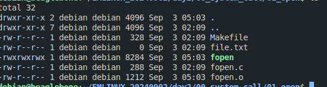
- `chmod 777 파일이름`
    - 7 = 4+2+1 이니까, 순서대로 rwx, 읽기쓰기실행권한임
    - `chmod u+rw 파일이름` 이란형태로 읽기쓰기 권한을 위와같이 부여할수도 있음

### 키워드 요약
1. 프로그램 생성과 동시에 생기는 표준 입출력
- `stdin, stdout, stderr`

2. 파일에 접근하기 위해 최초로 파일을 열어서, 파일 구조체로 포인터를 얻기 위한 표준 함수는
- `fopen()`

3. 하드웨어 장치에 접근하기 위한 저수준의 함수이며, 커널이 제공함
- system call

4. 프로그램 실행시, 점프할 함수를 내 프로그램에 동적으로 결합
- 동적 링킹
- 컴파일 후 생기는 오브젝트파일(리눅스: `*.so`, 윈도우즈: `*.dll`)을 링크시킴

5. 리눅스에서 다룰 수 있는 모든 장치를 열기 위한 함수로, 파일 descriptor를 반환하는 함수
- `open()`

6. 하나의 파일의 특정 영역을 복수의 프로세스가 접근할 때 I/O 잠금해주는 함수
- `flock()`

7. 운영체제와 나 사이에 인터페이싱해주는 프로세스로, 프로그램을 커널 위에 올려주는 역할, (예를들어 `fork(), exec()`) 
- `쉘, shell`

8. 파일의 소유자는 아니지만, 실행할 때 잠시 소유자의 권한을 획득
- `set user id`: effective id

9. `fork`를 이용해서 자식을 생성하는 과정
- 자식 프로세스는 부모 프로세스를 완전히 복제
- 부모 프로세스의 fork() 리턴값은 자식의 pid임
- 부모 프로세스는, 자식 프로세스가 끝날 때까지 기다리지 않고, 바로 실행을 이어감

10. 하드웨어 자원의 특정 영역을 메모리의 한 영역으로 매핑해서, 마지 메모리에 읽고 쓰는 방식으로 자원에 접근하게 해주는 함수
- `mmap`

## 끝